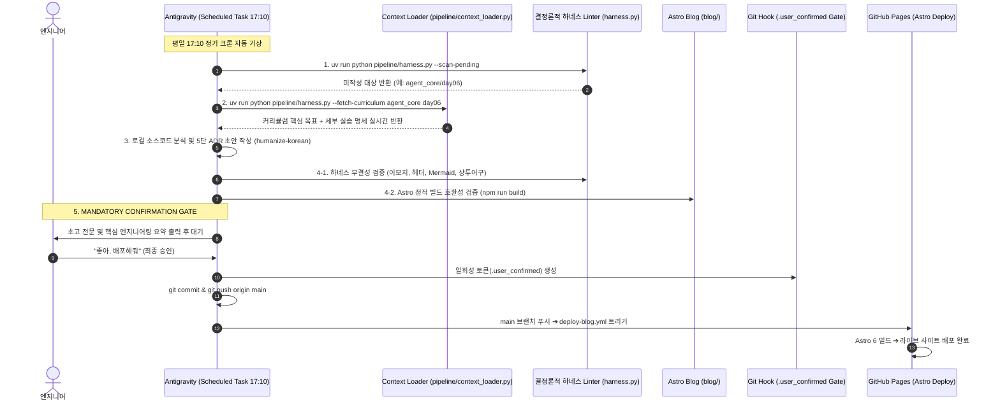

# Security Agent Toolkit & DevLog Pipeline

SKT ALEPH 보안 자동화 부트캠프의 실습 코드와 아키텍처 리팩터링 기록을 보관하고, 안티그래비티(Antigravity) 에이전트 올인원 오케스트레이션을 통해 ADR 기술 블로그 포스트를 완전 자동 발행하는 파이프라인 저장소입니다.

---

## 1. 프로젝트 개요

- **목적:** 
  1. 부트캠프 실습 코드, 문제의식 주석, 아키텍처 회고 메모를 체계적으로 관리합니다.
  2. 단순 문법 정리를 넘어 나이브한 베이스라인의 한계와 구조적 리팩터링 과정을 담은 기술 의사결정 기록(ADR)을 생성합니다.
  3. 평일 17:10 안티그래비티 정기 스케줄러가 커리큘럼 명세와 로컬 코드를 인제스트하여 초안을 대기시키고, 사용자의 원클릭 컨펌으로 Astro 정적 블로그에 즉시 배포합니다.
- **라이브 블로그 URL:** https://mmmphyun.github.io/security-agent-toolkit/blog/
- **운영 비용:** Google Gemini 무료 티어와 GitHub Pages, 안티그래비티 로컬 엔진을 활용하여 별도 인프라 비용 없이 0원으로 운영합니다.

---

## 2. 저장소 구조 (Monorepo)

```text
security-agent-toolkit/
├── [course_name]/                    # 과목별 실습 디렉토리 (agent_core, network_zt 등)
│   ├── README.md                     # 과목 표준 가이드라인 (# N과목 헤더 포함)
│   └── day01 ~ day08/                # 일차별 실습 코드 (*practice.py, *llm.py 등)
│       └── logs/                     # 실습 전용 데이터 격리 공간
│
├── projects/                         # 자율 프로젝트 및 아키텍처 심층 회고 공간
│   └── [project_name]/               # 프로젝트별 자유 마크다운 메모 (*.md)
│       ├── 01_architecture_and_tradeoffs.md
│       ├── 02_troubleshooting_and_humanizing.md
│       └── 03_zero_command_and_coauthoring.md
│
├── pipeline/                         # DevLog 자동 생성 및 검증 엔진
│   ├── context_loader.py             # 커리큘럼 허브 및 세부 실습 명세 실시간 인제스트 엔진
│   ├── harness.py                    # 동적 타겟 스캐너, 하네스 Linter, CLI 허브
│   └── rules/                        # im-not-ai 한국어 룰북 (내재화)
│       └── humanize_rules.md
│
├── tests/                            # 하네스 및 파이프라인 단위 테스트 (100% 무결성 검증)
│   └── test_harness.py
│
├── blog/                             # Astro Bento Blog 프론트엔드
│   ├── src/                          # 3대 카테고리 탭, Shiki + Mermaid 렌더러, Bento UI
│   └── package.json                  # Astro 6 + Tailwind CSS
│
├── docs/                             # 아키텍처 의사결정 기록 및 발행 아티클
│   ├── adr/                          # ADR-0001, ADR-0002 기록
│   └── posts/                        # 최종 검증 및 발행된 마크다운 아티클 저장소
│
└── .github/workflows/
    └── deploy-blog.yml               # main 브랜치 Push 시 Astro 빌드 및 Pages 자동 배포
```

---

## 3. 데이터 흐름 및 올인원 배포 파이프라인



---

## 4. 핵심 엔지니어링 및 거버넌스 원칙

### 1) 3단 대조 스토리라인 (Baseline -> Problem -> Refactoring)
독자가 강의를 직접 듣지 않아도 엔지니어링 맥락을 이해할 수 있도록 구성합니다:
1. **나이브한 베이스라인:** 일반적인 튜토리얼 수준의 단순 구현 예제 스니펫(5~10줄)을 먼저 제시.
2. **실무적 결함과 문제의식:** 대용량 트래픽이나 운영 환경에서 해당 코드가 실패하는 구체적인 이유(비정형 데이터, 메모리 누수, 예외 미처리)를 분석.
3. **초기 프로토타입 vs 리팩터링 구현체:** 1차 시도 코드(`*practice.py`)와 LLM 기반 구조 최적화 코드(`*llm.py`)를 대조 분석 (*llm.py가 없는 경우 주석 기반 구조 개선안으로 단독 서술).

### 2) 커리큘럼 세부 실습 명세 실시간 자동 인제스트 (Zero-Effort)
컨텍스트 로더(`context_loader.py`)를 통해 메인 학습 목표뿐 아니라 세부 실습 이론, 정답 코드, 트러블슈팅 Q&A를 실시간 바인딩합니다. 수동 요약 노트(`lecture_notes.md`)를 작성할 필요가 전혀 없습니다.

### 3) 품질 검증 체계와 결정론적 하네스 (`harness.py`)
- **이모지 완전 배제:** 본문, 제목, 커밋 메시지 어디에도 유니코드 이모지를 쓰지 않습니다.
- **불필요한 괄호 영어 차단:** `손상(Broken)` 같은 불필요한 번역투 괄호 영어를 차단하고, `IDS`, `SOAR`, `REST API`, `PCAP` 등 공인 대문자 표준 약어만 허용합니다.
- **비전문적 메타 어휘 차단:** `수강생`, `페어 프로그래밍`, `학습자`, `모범 답안`, `교시` 등 학생 티를 내는 어휘를 하네스 차원에서 물리적으로 차단합니다.
- **자립형 룰북:** `im-not-ai` 72대 룰북을 레포지토리 내부에 포함해 동일한 품질을 엄격히 통제합니다.

### 4) 물리적 Git 차단 가드레일 (User Confirmation Gate)
`.git/hooks/pre-commit` 훅을 통해 사용자의 명시적 승인 토큰(`.user_confirmed`)이 없으면 `docs/posts/` 커밋이 원천 차단되며, 토큰은 커밋 직후 1회성으로 자동 소멸합니다.

---

## 5. 로컬 개발 및 실행 방법

### 환경 요구사항
- Python >= 3.10 (`uv` 권장)
- Node.js >= 22.12.0
- npm >= 10.0.0

### 설치 및 환경 구성
```powershell
# Python 의존성 동기화 (uv)
uv sync --extra dev

# Astro 블로그 의존성 설치
npm --prefix blog install
```

### CLI 도구 실행 및 검증
```powershell
# 1. 미작성 대기 타겟 동적 스캔
uv run python pipeline/harness.py --scan-pending

# 2. 커리큘럼 학습 목표 및 세부 실습 명세 실시간 인제스트
uv run python pipeline/harness.py --fetch-curriculum agent_core day06

# 3. 마크다운 포스트 하네스 단독 검증
uv run python pipeline/harness.py docs/posts/c01-agent-core-day01.md

# 4. 전체 단위 테스트 실행 (6/6 통과)
uv run python -m unittest discover -s tests

# 5. 전체 린트 검사
uv run ruff check pipeline/ tests/

# 6. Astro 블로그 정적 빌드 테스트
npm --prefix blog run build
```

---

## 6. 라이선스 및 저작권
- 실습 코드 및 분석 아티클: 작성자 본인의 저작물이며 공정 이용 기준을 준수합니다.
- 자동화 파이프라인 소스코드는 MIT 라이선스를 따릅니다.
