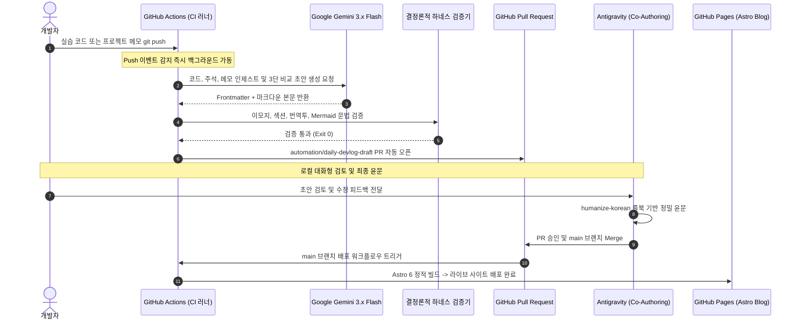

# Security Agent Toolkit & DevLog Pipeline

SKT ALEPH 아카데미의 보안 자동화 실습 코드와 리팩터링 기록을 보관하고, 이를 기술 블로그 포스트로 자동 발행하는 파이프라인 저장소입니다.

---

## 1. 프로젝트 개요

- **목적:** 
  1. 부트캠프 수업 실습 코드와 고민 주석, 프로젝트 회고 메모를 체계적으로 관리합니다.
  2. 단순 문법 정리를 넘어 기본 구현의 한계와 리팩터링 과정을 담은 기술 의사결정 기록을 생성합니다.
  3. 실습 후 코드를 올리면 GitHub Actions와 Google Gemini 3.x, Astro 정적 블로그가 연동되어 별도 작업 없이 글이 발행되도록 파이프라인을 구축했습니다.
- **라이브 블로그 URL:** https://mmmphyun.github.io/security-agent-toolkit/blog/
- **운영 비용:** Google Gemini 무료 티어와 GitHub Pages를 활용하여 별도 인프라 비용 없이 0원으로 운영합니다.

---

## 2. 저장소 구조 (Monorepo)

```text
C:\project\security-agent-toolkit/
├── [course_name]/                    # 과목별 실습 디렉토리 (agent_core, network_zt 등)
│   ├── README.md                     # 과목별 표준 가이드라인 (선택)
│   └── day01 ~ day08/                # 일차별 실습 코드 (*_연습.py, *_llm.py 등)
│       └── logs/                     # 실습 전용 데이터 격리 공간
│
├── projects/                         # 자율 프로젝트 및 아키텍처 심층 회고 공간
│   └── [project_name]/               # 프로젝트별 자유 마크다운 메모 (*.md)
│       ├── 01_architecture_and_tradeoffs.md
│       ├── 02_troubleshooting_and_humanizing.md
│       └── 03_zero_command_and_coauthoring.md
│
├── pipeline/                         # DevLog 자동 생성 및 검증 엔진
│   ├── generate_draft.py             # Gemini 3.x Flash 연동 다중 타깃 초고 생성기
│   ├── harness.py                    # 이모지, 필수 섹션, AI 번역투 결정론적 검증기
│   └── rules/                        # im-not-ai 한국어 룰북 (내재화)
│       └── humanize_rules.md
│
├── blog/                             # Astro Bento Blog 프론트엔드
│   ├── src/                          # 3대 카테고리 탭, Shiki + Mermaid 렌더러, Bento UI
│   └── package.json                  # Astro 6 + Tailwind CSS
│
├── docs/posts/                       # 최종 검증 및 발행된 마크다운 아티클 저장소
└── .github/workflows/                # CI/CD 자동화 워크플로우 2종
    ├── daily-draft.yml               # Push 즉시 실행 + 18:00 Cron 초안 자동 생성 & PR 오픈
    └── deploy-blog.yml               # main 브랜치 Push 시 Astro 빌드 및 Pages 자동 배포
```

---

## 3. 데이터 흐름 및 배포 파이프라인



---

## 4. 핵심 엔지니어링 및 작성 원칙

### 1) 3단 비교 스토리라인
독자가 강의를 직접 듣지 않아도 맥락을 이해할 수 있도록 구성합니다:
1. **기본 베이스라인 코드:** 일반적인 튜토리얼 수준의 단순 구현(5~10줄)을 먼저 제시합니다.
2. **실무적 결함과 문제의식:** 대용량 트래픽이나 운영 환경에서 해당 코드가 실패하는 구체적인 이유를 짚습니다.
3. **나의 시도와 최적화:** 6교시 원본 코드(`연습`)와 AI 페어 프로그래밍 최적화 코드(`llm`)를 대조 분석합니다.

### 2) 조건부 페어 프로그래밍 분기
`*llm*.py` 파일이 존재하는 날에만 페어 프로그래밍 대조로 풀고, 없는 날은 단독 설계 의사결정으로 작성하여 가상의 협업을 인위적으로 꾸며내지 않습니다.

### 3) 품질 검증 체계와 결정론적 하네스 (`harness.py`)
- **이모지 완전 배제:** 본문, 제목, 커밋 메시지 어디에도 유니코드 이모지를 쓰지 않습니다.
- **불필요한 괄호 영어 차단:** 굳이 한글 뒤에 영어 단어를 덧붙이는 번역투를 막고, `IDS`, `SOAR`, `SRP`, `CSV` 같은 공인 대문자 표준 약어만 허용합니다.
- **자립형 룰북:** `im-not-ai` 72대 룰북을 레포지토리 내부에 포함해 클라우드 CI 러너에서도 동일하게 품질을 통제합니다.

### 4) 블로그 카테고리 분류 체계
- **부트캠프 과목별 트랙:** `c01-agent-core-dayXX`, `c02-network-zt-dayXX` 등 과목 ID 접두사로 격리 발행.
- **프로젝트 분석 & 회고:** `proj-프로젝트명-주제` 슬러그로 시리즈 묶음 발행.

---

## 5. 로컬 개발 및 실행 방법

### 환경 요구사항
- Python >= 3.10
- Node.js >= 22.12.0
- npm >= 10.0.0

### 설치 및 환경 구성
```powershell
# Python 패키지 설치
py -3.12 -m pip install -e .

# Astro 블로그 의존성 설치
npm --prefix blog install
```

### 로컬 테스트 및 빌드
```powershell
# 1. 하네스 검증 단독 실행
py -3.12 pipeline/harness.py docs/posts/c01-agent-core-day01.md

# 2. 초안 수동 생성 (GEMINI_API_KEY 필요)
$env:GEMINI_API_KEY="your_api_key_here"
py -3.12 pipeline/generate_draft.py --auto

# 3. Astro 블로그 로컬 개발 서버 실행
npm --prefix blog run dev

# 4. Astro 블로그 정적 빌드 테스트
npm --prefix blog run build
```

---

## 6. 라이선스 및 저작권
- 실습 코드 및 분석 아티클: 작성자 본인의 저작물이며 공정 이용 기준을 준수합니다.
- 자동화 파이프라인 소스코드는 MIT 라이선스를 따릅니다.
