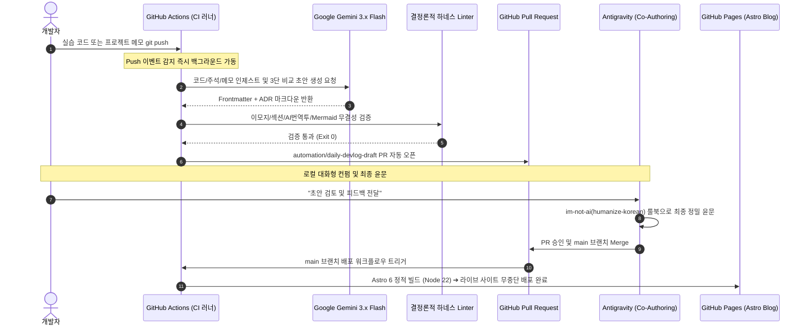

# Security Agent Toolkit & DevLog Pipeline

SKT ALEPH 아카데미 보안 자동화 및 AI 에이전트 엔지니어링 실습 코드베이스와, 이를 시니어 관점의 기술 블로그 아티클로 자동 전환·배포하는 자율 파이프라인(DevLog Agent Pipeline) 저장소입니다.

---

## 1. 프로젝트 개요

- **목적:** 
  1. 부트캠프 실습 코드와 고민 주석, 그리고 개인/팀 프로젝트 회고 메모의 체계적 보관.
  2. 단순 문법 요약을 넘어 "기본 구현의 한계점과 리팩터링 의사결정"을 담은 고품질 기술 의사결정 기록(ADR) 자동 생성.
  3. 개발자가 별도의 글 작성 부담 없이 실습에만 집중할 수 있도록 GitHub Actions + Google Gemini 3.x + Astro 정적 블로그를 결합한 완전 자동화(Zero-Command) 파이프라인 구축.
- **라이브 블로그 URL:** https://mmmphyun.github.io/security-agent-toolkit/blog/
- **운영 비용:** Google Gemini Free Tier + GitHub Pages 기반 0원 (무료 인프라)

---

## 2. 저장소 구조 (Monorepo)

```text
C:\project\security-agent-toolkit/
├── agent_core/                       # 1과목: AI·보안 자동화 기초 실습 (day01 ~ day08)
│   └── day05/                        # 일차별 실습 코드 (*_연습.py, *_llm.py 등)
│       └── logs/                     # 실습 전용 데이터 격리 공간
│
├── network_zt/                       # 2과목: 네트워크·Zero Trust 운영 기초 실습 (day01 ~ day08)
│   └── README.md                     # 2과목 실습 작성 표준 가이드라인
│
├── projects/                         # 자율 프로젝트 및 아키텍처 심층 회고 공간
│   └── devlog-agent-pipeline/        # 파이프라인 구축 프로젝트 메모 3종
│       ├── 01_architecture_and_tradeoffs.md
│       ├── 02_troubleshooting_and_humanizing.md
│       └── 03_zero_command_and_coauthoring.md
│
├── pipeline/                         # DevLog 자동 생성 및 검증 엔진
│   ├── generate_draft.py             # Gemini 3.x Flash 연동 다중 타깃 초고 생성기
│   ├── harness.py                    # 이모지/섹션/AI상투어/괄호영어 결정론적 Linter
│   └── rules/                        # im-not-ai 한국어 휴머나이징 72대 룰북 (내재화)
│       └── humanize_rules.md
│
├── blog/                             # Astro Bento Blog 프론트엔드
│   ├── src/                          # 3대 카테고리 탭, Shiki + Mermaid 렌더러, Bento UI
│   └── package.json                  # Astro 6 + Tailwind CSS
│
├── docs/posts/                       # 최종 검증 및 발행된 마크다운 아티클 저장소
└── .github/workflows/                # CI/CD 자동화 워크플로우 2종
    ├── daily-draft.yml               # Push 즉시 트리거 + 18:00 Cron 초안 자동 생성 & PR 오픈
    └── deploy-blog.yml               # main 브랜치 Push 시 Astro 빌드 및 Pages 자동 배포
```

---

## 3. 완전 자동화 데이터 흐름 (End-to-End Architecture)



---

## 4. 핵심 엔지니어링 및 거버넌스 원칙

### 1) 3단 비교 스토리라인 (Baseline ➔ Problem ➔ Solution)
- 단순한 코드 나열을 지양하고 독자 관점의 개연성을 확보합니다:
  1. **기본 베이스라인 코드:** 일반적인 튜토리얼 수준의 단순 구현 스니펫(5~10줄) 제시.
  2. **실무적 결함과 문제의식:** 대용량 트래픽이나 실제 보안 환경에서 해당 코드가 깨지는 이유 지적.
  3. **나의 시도와 최적화:** 6교시 원본 코드(`연습`)와 AI 페어 프로그래밍 최적화 코드(`llm`) 대조 분석.

### 2) 조건부 페어 프로그래밍 분기 (`has_llm`)
- `*llm*.py` 파일이 존재하는 날에만 페어 프로그래밍 대조 모드로 서술하고, 없는 날은 단독 설계 의사결정 모드로 자동 전환하여 AI 가상 협업 날조(Hallucination)를 원천 차단합니다.

### 3) LLM 품질 거버넌스 및 결정론적 하네스 (`harness.py`)
- **이모지 0개:** 본문, 제목, 커밋 메시지 어디에도 유니코드 이모지를 허용하지 않습니다.
- **불필요한 괄호 영단어 번역투 차단:** `손상(Broken)`, `부작용(Side-Effect)` 등 잉여 번역투를 차단하고, `IDS`, `SOAR`, `SRP`, `CSV` 등 공인 대문자 표준 약어만 선별 허용합니다.
- **자립형(Self-Contained) 룰북:** `im-not-ai` 72대 룰북을 레포지토리 내부에 내재화하여 클라우드 CI 러너에서도 100% 동일하게 품질을 통제합니다.

### 4) 블로그 3대 핵심 카테고리 체계
- **1과목: AI·보안 자동화** (`c01-agent-core-dayXX`)
- **2과목: 네트워크·Zero Trust** (`c02-network-zt-dayXX`)
- **프로젝트 분석 & 회고** (`proj-프로젝트명-주제`)

---

## 5. 로컬 개발 및 실행 가이드

### 환경 요구사항
- Python >= 3.10
- Node.js >= 22.12.0
- npm >= 10.0.0

### 설치 및 의존성 구성
```powershell
# Python 패키지 설치 (Editable 모드)
py -3.12 -m pip install -e .

# Astro 블로그 의존성 설치
npm --prefix blog install
```

### 로컬 테스트 및 검증
```powershell
# 1. 하네스 Linter 단독 검증
py -3.12 pipeline/harness.py docs/posts/c01-agent-core-day01.md

# 2. 초안 수동 생성 (GEMINI_API_KEY 필요)
$env:GEMINI_API_KEY="your_api_key_here"
py -3.12 pipeline/generate_draft.py --auto

# 3. Astro 블로그 로컬 개발 서버 실행
npm --prefix blog run dev

# 4. Astro 블로그 프로덕션 빌드 테스트
npm --prefix blog run build
```

---

## 6. 라이선스 및 저작권
- 실습 코드 및 분석 아티클: 본인 창작물 및 공정 이용(Fair Use) 기준을 준수합니다.
- 본 저장소의 모든 자동화 파이프라인 코드는 MIT 라이선스를 따릅니다.
