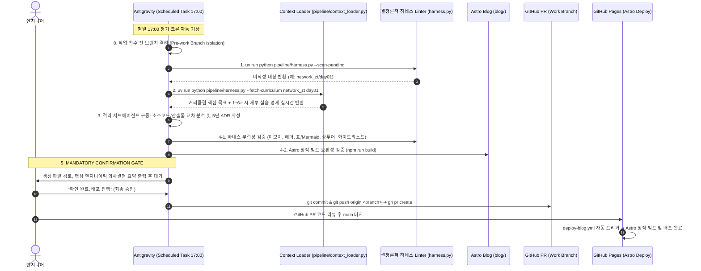

# Security Agent Toolkit & DevLog Pipeline

SKT ALEPH 보안 자동화 실습 소스코드와 아키텍처 리팩터링 내역을 보관하고, Antigravity 에이전트 오케스트레이션으로 ADR 기술 블로그 포스트를 자동 발행하는 파이프라인 저장소입니다.

---

## 1. 프로젝트 개요

- **목적:** 
  1. 부트캠프 실습 코드, 시스템 명령어 실행 로그, 패킷 분석 보고서, 아키텍처 회고 메모를 체계적으로 관리합니다.
  2. 단순 문법 나열을 넘어 나이브한 베이스라인의 한계와 구조적 리팩터링 및 계층별 장애 격리 과정을 담은 기술 의사결정 기록(ADR)을 작성합니다.
  3. 평일 17:00 Antigravity 정기 스케줄러가 커리큘럼 명세와 로컬 산출물을 인제스트하여 초안을 검증·대기시키고, 사용자 컨펌 후 Astro 정적 블로그로 배포합니다.
- **라이브 블로그 URL:** https://mmmphyun.github.io/security-agent-toolkit/blog/
- **운영 비용:** Google Gemini 무료 티어, GitHub Pages, Antigravity 로컬 엔진을 활용해 별도 인프라 비용 없이 운영합니다.

---

## 2. 저장소 구조 (Monorepo)

```text
security-agent-toolkit/
├── [course_name]/                    # 과목별 실습 디렉토리 (agent_core, network_zt 등)
│   ├── README.md                     # 과목 표준 가이드라인 (# N과목 헤더 포함)
│   └── day01 ~ day08/                # 일차별 실습 코드 (*practice.py, *llm.py, 일반 .py)
│       ├── dayXX_*.md                # 패킷/헤더 분석 보고서 및 실습 산출물
│       └── logs/                     # 실습 전용 데이터 격리 공간 (*.pcap, *.log)
│
├── projects/                         # 자율 프로젝트 및 아키텍처 심층 회고 공간
│   └── [project_name]/               # 프로젝트별 마크다운 메모 (*.md)
│       ├── 01_architecture_and_tradeoffs.md
│       ├── 02_troubleshooting_and_humanizing.md
│       ├── 03_zero_command_and_coauthoring.md
│       ├── 04_subagent_isolation_and_linter_defense.md
│       └── 05_governance_rules_and_humanizing_trials.md
│
├── pipeline/                         # DevLog 자동 생성 및 검증 엔진
│   ├── context_loader.py             # 커리큘럼 허브 및 세부 실습 명세 인제스트 엔진
│   ├── harness.py                    # 동적 타겟 스캐너, 하네스 Linter, CLI 허브
│   ├── config/                       # 하네스 화이트리스트 설정
│   │   └── whitelist.json            # 네트워크/보안 프로토콜 및 CS 표준 식별자
│   └── rules/                        # im-not-ai 한국어 룰북 (내재화)
│       └── humanize_rules.md
│
├── tests/                            # 하네스 및 파이프라인 단위 테스트 (100% 무결성 검증)
│   ├── test_analyze_project.py
│   └── test_harness.py
│
├── blog/                             # Astro Bento Blog 프론트엔드
│   ├── src/                          # 3대 카테고리 탭, Shiki + Mermaid 렌더러, Bento UI
│   └── package.json                  # Astro 6 + Tailwind CSS
│
├── docs/                             # 아키텍처 의사결정 기록 및 발행 아티클
│   └── posts/                        # 최종 검증 및 발행된 마크다운 아티클 저장소 (*.md)
│
└── .github/workflows/
    └── deploy-blog.yml               # main 브랜치 Push 시 Astro 빌드 및 Pages 자동 배포
```

---

## 3. 데이터 흐름 및 올인원 배포 파이프라인



---

## 4. 핵심 엔지니어링 및 거버넌스 원칙

### 1) 과목/성격별 4대 전개 유형 맞춤 구성
모든 실습을 획일적인 코드 diff에 끼워 맞추지 않고, 과목 성격에 맞춰 지면의 무게중심을 유연하게 배정합니다:
- **코드 구현/리팩터링형 (1과목, 5과목):** 1차 코드 vs 런타임 결함 vs 리팩터링 코드 3단 대조 및 diff 중심 서술.
- **아키텍처/설계형 (종합 실습):** 모놀리식 병목 분석 → 책임 격리/계층형 설계(주석 Q&A 리서치 전면 배치) → 모듈 인터페이스 정의.
- **인프라/환경 구축형:** 인프라 요건 → 네트워크/보안 격리 토폴로지 → 설정 파일 및 통신 안정성 엔지니어링.
- **보안 분석/위협 모델링형 (2과목, 3과목, 4과목):** 위협 시나리오 → 패킷/로그/정책 공격 표면 분석 → 다층 방어 기법 구현.

### 2) 소제목 근거 승격 (Grounding Triad)
'파이썬 함수/클래스 매핑'이라는 좁은 구현체 결속을 탈피하고, **당일 인제스트된 3대 실체적 원천**과 1:1 매핑되는 구체적 엔지니어링 대상만을 소제목(`###`)으로 인정합니다:
1. **로컬 산출물:** 소스코드(함수/클래스/변수), 설정 파일(JSON/YAML), 패킷/헤더 분석 보고서(`.md`), 캡처 데이터.
2. **커리큘럼 실습 명세:** 당일 노션에서 수집된 시스템 명령어(`ping`, `netstat`), 프로토콜 헤더, 패킷 시퀀스.
3. **인라인 주석/질의응답:** 코드 내 기술 Q&A 블록, 에러 로그, 트러블슈팅 기록.
*(근거 없는 가상 이론 및 단순 튜토리얼식 정의 나열 엄격 금지)*

### 3) 인라인 주석 및 문자열 식별 컨벤션
- **작성자 고유 리서치 (`''' ... '''`):** 홑따옴표 3중 블록은 작성자의 독자적 탐구 기록으로 식별. 객관적 기술 스펙/Q&A는 4번(엔지니어링 의사결정) 근거로 선별 인용하며, 현장 회고 메모는 5번(회고)의 현실적 맥락으로만 반영.
- **비즈니스 로직 문자열 (`""" ... """`):** 변수에 대입된 쌍따옴표 3중 블록은 테스트 데이터, 패킷 덤프 등 코드 실행용 문자열(str) 리터럴로 격리.
- **강의 안내 주석 (`# ...`):** 강의 예제 사전 설명문이나 비활성화 코드로 식별하여 왜곡 인용 원천 차단.

### 4) 품질 검증 체계와 결정론적 하네스 (`harness.py`)
- **이모지 배제:** 본문, 제목, 커밋 메시지 어디에도 유니코드 이모지를 쓰지 않습니다.
- **불필요한 괄호 영어 차단 & 도메인 화이트리스트:** `손상(Broken)` 같은 번역투 괄호 영어를 막고, `pipeline/config/whitelist.json`에 등록된 네트워크/보안 프로토콜 식별자(`Wireshark`, `TIME_WAIT`, `SYN-ACK`, `netstat` 등) 및 CS 공인 대문자 약어만 허용합니다.
- **시각화 다변화:** 무조건적인 Mermaid 강박을 배제하고, `Mermaid 다이어그램 OR 마크다운 구조화 표(| ... |)` 중 최소 1개 이상을 포함하여 시각적 앵커를 제공합니다.
- **비전문적 메타 어휘 차단:** `수강생`, `페어 프로그래밍`, `학습자`, `모범 답안`, `교시` 등 학생 티를 내는 어휘를 하네스 차원에서 물리적으로 차단합니다.

### 5) 사전 브랜치 격리 의무화 (Pre-work Branch Isolation)
- 단순 조회가 아닌 파일 수정·작업 착수 직전, 에이전트는 `git status` 및 `git branch -vv` 점검을 거쳐 머지 완료 브랜치나 `main`일 경우 최신 `origin/main`에서 신규 분기(`git switch -c <branch> origin/main`)한 후 수정을 시작합니다.
- 1 작업 단위 = 1 독립 브랜치 = 1 PR 원칙을 준수하여 과거 브랜치 오염을 원천 차단합니다.

---

## 5. 로컬 개발 및 실행 방법

### 환경 요구사항
- Python >= 3.10 (`uv` 권장)
- Node.js >= 22.12.0
- npm >= 10.0.0

### 설치 및 환경 구성
```powershell
# Python 의존성 동기화 (uv)
uv sync --extra dev

# Astro 블로그 의존성 설치
npm --prefix blog install
```

### CLI 도구 실행 및 검증
```powershell
# 1. 미작성 대기 타겟 동적 스캔
uv run python pipeline/harness.py --scan-pending

# 2. 커리큘럼 학습 목표 및 세부 실습 명세 실시간 인제스트
uv run python pipeline/harness.py --fetch-curriculum network_zt day01

# 3. 마크다운 포스트 하네스 단독 검증
uv run python pipeline/harness.py docs/posts/c01-agent-core-day01.md

# 4. 전체 단위 테스트 실행 (15/15 통과)
uv run pytest tests/

# 5. 전체 린트 검사
uv run ruff check pipeline/ tests/

# 6. Astro 블로그 정적 빌드 테스트
npm --prefix blog run build
```

---

## 6. 라이선스 및 저작권
- 실습 코드 및 분석 아티클: 작성자 본인의 저작물이며 공정 이용 기준을 준수합니다.
- 자동화 파이프라인 소스코드는 MIT 라이선스를 따릅니다.
