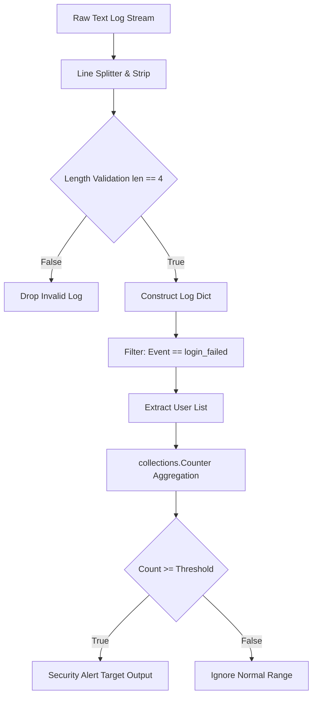

## 1. 개요 및 학습 맥락 (Context & Objective)

보안 관제 및 인프라 운영 환경에서 시스템 인증 로그(`auth.log` 등)는 정형화되지 않은 텍스트 형태로 누적된다. 침입 탐지 시스템(IDS)이나 보안 오케스트레이션(SOAR) 파이프라인을 구축할 때 가장 먼저 해결해야 하는 과제는 이러한 비정형 텍스트를 구조화된 데이터 구조(Data Structure)로 전환하고, 유의미한 이상 징후를 빠르게 필터링하는 것이다.

본 작업에서는 불규칙한 공백이나 탭으로 구분된 텍스트 로그를 파이썬 사전(Dictionary) 객체로 파싱하고, 특정 시간 동안 누적된 로그인 실패 횟수를 기준값(Threshold)에 따라 집계하여 이상징후 사용자(Suspect)를 선별하는 보안 자동화 로직을 구현한다.

## 2. 기본 구현의 한계점 (Limitation of Naive Approach)

단순한 문자열 자르기(String Slicing)나 고정 인덱스 기반 접근 방식은 실제 보안 환경에서 다음과 같은 한계점을 갖는다.

1. **불규칙한 구분자 처리 실패**: 로그 원본은 공백(Space) 단일 개수, 탭(`\t`), 혹은 복수 공백이 혼용된다. 고정 위치 슬라이싱이나 단일 공백 `split(' ')`을 적용하면 컬럼 위치가 어긋나 데이터 오염이 발생한다.
2. **단순 사용자 중심 집계의 한계**: 동일 사용자의 실패 이력만 단순 카운트할 경우, 단일 IP에서의 대규모 계정 대입 공격(Credential Stuffing)이나 분산 환경에서의 브루트포스(Brute Force) 공격 맥락을 분리해 파악하기 어렵다.
3. **메모리 효율 및 스키마 검증 부재**: 대용량 로그 파일을 전처리 없이 전체 메모리에 로드하면 메모리 고갈이 일어난다. 또한 레코드 구성 요소 개수 미달 시 예외가 발생할 위험이 존재한다.

## 3. 엔지니어링 의사결정 및 리팩터링 (Engineering Decisions)

### Q. 불규칙한 공백/탭을 정형 데이터로 어떻게 안정적으로 분할할 것인가?
`split()` 메소드에 인자를 전달하지 않으면, 연속된 모든 공백 및 탭 문자를 하나의 구분자로 취급하여 배열을 생성한다. 이를 통해 로그 포맷의 미세한 공백 차이에 인스턴스가 파괴되는 현상을 방지했다. 또한 `len(parts) == 4` 조건 검사를 배치해 포맷이 손상된 로그 항목을 사전에 필터링하도록 설계했다.

### Q. 실패 행위 집계 및 임계값 필터링을 위한 최선의 구조는 무엇인가?
`collections.Counter` 해시 테이블 구조를 활용하여 선형 시간 복잡도 $O(N)$ 내에 사용자별 실패 횟수를 집계한다. 리스트 순회 후 조건문 필터링 방식 대비 메모리 접근 오버헤드를 낮추고 모듈화된 파이프라인으로 분리했다.

```python
from collections import Counter

def parse_log_data(log_text):
    """
    비정형 텍스트 로그를 파싱하여 정형ized 리스트(Dict 형태)로 변환한다.
    연속된 공백 및 탭 문자를 유연하게 분할하고 스키마 길이를 검증한다.
    """
    logs = []
    for line in log_text.strip().splitlines():
        parts = line.split()  # 연속 공백/탭 일괄 처리
        if len(parts) == 4:
            logs.append({
                "time": parts[0],
                "user": parts[1],
                "event": parts[2],
                "ip": parts[3]
            })
    return logs

def find_suspects(logs):
    """
    로그 리스트에서 login_failed 이벤트만 추출하여 사용자 대상 리스트를 반환한다.
    """
    return [log["user"] for log in logs if log["event"] == "login_failed"]

# 실행 파이프라인
logs = parse_log_data(raw_log)
counts = Counter(find_suspects(logs))

# 임계값(Threshold >= 2) 기준 이상 징후 사용자 추출
for user, count in counts.items():
    if count >= 2:
        print(f"확인 필요: {user} — 실패 {count}회")
```

## 4. 시스템 아키텍처 흐름도 (Mermaid Diagram)



## 5. 검증 및 회고 (Verification & Takeaway)

### 동작 검증 결과
제공된 샘플 로그 파싱 결과, `admin` 사용자가 IP `211.45.12.9` 위치에서 연속 3회 로그인 실패를 기록했음을 정확히 탐지했다. 임계값 2 이상 조건에 의해 `admin` 계정이 경보 대상(`확인 필요: admin — 실패 3회`)으로 선별되었다.

### 기술적 배운 점
1. **파싱 유연성확보**: `str.split()`의 기본 동작 규칙을 이해하고 활용함으로써 정규식(Regex)을 복잡하게 작성하지 않고도 포맷 변동성에 원활히 대응했다.
2. **자료구조 기반 집계 최적화**: 파이썬 내장 `Counter` 객체를 사용하여 불필요한 루프 중첩을 제거하고 $O(N)$ 시간 복잡도로 카운팅을 완료했다.
3. **향후 확장 과제**: 단일 사용자 중심 필터링에서 나아가 `(User, IP)` 복합 키를 기반으로 집계 구조를 고도화하면, 계정 탐색형 분산 공격과 특정 IP 기반 침투 시도를 명확히 분리하여 탐지할 수 있다.