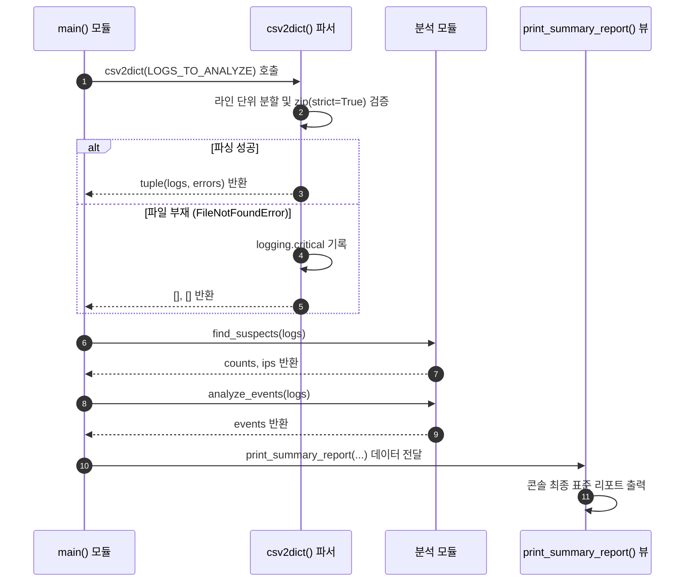

## 1. 개요 및 학습 맥락 (Context & Objective)

보안 관제 자동화의 출발점은 다양한 이종 시스템에서 수집되는 비정형 및 반정형 로그 텍스트를 손실 없이 파싱하고 구조화하는 작업이다. 실제 운영 환경의 로그 파일은 무작위 네트워크 절단, 디스크 쓰기 중단, 인코딩 깨짐 등으로 인해 일부 라인이 손상되어 전달되는 경우가 빈번하다.

이번 과제의 목표는 불완전한 텍스트 로그 데이터(`log_broken.csv`)를 안전하게 파싱하고, 정상 데이터와 에러 라인을 정확히 분리하는 로그 분석 로직을 구축하는 것이다. 수업 6교시까지 직접 고민하여 작성한 완성본 코드(`day02_연습.py`)의 한계점을 분석하고, AI 페어 프로그래머와 협업하여 최적화한 결과물(`day02_llm.py`)을 대조 검토하며 설계 원칙을 체화했다.

---

## 2. 기본 구현의 한계점 (Limitation of Naive Approach)

내가 수업 시간 6교시에 최종적으로 완성했던 `day02_연습.py` 코드는 기능 동작 자체는 성공했으나, 다음과 같은 구조적 한계를 가지고 있었다.

### 1. 단일 책임 원칙(SRP) 위반 및 부작용 발생
`csv2dict` 함수는 파일 I/O와 데이터 파싱만 전담해야 하지만, 함수 내부에서 `print()`를 직접 호출해 콘솔 출력을 수행했다. 이로 인해 비즈니스 로직과 화면 출력 계층이 강하게 결합되어, 다른 모듈이나 웹 API에서 이 함수를 재사용할 때 원치 않는 콘솔 출력이 발생하는 부작용이 있었다.

### 2. 예외 상태 정보의 유실
파싱 중 발견된 손상 라인 번호(`errors`)를 함수 내부에서 화면에 찍고 버렸다. 함수를 호출하는 `main` 입장에서는 파일의 몇 번째 라인이 왜 깨졌는지 전달받지 못해 데이터 파이프라인의 추적성이 단절되었다.

### 3. 명시적 인덱스 루프 사용
`for l in range(len(lines)):`와 같이 인덱스 배열에 기반한 루프를 사용하여 가독성이 떨어지고 파이썬의 `enumerate()` 내장 기능을 온전히 활용하지 못했다.

### 4. 엄격한 컬럼 검증 부재 및 KeyError 위험
CSV의 필드 개수가 정해진 헤더 키와 일치하지 않을 때 단순 `zip()`은 짧은 쪽에 맞추어 넘어가 데이터 누락을 감지하지 못했다. 또한 출력부의 `ips[user]` 직접 참조는 키가 없을 때 프로그램이 비정상 종료될 위험을 안고 있었다.

---

## 3. 엔지니어링 의사결정 및 리팩터링 (Engineering Decisions)

내 원본 코드(`day02_연습.py`)의 한계를 바탕으로, AI 페어 프로그래밍을 통해 `day02_llm.py` 최적화 코드를 도출하고 다음 의사결정을 적용했다.

### 주요 의사결정사항 (Q&A)

**Q. 파싱 함수 내부의 콘솔 출력을 어떻게 처리해야 하는가?**  
**A.** 데이터 파싱 함수 `csv2dict` 내의 모든 `print()` 구문을 제거한다. 대신 `tuple[list[dict[str, str]], list[int]]` 형태의 튜플 반환 타입을 도입하여, 정상 파싱 데이터와 에러 라인 인덱스 리스트를 호출자에게 동시 반환하도록 변경한다. 콘솔 리포팅은 독립된 뷰 함수 `print_summary_report()`에 전담시킨다.

**Q. CSV 라인의 데이터 무결성을 어떻게 보장하는가?**  
**A.** Python 3.10에 도입된 `zip(..., strict=True)` 키워드 인자를 사용한다. 헤더 키(`keys`)의 개수와 읽어들인 CSV 컬럼 요소 수가 일치하지 않으면 즉시 `ValueError`가 발생하므로, 손상된 라인을 정교하게 포착하여 `errors` 리스트에 수집하고 표준 로거(`logging.warning`)로 추적 기록한다.

**Q. 데이터 참조 시 예외 안정성은 어떻게 확보하는가?**  
**A.** 의심 사용자 IP 매핑 데이터 참조 시 직접 인덱싱(`ips[user]`) 대신 `suspect_ips.get(user, 'N/A')` 패턴을 적용하여 데이터 누락 시에도 안전하게 기본값을 반환하도록 수정한다.

### 리팩터링 대조 코드

```python
# [내가 6교시에 작성한 완성 코드: day02_연습.py]
def csv2dict(file: str) -> List[Dict[str, str]]:
    # ...
    for l in range(len(lines)):
        try:
            logs.append(dict(zip(keys, lines[l].split(","), strict = True)))
        except ValueError as e:
            errors.append(l)
            logging.warning(...)
            continue

    if errors is not None:
        print(f"[경고] 오류 {len(errors)}회, {file}의 라인 {errors}")
    print(f"[요약] 정상 {len(logs)}건, 오류 {len(errors)}건")
    return logs  # 에러 라인 인덱스 정보 유실
```

```python
# [AI 페어 프로그래밍 최적화 코드: day02_llm.py]
def csv2dict(file: str) -> tuple[list[dict[str, str]], list[int]]:
    """CSV 파일 파싱 및 순수 데이터/에러 라인 반환 (콘솔 출력 부작용 제거)"""
    try:
        logging.info(f"파싱 시작: {file}")
        with open(file, encoding="utf-8") as f:
            keys = ["time", "user", "event", "ip"]
            lines = f.read().splitlines()
            logs, errors = [], []

            for l_idx, line in enumerate(lines):
                try:
                    logs.append(dict(zip(keys, line.split(","), strict=True)))
                except ValueError as e:
                    errors.append(l_idx)
                    logging.warning(f"{e}, at {file}, line {l_idx} ({line or '빈 줄'})")
                    continue

            logging.info(f"{len(logs)} 줄 파싱 완료")
            return logs, errors
    except FileNotFoundError as e:
        logging.error(f"Code: {e.errno}, Message: {e.strerror}, Target: {e.filename}")
        logging.critical("비정상 종료")
        return [], []
```

---

## 4. 시스템 아키텍처 흐름도 (Mermaid Diagram)

전체 시스템 흐름은 아래 파이프라인과 같이 데이터 수집, 파싱 검증, 분석 집계, 뷰 출력의 단계로 분리되어 수행된다.



---

## 5. 검증 및 회고 (Verification & Takeaway)

### 검증 결과
손상된 텍스트 로그 파일(`log_broken.csv`)을 통한 실행 테스트 결과는 다음과 같다.

1. **에러 라인 정확 분리**: 무결성이 훼손된 라인 인덱스가 `errors` 리스트에 안전하게 격리되며, 파일 전체 파싱 실패로 전이되지 않음을 확인했다.
2. **로그 추적성 확보**: 발생한 오류 내역이 `agent.log`에 `WARNING` 및 `CRITICAL` 레벨로 기록되어, 콘솔의 깨끗한 출력과 시스템 감사 기록 보존이 동시 성취되었다.
3. **이상 징후 포착**: 실패 임계값(`ALERT_LIMIT = 2`) 이상의 비정상 접근 시도 사용자와 해당 발신 IP 주소를 정확히 추출하여 표시했다.

### 핵심 배움 (Takeaway)

* **관심사의 분리(Separation of Concerns)**: 파싱 로직, 통계 로직, 뷰 로직이 단일 함수 내에 엉켜 있을 경우 코드 확장성은 급격히 떨어진다. 데이터의 수집과 표현을 분리하는 구조 설계가 자동화 시스템의 기본 요건이다.
* **`zip(..., strict=True)`의 무결성 보장**: 파이썬 3.10에 도입된 `strict` 옵션은 CSV 파싱 시 예기치 못한 스키마 변형이나 누락 라인을 인라인 단계에서 가장 확실히 차단하는 안전장치이다.
* **Logging과 Print의 명확한 역할 구별**: 개발자 및 운용자를 위한 감성/디버그 정보는 구조화된 `logging`으로 전송하고, 최종 사용자나 관제 화면 출력은 표준 인터페이스 뷰로 전담시키는 엄격함이 필요하다.