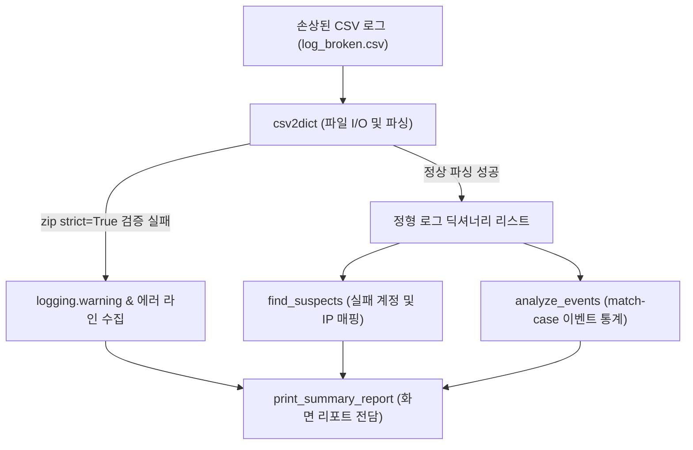

## 1. 오늘의 학습 개념 요약

실제 보안 관제 환경에서 유입되는 CSV 로그는 네트워크 전송 지연, 버퍼 단편화, 비정상 프로세스 종료로 인해 행마다 필드 개수가 누락되거나 왜곡되는 손상 데이터가 빈번하게 발생한다. 비정상 행을 무시하지 않고 정확한 에러 라인을 로깅하면서도 전체 파이프라인이 중단되지 않도록 방어 로직을 구성하는 것이 핵심 과제다.

파이썬 3.10에 도입된 `zip(..., strict=True)` 구문은 키와 값의 개수가 불일치할 때 즉시 `ValueError`를 발생시키므로, 컬럼 누락 행을 결정론적으로 검출하는 강력한 방어 도구가 된다. 또한 `logging` 라이브러리의 심각도 체계(INFO, WARNING, ERROR, CRITICAL)를 설정하여 휘발성 콘솔 출력이 아닌 영구 로그 파일(`agent.log`)에 실행 추적 기록을 남기는 기법을 체득했다.

## 2. 전체 산출물 파이프라인 구조

Day 02 실습 산출물은 `day02_practice.py`와 AI 최적화 버전인 `day02_llm.py`로 구성된다.



데이터 파싱(`csv2dict`), 침해 지표 수집(`find_suspects`), 이벤트 통계 집계(`analyze_events`), 화면 출력(`print_summary_report`)이 상호 독립된 계층으로 연결된다.

## 3. 기본 구현의 한계점

강의 기본 예시 코드는 단순 `try-except IndexError`와 `print` 문에 의존한다.

```python
# 단순 예외 처리 접근 (베이스라인 예제)
logs = []
with open("sample_logs_broken.csv", encoding="utf-8") as f:
    for line in f:
        parts = line.strip().split(",")
        try:
            logs.append({"time": parts[0], "user": parts[1], "event": parts[2], "ip": parts[3]})
        except IndexError:
            print(f"깨진 줄 건너뜀: {line.strip()}")
```

이 접근 방식의 구조적 한계는 명확하다.

1. **컬럼 초과 결손 미탐지:** `IndexError`는 컬럼 수가 4개 미만인 경우만 포착한다. 공격자가 악의적으로 추가 필드를 삽입하거나 구분자가 오염되어 5개 이상의 컬럼이 유입되는 경우 에러 없이 4번째 컬럼까지만 잘려 적재되므로 데이터 왜곡을 감지하지 못한다.
2. **휘발성 경고 출력:** `print`를 통한 콘솔 출력은 프로세스 종료 시 즉시 소멸하여 사후 감사 추적이 불가능하다.
3. **I/O 부작용 혼재:** 파싱 함수 내부에서 화면 출력을 직접 수행하면 단위 테스트 작성이 어려워지고, 향후 웹훅이나 데이터베이스 파이프라인으로 확장할 때 코드를 재사용할 수 없다.

## 4. 엔지니어링 의사결정 및 리팩터링

### 4.1. 1차 프로토타입 구현: zip(strict=True)와 match-case 패턴 매칭
1차 구현(`day02_practice.py`)에서는 키 목록과 분할된 토큰을 결합할 때 `strict=True` 옵션을 적용했다. 필드 개수가 4개가 아니면 즉시 `ValueError`가 발생하므로 누락과 초과를 동시에 잡아낸다.

```python
def csv2dict(file: str) -> list[dict[str, str]]:
    with open(file, encoding="utf-8") as f:
        keys = ["time", "user", "event", "ip"]
        lines = f.read().splitlines()
        logs = []
        errors = []

        for l in range(len(lines)):
            try:
                logs.append(dict(zip(keys, lines[l].split(","), strict=True)))
            except ValueError as e:
                errors.append(l)
                logging.warning(f"{e}, at {file}, line {l} ({lines[l] or '빈 줄'})")
                continue
        return logs
```

또한 이벤트 통계 집계에 파이썬 3.10 `match-case` 구문을 도입하여 알 수 없는 미정의 이벤트(`case _:`) 유입 시 경고 로그를 남기도록 설계했다.

### 4.2. 2차 구조 개선: 화면 출력 부작용 격리 및 순수 함수화
1차 구현의 `csv2dict` 내부에는 `print(f"[경고] 오류 {len(errors)}회...")`와 같은 콘솔 출력이 포함되어 있었다. 2차 구조 개선(`day02_llm.py`)을 거치며 파싱 함수는 데이터(`tuple[list[dict], list[int]]`)만 반환하고, 화면 출력은 전담 뷰 함수(`print_summary_report`)로 완전히 분리했다.

```python
def csv2dict(file: str) -> tuple[list[dict[str, str]], list[int]]:
    """CSV 파일을 읽어 파싱된 로그 리스트와 오류 라인 번호 리스트를 반환 (I/O 부작용 격리)"""
    try:
        logging.info(f"파싱 시작: {file}")
        with open(file, encoding="utf-8") as f:
            keys = ["time", "user", "event", "ip"]
            lines = f.read().splitlines()
            logs = []
            errors = []

            for l_idx, line in enumerate(lines):
                try:
                    logs.append(dict(zip(keys, line.split(","), strict=True)))
                except ValueError as e:
                    errors.append(l_idx)
                    logging.warning(f"{e}, at {file}, line {l_idx} ({line or '빈 줄'})")
                    continue

            logging.info(f"{len(logs)} 줄 파싱 완료")
            return logs, errors
    except FileNotFoundError as e:
        logging.error(f"Code: {e.errno}, Message: {e.strerror}, Target: {e.filename}")
        logging.critical("비정상 종료")
        return [], []
```

## 5. 검증 및 회고

`day02_llm.py`를 실행하여 22줄(정상 20건, 결손 2건)로 구성된 `log_broken.csv`를 분석했다.

```text
[경고] 오류 2회, ./logs/log_broken.csv의 라인 [10, 17]
[요약] 정상 20건, 오류 2건
	login_success: 10건
	login_failed: 4건
	logout: 6건
확인 필요: admin — 실패 3회
	발신 IP: 211.45.12.9
```

`agent.log` 파일에도 의도한 로그 추적 데이터가 기록되었다.

```text
2026-08-30 14:10:01,102 INFO 파싱 시작: ./logs/log_broken.csv
2026-08-30 14:10:01,103 WARNING zip() argument 2 is shorter than argument 1, at ./logs/log_broken.csv, line 10 (03:22,hacker)
2026-08-30 14:10:01,103 WARNING zip() argument 2 is shorter than argument 1, at ./logs/log_broken.csv, line 17 (빈 줄)
2026-08-30 14:10:01,104 INFO 20 줄 파싱 완료
```

결손 데이터가 유입되어도 파이프라인 전체가 중단되지 않고, 로깅을 통해 결손 원인을 명확히 추적할 수 있음을 검증했다. 비즈니스 로직에서 화면 출력 부작용을 제거하는 리팩터링이 향후 모듈 확장에 필수적인 설계임을 확인했다.
