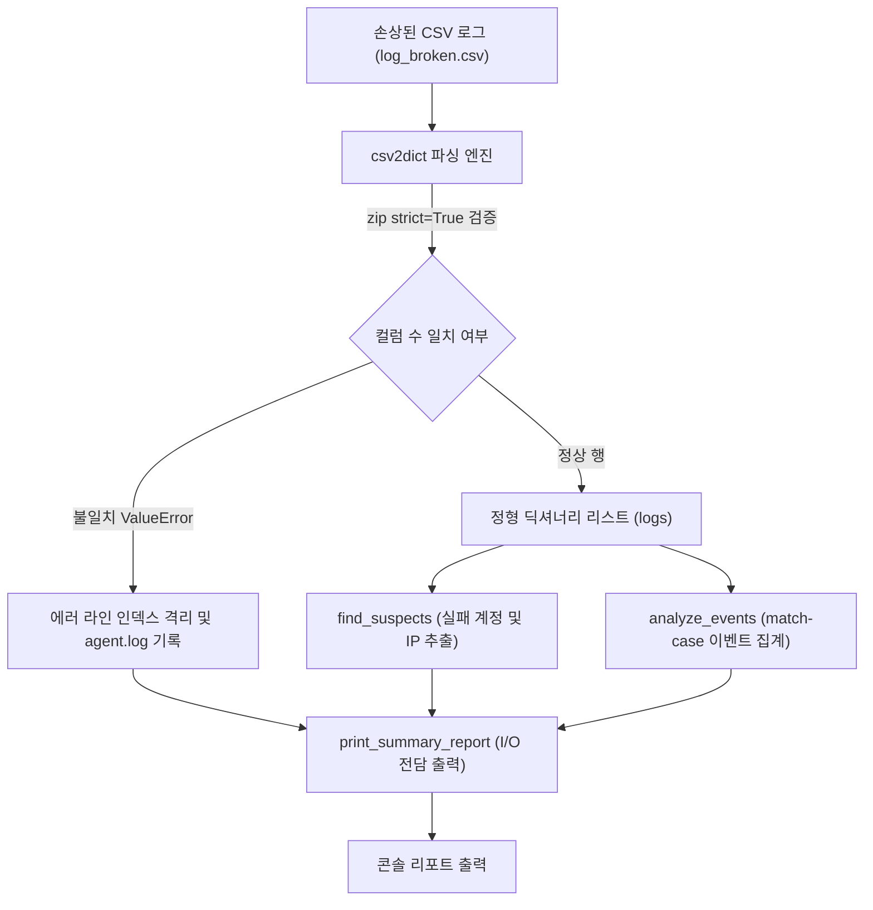

## 1. 오늘의 학습 개념 요약

실제 보안 관제 환경에서 유입되는 CSV 로그는 네트워크 전송 지연, 버퍼 단편화, 비정상 프로세스 종료로 인해 행마다 필드 개수가 누락되거나 왜곡되는 손상 데이터가 빈번하게 발생한다. 비정상 행을 무시하지 않고 정확한 에러 라인을 로깅하면서도 전체 파이프라인이 중단되지 않도록 방어 로직을 구성하는 것이 핵심 과제다.

파이썬 3.10에 도입된 `zip(..., strict=True)` 구문은 키와 값의 개수가 불일치할 때 즉시 `ValueError`를 발생시키므로, 컬럼 누락 행을 결정론적으로 검출하는 강력한 방어 도구가 된다. 또한 애플리케이션의 핵심 비즈니스 로직(데이터 파싱 및 통계 집계)과 화면 출력 부작용을 분리해야만 향후 자동화 파이프라인 확장 시 코드 재사용성이 보장된다.

## 2. 전체 산출물 파이프라인 구조

Day 02 실습은 손상된 CSV 로그(`log_broken.csv`)를 읽어 파싱 에러를 `agent.log`에 기록하고, 통계 및 이상 징후를 격리 출력하는 아키텍처로 설계되었다.



시스템은 파싱 단계에서 정상 데이터와 결함 데이터를 명확히 분리한다. 파싱된 데이터는 이벤트 분석기와 위협 계정 추출기로 전달되며, 최종 출력은 별도로 분리된 리포트 함수가 취합하여 화면에 표시한다.

## 3. 기본 구현의 한계점

입문 과정이나 단순 스크립트에서는 대개 다음과 같은 베이스라인 코드를 사용한다.

```python
# 단순 CSV 파싱 접근 방식 (베이스라인 예제)
logs = []
with open("log.csv", encoding="utf-8") as f:
    for line in f:
        parts = line.strip().split(",")
        logs.append({
            "time": parts[0],
            "user": parts[1],
            "event": parts[2],
            "ip": parts[3]
        })
        print(f"파싱 완료: {parts[1]}")
```

이러한 단순 구현은 실무 관제 환경에서 다음과 같은 구조적 결함을 드러낸다.

1. **컬럼 누락 시 인덱스 예외로 인한 전체 중단:** 네트워크 유실 등으로 인해 특정 행의 필드가 3개 이하로 잘리면 `parts[3]` 접근 시 `IndexError`가 발생해 수만 줄의 전체 파싱 작업이 즉시 중단된다.
2. **비즈니스 로직과 I/O 부작용의 강한 결합:** 파싱 루프 내부에서 `print`를 직접 호출하면, 해당 함수를 다른 모듈(웹훅 전송기, 데이터베이스 적재기)에서 재사용할 때마다 불필요한 콘솔 출력이 강제된다.
3. **손상 데이터에 대한 감사 추적 부재:** 어떤 라인에서 몇 개의 에러가 발생했는지 구조화된 로그나 에러 리스트를 남기지 않아 데이터 무결성 검증이 불가능하다.

## 4. 엔지니어링 의사결정 및 리팩터링

수업 중 직접 작성한 6교시 구현(`day02_practice.py`)을 바탕으로 AI 페어 프로그래밍을 진행하여, 구조적 결함을 해소하고 단일 책임 원칙을 달성하는 최적화 코드(`day02_llm.py`)를 도출했다.

### 4.1. 파싱 함수에서 화면 출력 부작용 완전 격리
초기 작성 코드에서는 `csv2dict` 내부에서 경고 문구를 직접 `print`하고 있었다. AI 페어 프로그래머의 조언에 따라 모든 화면 출력을 제거하고 정상 로그 리스트와 에러 라인 번호 리스트를 튜플 `(logs, errors)` 형태로 반환하도록 재설계했다.

```python
# day02_practice.py (나의 시도: 파싱 함수 내 print 결합 및 List 타입 힌트)
def csv2dict(file: str) -> List[Dict[str, str]]:
    ...
    for l in range(len(lines)):
        try:
            logs.append(dict(zip(keys, lines[l].split(","), strict=True)))
        except ValueError as e:
            errors.append(l)
            logging.warning(f"{e}, at {file}, line {l} ({lines[l] or '빈 줄'})")
            continue
    if errors is not None:
        print(f"[경고] 오류 {len(errors)}회, {file}의 라인 {errors}")
    return logs

# day02_llm.py (AI 페어 프로그래밍 최적화: 순수 함수 지향 및 튜플 반환)
def csv2dict(file: str) -> tuple[list[dict[str, str]], list[int]]:
    """CSV 파일을 읽어 파싱된 로그 리스트와 오류 라인 번호 리스트를 반환"""
    try:
        logging.info(f"파싱 시작: {file}")
        with open(file, encoding="utf-8") as f:
            keys = ["time", "user", "event", "ip"]
            lines = f.read().splitlines()
            logs = []
            errors = []
            for l_idx, line in enumerate(lines):
                try:
                    logs.append(dict(zip(keys, line.split(","), strict=True)))
                except ValueError as e:
                    errors.append(l_idx)
                    logging.warning(f"{e}, at {file}, line {l_idx} ({line or '빈 줄'})")
                    continue
            logging.info(f"{len(logs)} 줄 파싱 완료")
            return logs, errors
    except FileNotFoundError as e:
        logging.error(f"Code: {e.errno}, Message: {e.strerror}, Target: {e.filename}")
        logging.critical("비정상 종료")
        return [], []
```

`zip(..., strict=True)`를 유지하여 컬럼 수 불일치를 `ValueError`로 정확히 포착하면서도, 함수 외부로 에러 인덱스를 전달하여 데이터 파싱 책임을 완결했다.

### 4.2. 리포트 전담 뷰 함수 print_summary_report 신설
비즈니스 로직과 화면 출력 로직을 격리하기 위해 콘솔 렌더링 책임을 전담하는 `print_summary_report` 함수를 신설했다.

```python
def print_summary_report(
    file_path: str,
    logs: list[dict[str, str]],
    errors: list[int],
    events: dict[str, int],
    suspect_counts: Counter,
    suspect_ips: dict[str, str],
    alert_limit: int,
) -> None:
    """분석 완료된 데이터를 콘솔에 전담 출력하는 뷰 함수"""
    if errors:
        print(f"[경고] 오류 {len(errors)}회, {file_path}의 라인 {errors}")
    print(f"[요약] 정상 {len(logs)}건, 오류 {len(errors)}건")
    for event, count in events.items():
        print(f"\t{event}: {count}건")
    for user, count in suspect_counts.items():
        if count >= alert_limit:
            print(f"확인 필요: {user} — 실패 {count}회")
            print(f"\t발신 IP: {suspect_ips.get(user, 'N/A')}")
```

발신 IP 조회 시에도 `suspect_ips.get(user, 'N/A')`를 적용하여 딕셔너리 키 누락으로 인한 비정상 크래시를 방지했다.

### 4.3. enumerate 도입 및 파이썬 3.9+ 표준 내장 제네릭 통일
`range(len(lines))` 인덱스 순회를 `enumerate(lines)`로 교체하여 가독성을 높이고 인덱스와 데이터를 안전하게 바인딩했다. 또한 파이썬 3.9 이상 표준인 내장 컬렉션 타입 힌트(`list[...]`, `tuple[...]`, `dict[...]`)로 통일하여 별도 모듈 임포트 의존성을 제거했다.

## 5. 검증 및 회고

손상된 텍스트가 포함된 `log_broken.csv`를 입력으로 테스트를 수행한 결과는 다음과 같다.

```text
[경고] 오류 2회, ./logs/log_broken.csv의 라인 [10, 17]
[요약] 정상 20건, 오류 2건
	login_success: 8건
	login_failed: 4건
	logout: 8건
확인 필요: admin — 실패 3회
	발신 IP: 211.45.12.9
```

컬럼 수가 부족한 11번째 라인(인덱스 10)과 빈 줄(인덱스 17)을 정확히 포착하여 `agent.log`에 경고를 남기고 에러 리스트에 격리했다. 정상 처리된 20건의 로그는 이벤트 통계와 함께 3회 실패한 `admin` 계정 및 발신 IP(`211.45.12.9`)까지 안전하게 출력되었다.

기능 구현에 치중했던 초기 코드에서 탈피하여, AI 페어 프로그래밍을 통해 함수의 반환 시그니처와 출력 책임을 정교하게 분리했다. 작은 파싱 유틸리티라도 단일 책임 원칙(SRP)을 준수하는 것이 장기적인 유지보수성과 확장성의 출발점임을 체득했다.
