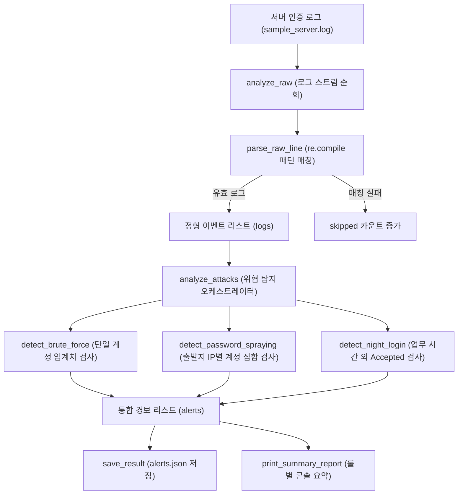

## 1. 오늘의 학습 개념 요약

서버 시스템의 인증 로그는 정형화된 CSV 형식이 아닌 자유로운 텍스트 문자열 형태로 기록된다. 특히 SSH 데몬 인증 로그는 타임스탬프, 프로세스 정보, 인증 성공 및 실패 여부, 대상 계정명, 출발지 IP 및 포트 번호가 섞여 있어 원하는 필드만 정확히 캡처하려면 정규표현식을 이용한 패턴 매칭이 필수적이다.

보안 관제 관점에서는 단일 로그 이벤트만으로 위협을 판단하기 어렵다. 동일 계정에 대한 반복 실패는 무차별 대입 공격(Brute-force), 단일 IP에서 다수의 서로 다른 계정으로 실패를 분산 시도하는 행위는 패스워드 스프레잉(Password Spraying), 정상적인 로그인이라 하더라도 비인가 시간대에 발생하는 행위는 심야 비인가 접속으로 분류된다. 이처럼 서로 다른 공격 패턴을 독립된 탐지 규칙으로 추상화하고 정형 JSON 리포트로 저장하는 구조를 학습했다.

## 2. 전체 산출물 파이프라인 구조

Day 03 실습 산출물은 `sample_server.log` 텍스트를 인제스트하여 3가지 보안 룰을 순차 검증하고, 구조화된 경보 리포트(`alerts.json`) 생성 및 콘솔 요약을 출력하는 아키텍처로 완성되었다.



데이터 스트림은 정규식 파싱 단계를 거쳐 구조화된 로그 레코드로 전환된 후, 세 가지 개별 탐지 엔진으로 라우팅된다. 탐지된 결과는 단일 TypedDict 스키마로 집약되어 영속 파일 저장 및 화면 브리핑으로 연결된다.

## 3. 기본 구현의 한계점

입문 교재나 단순 스크립트에서는 대개 다음과 같은 일체형 루프 방식을 사용한다.

```python
# 단순 접근 방식 (베이스라인 예제)
import re

alerts = []
for line in open("sample_server.log"):
    # 매 라인마다 패턴을 재컴파일하며 검색
    m = re.search(r"(Failed|Accepted) password for (\w+) from ([\d.]+)", line)
    if m:
        event, user, ip = m.group(1), m.group(2), m.group(3)
        if event == "Failed" and user == "admin":
            alerts.append(f"관리자 로그인 실패: {ip}")
```

이러한 단순 구현은 실무 대용량 관제 환경에서 다음과 같은 구조적 결함을 드러낸다.

1. **정규식 매번 재컴파일로 인한 심각한 CPU 병목:** 반복 루프 내부에서 `re.search`에 문자열 패턴을 직접 전달하면 파이썬 엔진이 매 줄마다 정규식 문자열을 파싱하고 컴파일하여 수십만 줄 처리 시 심각한 I/O 및 CPU 병목을 유발한다.
2. **단일 거대 루프 내 룰 결합으로 인한 확장성 붕괴:** 여러 보안 룰(무차별 대입, 스프레잉, 심야 접속)의 상태 변수와 조건 분기가 하나의 거대한 루프에 엉키면, 새로운 탐지 룰을 추가하거나 수정할 때 기존 코드가 오염될 위험이 크다.
3. **스키마 검증 부재 및 예외 은닉:** 탐지된 경보 데이터의 구조가 정형화되지 않아 외부 시스템과의 연동이 어렵고, 파일 I/O 예외 처리가 누락되면 장애 상황을 은폐하게 된다.

## 4. 엔지니어링 의사결정 및 리팩터링

수업 중 직접 작성한 6교시 구현(`detect.py`)을 바탕으로 AI 페어 프로그래밍을 진행하여, 성능 병목을 제거하고 단일 책임 원칙을 적용한 최적화 코드(`detect_llm.py`)를 도출했다.

### 4.1. re.compile을 통한 모듈 레벨 정규식 사전 컴파일
초기 구현에서는 `parse_raw_line` 함수 내에서 매번 정규식 검색을 실행했다. AI 페어 프로그래머의 조언에 따라 모듈 초기화 시점에 `re.compile`로 단 한 번만 컴파일하도록 상수로 선언하여 라인 순회 시 파싱 속도를 대폭 개선했다.

```python
# detect.py (나의 시도: 함수 내부에서 매번 패턴 정의)
def parse_raw_line(line: str) -> list[dict[str, str]] | None:
    pattern = r"(\d+:\d+:\d+).*(Failed|Accepted) password for ([\w.]+) from ([\d.]+) port (\d+)"
    m = re.search(pattern, line)
    ...

# detect_llm.py (AI 페어 프로그래밍 최적화: 모듈 레벨 사전 컴파일)
LOG_PATTERN = re.compile(
    r"(\d+:\d+:\d+).*(Failed|Accepted) password for ([\w.]+) from ([\d.]+) port (\d+)"
)

def parse_raw_line(line: str) -> dict[str, str] | None:
    m = LOG_PATTERN.search(line)
    if m:
        return {
            "time": m.group(1),
            "event": m.group(2),
            "user": m.group(3),
            "ip": m.group(4),
            "port": m.group(5),
        }
    return None
```

### 4.2. 단일 책임 원칙에 기반한 3대 탐지 엔진 분리
`analyze_attacks`에 혼재되어 있던 탐지 로직을 `detect_brute_force`, `detect_password_spraying`, `detect_night_login`의 세 독립 함수로 분리했다.

```python
def analyze_attacks(logs: list[dict[str, str]]) -> list[Alert]:
    alerts: list[Alert] = []
    alerts.extend(detect_brute_force(logs))
    alerts.extend(detect_password_spraying(logs))
    alerts.extend(detect_night_login(logs))
    return alerts
```

각 룰 엔진은 입력 로그 리스트를 받아 자신이 담당하는 특정 위험 패턴만 순수하게 판별하여 반환하므로 개별 룰 단위의 단위 테스트 작성이 용이해졌다.

### 4.3. TypedDict 스키마 무결성 확보 및 예외 로깅 정상화
`PasswordSprayingAlert`에 `users: list[str]` 필드 타입을 명시하여 정적 타입 검사 무결성을 확보했다. 또한 `save_result`의 bare except(`except:`)를 `except OSError as e:`로 변경하여 파일 시스템 에러 발생 시 명확한 로그가 남도록 수정했다.

```python
class PasswordSprayingAlert(TypedDict):
    rule: Literal["password_spraying"]
    ip: str
    accounts: int
    users: list[str]

def save_result(log_file_name: str, parsed_line: int, skipped_line: int, alerts: list[Alert]) -> None:
    combined: LogAnalysisReport = {
        "file": log_file_name,
        "parsed": parsed_line,
        "skipped": skipped_line,
        "alerts": alerts,
    }
    try:
        with open(JSON_FILE_NAME, "w", encoding="utf-8") as f:
            json.dump(combined, f, ensure_ascii=False, indent=2)
    except OSError as e:
        logging.error(f"Failed to save JSON report: {e}")
```

## 5. 검증 및 회고

`detect_llm.py`를 실행하여 `sample_server.log`를 분석한 결과, 10건의 정상 로그를 완벽히 파싱하고 결손 0건을 확인했다. 탐지 엔진은 `admin` 계정에 대한 2회 연속 실패, `192.168.1.105` IP에서의 3개 계정 분산 시도, `03:45:12` 심야 시간대의 비인가 로그인을 각각 정확하게 식별하여 `alerts.json` 파일에 저장했다.

보안 관제 파이프라인에서 정규식 사전 컴파일은 대용량 트래픽 처리 성능을 좌우하는 필수 테크닉임을 확인했다. 또한 탐지 로직이 복잡해질수록 단일 거대 루프에 의존하지 않고 룰별 독립 함수로 격리하는 설계가 시스템의 확장성을 담보한다는 중요한 교훈을 얻었다.
