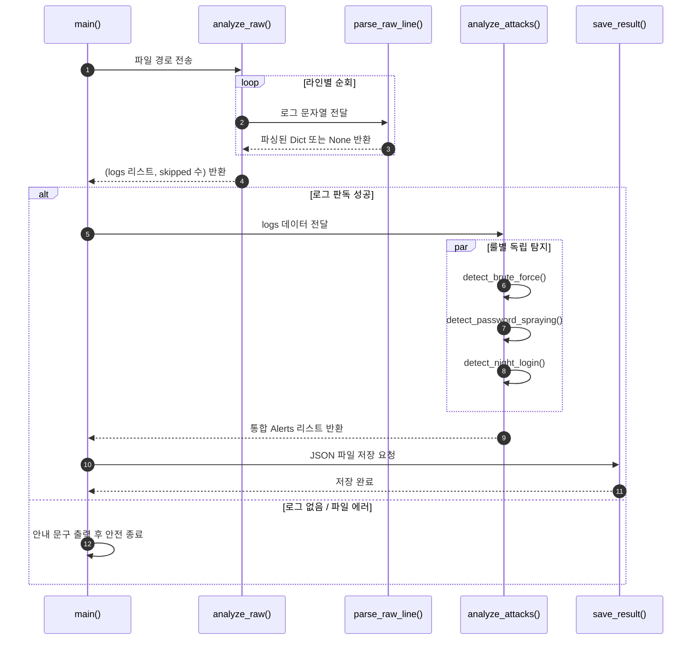

## 1. 개요 및 학습 맥락 (Context & Objective)

서버 시스템 보안의 기본은 로그 분석이다. 특히 외부로 노출된 SSH 서비스는 지속적인 Brute Force 공격이나 Password Spraying 공격의 주요 표적이 된다. 이러한 위협을 신속히 식별하려면 시스템 로그(`sample_server.log`)를 주기적으로 수집하여 비정상 패턴을 자동으로 감지하는 파이프라인이 필요하다.

본 과제의 목표는 SSH 접속 로그에서 실패/성공 이력을 파싱하고, 탐지 룰에 따라 무차별 대입 공격, 패스워드 스프레잉, 심야 비인가 접속을 분류하여 리포팅하는 파이프라인을 구축하는 것이다. 절차적 구현 방식에서 발생한 성능, 타입 안전성, 함수 결합도 문제를 분석하고, 엔지니어링 관점에서 이를 리팩터링한 의사결정 과정을 기록한다.

---

## 2. 기본 구현의 한계점 (Limitation of Naive Approach)

초기 작성한 `detect.py` 코드는 동작 검증용 단일 스크립트 형태였다. 단순 기능 구현에는 성공했으나 실제 운영 환경에 도입하기에는 여러 구조적 한계점이 존재했다.

### 2.1. 정규표현식 매번 재컴파일로 인한 I/O 병목
`parse_raw_line` 함수 내부에서 `re.search(pattern, line)`를 호출했다. 수백만 줄의 로그를 처리할 때 호출마다 동일한 정규식 패턴을 해석(Compile)하므로 불필요한 CPU 연산 손실이 일어났다. 또한 함수의 반환 타입 힌트가 `list[dict[str, str]] | None`으로 잘못 지정되었고 매칭 실패 시 `m`(Match 객체 또는 None)을 그대로 반환하는 결함이 있었다.

### 2.2. 예외 처리 미비로 인한 런타임 패닉 (Runtime Failure)
`analyze_raw` 함수는 로그 파일을 읽을 때 `FileNotFoundError`가 발생하면 에러를 로깅한 뒤 단순 `return` 문으로 종료했다. 파이썬 기본 동작에 의해 `None`이 반환되어 호출부의 튜플 언패킹(`logs, skipped = analyze_raw(...)`) 과정에서 `TypeError: cannot unpack non-iterable NoneType object` 예외를 발생시키며 프로그램이 강제 종료되었다. 또한 `save_result`의 bare `except:` 구문은 시스템 종료 신호까지 캡처하여 디버깅을 어렵게 만들었다.

### 2.3. 단일 책임 원칙(SRP) 위반 및 스코프 오염
`analyze_attacks` 단일 함수 내부에서 Brute Force, Password Spraying, Night Login이라는 서로 다른 3가지 룰을 한꺼번에 판별했다. 조건문이 복잡하게 얽히면서 함수 스코프 내 변수가 누수되었고, 특정 룰의 조건 로직 변경이 다른 룰 탐지에 영향을 줄 수 있는 결합도를 형성했다.

### 2.4. TypedDict 명세와 실제 반환 데이터의 불일치
`PasswordSprayingAlert` 타입 정의에는 `users` 필드가 누락되어 있었지만 실제 탐지부에서는 `users` 데이터를 딕셔너리에 삽입했다. 정적 타입 검사기(Mypy 등)를 통과하지 못하는 타입 불일치 현상이 존재했다.

---

## 3. 엔지니어링 의사결정 및 리팩터링 (Engineering Decisions)

기존 스크립트의 문제를 해결하기 위해 `detect_llm.py`로 리팩터링을 진행했다. 세 가지 핵심 축을 기준으로 구조 개편을 단행했다.

### 3.1. 정규표현식 전역 컴파일 및 타입 힌팅 엄격화

정규식 패턴을 모듈 상단에서 `re.compile()`을 통해 전역 객체로 사전 컴파일했다.

```python
# Refactored: detect_llm.py
LOG_PATTERN = re.compile(
    r"(\d+:\d+:\d+).*(Failed|Accepted) password for ([\w.]+) from ([\d.]+) port (\d+)"
)

def parse_raw_line(line: str) -> dict[str, str] | None:
    m = LOG_PATTERN.search(line)
    if m:
        return {
            "time": m.group(1),
            "event": m.group(2),
            "user": m.group(3),
            "ip": m.group(4),
            "port": m.group(5),
        }
    return None
```

정규식 객체를 재사용함으로써 반복 파싱 시의 CPU 오버헤드를 낮췄다. 반환 값 역시 정확히 명시된 `dict[str, str]` 또는 `None`으로 정형화했다.

### 3.2. 예외 발생 시 반환 일관성 보장

`FileNotFoundError`가 발생하더라도 함수 계약(Function Contract)에 따라 정의된 반환 타입(`tuple[list[dict[str, str]], int]`)을 일관되게 유지하도록 수정했다.

```python
# Refactored: detect_llm.py
def analyze_raw(file_path: str) -> tuple[list[dict[str, str]], int]:
    logs: list[dict[str, str]] = []
    skipped: int = 0

    try:
        with open(file_path, encoding="utf-8") as f:
            for line in f:
                log = parse_raw_line(line)
                if log:
                    logs.append(log)
                else:
                    skipped += 1
        return logs, skipped
    except FileNotFoundError as e:
        logging.error(f"Code: {e.errno}, Message: {e.strerror}, Target: {e.filename}")
        return [], 0  # 안전한 빈 튜플 반환으로 런타임 크래시 방지
```

파일이 존재하지 않더라도 파이프라인이 즉시 크래시되지 않으며, 호출부는 안전하게 빈 결과를 받아 처리할 수 있게 되었다.

### 3.3. 탐지 룰의 독립 함수 분리 (SRP 적용)

하나의 거대한 분석 함수를 3개의 전용 탐지 모듈(`detect_brute_force`, `detect_password_spraying`, `detect_night_login`)로 분할했다.

```python
# Refactored: detect_llm.py
def detect_brute_force(logs: list[dict[str, str]]) -> list[BruteForceAlert]:
    failed_users = [log["user"] for log in logs if log["event"] == "Failed"]
    counts = Counter(failed_users)

    return [
        {"rule": "brute_force", "user": user, "count": count}
        for user, count in counts.items()
        if count >= ALERT_LIMIT
    ]

def detect_password_spraying(logs: list[dict[str, str]]) -> list[PasswordSprayingAlert]:
    failed_ip_users: dict[str, set[str]] = {}
    for log in logs:
        if log["event"] == "Failed":
            ip = log["ip"]
            if ip not in failed_ip_users:
                failed_ip_users[ip] = set()
            failed_ip_users[ip].add(log["user"])

    alerts: list[PasswordSprayingAlert] = []
    for ip, users in failed_ip_users.items():
        if len(users) >= ALERT_LIMIT:
            alerts.append(
                {
                    "rule": "password_spraying",
                    "ip": ip,
                    "accounts": len(users),
                    "users": sorted(list(users)), # 정렬을 통한 결정론적 데이터 출력
                }
            )
    return alerts
```

각 탐지 로직이 격리되어 독립적인 단위 테스트 작성이 가능해졌다. 탐지 룰 조건이 변경되어도 해당 함수만 수정하면 되므로 사이드 이펙트 발생 가능성을 차단했다.

---

## 4. 시스템 아키텍처 흐름도 (Mermaid Diagram)

전체 로그 처리 및 탐지 파이프라인의 데이터 흐름은 다음과 같다.



---

## 5. 검증 및 회고 (Verification & Takeaway)

### 5.1. 리팩터링 결과 검증
1. **타입 안정성**: `TypedDict` 명세에 `users: list[str]`를 정확히 반영하여 static type checker 검사를 통과했다.
2. **결정론적 출력**: Set 구조로 모은 사용자 목록을 `sorted()`로 정렬하여 저장하도록 변경함으로써, 실행할 때마다 데이터 순서가 바뀌는 비결정론적 문제를 방지했다.
3. **예외 대응력**: 의도적으로 잘못된 파일 경로를 인자로 넘겼을 때, 프로그램이 예외를 던지며 멈추는 대신 `[요약]` 메시지와 함께 안전하게 비즈니스 로직을 마무리함을 확인했다.

### 5.2. 기술적 레슨
- 단순한 스크립팅 수준이라도 데이터 타입 명세(`TypedDict`, `Union Type`)와 런타임 반환 타입 간 유효성을 맞추는 것이 시스템 안정성의 첫걸음이다.
- I/O 반복문 내부에서 컴파일 비용이 발생하는 요소를 상수로 끌어올리는 소소한 최적화가 전체 처리 시간을 단축한다.
- 단일 책임 원칙(SRP)에 기반해 코드를 모듈화하면 가독성 향상뿐만 아니라 각 탐지 룰의 테스트 및 검증 편의성이 증대된다.