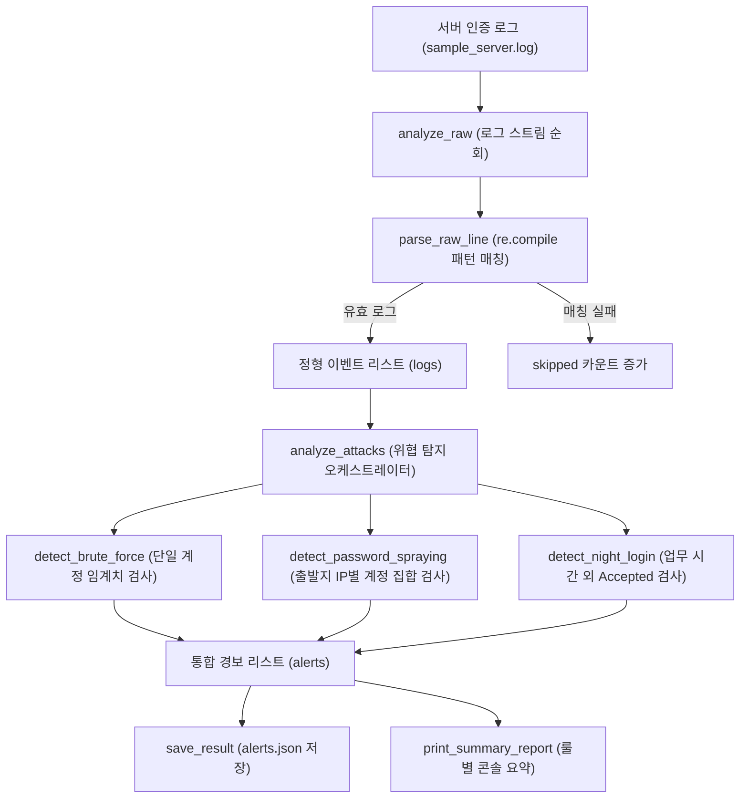

## 1. 오늘의 학습 개념 요약

서버 시스템의 인증 로그는 정형화된 CSV 형식이 아닌 자유로운 텍스트 문자열 형태로 기록된다. 특히 SSH 데몬 인증 로그는 타임스탬프, 프로세스 정보, 성공 및 실패 여부, 대상 계정명, 출발지 IP 및 포트 번호가 섞여 있어, 원하는 필드만 정확히 캡처하려면 정규표현식을 이용한 패턴 매칭이 필수적이다.

보안 관제 관점에서는 단일 로그 이벤트만으로 위협을 판단하기 어렵다. 동일 계정에 대한 반복 실패는 무차별 대입 공격, 단일 IP에서 다수의 서로 다른 계정으로 실패를 분산 시도하는 행위는 패스워드 스프레잉, 정상적인 로그인이라 하더라도 비인가 시간대에 발생하는 행위는 심야 비인가 접속으로 분류된다. 이처럼 서로 다른 공격 패턴을 독립된 탐지 규칙으로 추상화하고 정형 JSON 리포트로 저장하는 구조를 학습했다.

## 2. 전체 산출물 파이프라인 구조

Day 03 실습 산출물은 `sample_server.log` 텍스트를 인제스트하여 3가지 보안 룰을 순차 검증하고, 구조화된 경보 리포트(`alerts.json`) 생성 및 콘솔 요약을 출력하는 아키텍처로 완성되었다.



데이터 스트림은 정규식 파싱 단계를 거쳐 구조화된 로그 레코드로 전환된 후, 세 가지 개별 탐지 엔진으로 라우팅된다. 탐지된 결과는 단일 TypedDict 스키마로 집약되어 영속 파일 저장 및 화면 브리핑으로 연결된다.

## 3. 기본 구현의 한계점

수업 중 완성했던 초기 구현(`detect.py`)은 3가지 보안 룰을 성공적으로 탐지했으나, 대용량 트래픽 처리와 유지보수 관점에서 네 가지 주요 한계를 노출했다.

첫째, 정규식 매번 재컴파일로 인한 I/O 병목이다. `parse_raw_line` 함수 내부에서 패턴 문자열을 정의하고 매 라인마다 `re.search`를 직접 호출했다. 수십만 줄의 로그를 처리할 때 정규식 엔진이 매번 패턴을 컴파일하여 심각한 CPU 오버헤드를 유발했다.

둘째, 단일 거대 함수 내 룰 결합도 문제다. `analyze_attacks` 함수 내부에 3개 룰의 상태 변수(`failed_users`, `failed_ip`, 시간 비교 분기)가 단일 루프에 혼재되어 있었다. 새로운 탐지 규칙을 추가할 때 기존 코드가 오염될 위험이 컸다.

셋째, 타입 정의 불일치다. `PasswordSprayingAlert`의 `TypedDict` 정의에는 `users` 필드가 빠져 있었으나, 실제 딕셔너리 생성부에서는 `users: list(user)`를 주입하여 정적 타입 검사기가 에러를 검출하는 불일치가 발생했다.

넷째, 예외 은닉 안티패턴이다. `save_result` 함수에서 `except:` 구문으로 모든 예외를 무조건 통과시켜 디스크 쓰기 권한 부족이나 JSON 직렬화 에러를 조용히 묻어버리는 잠재적 결함이 있었다.

## 4. 엔지니어링 의사결정 및 리팩터링

AI 페어 프로그래머와 함께 이러한 구조적 병목을 진단하고, 확장성을 갖춘 코드(`detect_llm.py`)로 전면 리팩터링을 단행했다.

### 4.1. re.compile을 통한 모듈 레벨 정규식 사전 컴파일
로그 파싱 패턴을 모듈 초기화 시점에 `re.compile`로 단 한 번만 컴파일하도록 상수로 선언하여 라인 순회 시 파싱 속도를 대폭 개선했다.

```python
# detect_llm.py (모듈 레벨 사전 컴파일)
LOG_PATTERN = re.compile(
    r"(\d+:\d+:\d+).*(Failed|Accepted) password for ([\w.]+) from ([\d.]+) port (\d+)"
)

def parse_raw_line(line: str) -> dict[str, str] | None:
    m = LOG_PATTERN.search(line)
    if m:
        return {
            "time": m.group(1),
            "event": m.group(2),
            "user": m.group(3),
            "ip": m.group(4),
            "port": m.group(5),
        }
    return None
```

### 4.2. 단일 책임 원칙에 기반한 3대 탐지 엔진 분리
`analyze_attacks`에 뭉쳐 있던 로직을 `detect_brute_force`, `detect_password_spraying`, `detect_night_login`의 세 독립 함수로 분리했다.

```python
# 개별 탐지 룰 모듈화
def analyze_attacks(logs: list[dict[str, str]]) -> list[Alert]:
    alerts: list[Alert] = []
    alerts.extend(detect_brute_force(logs))
    alerts.extend(detect_password_spraying(logs))
    alerts.extend(detect_night_login(logs))
    return alerts
```

각 룰 엔진은 입력 로그 리스트를 받아 자신이 담당하는 특정 위험 패턴만 순수하게 판별하여 반환하므로 개별 룰 단위의 단위 테스트 작성이 용이해졌다.

### 4.3. TypedDict 스키마 무결성 확보 및 예외 로깅 정상화
`PasswordSprayingAlert`에 `users: list[str]` 타입을 명시하여 스키마를 정합화하고, `save_result`의 bare except를 `except OSError as e:`로 변경하여 파일 시스템 에러 발생 시 명확한 로그가 남도록 수정했다.

```python
class PasswordSprayingAlert(TypedDict):
    rule: Literal["password_spraying"]
    ip: str
    accounts: int
    users: list[str]
```

## 5. 검증 및 회고

`detect_llm.py`를 실행하여 `sample_server.log`를 분석한 결과, 10건의 정상 로그를 완벽히 파싱하고 결손 0건을 확인했다. 탐지 엔진은 `admin` 계정에 대한 2회 연속 실패, `192.168.1.105` IP에서의 3개 계정 분산 시도, `03:45:12` 심야 시간대의 비인가 로그인을 각각 정확하게 식별하여 `alerts.json` 파일에 저장했다.

보안 관제 파이프라인에서 정규식 사전 컴파일은 대용량 트래픽 처리 성능을 좌우하는 필수 테크닉임을 체감했다. 또한 탐지 로직이 복잡해질수록 단일 거대 루프에 의존하지 않고 룰별 독립 함수로 격리하는 설계가 시스템의 확장성을 담보한다는 중요한 교훈을 얻었다.
