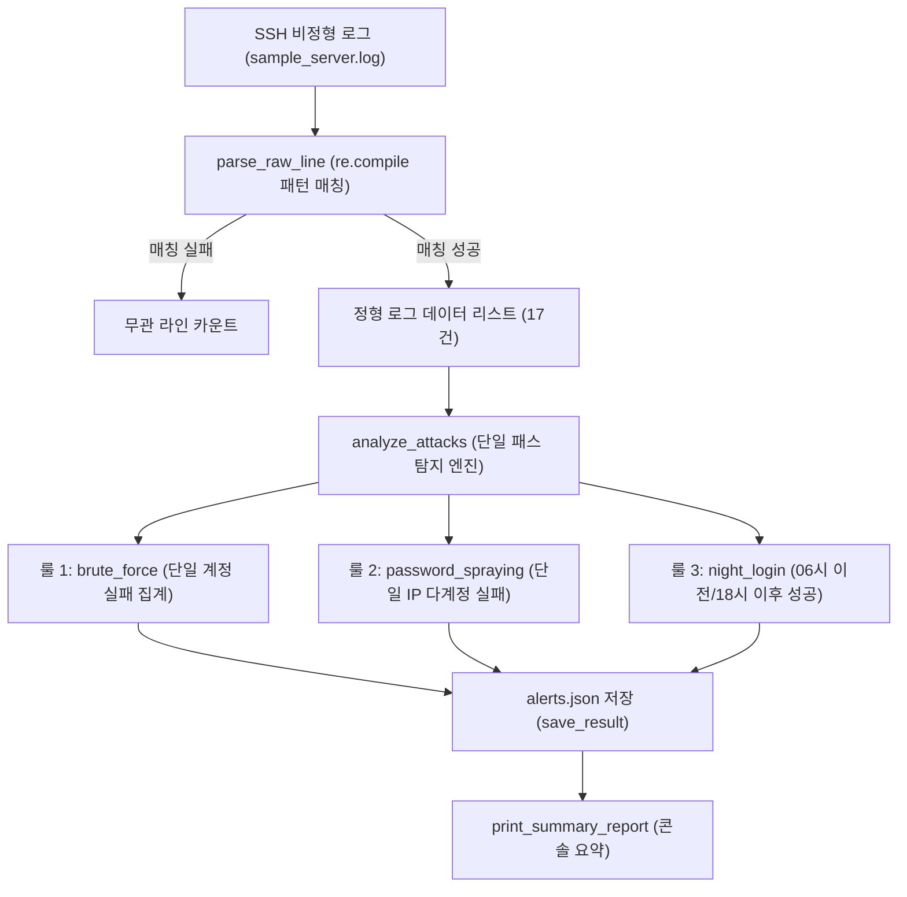

## 1. 오늘의 학습 개념 요약

서버 시스템의 인증 로그는 정형화된 CSV 형식이 아닌 텍스트 문자열 형태로 기록된다. 리눅스 SSH 데몬 인증 로그는 타임스탬프, 프로세스 식별자, 인증 성공 및 실패 여부, 대상 계정명, 출발지 IP 및 포트 번호가 섞여 있어 원하는 필드만 정확히 캡처하려면 정규표현식을 활용한 패턴 매칭이 필수적이다.

보안 관제 관점에서는 단일 로그 이벤트만으로 위협을 판단하기 어렵다. 동일 계정에 대한 반복 실패는 무차별 대입 공격, 단일 IP에서 다수의 서로 다른 계정으로 실패를 분산 시도하는 행위는 패스워드 스프레잉, 정상적인 로그인이라 하더라도 비인가 시간대에 발생하는 행위는 심야 비인가 접속으로 분류된다. `datetime.time` 객체를 사용한 정밀 시각 비교와 `TypedDict` 기반의 정형 스키마 선언을 결합하여 탐지 결과를 표준 JSON 형태로 저장하는 구조를 구축했다.

## 2. 전체 산출물 파이프라인 구조

Day 03 실습 산출물은 `detect.py`와 `detect_llm.py`로 구성되며, 비정형 로그 파싱부터 다각도 위협 탐지 및 JSON 리포트 생성까지 일원화된 파이프라인을 형성한다.



## 3. 기본 구현의 한계점

강의 기본 예시 코드는 각 탐지 룰마다 로그 리스트 전체를 반복 순회하고 문자열 분할로 시각을 비교하는 방식을 취한다.

```python
# 단순 접근 방식 (베이스라인 예제)
for line in logs:
    if line["event"] == "Accepted":
        hour = int(line["time"].split(":")[0])
        if hour < 6:
            print(f"[룰 3] 심야 접속: {line['time']} {line['user']}")
```

이 접근 방식의 기술적 결함은 다음과 같다.

1. **매 반복 시 정규표현식 재컴파일 오버헤드:** 루프 내부에서 `re.search`에 문자열 패턴을 매번 전달하면 내부 파서가 정규표현식 트리를 반복적으로 빌드하여 대용량 로그 처리 시 CPU 사이클을 낭비한다.
2. **다중 루프 순회로 인한 $O(3N)$ 낭비:** 룰 1, 룰 2, 룰 3을 별도의 `for` 루프로 순회하면 동일한 로그 배열을 3번 순회하는 비효율이 발생한다.
3. **취약한 시각 비교:** `split(":")[0]`으로 시 단위만 정수형으로 비교하는 방식은 분·초 단위의 정밀한 근무 시간대(예: 09:00~18:00) 판정이 불가능하다.

## 4. 엔지니어링 의사결정 및 리팩터링

### 4.1. 1차 프로토타입 구현: 단일 패스 집계 및 datetime.time 정밀 비교
1차 구현(`detect.py`)에서는 로그 배열을 단 1회만 순회하며 3대 룰의 기초 데이터를 동시에 수집했다. `failed_users` 리스트와 `failed_ip` 딕셔너리(`dict[str, set[str]]`)를 한 번의 루프에서 채운 뒤 집계한다.

```python
def analyze_attacks(logs: list[dict[str]]) -> list[Alert]:
    failed_users: list[str] = []
    failed_ip: dict[str, set[str]] = {}
    alert: list[Alert] = []

    for log in logs:
        if log["event"] == "Failed":
            failed_users.append(log["user"])
            if log["ip"] not in failed_ip:
                failed_ip[log["ip"]] = set()
            failed_ip[log["ip"]].add(log["user"])
        elif log["event"] == "Accepted":
            parts = log["time"].split(":")
            access_time = time(int(parts[0]), int(parts[1]), int(parts[2]))
            if access_time < WORK_START or access_time > WORK_END:
                alert.append({
                    "rule": "night_login",
                    "time": log["time"],
                    "user": log["user"],
                    "ip": log["ip"]
                })
```

또한 `WORK_START = time(9,0,0)`, `WORK_END = time(18,0,0)` 객체를 선언하여 업무 시간 외 비인가 접근을 명확히 격리했다.

### 4.2. 2차 최적화: re.compile 사전 컴파일과 TypedDict 정형화
2차 최적화(`detect_llm.py`)에서는 정규표현식을 모듈 최상단에서 1회 사전 컴파일(`re.compile`)하여 파싱 속도를 끌어올렸다.

```python
LOG_PATTERN = re.compile(
    r"(\d+:\d+:\d+).*(Failed|Accepted) password for ([\w.]+) from ([\d.]+) port (\d+)"
)

def parse_raw_line(line: str) -> dict[str, str] | None:
    m = LOG_PATTERN.search(line)
    if m:
        return {
            "time": m.group(1),
            "event": m.group(2),
            "user": m.group(3),
            "ip": m.group(4),
            "port": m.group(5),
        }
    return None
```

경보 데이터 구조를 `TypedDict`와 `Literal` 유니온 타입(`type Alert = BruteForceAlert | PasswordSprayingAlert | NightLoginAlert`)으로 엄격히 정의하여 런타임 데이터 무결성을 보장했다.

## 5. 검증 및 회고

`sample_server.log` 원본 22줄을 대상으로 실행한 결과는 다음과 같다.

```text
[요약] 파싱 17건 / 건너뜀 5건
[룰 1] 확인 필요: admin — 실패 5회
[룰 2] 의심 IP: 185.220.101.34 — 계정 4개 시도: ['kim.cs', 'lee.yh', 'choi.mk', 'jung.hw']
[룰 3] 심야 접속: 03:17:09 admin (211.45.12.9)
```

생성된 `alerts.json` 파일도 표준 JSON 규격에 부합하게 생성되었다.

```json
{
  "file": "./logs/sample_server.log",
  "parsed": 17,
  "skipped": 5,
  "alerts": [
    {
      "rule": "night_login",
      "time": "03:17:09",
      "user": "admin",
      "ip": "211.45.12.9"
    },
    {
      "rule": "brute_force",
      "user": "admin",
      "count": 5
    },
    {
      "rule": "password_spraying",
      "ip": "185.220.101.34",
      "accounts": 4,
      "users": ["kim.cs", "lee.yh", "choi.mk", "jung.hw"]
    }
  ]
}
```

비인가 접속 시도(룰 1, 2)와 비정상 성공 접속(룰 3)을 다각도로 포착하여 공격의 전체 시나리오를 입체적으로 재구성할 수 있음을 확인했다.
