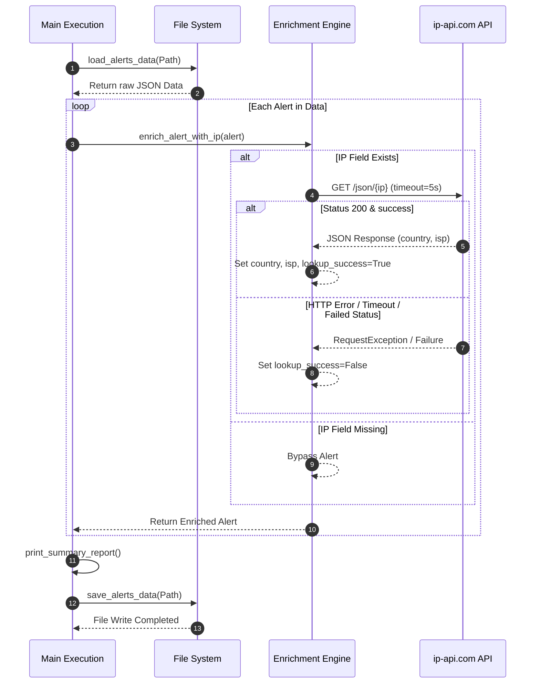

## 1. 개요 및 학습 맥락 (Context & Objective)

보안 관제 파이프라인에서 수집되는 알림(Alert) 데이터는 기본적으로 최소한의 네트워크 침해 지표(IP, Port 등)만 포함한다. 분석가가 침해 사고의 위급성을 빠르게 판단하려면 외부 위협 인텔리전스나 GeoIP API를 활용해 IP의 국가, ISP, 도메인 소유주 정보 등을 실시간으로 결합(Enrichment)하는 작업이 필요하다.

본 작업의 목표는 JSON 포맷으로 수집된 원시 보안 알림 로그를 읽어 외부 IP 룩업 API(`ip-api.com`)를 호출하고, GeoIP 및 ISP 정보를 원본 로그에 결합한 후 구조화된 결과 파일로 저장하는 자동화 파이프라인을 구축하는 것이다. 단순 동작 스크립트(`request.py`) 수준에서 발생할 수 있는 네트워크 타임아웃 블로킹, 예외 은닉, 파일 시스템 접근 오류 등의 한계를 엔지니어링 관점에서 분석하고 이를 프로덕션 환경에 적합한 구조(`request_llm.py`)로 리팩터링한다.

## 2. 기본 구현의 한계점 (Limitation of Naive Approach)

초기 작성된 `request.py` 구현은 기능 검증(PoC) 목적으로는 동작하지만, 실무 자동화 파이프라인에 적용하기에는 다음과 같은 구조적 한계와 안정성 결함이 존재한다.

```python
# request.py 의 한계점 예시
def lookup_ip(ip: str):
    response = requests.get(f"http://ip-api.com/json/{ip}")
    data = response.json()
    if data["status"] == "success":
        return {"country": data["country"], "isp": data["isp"]}
    return None

def save_result(json2dict):
    try:
        with open("enriched_alerts.json", "w", encoding="utf-8") as f:
            f = json.dump(json2dict, f, ensure_ascii=False, indent=2)
    except FileNotFoundError:
        pass
```

1. **무제한 Network Blocking 위험**
   `requests.get()` 호출 시 `timeout` 매개변수를 지정하지 않았다. 외부 API 서버의 응답이 지연되거나 소켓 연결이 유실될 경우, 해당 패킷을 기다리며 무한 대기에 빠진다. 이는 전체 보안 파이프라인의 스레드/프로세스 고갈로 이어진다.
2. **HTTP 상태 코드 및 예외 처리 부재**
   네트워크 오류(DNS 해결 실패, 5xx Server Error 등) 발생 시 `response.json()`을 즉시 호출하여 `UnboundLocalError`나 `JSONDecodeError`를 유발한다. 명시적인 HTTP 상태 코드 검증 과정이 없다.
3. **치명적인 예외 은닉(Exception Swallowing)**
   `save_result` 함수에서 예외 처리 구문 내 `pass`를 사용하여 오류를 무시한다. 저장 대상 경로의 디렉터리가 없거나 권한이 부족할 때 아무런 로그도 남기지 않고 실패하여 데이터 유실을 추적할 수 없다. 또한 `json.dump()` 실행 결과를 변수 `f`에 재할당하는 연산 오용이 존재한다.
4. **파일 경로 처리의 취약점 및 상태 관찰 불가능성**
   문자열 기반 경로(`"./logs/alerts.json"`)를 사용하며 저장 시 상위 디렉터리 존재 여부를 보장하지 않는다. 또한 룩업 실패 시 로그 내부 상태 값 변형이 없어 데이터 보강의 성공 여부를 후속 시스템이 인지하기 어렵다.

## 3. 엔지니어링 의사결정 및 리팩터링 (Engineering Decisions)

단순한 스크립트 나열을 벗어나 코드의 예측 가능성과 견고성을 확보하기 위해 다음 네 가지 축을 중심으로 리팩터링을 진행했다.

### 가. 명시적 Timeout 설정 및 HTTP Exception 처리
외부 API와의 통신 실패 가능성을 항상 전제로 두어야 한다. `requests.get()`에 5초의 타임아웃을 강제하고 `raise_for_status()`를 통해 4xx/5xx 응답을 에러 패스(Error Path)로 격리했다.

```python
def fetch_ip_info(ip: str) -> Optional[Dict[str, str]]:
    try:
        response = requests.get(f"http://ip-api.com/json/{ip}", timeout=5)
        response.raise_for_status()
        data = response.json()
        if data.get("status") == "success":
            return {"country": data["country"], "isp": data["isp"]}
    except (requests.RequestException, KeyError):
        pass
    return None
```

### 나. pathlib 활용 및 안전한 디렉터리 생성
문자열 기반 파일 경로 처리를 Python 표준 라이브러리인 `pathlib.Path`로 전면 교체했다. 저장 시 `parent.mkdir(parents=True, exist_ok=True)`를 수행하여 대상 디렉터리가 존재하지 않아 발생하는 I/O 예외를 방지한다.

```python
def save_alerts_data(file_path: Path, data: Dict[str, Any]) -> None:
    file_path.parent.mkdir(parents=True, exist_ok=True)
    with open(file_path, mode="w", encoding="utf-8") as f:
        json.dump(data, f, ensure_ascii=False, indent=2)
```

### 다. 명시적 데이터 상태 트래킹 (`lookup_success` 필드 추가)
외부 정보 결합 실패를 원본 데이터 손실로 처리하지 않고, 상태 메타데이터를 명시하도록 개선했다. `lookup_success` Boolean 필드를 통해 정보 결합 여부를 기록함으로써 후속 분석 로직이나 관제 화면에서 실패한 항목만 재조회하는 등 관찰 가능성을 높였다.

```python
def enrich_alert_with_ip(alert: Dict[str, Any]) -> Dict[str, Any]:
    ip = alert.get("ip")
    if not ip:
        return alert

    ip_info = fetch_ip_info(ip)
    if ip_info:
        alert["country"] = ip_info["country"]
        alert["isp"] = ip_info["isp"]
        alert["lookup_success"] = True
    else:
        alert["lookup_success"] = False

    return alert
```

### 라. 타입 힌팅 도입 및 단일 책임 원칙(SRP) 적용
입출력 데이터 타입을 `typing` 모듈(`Dict`, `List`, `Optional`, `Any`)로 명시하여 静的 분석 시스템에서 코드 안정성을 검증할 수 있도록 했다. 또한 파일 입출력, 룩업 통신, 알림 데이터 가공, 출력 출력을 개별 단일 목적 함수로 분리했다.

## 4. 시스템 아키텍처 흐름도 (Mermaid Diagram)

전체 파이프라인의 데이터 흐름과 예외 처리 분기 구조는 다음과 같다.



## 5. 검증 및 회고 (Verification & Takeaway)

### 동작 검증
개선된 코드 `request_llm.py`의 실행 결과를 확인하기 위해 비정상적인 경로, 유효하지 않은 IP 주소, 네트워크 차단 상황 등의 테스트 케이스를 적용했다.

1. **존재하지 않는 입력 파일 지정 시**
   기존 코드처럼 프로세스가 중단되거나 아무런 반응 없이 종료되는 대신, standard error 출력과 함께 명시적으로 메인 프로세스를 안전하게 종료한다.
   ```text
   [오류] 입력 파일을 찾을 수 없습니다: logs/alerts.json
   ```
2. **정보 조회 실패 IP 포함 시**
   API 타임아웃 혹은 내부 사설 IP가 입력된 경우에도 전체 루프가 중단되지 않으며, `lookup_success` 플래그를 비활성화하고 결과 콘솔에 명확한 상태를 출력한다.
   ```text
   [추적] 8.8.8.8 -> United States (Google LLC)
   [실패] 192.168.1.1 -> IP 정보 조회 실패
   ```

### 회고 및 엔지니어링 교훈
- **네트워크 I/O에서의 타임아웃은 옵션이 아닌 필수다:** 외부 API 시스템에 의존하는 자동화 스크립트에서 타임아웃 미설정은 전체 파이프라인을 멈추게 할 수 있는 치명적인 장애 포인트가 된다.
- **예외는 은닉하지 않고 처리 경로를 명시해야 한다:** `try-except` 블록에서 예외를 단순히 무시하는 코드는 추후 시스템 디버깅 시간을 폭발적으로 증가시킨다. 실패 상황 역시 정제된 상태 데이터(`lookup_success: False`)로 가공해 파이프라인 흐름을 유지하는 설계가 필요하다.
- **Pathlib 표준화:** 파이썬 환경에서 파일 시스템을 다룰 때 문자열 결합 대신 `pathlib.Path`를 사용하여 OS 간 경로 호환성을 확보하고 I/O 예외 발생 요인을 사전 검증하는 방식을 습관화해야 한다.