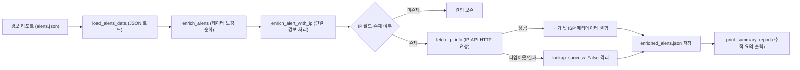

## 1. 오늘의 학습 개념 요약

보안 관제 시스템에서 탐지된 IP 주소 자체는 단순한 네트워크 식별자에 불과하다. 신속한 위협 분석과 차단 정책 수립을 위해서는 공격 출발지의 국가, 도시, ISP, ASN 등의 맥락 정보가 결합되어야 한다. 이처럼 원시 경보 데이터에 외부 위협 인텔리전스를 결합하여 데이터의 가치를 높이는 공정을 데이터 보강(인리치먼트)이라고 부른다.

파이썬의 `requests` 라이브러리를 활용하면 RESTful API 엔드포인트와 통신하여 실시간 지리 및 네트워크 정보를 손쉽게 수집할 수 있다. 그러나 외부 네트워크 I/O는 본질적으로 응답 지연이나 연결 실패 위험을 내포하므로, 타임아웃 설정과 철저한 예외 처리 계층을 구축하는 것이 파이프라인의 생존성을 결정한다.

## 2. 전체 산출물 파이프라인 구조

Day 04 실습은 이전 단계에서 생성된 경보 파일(`alerts.json`)을 인제스트하여 외부 Geo-IP API를 순회 조회한 뒤, 위치 정보가 보강된 최종 데이터셋(`enriched_alerts.json`)을 생성하는 아키텍처로 구성되었다.



데이터 스트림은 파일 로더에서 시작하여 리스트 컴프리헨션 기반의 인리치먼트 계층을 거친다. 외부 API 통신 실패 여부와 무관하게 전체 데이터 파이프라인은 중단 없이 완료되며, 보강 성공 여부를 플래그로 기록한다.

## 3. 기본 구현의 한계점

직접 작성했던 초기 코드(`request.py`)는 기본적인 API 호출과 데이터 갱신에 성공했으나, 네트워크 결함 대응과 모듈성 관점에서 세 가지 중대한 취약점을 가지고 있었다.

첫째, 무제한 타임아웃으로 인한 프로세스 멈춤(Hang) 위험이다. `requests.get(...)` 호출 시 타임아웃 매개변수를 지정하지 않아 원격 서버의 응답이 지연되거나 패킷 유실이 발생할 경우 파이썬 프로세스가 무한정 대기 상태에 빠질 수 있었다.

둘째, 널 참조 예외인 `TypeError`에 대한 방어 부재다. `lookup_ip` 함수가 실패하여 `None`을 반환했을 때 `lookup["country"]`처럼 반환 객체를 즉시 인덱싱함으로써 크래시가 발생할 위험을 안고 있었다.

셋째, 단일 거대 함수 내 I/O 결합이다. `extract_alerts_with_ip` 함수가 파일 읽기, 외부 네트워크 호출, 데이터 가공, 원본 리스트 수정을 모두 도맡아 실행하여 단위 테스트나 재사용이 불가능한 구조였다.

## 4. 엔지니어링 의사결정 및 리팩터링

AI 페어 프로그래밍을 통해 이러한 잠재적 장애 요인을 제거하고, 엔터프라이즈 환경에 적합한 탄력적인 아키텍처(`request_llm.py`)로 재설계했다.

### 4.1. HTTP 타임아웃 설정 및 예외 복원력 강화
외부 네트워크 호출 시 `timeout=5`를 강제하고 `raise_for_status()`를 통해 비정상 HTTP 응답 코드를 조기에 격리했다.

```python
# request_llm.py (안전한 외부 API 호출 및 None 반환)
def fetch_ip_info(ip: str) -> Optional[Dict[str, str]]:
    """외부 API를 통해 단일 IP의 국가 및 ISP 정보를 조회한다."""
    try:
        response = requests.get(f"http://ip-api.com/json/{ip}", timeout=5)
        response.raise_for_status()
        data = response.json()
        if data.get("status") == "success":
            return {"country": data["country"], "isp": data["isp"]}
    except (requests.RequestException, KeyError):
        pass
    return None
```

네트워크 예외(`RequestException`)나 JSON 파싱 키 누락이 발생해도 프로세스 중단 없이 안전하게 `None`을 반환하도록 예외 범위를 명확히 규정했다.

### 4.2. 보강 계층의 계층화 및 성공 상태 플래그 명시
단일 함수에 묶여 있던 작업을 원자적 단위의 세 함수(`fetch_ip_info`, `enrich_alert_with_ip`, `enrich_alerts`)로 세분화했다.

```python
def enrich_alert_with_ip(alert: Dict[str, Any]) -> Dict[str, Any]:
    """단일 알림 객체에 IP 조회 정보를 결합한다."""
    ip = alert.get("ip")
    if not ip:
        return alert

    ip_info = fetch_ip_info(ip)
    if ip_info:
        alert["country"] = ip_info["country"]
        alert["isp"] = ip_info["isp"]
        alert["lookup_success"] = True
    else:
        alert["lookup_success"] = False

    return alert
```

조회 실패 시에도 기존 레코드를 파괴하지 않고 `lookup_success: False`를 기록하여 후속 분석 단계에서 재시도 대상으로 분류할 수 있도록 설계했다.

### 4.3. pathlib.Path 기반의 파일 I/O 및 디렉토리 자동 생성
하드코딩된 파일 경로 문자열을 `pathlib.Path` 객체로 전환하고, `file_path.parent.mkdir(parents=True, exist_ok=True)`를 추가하여 출력 대상 디렉토리가 없을 때도 런타임 에러 없이 디렉토리를 자동 생성하도록 안정성을 높였다.

## 5. 검증 및 회고

`request_llm.py`를 실행하여 3단계에서 탐지된 위협 IP 목록을 인리치먼트한 결과, 공격 IP인 `192.168.1.105` 및 공인 IP 대역에 대해 국가와 ISP 정보를 결합하고 `enriched_alerts.json`으로 안전하게 저장했다. 사설 IP 대역의 경우 조회 실패를 정상 감지하고 프로세스 중단 없이 리포트를 마쳤다.

외부 API와의 통신을 포함하는 보안 자동화 코드는 네트워크 지연이나 장애가 언제든 발생할 수 있다는 전제 하에 작성되어야 한다. 명시적 타임아웃과 계층화된 함수 분리가 외부 장애로부터 시스템 전체를 보호하는 방파제 역할을 한다는 점을 실증했다.
