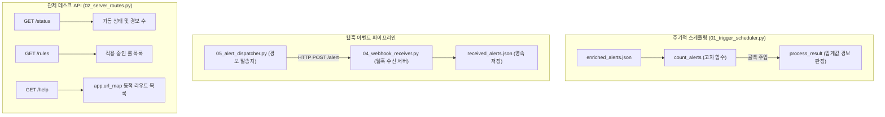

## 1. 오늘의 학습 개념 요약

보안 관제 운영에서 분석가가 수동으로 스크립트를 실행하는 방식은 긴급 위협 대응에 치명적인 지연을 초래한다. 진정한 의미의 보안 자동화는 주기적 시간 트리거와 실시간 이벤트 웹훅을 유기적으로 결합하여 인간의 개입 없이 스스로 탐지하고 전달하는 파이프라인을 구축하는 데서 완성된다.

파이썬의 `schedule` 라이브러리를 사용하면 복잡한 크론탭 설정 없이도 파이썬 런타임 내부에서 주기적 배치 작업을 오케스트레이션할 수 있으며, 마이크로 웹 프레임워크인 `Flask`를 활용하여 외부 침해 징후를 실시간으로 수신하는 RESTful 웹훅 엔드포인트를 구축할 수 있다. 관제 데스크와 경보 발송자 사이의 결합도를 낮추기 위해 HTTP 웹훅 프로토콜을 도입하고, 내부적으로는 고차 함수와 콜백 패턴을 적용해 확장성을 확보했다.

## 2. 전체 산출물 파이프라인 구조

Day 05 실습은 6개의 개별 모듈이 결합되어 스케줄링, 경보 발송, 수신 서버, 동적 라우팅을 아우르는 엔드투엔드 이벤트 주도 파이프라인을 구성한다.



파이프라인은 크게 세 영역으로 동작한다.
1. 주기적 감시: 스케줄러가 `enriched_alerts.json`의 상태를 2초 주기로 폴링하여 콜백 함수로 결과를 넘긴다.
2. 실시간 웹훅 디스패치: 발송자(`05_alert_dispatcher.py`)가 보강된 위협 데이터를 수신 서버(`04_webhook_receiver.py`)의 `/alert` 엔드포인트로 전송하고 결과를 확인한다.
3. 메타데이터 조회 API: 중앙 라우팅 서버(`02_server_routes.py`)가 `app.url_map`을 통해 등록된 엔드포인트를 동적으로 노출하며 전체 관제 상태를 제공한다.

## 3. 기본 구현의 한계점

초기 학습 단계의 스크립트 작성 방식에서는 세 가지 구조적 및 운영적 한계가 존재했다.

첫째, 스케줄러 내 비즈니스 로직 결합이다. 파일 읽기 작업과 화면 출력 및 경보 판정 로직이 하나의 함수에 하드코딩될 경우, 향후 Slack 알림이나 이메일 발송 등 다른 액션으로 확장할 때마다 핵심 파일 I/O 코드를 수정해야 하는 결합도 문제가 발생한다.

둘째, 정적 엔드포인트 하드코딩이다. API 엔드포인트 목록을 클라이언트에 제공할 때 딕셔너리나 문자열 리스트로 수동 작성하면, 새로운 라우트를 추가하거나 삭제할 때 문서와 실제 코드 간의 불일치가 발생하는 동기화 결함이 생긴다.

셋째, 대용량 로그 환경에서의 인메모리 버퍼링 및 전체 덮어쓰기 I/O 병목이다. 웹훅 수신 핸들러가 메모리 리스트(`received = []`)에 모든 데이터를 적재하거나 매 요청마다 전체 JSON 파일을 읽고 다시 쓰는 방식은 OOM 및 파일 잠금 충돌로 인한 데이터 오염을 유발한다.

## 4. 엔지니어링 의사결정 및 리팩터링

코드 작성 과정에서 제기된 엔지니어링 질문들을 분석하고, 단독 설계를 통해 시스템 아키텍처를 고도화했다.

### 4.1. 고차 함수와 콜백 패턴을 통한 스케줄러 디커플링
`01_trigger_scheduler.py`에서 데이터 로더(`count_alerts`)를 고차 함수로 설계하고, 후속 처리 로직(`process_result`)을 콜백 함수로 주입받도록 구조화했다.

```python
# 01_trigger_scheduler.py (고차 함수와 콜백 분리)
def process_result(now, count):
    print(f"{now} 현재 경보 {count}건")
    if count >= 4:
        print(f"[경고] 경보가 4건 이상")

def count_alerts(file, callback=None):
    with open(file, encoding="utf-8") as f:
        alerts = json.load(f)["alerts"]
        now = time.strftime("[%H:%M:%S]")
        count = len(alerts)

    if callback:
        callback(now, count)
        return None

    return now, count

# 2초 주기 스케줄러 등록
schedule.every(2).seconds.do(count_alerts, file="./logs/enriched_alerts.json", callback=process_result)
```

이 설계를 통해 `count_alerts`는 파일 읽기 책임만 지며, 경보 기준 변경이나 전송 방식 변경 시 콜백 함수만 교체할 수 있는 유연성을 확보했다.

### 4.2. Flask app.url_map 순회를 통한 라우트 동적 탐색
`02_server_routes.py`에서 등록된 모든 API 엔드포인트를 하드코딩하지 않고, Flask 내부의 `app.url_map.iter_rules()` 메타데이터를 순회하여 동적으로 추출하는 `/help` 라우트를 구현했다.

```python
# 02_server_routes.py (동적 라우트 순회)
@app.route("/help")
def available_address():
    routes = [rule.rule for rule in app.url_map.iter_rules() if rule.endpoint != "static"]
    return f"available_routes: {routes}"
```

새로운 라우트 데코레이터가 추가되더라도 `/help` 엔드포인트는 변경 없이 항상 최신 API 명세를 실시간으로 반영한다.

### 4.3. 웹훅 응답 상태 코드(204 No Content) 및 실무 스토리지 I/O 분석
단순 이벤트 통보용 웹훅 수신부(`02_server_routes.py`)에서 반환할 본문이 없을 때 `return "", 204`를 명시하여 불필요한 페이로드 전송을 방지했다.

또한 `04_webhook_receiver.py`의 파일 쓰기 방식에 대한 질문을 통해, 동시 다발적인 웹훅 요청 환경에서는 전체 JSON 덮어쓰기 대신 각 이벤트를 개별 라인으로 추가하는 JSON Lines(`.jsonl`) 포맷과 Append(`"a"`) 모드, 나아가 Redis 큐를 활용한 비동기 작업 분리가 실무 엔터프라이즈 환경의 표준임을 도출했다.

## 5. 검증 및 회고

로컬 5001번 포트에 Flask 수신 서버를 가동하고 스케줄러와 발송자(`05_alert_dispatcher.py`)를 실행하여 검증을 진행했다.

스케줄러는 2초마다 경보 건수를 정확히 집계하여 기준치 초과 경보를 출력했고, 발송자가 전송한 위협 이벤트는 웹훅 수신기를 통해 국가 및 ISP 정보와 함께 실시간 출력된 후 `received_alerts.json`에 영속화되었다. 또한 `03_client_requester.py`를 통해 `/rules` 엔드포인트를 호출하여 JSON 응답을 정상 수신했다.

단순한 일회성 파이썬 스크립트에서 벗어나 스케줄러, 웹훅, REST API로 이어지는 이벤트 기반 자동화 파이프라인을 완성하면서, 소프트웨어 간의 느슨한 결합과 인터페이스 기반 설계의 가치를 명확히 확인했다.
