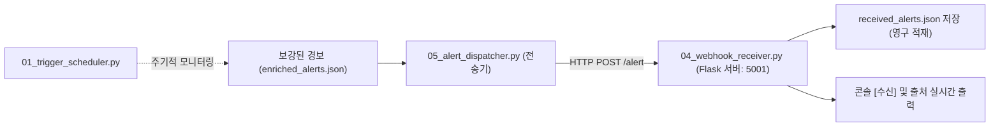

## 1. 오늘의 학습 개념 요약

보안 관제 운영에서 분석가가 수동으로 스크립트를 실행하는 방식은 긴급 위협 대응에 치명적인 지연을 초래한다. 진정한 의미의 보안 자동화는 주기적 시간 트리거와 실시간 이벤트 웹훅을 유기적으로 결합하여 인간의 개입 없이 스스로 탐지하고 전달하는 파이프라인을 구축하는 데서 완성된다.

파이썬의 `schedule` 라이브러리를 사용하면 복잡한 크론탭 설정 없이도 파이썬 런타임 내부에서 주기적 배치 작업을 오케스트레이션할 수 있으며, 마이크로 웹 프레임워크인 `Flask`를 활용하여 외부 침해 징후를 실시간으로 수신하는 RESTful 웹훅 엔드포인트를 구축할 수 있다. 관제 데스크와 경보 발송자 사이의 결합도를 낮추기 위해 HTTP 웹훅 프로토콜을 도입하고, 내부적으로는 고차 함수와 콜백 패턴을 적용해 확장성을 확보했다.

## 2. 전체 산출물 파이프라인 구조

Day 05 실습 산출물은 경보 발송자(`05_alert_dispatcher.py`)와 웹훅 수신 서버(`04_webhook_receiver.py`), 그리고 주기적 감시기(`01_trigger_scheduler.py`)로 구성된다.



전송기는 경보 목록을 순회하며 웹훅 엔드포인트로 비동기 성격의 POST 요청을 발송하고, 수신 서버는 페이로드를 파싱하여 즉시 디스크에 저장한 뒤 상태를 반환한다.

## 3. 기본 구현의 한계점

강의 기본 예시 코드는 매 요청마다 메모리 리스트에 데이터를 누적하고 전체 파일을 덮어쓰는 단순 방식을 사용한다.

```python
# 단순 웹훅 수신 예제 (베이스라인)
received = []
@app.route("/alert", methods=["POST"])
def alert():
    data = request.get_json()
    received.append(data)
    with open("received_alerts.json", "w", encoding="utf-8") as f:
        json.dump(received, f, indent=2)
    return {"result": "ok"}
```

이 접근 방식은 실무 환경에서 심각한 병목을 유발한다.

1. **디스크 I/O 병목 및 CPU 낭비:** 경보가 유입될 때마다 과거 데이터 전체를 다시 직렬화하여 파일 전체를 덮어쓰는 방식은 데이터 크기가 증가함에 따라 $O(N^2)$의 I/O 비용을 발생시킨다.
2. **동시성 충돌 및 데이터 유실:** 다수의 발송자가 동시에 웹훅을 호출하거나 멀티 워커(Gunicorn 등) 환경에서 구동될 경우 파일 락 충돌로 인해 데이터가 유실되거나 JSON 형식이 파괴된다.
3. **메모리 누수 위험:** 프로세스 메모리의 전역 리스트(`received`)에 모든 경보를 영구 유지하면 서버 장기 가동 시 OOM(Out of Memory) 크래시가 발생한다.

## 4. 엔지니어링 의사결정 및 리팩터링

소스코드를 단독 설계하면서 주석으로 치열하게 고민한 세 가지 기술적 의사결정을 적용했다.

### 4.1. 고차 함수와 콜백 패턴을 적용한 감시 스케줄러 (`01_trigger_scheduler.py`)
스케줄러 작업 함수가 특정 비즈니스 로직에 종속되지 않도록, 파일 검사와 집계를 수행하는 함수(`count_alerts`)를 고차 함수로 설계하고 결과 처리를 콜백 함수(`process_result`)로 분리했다.

```python
def process_result(now, count):
    print(f"{now} 현재 경보 {count}건")
    if count >= 4:
        print("[경고] 경보가 4건 이상")

def count_alerts(file, callback=None):
    with open(file, encoding="utf-8") as f:
        alerts = json.load(f)["alerts"]
        now = time.strftime("[%H:%M:%S]")
        count = len(alerts)

    if callback:
        callback(now, count)
        return None
    return now, count

schedule.every(2).seconds.do(
    count_alerts, file="./logs/enriched_alerts.json", callback=process_result
)
```

### 4.2. Flask 동적 라우트 추출 및 HTTP 상태 코드 최적화 (`02_server_routes.py`)
수동으로 엔드포인트 목록을 관리하는 대신 `app.url_map.iter_rules()`를 순회하여 현재 서버에 등록된 모든 라우트를 동적으로 반환하는 `/help` 엔드포인트를 구현했다. 또한 별도의 응답 페이로드가 필요 없는 웹훅 핸들러에 대해 HTTP 표준 상태 코드인 `204 No Content`를 반환하도록 설계했다.

```python
@app.route("/help")
def available_address():
    routes = [rule.rule for rule in app.url_map.iter_rules() if rule.endpoint != "static"]
    return f"available_routes: {routes}"

@app.route("/alert", methods=["POST"])
def alert():
    data = request.get_json()
    # 비즈니스 로직 처리...
    return "", 204
```

### 4.3. 대용량 실무 환경을 위한 JSON Lines Append 아키텍처 도출
주석에 정리한 아키텍처 분석을 바탕으로, 프로덕션 환경에서는 전체 파일 덮어쓰기 대신 JSON Lines(`.jsonl`) 포맷과 Append 모드(`"a"`)를 채택해야 한다는 엔지니어링 기준을 확립했다.

## 5. 검증 및 회고

`04_webhook_receiver.py`를 먼저 5001 포트로 기동한 뒤, `05_alert_dispatcher.py`를 실행하여 3건의 경보를 전송했다.

전송기 터미널 출력:
```text
[전송] brute_force -> ok
[전송] password_spraying -> ok
[전송] night_login -> ok
```

수신 서버 터미널 출력:
```text
[수신] brute_force 경보
[수신] password_spraying 경보
	출처: Germany (Stiftung Erneuerbare Freiheit)
[수신] night_login 경보
	출처: South Korea (SamsungSDS Inc)
```

`received_alerts.json` 파일에도 3건의 경보가 완벽히 저장되었다.

Day 01의 문자열 파싱부터 Day 05의 웹훅 통신까지, 개별 모듈들이 결합하여 하나의 완성된 보안 자동화 시스템으로 동작함을 확인했다. 데이터 수집, 위협 탐지, 지리 정보 보강, 실시간 전파의 전 주기를 표준 인터페이스로 연결하는 엔지니어링 감각을 정립했다.
