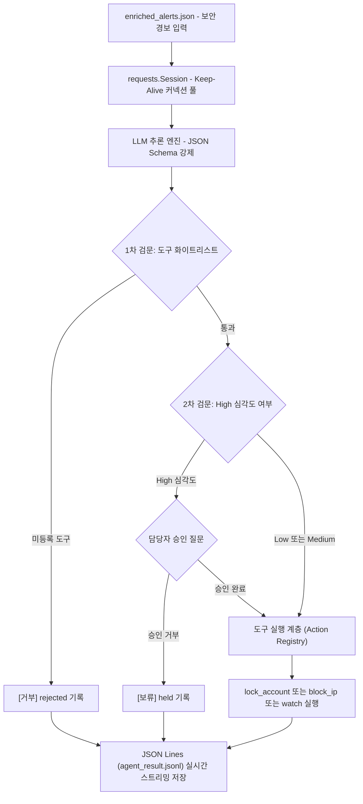

## 1. 오늘의 학습 개념 요약

보안 관제 시스템으로 쏟아지는 경보를 분석가가 일일이 수동 분석하는 방식은 대응 지연과 운영 피로를 부른다. 대규모 언어 모델(LLM)을 연동해 경보 데이터를 읽고, 위험도를 판단하며, 적절한 대응 도구를 골라 실행까지 위임하는 자율 관제 데스크를 구축했다.

### 1.1. 구조화된 출력 강제 (JSON Schema)
LLM의 자유 텍스트 응답은 불완전한 포맷팅이나 파싱 실패(`JSONDecodeError`)를 유발하기 쉽다. API 요청 시 `response_format`에 엄격한 `json_schema`를 주입해 `severity`(high/medium/low), `summary`, `tool`(lock_account/block_ip/watch) 필드와 Enum 값을 런타임에 결정론적으로 강제했다.

### 1.2. 도구 호출과 디스패처
LLM이 내린 판단 문자열을 실제 실행 가능한 파이썬 함수와 매핑하는 레지스트리 패턴(`tools` 딕셔너리)을 구성해, 모델의 판단이 시스템 조치(계정 잠금, IP 차단, 관찰 대상 등록)로 이어지도록 연동했다.

### 1.3. 2단계 검문 가드레일
- **1차 검문 (허용 목록 검증):** LLM이 임의의 함수나 시스템 명령을 호출하지 못하도록 사전에 정의된 도구 레지스트리에 존재하는지 화이트리스트 검사(`name not in tools`).
- **2차 검문 (인간 개입 승인 게이트):** 파급도가 큰 `high` 심각도 조치는 담당자의 명시적 승인(`input(y/n)`)이 있을 때만 실행하고, 거부 시 `held`(보류) 상태로 격리.

## 2. 전체 산출물 파이프라인 구조

경보 수집부터 LLM 추론, 2단계 보안 검문, 도구 실행 및 JSONL 영속화로 이어지는 전체 아키텍처 흐름이다.



## 3. 기본 구현의 한계점

강의 기본 실습 코드(`agent_desk.py`)는 관제 자동화의 뼈대를 제공하지만, 운영 환경 관점에서 세 가지 구조적 결함을 안고 있었다.

### 3.1. HTTP 커넥션 낭비와 핸드셰이크 오버헤드
루프 내부에서 경보마다 `requests.post()`를 매번 호출해 TCP 3-Way Handshake와 TLS 협상이 매 요청마다 반복되는 지연 병목이 발생했다.

### 3.2. 단일 실패 지점과 일괄 쓰기로 인한 데이터 유실 위험
모든 경보 처리가 끝난 뒤 마지막에 `json.dump()`로 단일 배열을 한 번에 덮어쓰는 구조는, 중간에 네트워크 단절이나 프로세스 비정상 종료가 일어날 경우 이전까지 처리된 모든 조치 내역이 사라지는 단일 실패 지점(SPOF)을 노출했다.

### 3.3. 딕셔너리 직접 참조 취약성과 KeyError 예외
`alert['user']`, `alert['ip']`처럼 직접 인덱싱을 수행하면, 특정 룰(예: `unknown_malware` 등 유저 정보가 없는 비정형 경보)에서 `KeyError` 예외가 발생해 전체 관제 루프가 멈출 위험이 존재했다.

## 4. 엔지니어링 의사결정 및 리팩터링

기본 구현체의 결함을 해결하고, 실무 수준의 내결함성과 보안성을 확보하기 위해 `agent_desk_llm.py`로 구조적 리팩터링을 단행했다.

### 4.1. HTTP 커넥션 풀링 및 실시간 JSONL 스트리밍 영속화
- `requests.Session()` 컨텍스트를 도입해 단일 TCP 커넥션을 재사용(Keep-Alive)함으로써 통신 오버헤드를 줄였다.
- 결과를 메모리 배열에 누적하지 않고, 단건 처리 즉시 `agent_result.jsonl`에 한 줄씩 추가(`append_result_jsonl`)해 예기치 못한 장애 상황에서도 이전 작업 내역을 보존하도록 개선했다.

```python
def append_result_jsonl(file_path: Path, record: Dict[str, Any]) -> None:
    """단일 레코드를 JSONL 파일에 즉시 추가하여 영속성 보장"""
    file_path.parent.mkdir(parents=True, exist_ok=True)
    with open(file_path, "a", encoding="utf-8") as f:
        f.write(json.dumps(record, ensure_ascii=False) + "\n")

with requests.Session() as session:
    for alert in alerts:
        judgment = request_judgment(session, api_key, alert)
        if not judgment:
            continue
        judgment["result"] = evaluate_and_execute_tool(judgment, alert)
        append_result_jsonl(SAVE_TARGET_FILE, judgment)
```

### 4.2. 방어적 키 접근 및 고차 함수 액션 레지스트리
- `alert.get("user", "UNKNOWN")` 방어적 파싱을 적용해 스키마 불일치 예외를 차단했다.
- `ACTION_REGISTRY` 딕셔너리에 타입 힌트(`Callable[[Dict[str, Any]], str]`)를 부여해 도구 실행 계층을 모듈화했다.

```python
def lock_account(alert: Dict[str, Any]) -> str:
    target = alert.get("user", "UNKNOWN")
    print(f"[조치] 계정 잠금: {target}")
    return f"locked:{target}"

ACTION_REGISTRY: Dict[str, Callable[[Dict[str, Any]], str]] = {
    "lock_account": lock_account,
    "block_ip": block_ip,
    "watch": watch,
}
```

### 4.3. 심층 방어 아키텍처 (Zero Trust)

AI 에이전트가 도구를 직접 실행하는 환경은 **간접 프롬프트 인젝션**, 권한 오남용, 파괴적 명령 실행 등의 보안 위협에 노출된다. 이를 방어하기 위해 실무 관점에서 다음 다중 방어 체계를 정립했다.

1. **Dual LLM 패턴 (물리적 책임 분리):**
   - 신뢰할 수 없는 외부 데이터(로그, 웹, 메일)를 읽고 분석하는 분석 에이전트와, 실제 조치 권한(API 호출, 격리)을 가진 실행 에이전트를 물리적으로 격리해 인젝션 공격의 실행 체인을 차단한다.
2. **최소 권한 및 임시 STS/OIDC 토큰:**
   - 에이전트에 장기 인증서를 부여하지 않고, 작업 단위별로 최소 범위의 임시 STS/OIDC 토큰만 발급한다.
3. **결정론적 파라미터 검증:**
   - LLM이 생성한 문자열을 쉘 커맨드로 직접 조립(`shell=True`)하는 행위를 금지하고, Pydantic 및 Enum 기반의 화이트리스트 검증을 통과한 인자만 함수에 전달한다.
4. **격리된 런타임 샌드박스와 영향 반경 제어:**
   - 도구 실행 환경 자체를 gVisor 또는 Firecracker microVM과 같은 경량 가상화 컨테이너 내에서 구동해 호스트 시스템 영향 반경을 물리적으로 격리한다.

## 5. 검증 및 회고

### 5.1. 실습 동작 검증
- 3건의 종합 경보(`brute_force`, `password_spraying`, `night_login`)를 대상으로 테스트를 수행했다.
- `password_spraying` 경보(high 심각도) 발생 시 승인 프롬프트가 정상 동작하였으며, 승인 거부 시 `held` 상태로 안전하게 기록됨을 확인했다.
- 처리 결과가 `agent_result.jsonl`에 단건별로 누락 없이 기록되었다.

### 5.2. 캡스톤 프로젝트 및 실무 확장 로드맵
- 이번 실습에서는 단일 CLI 기반 관제 데스크를 구현했으나, 향후 캡스톤 프로젝트에서는 **Dual LLM 기반의 에이전트 파이프라인**과 **Kafka 기반 비동기 승인 큐**를 결합해 대규모 트래픽에서도 안전하고 결정론적인 보안 오케스트레이션(SOAR) 시스템으로 확장할 계획이다.
