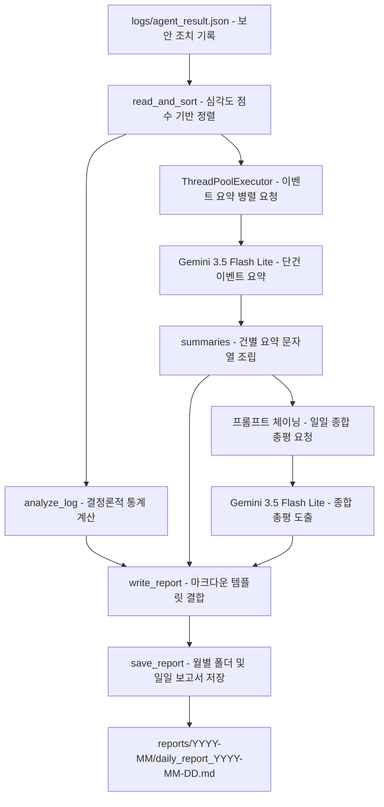

## 1. 개요 및 학습 개념 요약

보안 관제 에이전트가 탐지하고 조치한 이벤트 기록은 기본적으로 JSON 데이터로 축적된다. 기계 가독성은 높지만 즉각적인 상황 판단이 필요한 운영 관리자에게는 한눈에 들어오지 않는다. 비정형 보안 이벤트 기록을 분석해 위험도 순으로 정렬하고, 자연어 요약과 종합 총평을 결합한 일일 마크다운 보고서 생성 파이프라인을 구축했다.

- **결정론적 수치 집계와 자연어 요약의 책임 분리:** 수치 연산과 통계 집계에서 발생할 수 있는 LLM의 환각을 차단하기 위해 총 경보 건수, 심각도별 수치, 차단 및 보류 건수는 파이썬 코드가 직접 계산한다. LLM에는 비정형 로그의 맥락 요약과 총평 작성만 위임한다.
- **자유 형식 요약과 프롬프트 엔지니어링:** 판단 단계에서는 JSON Schema로 출력을 강제했으나, 보고서 작성 단계에서는 자연스러운 서술을 유도한다. 페르소나와 조치 결과 코드의 명확한 뜻풀이를 프롬프트에 주입해 용어 왜곡을 방지한다.
- **위험도 기반 우선순위 정렬:** 수집 순서대로 나열할 경우 치명적 위협이 하단에 묻힐 위험이 있다. 심각도 문자열을 가중치 점수로 치환하는 기준표를 정의하고 파이썬 정렬을 거쳐 치명적인 사건이 상단에 배치되도록 한다.
- **2단계 프롬프트 체이닝:** 방대한 로그를 한 번에 입력해 요약과 총평을 동시에 요구하면 세부 맥락이 누락되기 쉽다. 1단계에서 개별 이벤트를 단문 요약 목록으로 변환한 뒤, 2단계에서 이 요약본을 바탕으로 일일 종합 총평을 도출한다.

## 2. 전체 산출물 파이프라인 구조

보안 조치 로그 적재부터 위험도 정렬, 병렬 이벤트 요약, 총평 프롬프트 체이닝, 일일 마크다운 보고서 저장으로 이어지는 파이프라인 구조다.



## 3. 1차 구현의 한계점

실습 중 작성한 1차 구현 코드(`report_writer.py`, `chain_report.py`, `make_report.py`)는 직관적인 동작을 보였으나, 운영 환경 관점에서 세 가지 구조적 한계를 안고 있었다.

1. **동기식 직렬 호출로 인한 입출력 지연 폭증:** 루프 내부에서 이벤트를 한 건씩 순차 요청하는 방식은 대규모 이벤트 환경에서 네트워크 대기 시간이 선형으로 증가한다.
2. **재귀 기반 재시도의 스택 오버플로우 위험:** 검증 실패 시 함수를 재귀적으로 자가 호출하는 구조는 파이썬 런타임이 꼬리 재귀 최적화를 지원하지 않아 연속 장애 시 호출 스택 누적으로 프로세스가 중단될 수 있다.
3. **실행 작업 디렉터리 종속성:** 상대경로 기반 파일 접근은 크론탭이나 시스템 데몬 환경에서 실행 시 작업 디렉터리 위치에 따라 파일을 찾지 못하는 예외를 유발한다.

## 4. 엔지니어링 의사결정 및 리팩터링

1차 구현의 병목과 안정성 결함을 해결하기 위해 AI와 함께 점검하며 `report_writer_llm.py`로 구조적 리팩터링을 진행했다.

### 결정론적 수치 집계와 ThreadPoolExecutor 기반 병렬 요약

통계 지표(총 경보 건수, 심각도별 건수, 조치 보류 건수)를 LLM에 맡길 경우 발생하는 수치 왜곡과 환각을 차단하기 위해 `analyze_log` 함수가 파이썬 레벨에서 정량 계산을 전담하도록 역할을 분리했다. LLM에는 비정형 보안 로그의 맥락 요약과 총평 도출만을 위임했다.

또한 이벤트별 단건 요약 과정에서 발생하는 네트워크 대기 시간을 줄이기 위해 `concurrent.futures.ThreadPoolExecutor`를 도입했다. 이때 스레드 완료 순서가 뒤섞이더라도 원래 위험도 정렬 인덱스를 매핑(`summaries_dict[idx]`)하여 최종 마크다운 보고서에서 심각도 우선순위가 유지되도록 구성했다.

```python
def summarize_event(index: int, result: Dict[str, Any]) -> tuple[int, str]:
    prompt = build_prompt(result)
    line = ask_llm(prompt)
    logger.info(f"Summary generated for [{result.get('tool', 'unknown')}]")
    formatted_line = f"- [{result.get('severity', 'UNKNOWN')}] {result.get('tool', 'Unknown')} → {result.get('result', 'Unknown')}: {line}\n"
    return index, formatted_line


def generate_summaries_parallel(results: List[Dict[str, Any]], max_workers: int = 5) -> str:
    summaries_dict = {}
    with ThreadPoolExecutor(max_workers=max_workers) as executor:
        futures = {
            executor.submit(summarize_event, idx, res): idx
            for idx, res in enumerate(results)
        }
        for future in as_completed(futures):
            idx, line = future.result()
            summaries_dict[idx] = line

    return "".join(summaries_dict[i] for i in range(len(results)))
```

### 지수 백오프 기반 반복문 재시도와 파일 경로 동적 해석

1차 구현(`chain_report.py`)의 재귀 자가 호출 구조는 파이썬 런타임 특성상 꼬리 재귀 최적화를 지원하지 않아 연속 장애 발생 시 스택 오버플로우를 유발할 수 있다. 이를 제거하고 `for` 루프와 지수 백오프(`time.sleep(2 ** attempt)`)를 적용한 안정적인 재시도 메커니즘을 구축했다.

통신 타임아웃과 기본 예외 처리는 이전 [Day 04](/security-agent-toolkit/blog/c01-agent-core-day04/)의 방어선을 계승하되, 최대 재시도 초과 시에도 프로세스가 비정상 종료되지 않고 대체 문구를 반환하도록 안전망을 구성했다. 아울러 실행 작업 디렉터리 종속성을 탈피하기 위해 파일 기준 동적 절대경로(`os.path.abspath(__file__)`)와 월별 아카이빙 디렉터리 자동 생성(`os.makedirs`)을 적용했다.

```python
BASE_DIR = os.path.dirname(os.path.abspath(__file__))
FILE_PATH = os.path.join(BASE_DIR, "logs", "agent_result.json")

def ask_llm(prompt: str, retries: int = MAX_RETRIES) -> str:
    body = {
        "model": "gemini-3.5-flash-lite",
        "messages": [
            {"role": "system", "content": "너는 보안 관제 어시스턴트다. 항상 한국어로 답한다."},
            {"role": "user", "content": prompt},
        ],
    }

    for attempt in range(1, retries + 1):
        try:
            response = requests.post(URL, headers=HEADERS, json=body, timeout=DEFAULT_TIMEOUT)
            response.raise_for_status()
            data = response.json()
            return data["choices"][0]["message"]["content"].strip()
        except (requests.RequestException, KeyError, IndexError) as err:
            logger.warning(f"LLM API request failed (Attempt {attempt}/{retries}): {err}")
            if attempt < retries:
                time.sleep(2 ** attempt)
            else:
                logger.error("Max retries reached. Returning fallback message.")
                return "이벤트 요약 생성 실패 (API 통신 오류)"


def save_report(file_path: str, report: str) -> None:
    os.makedirs(os.path.dirname(file_path), exist_ok=True)
    with open(file_path, "w", encoding="utf-8") as f:
        f.write(report)
    logger.info(f"Report successfully saved to {file_path}")
```

## 5. 검증 및 회고

### 5.1. 실습 동작 검증

`agent_result.json` 내 3건의 보안 이벤트를 대상으로 정렬 및 병렬 요약, 총평 체이닝 파이프라인을 구동했다. 심각도가 높은 계정 잠금 및 IP 차단 건이 최상단에 우선 배치되었으며, 고위험 경보에 대한 주의 문구가 마크다운 보고서에 정상 반영되었다. 아울러 월별 폴더 자동 생성과 함께 `reports/2026-09/daily_report_2026-09-01.md` 경로에 정갈한 일일 보고서가 저장됨을 확인했다.

### 5.2. 모듈화와 방어적 프로그래밍에 대한 교훈

단순 스크립트 작성에서 벗어나 함수 단위로 책임을 명확히 쪼개는 모듈화의 중요성을 체감했다. 제한된 실습 시간 압박 속에서도 런타임에 발생할 수 있는 엣지 케이스를 놓치지 않는 태도가 핵심이다.

특히 키 누락이나 빈 로그 유입 시의 기본값 처리, 파이썬 런타임 한계를 고려한 재귀 제거, 네트워크 지연에 대비한 병렬 I/O와 지수 백오프 등 견고한 예외 처리가 갖춰져야 실무 관제 환경에서 중단 없는 자동화 파이프라인을 운영할 수 있다는 점을 확인했다.
