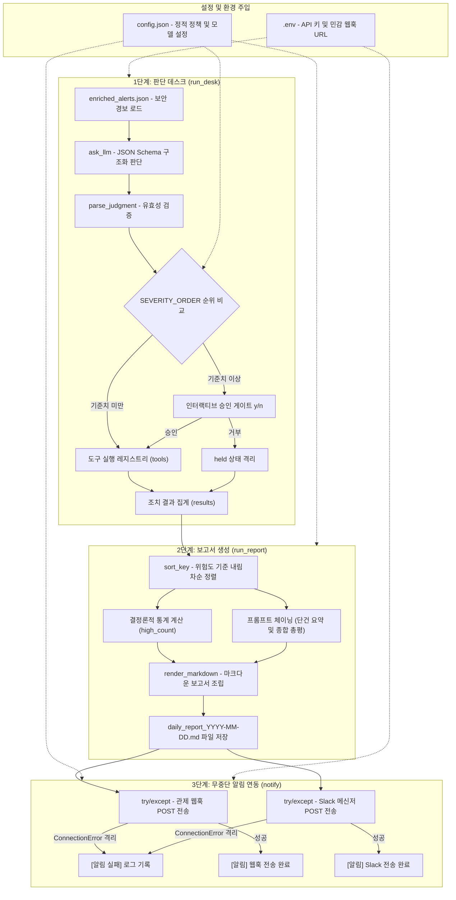

## 1. 개요 및 학습 개념 요약

보안 관제 자동화 1과목의 지난 7일간 실습을 통해 경보 로그 파싱, 위협 인텔리전스 인리치먼트, 웹훅 기반 실시간 수집 서버, LLM 판단 및 도구 실행 디스패처, 프롬프트 체이닝 기반 일일 마크다운 보고서 생성기를 단계별로 구축했다. 각 모듈은 독립적으로 동작하지만, 실무 운영 환경에서 여러 스크립트를 수동으로 순차 실행하거나 환경값과 정책 기준이 코드 곳곳에 하드코딩되어 있으면 유지보수와 신속한 장애 대응이 불가능하다.

개별 구성 요소를 유기적으로 결합하여 단일 진입점 실행으로 판단, 승인, 조치, 보고서 생성, 다중 채널 알림까지 완결하는 엔드투엔드 관제 파이프라인을 구축했다.

- **설정과 비즈니스 로직의 완전한 격리:** 모델 명칭, 승인 임계값, 보고서 저장 경로, 웹훅 URL 등 환경에 따라 변동되는 값을 코드 외부의 `config.json`으로 분리했다. 소스코드 수정이나 재배포 없이 설정 파일 교체만으로 다중 고객사 환경 및 정책 변경을 지원한다.
- **심각도 순위표 기반의 결정론적 임계값 비교:** 문자열의 단순 부등호 비교 시 발생하는 사전순 정렬 오판을 방지하기 위해 심각도 서열 리스트의 인덱스를 비교하는 결정론적 순위 게이트를 구현했다.
- **예외 격리를 통한 파이프라인 무중단 완결성 확보:** 웹훅 수신 서버 다운이나 네트워크 단절 등의 외부 요인이 핵심 산출물인 일일 보고서 저장과 관제 흐름 전체를 중단시키지 않도록, 부가 알림 단계에 세분화된 예외 처리 방어선을 구축했다.
- **주석 Q&A 기반 계층형 아키텍처 및 안티패턴 방어:** 단일 파일 스켈레톤의 병목을 진단하고, 핵심 도메인과 인프라를 분리하는 계층형 디렉터리 구조를 도출했다. 6대 안티패턴 코드 리뷰와 테스트 디렉터리 격리 원칙을 정리했다.

## 2. 전체 산출물 파이프라인 구조

경보 데이터 로드부터 LLM 판단, 휴먼 승인 게이트, 보고서 생성, 다중 채널 알림으로 이어지는 엔드투엔드 파이프라인 아키텍처다.



## 3. 1차 구현의 한계점

개별 스크립트 단위로 실습하던 1차 코드 구조와 종합 실습 스켈레톤에서는 다음과 같은 아키텍처적 결함과 운영 병목이 존재했다.

- **하드코딩된 설정값으로 인한 배포 병목:** 모델 이름(`gemini-3.5-flash-lite`), 보고서 저장 폴더, 웹훅 엔드포인트 주소가 각 파일에 직접 작성되어 있어, 운영 정책을 변경하거나 스테이징/운영 환경으로 전환할 때마다 여러 소스코드를 일일이 찾아 수정해야 했다.
- **문자열 단순 비교에 따른 정책 오판 취약점:** `severity >= approve_severity`와 같이 문자열 부등호 연산을 사용할 경우 알파벳 사전순으로 평가된다. `"high" >= "medium"` 연산 결과가 `False`가 되는 논리 오류가 발생하여, 가장 위험한 `high` 경보가 승인 게이트를 무단 통과하는 보안 사고로 이어진다.
- **부가 알림 실패로 인한 파이프라인 전체 중단:** 수신 웹훅 서버가 일시적인 네트워크 순단이나 장애로 닫혀 있을 때, 처리되지 않은 `requests.exceptions.ConnectionError`가 호출 스택 전체로 전파되어 이미 완결된 관제 조치와 보고서 저장 후속 절차까지 전부 비정상 종료되었다.
- **단일 파일 스켈레톤의 책임 혼재:** 판단, 승인 인터페이스, 도구 실행, 요약, 파일 I/O, 알림 발송이 명확한 경계 없이 소수의 함수에 결합되어 있어, 단위 테스트와 모듈별 독립 확장이 불가능한 구조였다.

## 4. 엔지니어링 의사결정 및 리팩터링

### 4.1. 데이터와 행위의 분리: 설정 파일 격리와 결정론적 순위표 게이트

환경에 따라 달라지는 정적 값은 `config.json`으로 격리하고, 노출 시 보안 사고로 이어지는 비밀 토큰은 `.env`로 격리하는 다층 설정 관리 원칙을 수립했다. 승인 기준(`approve_severity`)은 단순 값이 아닌 보안 거버넌스 정책에 해당하므로 Git 형상 관리가 가능한 `config.json`에 배치했다.

```python
# evaluation_by_config.py
BASE_DIR = os.path.dirname(os.path.abspath(__file__))
CONFIG_FILE = "config.json"
FILE_PATH = os.path.join(BASE_DIR, CONFIG_FILE)
SEVERITY_ORDER = ["low", "medium", "high"]

with open(FILE_PATH, encoding="utf-8") as f:
    config = json.load(f)

judgments = [
    {"rule": "port_scan", "severity": "low", "tool": "log_only"},
    {"rule": "night_login", "severity": "medium", "tool": "watch"},
    {"rule": "brute_force", "severity": "high", "tool": "lock_account"},
]

gated = 0
passed = 0
if config['approve_severity'] in SEVERITY_ORDER:
    base_severity = SEVERITY_ORDER.index(config['approve_severity'])
else:
    base_severity = SEVERITY_ORDER.index('high')
    print(f"[설정 오류] 없는 심각도 값: '{config['approve_severity']}' — high로 간주한다")

for judgment in judgments:
    severity = SEVERITY_ORDER.index(judgment['severity'])
    if severity >= base_severity:
        gated += 1
        print(f"[게이트] {judgment['rule']} ({judgment['severity']}) — 사람에게 묻는다")
    else:
        passed += 1
        print(f"[통과] {judgment['rule']} ({judgment['severity']}) — 바로 실행한다")
```

문자열 사전순 비교의 결함을 차단하기 위해 `SEVERITY_ORDER` 리스트를 선언하고 `.index()`를 호출하여 인덱스 정수값 기반의 대소 비교를 수행했다. 설정 파일에 오타가 유입되어도 기본값을 `high`로 강제하는 방어 로직을 더해 정책 우회를 차단했다.

소스코드 주석 Q&A를 통해 설정 분리와 함수 모듈화의 역할을 다음과 같이 정리했다. 설정 분리는 코드 실행 로직은 그대로 유지한 채 런타임 환경값(배포 환경, 모델명, 정책 임계값)만 주입할 때 사용하며, 함수 모듈화는 프로토콜 통신 규격, 데이터 변환 알고리즘, 단위 테스트 대상이 되는 공통 비즈니스 로직을 캡슐화할 때 적용한다.

### 4.2. 모놀리식 스켈레톤의 한계와 단일 책임 원칙 기반 함수 인터페이스 설계

8일차 6교시 스켈레톤 코드(`agent_pipeline.py`)는 동작 가능한 수준으로 작성되었으나, 실무 아키텍처 관점에서는 함수 내부 책임 결합과 인터페이스 누락이 존재했다. 소스코드 주석 Q&A 리서치를 바탕으로 각 함수의 세부 책임을 분리하고 명확한 타입 시그니처를 도출했다.

`run_desk()`의 경우 단순 콘솔 출력을 넘어 감사 로그 기록 책임을 분리하고, 승인 정책 판정(`is_approval_required`)과 실제 대화형 입력 수집(`prompt_approval_gate`)을 분리하여 CLI 외에 메신저 상호작용으로 확장할 수 있도록 설계했다. 또한 도구 실행 시 방화벽 API 타임아웃 같은 외부 예외로 파이프라인 전체가 중단되지 않도록 실행기(`execute_remediation`)의 예외 격리를 정의했다.

`run_report()`에서는 마크다운 문자열 조립(`render_markdown`)과 파일 시스템 저장(`save_report`)을 분리했다. 이를 통해 향후 로컬 파일 대신 오브젝트 스토리지 업로드나 이메일 전송으로 요구사항이 변경되어도 보고서 렌더링 로직을 수정하지 않도록 인터페이스를 격리했다.

```text
[Desk 모듈]
├── load_alerts(file_path) -> List[dict]                  # 로그 파일 안전 로드
├── build_judgment_prompt(alert) -> str                   # 프롬프트 구성
├── is_approval_required(severity, config_level) -> bool  # 게이트 판정
├── prompt_approval_gate(rule, action) -> bool            # 승인 입력 인터페이스
└── execute_remediation(tool_name, alert) -> str          # 도구 실행 및 예외 격리

[Report 모듈]
├── aggregate_metrics(results) -> dict                    # 위험도 순 정렬 및 카운트 집계
├── generate_summaries(results) -> tuple[str, str]        # LLM 요약 및 총평 생성
├── render_markdown(metrics, summaries, today) -> str     # 템플릿 기반 리포트 문자열 생성
└── save_report(content, base_dir, folder_name) -> str    # 경로 생성 및 파일 I/O
```

### 4.3. 계층형 아키텍처와 도메인·인프라 격리 디렉터리 구조

단순히 파일 개수를 쪼개는 수준을 넘어, 설정 및 외부 통신을 담당하는 인프라 계층, 관제 비즈니스 로직을 수행하는 도메인 계층, 전체 흐름을 제어하는 오케스트레이션 진입점으로 역할을 격리하는 디렉터리 구조를 수립했다.

```text
security_pipeline/
├── config.json                     # 기본 정적 설정값
├── .env                            # 민감 정보 (API 키, 웹훅 URL)
├── main.py                         # 파이프라인 오케스트레이터 (진입점)
│
├── core/
│   ├── config.py                   # .env + config.json 통합 로더 및 유효성 검증
│   └── llm.py                      # Gemini API 클라이언트 및 스키마 호출 전담
│
├── desk/
│   ├── alerts.py                   # 로그 파일(JSON) 파싱 및 유효성 검사
│   ├── evaluator.py                # LLM 프롬프트 빌드 및 판단 결과 파싱
│   ├── gate.py                     # 승인 임계값 판정 및 사용자 승인 인터페이스
│   └── tools.py                    # 보안 조치 액션 (차단, 잠금, 관찰) 실행기
│
├── report/
│   ├── aggregator.py               # 결과 정렬, 통계 집계
│   ├── summarizer.py               # LLM 기반 건별 요약 및 총평 생성
│   └── writer.py                   # 마크다운 렌더링 및 파일 시스템 저장 전담
│
└── notification/
    └── webhook.py                  # 슬랙/디스코드 웹훅 전송 및 재시도/에러 격리
```

진입점인 `main.py`는 비즈니스 로직을 직접 구현하지 않고, 각 모듈의 함수를 호출하여 데이터 흐름(`alerts -> desk -> report -> notify`)만 제어한다. 합성 함수 중첩 호출(`notify(run_report(run_desk()))`)을 피하고 단계별 반환값을 명시적으로 전달하여 가시성과 디버깅 용이성을 확보했다.

```python
# agent_pipeline.py
def main():
    results = run_desk()
    report = run_report(results)
    notify(report)
    print(f"[파이프라인 완료] 판단 {len(results)}건 → {report}")

if __name__ == "__main__":
    main()
```

모듈의 최상위 스코프에 실행 코드를 나열하는 대신 `main()` 함수를 정의하고 `if __name__ == "__main__":` 진입점 가드를 적용했다. 전역 네임스페이스 오염을 방지하고 불필요한 메모리 상주를 차단하며, CPython 바이트코드 실행 시 `LOAD_GLOBAL` 대신 `LOAD_FAST` 인덱스 조회를 유도해 성능을 최적화한다.

### 4.4. 무중단 알림 예외 격리와 테스트 격리 거버넌스

관제 파이프라인의 핵심 책임은 위협 판단, 조치 실행, 일일 보고서 파일 영속화다. 메신저 알림은 부가 수단이므로 외부 네트워크 장애가 파이프라인 자체의 실패로 전파되어서는 안 된다.

`notify.py`에서는 관제 웹훅과 Slack 호출부를 독립적인 `try/except` 블록으로 각각 분리하여 `requests.exceptions.ConnectionError`를 국소 격리했다.

```python
# notify.py
def make_message(count, filename):
    return f"[관제 데스크] 판단 {count}건 처리 완료 — 보고서: {filename}"

def notify(filename):
    try:
        requests.post(config["webhook_url"], json={"rule": "daily_report", "file": filename})
        print("[알림] 웹훅 전송 완료")
    except requests.exceptions.ConnectionError:
        print("[알림 실패] 웹훅 - 서버가 꺼져 있다, 계속 간다")

    try:
        message = make_message(3, filename)
        response = requests.post(WEBHOOK_URL, json={"text": message})
        print("[알림] Slack 전송 완료")
    except requests.exceptions.ConnectionError:
        print("[알림 실패] Slack — 주소에 닿지 못했다, 계속 간다")

    print("(notify 끝)")
```

LLM 도구 실행과 프롬프트 체이닝은 [Day 06 포스트](/security-agent-toolkit/blog/c01-agent-core-day06/) 및 [Day 07 포스트](/security-agent-toolkit/blog/c01-agent-core-day07/)에서 확립한 구조를 계승했다. 여기에 개별 채널의 네트워크 장애가 다른 채널이나 파이프라인 완료 출력을 방해하지 않도록 설계하여 무중단 완결성을 보장했다.

코드 리뷰와 테스트 거버넌스 측면에서는 `code_review.py`의 6대 안티패턴(비밀 하드코딩, 무의미한 변수명, 비정형 LLM 응답 무검증 파싱, `except: pass`를 통한 무차별 예외 묵살, `high or medium` 논리 연산자 결함, `approve != 'n'` 부정형 승인 가드)을 분석했다.

```python
# test_code.py
def parse_judgment(text):
    try:
        return json.loads(text)
    except json.JSONDecodeError:
        print("[파싱 실패] JSON이 아니다:", text[:40])
        return None

assert parse_judgment('{"severity": "high"}') == {"severity": "high"}
assert parse_judgment('그럴듯한 문장입니다') is None, "깨진 입력은 None이어야 한다"
assert parse_judgment('') is None
print("[테스트 통과] parse_judgment 3건 모두 정상")
```

주석 Q&A 분석을 통해 테스트 코드는 프로덕션 소스코드와 완전히 분리된 `tests/` 디렉터리에 모듈별로 1:1 배치하는 표준을 수립했다. 테스트 본문에서 `open("test.json", "w")`을 직접 쓰고 마지막에 `os.remove()`를 호출하는 방식은 assert 실패 시 삭제 라인에 도달하지 못해 테스트 디렉터리가 오염되므로, 인메모리 Mocking(`mock_open`)이나 `tempfile` 픽스처를 사용하는 격리 원칙을 확립했다.

## 5. 검증 및 회고

### 5.1. 엔드투엔드 파이프라인 통합 동작 검증

`agent_pipeline.py`를 실행하여 3건의 보안 경보에 대해 LLM 구조화 판단, `high` 심각도에 대한 대화형 승인(`y`), 계정 잠금 도구 실행, 마크다운 보고서 저장, 웹훅 알림 시도까지 단일 명령으로 수행되는 과정을 검증했다.

```text
[판단] brute_force → high — 관리자 계정을 대상으로 한 무차별 대입 공격이 5회 탐지되었습니다.
lock_account 조치를 실행할까요? (y/n) y
[조치] 계정 잠금: admin
[판단] night_login → medium — 비정상 시간대 로그인 시도가 탐지되었습니다.
[조치] 관찰 대상 등록: night_login
[판단] port_scan → high — 외부 IP로부터 대규모 포트 스캔이 탐지되었습니다.
block_ip 조치를 실행할까요? (y/n) y
[조치] IP 차단: 198.51.100.4
[요약] lock_account → 관리자 계정을 대상으로 한 무차별 대입 공격 5회가 탐지되어 계정 잠금 조치가 실행되었습니다.
[요약] watch → 비정상 시간대 로그인 시도가 탐지되어 관찰 대상으로 등록되었습니다.
[요약] block_ip → 외부 IP로부터 대규모 포트 스캔이 탐지되어 해당 IP 차단 조치가 실행되었습니다.
[완료] c:\work\security-agent-toolkit\agent_core\day08\reports\2026-09\daily_report_2026-09-02.md 저장
[알림 실패] 서버가 꺼져 있다 — 보고서는 저장됐으니 데스크는 멈추지 않는다
[파이프라인 완료] 판단 3건 → c:\work\security-agent-toolkit\agent_core\day08\reports\2026-09\daily_report_2026-09-02.md
```

알림 서버가 오프라인 상태임에도 `[알림 실패]` 로그를 남긴 후 일일 보고서가 정상적으로 생성 및 저장되었으며, 파이프라인 전체가 중단 없이 완결됨을 확인했다. `test_code.py`의 `parse_judgment` 3대 단언문 검증 역시 정상 통과했다.

### 5.2. 현실적 회고 및 교훈

1과목 8일간의 여정을 거치며 단순한 스크립트 작성에서 벗어나, 시스템 아키텍처 관점에서 책임을 분리하고 장애를 격리하는 방어적 엔지니어링의 중요성을 체감했다.

- **설정 분리의 실무적 가치:** `config.json`과 `.env`를 적절히 분리함으로써 코드 수정 없이도 정책 변경과 다중 고객사 배포를 유연하게 수용할 수 있는 기반을 마련했다.
- **실패를 기본 상태로 가정하는 설계:** 외부 API 타임아웃, LLM 응답 포맷 파싱 실패, 웹훅 서버 다운 등 분산 환경의 실패 요소를 예외가 아닌 정상적인 운영 시나리오로 취급하고 국소 격리하는 것이 관제 시스템의 연속성을 보장하는 핵심임을 체득했다.
- **테스트 격리와 아키텍처 설계의 선순환:** 런타임 에러를 뿜지 않는 논리적 오류를 방어하기 위해 입력 사전 검증과 단위 테스트가 필수적이며, 테스트하기 쉬운 코드를 작성하려는 시도가 자연스럽게 모듈의 책임 격리와 계층형 아키텍처 설계로 이어진다는 점을 확인했다.
