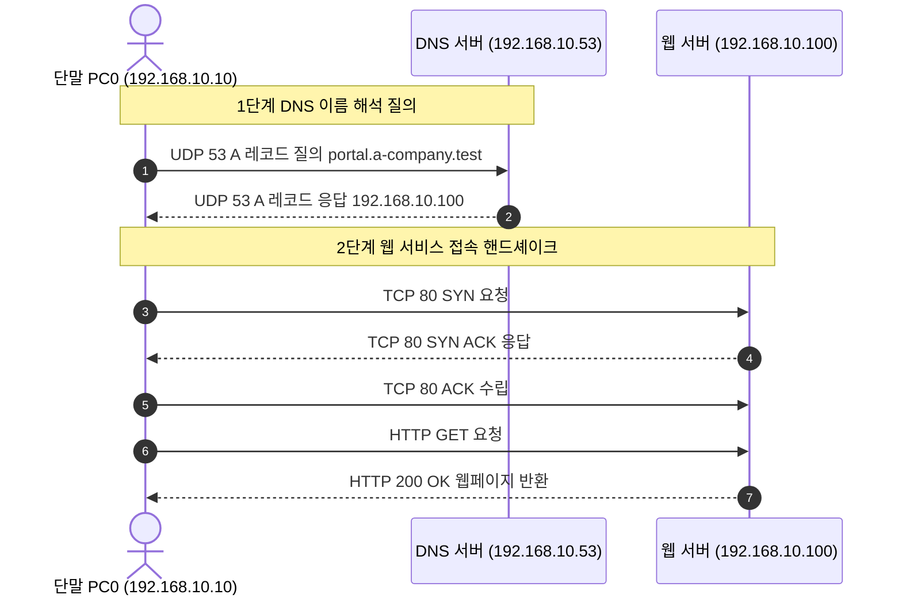

## 1. 개요 및 학습 개념 요약

[이전 포스트](/security-agent-toolkit/blog/c02-network-zt-day02/)에서는 CIDR 표기법과 서브네팅, 그리고 VLAN 기반의 2계층 및 3계층 네트워크 세그멘테이션을 다루었다. 브로드캐스트 도메인을 격리하고 라우터를 통해 통신 경로를 제어함으로써 물리 망 내의 횡적 이동을 차단하는 기법을 실증했다.

하지만 네트워크 인터페이스와 라우팅 경로가 정상 작동하더라도, 사용자가 32비트 숫자 주소를 직접 외워 통신할 수는 없다. 웹 브라우징을 비롯한 모든 네트워크 통신의 첫 관문은 호스트 이름을 목적지 IP 주소로 변환하는 DNS 질의 단계다.

> DNS는 단순한 이름 변환 주소록을 넘어, 외부 인바운드 트래픽을 선별하고 오리진 서버의 실제 IP를 은닉하는 제로 트러스트 경계 보안의 최전선이다.

단순 이름 해석 구조가 내포한 보안 취약점을 식별하고, 안전한 서비스 노출을 위한 인프라 설계를 분석했다. Cisco Packet Tracer 시뮬레이터로 DNS 서버와 웹 서버가 분리된 토폴로지를 구성하여 2단계 통신 흐름을 검증하고, 클라우드 환경의 Anycast 에지 프록시 결합 모델을 도출했다.

- **DNS 계층적 위임 구조 분석:** 루트 네임서버부터 TLD 서버, 도메인 권한 네임서버로 이어지는 트리 구조의 재귀 질의 흐름을 파악했다.
- **Packet Tracer 기반 서비스 분리 실증:** 단일 스위치 환경에서 DNS 서버와 웹 서버를 독립 호스트로 배치하고 A 레코드 해석과 HTTP 접근을 검증했다.
- **Apex 도메인 제약과 CNAME Flattening:** RFC 1034 표준에 따른 루트 도메인 레코드 충돌 문제와 최신 클라우드 인프라의 해결 방식을 분석했다.
- **에지 프록시 결합과 오리진 은닉:** Anycast DNS와 CDN 리버스 프록시를 결합하여 오리진 IP 노출을 원천 차단하는 방어 체계를 정립했다.
- **캐시 라이프사이클 및 무결성 검증:** TTL 만료 시차, 부정 캐시 락아웃 위험, 그리고 DNS 위변조를 무력화하는 TLS 인증서 상호 검증 원리를 분석했다.

## 2. 전체 산출물 구조 및 진단/파이프라인 체계

당일 실습에서는 Cisco Packet Tracer 기반 시뮬레이션 산출물 2종과 네트워크 분석 보고서 4종을 작성했다. 단말 PC가 웹 서버에 도달하기까지 거치는 2단계 통신 시퀀스는 다음과 같다.



실습에서 구축한 장비 구성 및 분석 보고서 목록은 다음과 같다.

| 구분 | 파일 및 산출물 | 주요 대상 및 프로토콜 | 핵심 역할 및 설정 내용 |
|---|---|---|---|
| 시뮬레이션 | `4교시. 웹 서버 연결하기 — IP 주소로 첫 웹페이지 열기.pkt` | WebServer, PC0, Switch0 | IP 기반 HTTP 접속 및 VLAN 확장 토폴로지 구성 |
| 시뮬레이션 | `5교시. DNS 서버 연결하기 — 이름을 물어 IP 주소 받기.pkt` | DNSServer, WebServer, PC0 | A 레코드 등록 및 nslookup 기반 주소 변환 검증 |
| 분석 보고서 | `network_zt/day03/packet_tracer.md` | L2/L3 통신 흐름 | 장비 간 케이블 결선 및 단계별 통신 순서 회고 |
| 분석 보고서 | `network_zt/day03/dns.md` | DNS vs CDN 아키텍처 | L7 리버스 프록시 차이점 및 Cloudflare 결합 분석 |
| 분석 보고서 | `network_zt/day03/nameserver.md` | DNS 계층 및 RFC 1034 | Apex 도메인 제약, CNAME Flattening 및 쿠키 격리 |
| 분석 보고서 | `network_zt/day03/record&cache.md` | 캐시 라이프사이클 | TTL 시차, NXDOMAIN 부정 캐시, TLS 2차 검증 |

## 3. 기존 체계의 한계와 도전 과제

숫자 IP 주소에 직접 의존하여 통신하는 초기 네트워크 체계는 인프라 확장성과 운영 안정성 측면에서 명확한 한계를 지닌다.

서버의 물리적 교체나 클라우드 마이그레이션으로 인해 공인 IP가 변경될 때마다, 전 세계 모든 클라이언트의 설정 파일이나 코드를 일일이 수정해야 한다. 또한 단일 IP 주소로는 하나의 포트에서 여러 웹사이트를 분기 서비스하는 가상 호스트 기술을 원활히 지원하기 어렵다.

> 단순한 이름 해석 기능만을 제공하는 기본 DNS 구조는 도청과 스푸핑에 무방비하며, 백엔드 오리진 서버의 실제 IP를 외부에 그대로 노출한다.

DNS 질의는 전통적으로 암호화되지 않은 UDP 53번 포트를 사용하므로, 중간자 공격에 의한 패킷 변조와 캐시 포이즈닝에 극도로 취약하다. 공격자가 허위 IP 응답을 주입할 경우 클라이언트는 피싱 사이트로 유도된다.

더욱이 오리진 서버의 실제 IP가 공인 DNS의 A 레코드로 직접 노출되면, 공격자가 웹 방화벽을 우회하여 원본 서버로 대규모 DDoS 공격을 직접 집중시킬 수 있다. 따라서 단순한 주소 조회를 넘어 프록시 계층과 결합한 방어적 네트워크 아키텍처가 필수적이다.

## 4. 엔지니어링 의사결정 및 리팩터링

### 4.1. Packet Tracer 기반 DNS·웹 서버 분리망 구축과 2단계 이름 해석 검증

이름 해석과 웹 서비스 제공 책임을 분리하기 위해 단일 LAN 환경에서 역할을 독립시킨 인프라를 설계했다. `network_zt/day03/packet_tracer.md`에 기록된 바와 같이, PC0, Switch0(2960-24TT), DNSServer, WebServer를 각각 배치했다.

```text
[PC0: 192.168.10.10/24] ── Fa0/1 ┐
[WebServer: 192.168.10.100/24] ─ Fa0/2 ┼─ [Switch0 (2960-24TT)]
[DNSServer: 192.168.10.53/24] ── Fa0/3 ┘
```

DNSServer 장비에서는 HTTP 서비스를 비활성화하고 오직 DNS Service만을 활성화했다. Name 필드에 `portal.a-company.test`를 입력하고, Type은 A Record, Address는 웹 서버의 주소인 `192.168.10.100`으로 등록했다. 이때 DNS 서버 자신의 IP(`192.168.10.53`)와 응답으로 반환할 웹 서버 IP를 명확히 분리했다.

단말 PC0의 네트워크 설정에서는 DNS Server 항목에 `192.168.10.53`을 지정했다. 터미널 환경에서 `nslookup portal.a-company.test`를 실행하여 쿼리 대상 서버(`192.168.10.53`)와 조회 결과 주소(`192.168.10.100`)를 단계별로 대조 검증했다.

```text
C:\> nslookup portal.a-company.test
Server: 192.168.10.53
Address: 192.168.10.53

Name: portal.a-company.test
Address: 192.168.10.100
```

주소 획득 후 웹 브라우저에서 도메인 이름으로 접속하여 웹 서버의 응답 본문이 정상 출력됨을 확인했다. DNS 서버는 웹 트래픽을 중계하지 않으며, 단말이 획득한 IP로 별도의 TCP 80번 연결을 직접 수립함을 패킷 흐름으로 실증했다.

### 4.2. 계층적 네임서버 위임 구조와 루트 도메인 CNAME 제약 극복

`network_zt/day03/nameserver.md`의 리서치 결과에 기반하여 인터넷 전체의 분산 네임서버 계층 구조를 분석했다. DNS는 루트 네임서버(`.`), 최상위 도메인 TLD 서버(`.com`), 그리고 개별 도메인의 권한 네임서버로 권한을 위임하는 역트리 구조를 형성한다.

로컬 리졸버는 캐시가 없을 경우 루트 서버에 질의하여 TLD 네임서버 주소를 안내받고, TLD 서버로부터 최종 권한 네임서버의 NS 레코드를 획득하여 목적지 IP를 찾아낸다.

> 인터넷 표준 RFC 1034에 따르면 루트 도메인에는 SOA와 NS 레코드가 반드시 존재해야 하므로, 동일 노드에 별칭인 CNAME 레코드를 공존시킬 수 없다.

과거 인터넷 환경에서 웹 사이트 접속 시 반드시 `www` 서브도메인을 명시해야 했던 근본 원인은 바로 이 규격 제약에 있었다. PaaS나 CDN 서비스를 루트 도메인에 연동하려면 CNAME 레코드가 필요한데, 표준 위반으로 인해 직접 연결이 불가능했다.

현대 클라우드 인프라는 CNAME Flattening 및 ALIAS 레코드 기술을 도입하여 이 한계를 극복했다. 권한 네임서버가 외부 질의를 수신할 때 내부적으로 CNAME 대상을 실시간 추적한 뒤, 최종 클라이언트에게는 A 레코드 IP 형태로 변환하여 응답한다.

실제 RPG Sync 프로젝트에서 Cloudflare R2 스토리지를 연동할 때도 이 메커니즘을 경험했다. 초기에는 개발용 기본 주소인 `r2.dev` 도메인을 사용하다가, 커스텀 도메인 설정을 활성화하면서 `assets` 서브도메인을 연결했다.

당시에는 콘솔에서 토글만 켜면 자동으로 주소가 할당되는 단순 편의 기능으로 여겼으나, 실제로는 권한 네임서버가 백그라운드에서 `assets` 도메인을 R2 버킷 엔드포인트에 대한 CNAME으로 등록하고 에지 IP로 평탄화해 주었던 원리였다.

하지만 루트 도메인을 기본 접속 주소로 채택할 경우 쿠키 격리 측면의 보안 트레이드오프가 발생한다. 루트 도메인으로 발급된 인증 쿠키는 하위 서브도메인으로 불필요하게 전송되어 세션 탈취 위험을 초래할 수 있으므로, 엔터프라이즈 환경에서는 여전히 `www` 분리와 엄격한 쿠키 범위 설정이 권장된다.

### 4.3. Anycast DNS와 에지 리버스 프록시 결합을 통한 오리진 IP 은닉 체계

`network_zt/day03/dns.md`의 리서치에 명시된 바와 같이, DNS와 CDN은 동작 계층과 서비스 목적이 명확히 구분된다. DNS는 IP 라우팅 이전의 이름 변환에만 관여하는 반면, CDN은 L7 HTTP 트래픽을 직접 처리하는 분산 역방향 프록시 기술이다.

최신 클라우드 인프라는 권한 네임서버와 에지 리버스 프록시를 단일 플랫폼으로 결합하여 제로 트러스트 보안 경계를 형성한다.

```text
[외부 클라이언트]
       │ 1. Anycast DNS 질의 (도메인 조회)
       ▼
[Cloudflare 권한 DNS] ──> A 레코드 응답: Anycast 에지 IP 반환
       │ 2. HTTPS 요청 전송
       ▼
[글로벌 에지 프록시 (WAF / DDoS 방어 / 캐싱)]
       │ 3. 정제된 인바운드 트래픽 포워딩 (mTLS)
       ▼
[사설 백엔드 오리진 서버] (공인망 노출 없음)
```

클라우드 사업자가 도메인의 권한 네임서버를 직접 운영하면, 도메인의 A 레코드에 원본 서버 주소 대신 자사의 Anycast 에지 IP를 자동 매핑할 수 있다.

이 구조를 적용하면 사용자의 트래픽은 원본 서버가 아닌 전 세계 수백 개 에지 노드로 분산 인입된다. Anycast 라우팅을 통해 가장 가까운 데이터센터에서 DNS 질의가 수 밀리초 내에 처리되며, 이어지는 웹 트래픽 역시 에지 서버가 대리 수신한다.

결과적으로 악의적인 대규모 DDoS 공격과 L7 웹 애플리케이션 공격이 에지 단에서 흡수 및 차단된다. 백엔드 오리진 서버의 실제 IP는 외부 인터넷에 전혀 노출되지 않으므로, 직접 공격 경로가 원천 봉쇄된다.

### 4.4. TTL 시차 방어와 부정 캐시 및 TLS 상호 검증을 통한 위협 완화

`network_zt/day03/record&cache.md`에서 분석한 바와 같이, 분산 캐시 환경에서는 레코드 갱신 시점과 클라이언트 캐시 만료 시점 간의 시차가 필연적으로 발생한다.

권한 네임서버의 원본 IP를 변경하더라도, 전 세계 리졸버에 저장된 이전 레코드의 TTL이 만료되기 전까지는 기존 주소로 트래픽이 전달된다.

RPG Sync 배포 파이프라인에서도 CDN 스토리지의 정적 자산을 갱신했으나 클라이언트가 구버전을 계속 참조하는 TTL 시차 문제가 발생했다. 이를 해결하기 위해 정적 에셋 빌드 경로에 콘텐츠 해시 식별자를 주입하는 캐시 버스팅을 적용하여 캐시 간섭을 차단했다.

또한 잘못된 도메인 입력 시 반환되는 NXDOMAIN 응답 역시 리졸버에 일정 시간 보관되는 부정 캐시 메커니즘이 작동한다.

도메인 설정 중 발생했던 철자 오타로 인해 단말의 정상 접근이 장시간 락아웃되던 현상의 실체도 이 부정 캐시 때문이었다. 잘못된 DNS 설정은 정정 후에도 리졸버의 부정 캐시 만료 시까지 접근이 차단되므로, 점진적 TTL 단축과 방어적 변경 절차가 요구된다.

> DNS 질의 단계에서 위변조된 IP를 수신하더라도, 클라이언트 브라우저의 TLS 핸드셰이크 인증서 검증이 최종적인 2차 방어선 역할을 수행한다.

공격자가 DNS 스푸핑이나 로컬 캐시 포이즈닝을 통해 단말에 피싱 서버 IP를 응답하더라도, 브라우저는 도메인 이름과 웹 서버가 제시하는 공인 TLS 인증서를 엄격히 대조한다. 인증서 불일치 시 연결이 즉시 강제 종료되므로 세션 탈취를 방지할 수 있다.

## 5. 검증 및 회고

### 5.1. 이름 해석 및 서비스 연동 검증

Cisco Packet Tracer 환경에서 단일 스위치 기반 분리망을 구축하고 두 단계 통신 과정을 체계적으로 검증했다.

1. **DNS 레코드 등록 및 서비스 격리:** DNSServer의 HTTP 서비스를 비활성화하고 DNS 기능만 활성화한 뒤, `portal.a-company.test` A 레코드를 `192.168.10.100`으로 매핑했다.
2. **이름 해석 질의 검증:** PC0에서 `nslookup portal.a-company.test`를 실행하여 쿼리 수신 대상(`192.168.10.53`)과 반환된 웹 서버 주소(`192.168.10.100`)를 분리 식별했다.
3. **HTTP 웹 접속 검증:** PC0의 웹 브라우저에서 도메인 이름으로 접속하여 `Hello from WebServer` 문구가 정상 렌더링됨을 확인했다.
4. **IP 직접 접속 대조:** 주소창에 `http://192.168.10.100`을 입력했을 때와 동일한 웹 페이지가 수신됨을 확인하여 두 경로의 정합성을 실증했다.

### 5.2. 현실적 회고 및 교훈

`packet_tracer.md`의 현장 기록처럼, 패킷 트레이서 시뮬레이션을 통해 PC, 스위치, DNS 서버, 웹 서버 간의 통신이 정해진 순서대로 유기적으로 맞물려 진행됨을 명확히 확인했다. 단말이 웹 서버에 바로 연결되는 것이 아니라, 반드시 사전에 지정된 DNS 서버로 질문을 던지고 수신한 주소를 토대로 HTTP 접근을 시도하는 2단계 생명주기를 시각적으로 체감했다.

이전 프로젝트(RPG Sync 등)를 진행할 당시에는 R2 스토리지에 커스텀 도메인을 연결하거나 Cloudflare 프록시를 켤 때 그저 콘솔의 편리한 설정으로만 여기고 지나쳤던 지점들이 많았다.

그러나 이번 실습과 표준 규격 분석을 거치며, RFC 1034의 Apex 도메인 CNAME 제약을 해결하기 위한 CNAME Flattening의 기술적 실체와, DNS와 L7 리버스 프록시 결합이 제공하는 오리진 IP 은닉의 보안적 가치를 명확히 이해하게 되었다. 단순한 기능 동작을 넘어 하부 네트워크 프로토콜과 보안 경계 아키텍처를 깊이 있게 조망해야 함을 배웠다.
