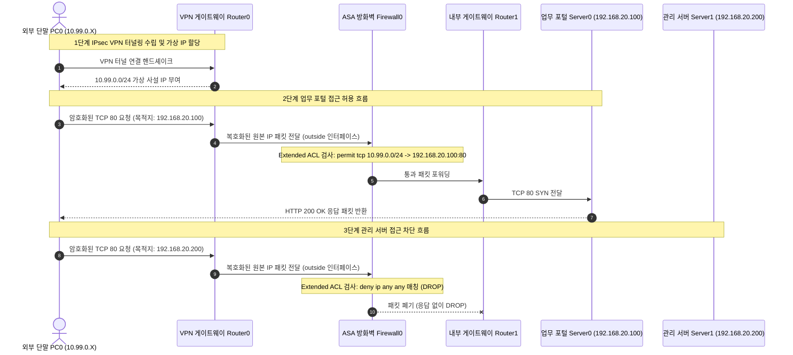

## 1. 개요 및 학습 개념 요약

[이전 포스트](/security-agent-toolkit/blog/c02-network-zt-day03/)에서는 도메인 네임시스템의 계층적 네임서버 구조와 CNAME 레코드 제약, 그리고 Anycast 에지 프록시 기반의 오리진 은닉 아키텍처를 다루었다. 올바른 이름 해석과 3계층 라우팅 경로가 확보되면 단말은 물리적 거리에 상관없이 원격 서버와 패킷을 교환할 수 있다.

그러나 네트워크 경로가 열려 있다는 사실이 곧 해당 단말의 접속을 허용해야 한다는 근거가 되지는 않는다. 재택근무나 외근 중인 직원이 외부 공용 인터넷을 통해 사내 자원에 접근할 때, 공중망에 그대로 노출된 평문 통신은 도청과 스푸핑의 표적이 된다.

> 라우팅 경로는 통신을 전달할 길을 열어줄 뿐이며, 그 통로를 통과할 자격을 부여하는 것은 방화벽과 접근 통제 목록이다.

외부 접속자에게 안전한 원격 접속 터널을 제공하면서도, 터널을 통과한 트래픽에 최소 권한 원칙을 강제하는 경계 보안 아키텍처를 실증했다. Cisco Packet Tracer 시뮬레이터로 8대의 네트워크 장비 토폴로지를 구성하고, 원격 접속 가상 사설망과 Cisco ASA 방화벽의 확장형 접근 통제 목록을 연동하여 업무 서비스와 관리 서비스를 격리 검증했다.

- **원격 접속 VPN과 다계층 암호화:** 외부 단말과 게이트웨이 사이의 전송 구간을 보호하는 원격 접속 터널링을 구축하고, 터널링 구간과 애플리케이션 종단간 암호화의 보호 범위를 분리했다.
- **라우팅 전달과 방화벽 인가의 직교성:** 다음 홉으로 패킷을 포워딩하는 라우터의 기능과 패킷의 통과 여부를 판정하는 방화벽의 정책을 명확히 구분했다.
- **5-Tuple 기반 확장형 접근 통제 목록:** 출발지 IP뿐만 아니라 목적지 IP, 전송 프로토콜, 출발지 및 목적지 포트를 종합 검사하여 동일 호스트에 대한 서비스별 접근을 차등화했다.
- **Top-down 및 First-match 규칙 정책:** 규칙이 순차 평가되는 구조에서 상위 규칙이 하위 규칙을 가리는 룰 섀도잉 현상을 방어하고, 기본 암묵적 거부 원칙을 확립했다.
- **다계층 제로 트러스트 검증:** 네트워크 계층의 터널 수립 및 포트 허용이 애플리케이션 계층의 직무 권한을 대체할 수 없음을 규명하고, 최소 권한 원칙 기반의 심층 방어를 설계했다.

## 2. 전체 산출물 구조 및 진단/파이프라인 체계

실습에서는 Cisco Packet Tracer 토폴로지 파일(`4교시. 직원 PC에서만 회사 웹페이지 열기.pkt`)과 방화벽 검사 체계 분석 보고서(`firewall.md`)를 중심 산출물로 분석했다.

규칙 순서 및 ACL 분석 보고서(`rule.md`), 원격 접속 보안 분석 보고서(`vpn.md`), 그리고 시뮬레이션 관찰 일지(`packet_tracer.md`)를 종합하여 통제 모델을 도출했다.

외부 단말 PC0이 VPN 터널을 통해 사내망에 진입한 뒤, ASA 방화벽의 검사를 거쳐 내부 서버에 접근하는 3단계 패킷 흐름과 차단 시퀀스는 다음과 같다.



위 시퀀스 흐름이 실제로 전개되는 8대 핵심 네트워크 장비의 물리적 인터페이스 구성과 보안 정책 매핑은 다음과 같다.

| 장비명 | 인터페이스 및 IP 구성 | 역할 및 배치 영역 | 적용 보안 정책 및 규칙 |
| :--- | :--- | :--- | :--- |
| **PC0** | DHCP 할당 (`10.99.0.0/24`) | 외부 원격 접속 단말 | VPN 클라이언트 소프트웨어 구동 |
| **Switch0** | L2 스위칭 | 외부 인터넷 접속 구간 스위치 | 단말 트래픽의 라우터 인입 중계 |
| **Router0** | 외부 IP 및 사설 대역 게이트웨이 | VPN 종단점 및 외부 경계 라우터 | IPsec 터널 종단 및 복호화 패킷 방화벽 인계 |
| **Firewall0** | `outside` / `inside` 인터페이스 | 전용 보안 방화벽 Cisco ASA | `VPN_WEB` 확장형 ACL (포털 허용, 관리 차단) |
| **Router1** | 내부 서버망 기본 게이트웨이 (`192.168.20.1`) | 내부 서브넷 라우팅 라우터 | 방화벽 통과 트래픽의 내부 서버 분배 |
| **Switch1** | L2 스위칭 | 서버 농장 내부 연결 스위치 | Server0 및 Server1 물리 포트 집선 |
| **Server0** | `192.168.20.100 /24` (TCP 80) | 사내 업무 포털 웹 서버 | 전 직원 대상 업무 웹 콘텐츠 제공 |
| **Server1** | `192.168.20.200 /24` (TCP 80) | 시스템 관리 서버 | 운영자 전용 시스템 관리 콘솔 제공 |

## 3. 기존 체계의 한계와 도전 과제: 경계 방어의 착시와 룰 섀도잉의 위험

단순히 사내 네트워크 경계에 VPN 장비 하나를 배치하고 인증을 통과시키는 전통적인 경계 방어 방식은 심각한 내부 보안 사각지대를 야기했다. 외부 사용자가 VPN 인증을 거쳐 내부 10.99.0.0/24 IP 대역을 할당받는 순간, 네트워크는 해당 단말을 신뢰 구역의 구성원으로 간주하여 사내 모든 서비스에 무차별적으로 접근할 수 있는 통로를 개방했다.

이로 인해 업무 포털 접속 권한만 필요한 계정이 내부망에 진입한 후 소스코드 저장소나 관리 서버인 192.168.20.200 콘솔까지 자유롭게 넘나드는 횡적 이동 공격 표면이 그대로 노출되었다.

L4 방화벽 정책 구성에서도 정책 작성 순서와 필터링 정밀도의 한계가 뒤따랐다. 출발지 IP만을 판별하는 표준 ACL 체계로는 동일 단말이 업무 포털과 관리 페이지로 동시에 접속을 시도할 때 목적지 호스트나 서비스 포트 단위로 선별 통제할 수 없었다.

접근 규칙 목록은 상단부터 순차적으로 탐색하여 가장 먼저 일치하는 규칙에서 처리를 종료하는 First-match 방식을 따른다. 이로 인해 광범위한 서브넷 허용 정책이 상단에 위치하면 그 아래 선언된 특정 관리 서버 차단 정책이 완전히 무시되는 룰 섀도잉 결함이 발생했다.

방화벽의 차단 방식 선택과 목록 종단 처리에서도 운영상 병목이 존재했다. 명시적으로 거부되지 않은 모든 통신이 차단되는 암묵적 거부 원칙을 고려하지 않은 채 차단 규칙만 나열할 경우 필수적인 정상 업무 트래픽까지 일괄 폐기되었다.

인가되지 않은 트래픽에 대해 TCP 리셋이나 ICMP Unreachable을 즉시 반환하는 REJECT 방식을 취하면 외부 공격자에게 포트 활성화 상태와 방화벽의 존재를 노출하게 된다. 따라서 무응답 폐기 방식인 DROP을 통해 타임아웃을 유도하는 신중한 설계가 요구되었다.

## 4. 엔지니어링 의사결정 및 리팩터링

### 4.1. 라우팅 경로와 패킷 인가의 분리 및 VPN 터널링 계층 설계

네트워크 엔지니어링에서 흔히 발생하는 혼선은 라우팅 경로의 존재와 방화벽의 인가 정책을 동일시하는 것이다. 라우터는 3계층 IP 헤더를 검사하여 목적지 서브넷으로 패킷을 포워딩하는 다음 홉 경로를 제공할 뿐, 해당 트래픽이 비즈니스 정책상 허용된 통신인지 판단하지 않는다. 반대로 방화벽에 아무리 완벽한 허용 규칙을 작성해 두어도 라우팅 테이블에 해당 목적지로 향하는 경로가 누락되어 있다면 패킷은 전달되지 못하고 드롭된다.

외부 단말 PC0과 Router0 게이트웨이 사이에는 클라이언트 대 사이트 원격 접속 VPN 터널을 수립하여 공용 인터넷 구간의 도청과 변조를 차단했다. 게이트웨이는 단말에 `10.99.0.0/24` 가상 사설 IP를 동적으로 부여하고, 단말이 생성한 모든 내부망 패킷을 IPsec 캡슐화 터널로 수용했다.

Router0 게이트웨이는 이 암호문을 수신하여 L3 캡슐화를 해제한 뒤, 원래의 IP 패킷 형태로 Cisco ASA 방화벽 Firewall0의 outside 인터페이스로 전달했다.

> VPN 터널링은 전송 구간의 기밀성을 보장할 뿐이며, 터널 안에서 복호화된 트래픽의 적격성을 판정하는 책임은 온전히 방화벽과 접근 통제 목록에 귀속된다.

터널링 구간 암호화와 애플리케이션 계층 암호화의 책임 경계도 명확히 분리했다. 게이트웨이가 VPN 암호화를 해제하더라도, 패킷 본문이 HTTPS로 보호되어 있다면 중간 장비는 웹 요청 본문을 평문으로 들여다볼 수 없다. 방화벽은 5-Tuple 헤더 정보를 기준으로 인가를 수행하고, 본문의 완전성은 단말과 웹 서버 간의 종단간 세션이 책임지는 이중 방어 계층을 확립했다.

### 4.2. 5-Tuple 기반 Extended ACL과 Top-down First-match 정책 엔지니어링

출발지 IP만을 비교하는 Standard ACL은 네트워크 경계 보안에 적용하기에 지나치게 둔박했다. 일반 직원 PC가 동일한 내부망 `192.168.20.0/24`에 존재하는 두 대의 서버 중 업무 포털 `192.168.20.100`만 접근하고 관리 서버 `192.168.20.200`은 차단해야 하는 요구사항을 충족할 수 없었기 때문이다.

이에 프로토콜, 출발지 IP, 목적지 IP, 출발지 포트, 목적지 포트의 5가지 요소를 조건으로 지정할 수 있는 확장형 접근 통제 목록을 전면 도입했다.

확장형 ACL을 설계할 때 가장 핵심적인 원칙은 Top-down 순차 검사와 First-match 판정 방식에 따른 룰 섀도잉 방어다. 방화벽 엔진은 목록의 첫 번째 줄부터 순서대로 패킷을 대조하며, 조건에 일치하는 첫 번째 규칙을 만나는 즉시 평가를 중단하고 해당 액션을 실행한다.

따라서 포괄적인 허용 규칙이 구체적인 차단 규칙보다 상단에 위치하면 하위 차단 규칙은 절대 실행되지 않는다.

```text
! [안티패턴: Rule Shadowing 결함]
access-list BAD_ORDER extended permit tcp 10.99.0.0 255.255.255.0 192.168.20.0 255.255.255.0 eq 80
access-list BAD_ORDER extended deny ip any host 192.168.20.200
! 관리 서버 차단 규칙이 상단의 전체 서브넷 허용 규칙에 가려져 영구 무력화됨

! [정상 설계: 구체적 제어 및 최소 권한]
access-list VPN_WEB extended permit tcp 10.99.0.0 255.255.255.0 host 192.168.20.100 eq 80
access-list VPN_WEB extended deny ip any any
! 필요한 목적지(192.168.20.100)만 명시적으로 허용하고 나머지는 전면 거부
```

규칙의 마지막에는 Cisco IOS 및 ASA의 표준 동작인 암묵적 거부 원칙을 명시화하여 `deny ip any any`를 선언했다. 인가되지 않은 트래픽에 대한 차단 정책은 REJECT가 아닌 DROP으로 설정했다.

내부 서비스 종료에 따라 사용자에게 명시적 실패를 알려야 하는 특수 목적이 아닌 한, 보안 경계 방화벽에서는 패킷을 응답 없이 버림으로써 공격자에게 내부 구조나 포트 필터링 규칙에 대한 정찰 단서를 일절 제공하지 않도록 차단했다.

### 4.3. Cisco ASA 방화벽 다계층 정책 배포와 최소 권한 격리 실증

Cisco Packet Tracer 실습 환경에서는 Cisco ASA 5505 방화벽인 Firewall0의 outside 인터페이스에 점진적 정책 전환을 적용하여 검증 신뢰성을 확보했다. 먼저 라우팅 테이블과 물리 케이블 연결 무결성을 선행 검증하기 위해, 업무 포털과 관리 서버 웹 접속을 모두 일시 허용하는 `BASE_BOTH` 규칙을 배포했다.

```cisco
Firewall0# configure terminal
Firewall0(config)# access-list BASE_BOTH extended permit tcp 10.99.0.0 255.255.255.0 host 192.168.20.100 eq 80
Firewall0(config)# access-list BASE_BOTH extended permit tcp 10.99.0.0 255.255.255.0 host 192.168.20.200 eq 80
Firewall0(config)# access-list BASE_BOTH extended deny ip any any
Firewall0(config)# access-group BASE_BOTH in interface outside
Firewall0(config)# end
```

`BASE_BOTH` 정책 하에서 VPN 단말 PC0이 `192.168.20.100`과 `192.168.20.200`의 웹 서비스를 모두 정상 호출하는 것을 확인한 뒤, 프로덕션 보안 기준인 최소 권한 원칙을 적용하여 관리 페이지 인가를 박탈하는 `VPN_WEB` 정책으로 교체 배포했다.

```text
Firewall0# configure terminal
Firewall0(config)# access-list VPN_WEB extended permit tcp 10.99.0.0 255.255.255.0 host 192.168.20.100 eq 80
Firewall0(config)# access-list VPN_WEB extended deny ip any any
Firewall0(config)# access-group VPN_WEB in interface outside
Firewall0(config)# end
```

`access-group VPN_WEB in interface outside` 명령을 통해 Router0으로부터 복호화되어 들어오는 모든 인바운드 트래픽에 해당 필터를 바인딩했다.

동일한 Switch1 스위치에 물려 있는 동일 서브넷의 서버들이라도, 방화벽 통과 시점에 목적지 IP가 `.100`인 웹 트래픽만 통과하고 `.200`인 관리 트래픽은 즉시 폐기되도록 통제함으로써 네트워크 마이크로세그멘테이션을 완결했다.

### 4.4. 제로 트러스트 관점의 접근 통제와 분산 오버레이 네트워크 고찰

이번 실습에서 확립한 네트워크 원칙은 클라우드 및 분산 인프라 프로젝트에서 적용했던 보안 아키텍처와 직결된다. 프로젝트 메모에 기록되었던 의문 중 하나는 "rpg-sync 분산 시스템에서 Redis와 플러그인 간 통신을 위해 도입했던 Tailscale VPN도 오늘의 허브앤스포크 VPN 개념에 포함되는가?"라는 질문이었다.

아키텍처 관점에서 두 기술은 토폴로지 상 명확한 차이를 가진다. 오늘 실습한 전통적 원격 접속 VPN은 모든 클라이언트 트래픽이 중앙 집중형 게이트웨이인 Router0으로 몰려 복호화된 뒤 내부망으로 쏟아지는 허브앤스포크 구조다.

반면 Tailscale은 WireGuard 프로토콜 기반의 분산 오버레이 메쉬 네트워크로, 중앙 집중형 게이트웨이 없이 NAT 뒤에 위치한 노드들이 STUN과 DERP를 통해 1:1 종단간 P2P 터널을 직접 맺고 `100.64.0.0/10` 가상 IP로 통신한다.

> 어떤 네트워크 가상화 기술을 사용하든, 터널에 연결되었다는 사실 하나만으로 엔드포인트를 신뢰 구역으로 간주해서는 안 된다.

그러나 제로 트러스트의 핵심 원칙인 '결코 신뢰하지 않고, 항상 검증한다'는 관점에서는 두 구조가 동일한 본질을 공유한다. 실제로 rpg-sync 인프라 구축 당시 Tailscale 가상 IP로 서버들이 묶였음에도 불구하고 무조건적인 통신을 허용하지 않았다.

GCP VPC 방화벽에서 Redis 6379 포트 인바운드 규칙을 오직 Tailscale 인터페이스 대역으로만 제한하고, Supabase 데이터베이스 방화벽에서 IP Allowlist로 GCP VM 고정 IP 외의 5432와 6543 포트 접근을 원천 차단했던 경험은 오늘 실습한 확장형 ACL의 최소 권한 통제 및 기본 차단 원칙과 완전히 궤를 같이한다.

물리적 네트워크 위치나 가상 터널 참여 여부는 단지 패킷을 전달하기 위한 통로일 뿐이며, 통신 주체와 목적지 포트에 대한 엄격한 L4 및 L7 방화벽 검증이 결합되어야만 진정한 제로 트러스트 심층 방어가 완성된다.

## 5. 검증 및 회고

### 5.1. Packet Tracer 시뮬레이션 및 방화벽 인가 검증

Cisco Packet Tracer 시뮬레이션 모드에서 이벤트 필터를 전체(TCP, HTTP, IPsec, ISAKMP)로 활성화한 뒤, 단말의 접속 상태와 방화벽 정책 변경에 따른 패킷 추적을 단계별로 검증했다.

```text
[검증 1: VPN 비활성화 상태의 외부 접속 차단]
- 시도: PC0 브라우저에서 http://192.168.20.100 접속 시도
- 결과: 외부 인터넷 구간(Switch0)에서 사내 사설망(192.168.20.0/24) 라우팅 불가 및 게이트웨이 미인증으로 즉시 시간 초과(Timeout) 발생

[검증 2: BASE_BOTH 정책 하의 이중 서비스 접근]
- 시도: PC0에서 VPN 연결 수립 (10.99.0.0/24 대역 IP 할당 확인) 후 포털 및 관리 서버 접속
- 결과: 
  1. http://192.168.20.100 -> PORTAL 웹페이지 정상 렌더링 확인
  2. http://192.168.20.200 -> MANAGEMENT 관리자 웹페이지 정상 렌더링 확인
- 패킷 경로: PC0 -> Switch0 -> Router0(복호화) -> Firewall0(permit) -> Router1 -> Switch1 -> Server0/Server1

[검증 3: VPN_WEB 정책 적용 후 최소 권한 차단 실증]
- 시도: Firewall0에 access-group VPN_WEB in interface outside 적용 후 재접속
- 결과:
  1. http://192.168.20.100 -> 정상 접속 유지 (HTTP 200 OK 수신)
  2. http://192.168.20.200 -> 접속 실패 (브라우저 로딩 후 Request Timeout)
- 시뮬레이션 관찰: Router0에서 복호화된 192.168.20.200:80 패킷이 Firewall0 outside 인터페이스에 도달한 즉시 빨간색 폐기 마크와 함께 드롭(DROP)되는 현상 확인
```

### 5.2. 현실적 회고 및 교훈

실습을 진행하며 가장 크게 체감한 점은 네트워크 엔지니어링에서 '경로가 연결되어 있다는 것'과 '접속이 인가되었다는 것'을 분리해서 사고해야 한다는 사실이었다. 라우터와 방화벽이 하나의 물리 장비로 통합되어 출시되는 현대 네트워크 장비에 익숙해지다 보면 두 개념을 혼동하기 쉽다. 하지만 경로 설정이 통신의 물리적 가능성을 보장하는 3계층의 문제라면, 접근 제어 목록은 보안 거버넌스를 강제하는 4계층 이상의 문제라는 점을 실증할 수 있었다.

또한 웹 브라우저의 Keep-Alive 커넥션 재사용 특성으로 인한 테스트 착시 위험을 확인했다. 방화벽 규칙을 수정한 뒤 웹 브라우저에서 단순 새로고침을 누를 경우, 브라우저가 기존에 수립해 둔 TCP 연결을 재사용하여 변경된 방화벽 인가 규칙을 통과하지 않고 캐시나 기존 세션으로 응답을 받아올 수 있다. 방화벽 정책의 유효성을 정확히 검증하기 위해서는 단순 화면 갱신이 아니라 새로운 3-way Handshake가 발생하는지 패킷 수준에서 대조해야 한다는 교훈을 얻었다.

마지막으로 Tailscale이나 클라우드 VPC와 같은 현대적 오버레이 네트워크를 다룰 때에도, 결국 그 근간에는 5-Tuple 기반의 패킷 필터링과 규칙 순서 의존성, 그리고 기본 차단이라는 고전적인 방화벽 원칙이 작동하고 있음을 재확인했다. 네트워크의 형상이 물리 장비에서 가상 오버레이로 진화하더라도 최소 권한 원칙에 입각한 경계 분리와 심층 방어는 결코 생략될 수 없는 보안의 핵심 본질이다.
