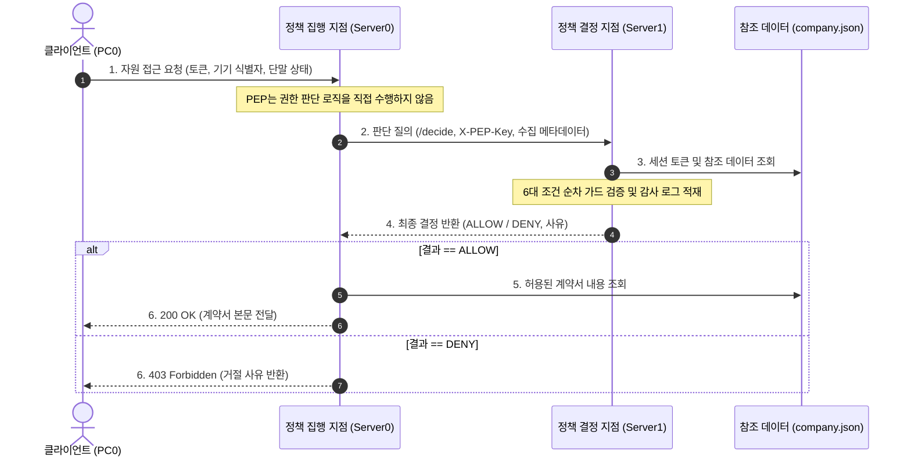

## 1. 개요 및 학습 개념 요약

[이전 실습](/security-agent-toolkit/blog/c02-network-zt-day05/)에서는 방화벽 기반 DMZ 분리와 부동 정적 라우트를 활용한 회선 이중화로 경계 보안을 다루었다. 하지만 사설 IP 대역에 접속했다는 사실만으로 단말과 사용자를 신뢰하는 방식은 단말 분실이나 계정 유출 상황에서 무력화된다.

네트워크 위치와 무관하게 모든 요청의 신원, 단말 건전성, 담당 권한을 명시적으로 검증하는 Zero Trust 기본 원리를 실습했다. 자원 접근을 집행하는 계층과 인가 정책을 판단하는 계층을 분리하지 않으면, 접근 규칙이 바뀔 때마다 전체 서비스 코드를 재배포해야 하는 관리 병목이 발생한다.

> 네트워크 경계 내부라는 이유로 주어지는 암묵적 신뢰를 배제하고, 모든 자원 요청마다 신원과 단말 상태를 지속적으로 검증해야 한다.

이번 실습에서는 사설 IP 검증 포털에서 출발하여 정책 결정 지점인 PDP와 정책 집행 지점인 PEP로 역할을 분리했다. 단일 JSON 참조 데이터를 활용한 6대 순차 가드 적용, 공유키 기반 PEP·PDP 연동, 그리고 Cisco Packet Tracer 환경의 단일 스레드 I/O 정지 예외를 작업 큐로 우회한 트러블슈팅 과정을 정리한다.

- **사설 IP 기반 경계 신뢰의 한계 확인:** 내부망 접속 여부만 확인하던 기존 방식의 취약점을 분석하고 비인가 접근 위험을 검증했다.
- **인메모리 딕셔너리 기반 6대 순차 가드 적용:** 계정 재직 상태, 담당 고객 일치 여부, 등록 기기, 기기 소유권, 단말 상태, 접속 대역을 순차 검사하는 방어 로직을 구현했다.
- **분산 제어 체계 검증:** 자원 전달을 집행하는 PEP와 정책 평가 및 감사 로그를 기록하는 PDP 서버로 역할을 격리했다.
- **패킷 트레이서 Skulpt 런타임 블로킹 예외 해결:** 단일 스레드 인터프리터의 동기 I/O 호출로 인한 정지 예외를 요청 적재 큐와 메인 루프 폴링 구조로 우회했다.

## 2. 전체 산출물 구조 및 진단/파이프라인 체계

실습에서는 단일 포털 스크립트에서 출발하여 독립된 PEP와 PDP 분산 구조로 전환하는 파이썬 코드 및 패킷 트레이서 토폴로지 산출물을 활용했다.

| 산출물 파일명 | 실습 단계 | 핵심 구현 및 분석 대상 | 보안 및 아키텍처 역할 |
|---|---|---|---|
| `network_zt/day06/portal_v1.py` | 1교시 기초 포털 | `ipaddress.is_private` 사설 IP 검증 | 출발지 사설 IP 대역만으로 접근을 허용하는 경계 신뢰 모델의 한계 확인 |
| `network_zt/day06/portal_login.py` | 2교시 인증 포털 | 세션 토큰 발급 및 `check_contract` 검사 | 인증, 권한 검증, 계약서 반환이 단일 파일에 결합된 모놀리식 구조 |
| `network_zt/day06/portal.py` | 2교시 PEP 서버 | `requests.post(PDP + "/decide")` 위임 | 계약서 자원 보관 및 PDP 판단 결과에 따른 최종 응답 집행 게이트웨이 |
| `network_zt/day06/pdp.py` | 2교시 PDP 서버 | `record` 감사 로깅 및 `check_contract` 검증 | 참조 데이터 대조, 6대 정책 규칙 순차 평가, JSONL 감사 로그 적재 |
| `network_zt/day06/employee.py` | 1·2교시 클라이언트 | 헤더 조작 및 토큰 기반 정상·비정상 요청 전송 | 헤더 변조, 비밀번호 오류, 미등록 기기 등 조건 위반 시 차단 동작 검증 |
| `network_zt/day06/company.json` | 참조 데이터 | 계정, 비밀번호, 기기 소유권, 계약 목록 | 정책 검증 시 사실 확인의 기준이 되는 JSON 참조 데이터 |
| `network_zt/day06/report.md` | 6교시 트러블슈팅 | 패킷 트레이서 환경의 `SuspensionError` 분석 | 단일 스레드 I/O 블로킹 원인 분석 및 비동기 작업 큐 우회 해결 기록 |
| `network_zt/day06/4교시. 서버 구성과 기본 통신 — 요청하고 답장받기.pkt` | 4~6교시 패킷 트레이서 | PC0, Switch0, Server0, Server1 | 분리된 가상 서버 환경에서 PEP·PDP 간 내부 HTTP 통신 및 접근 제어 실증 |

클라이언트 요청이 PEP에 도착한 뒤 PDP의 정책 검증을 거쳐 계약서 자원을 반환받는 흐름은 다음과 같다.



## 3. 기존 체계의 한계와 도전 과제: 경계 신뢰의 붕괴와 임베디드 런타임 I/O 병목

전통적인 네트워크 보안은 내부 사설망 대역에 속한 단말을 암묵적으로 신뢰하는 경계 모델에 의존했다. 사내망에 접속한 단말이 악성코드에 감염되거나 비인가 개인 노트북이 연결된 경우, 출발지 사설 IP 확인만으로는 내부 자원 접근을 차단할 수 없었다.

또한 클라이언트가 임의 조작할 수 있는 단순 HTTP 헤더에 의존하는 검증 체계는 본질적인 스푸핑 취약점을 안고 있다. 실습 코드에서는 클라이언트가 전송하는 기기 식별자와 단말 상태를 그대로 비교했으나, 실제 상용 환경에서는 하드웨어 보안 모듈이나 기기 인증서 기반 원격 증명 없이는 단말 신뢰성을 보장하기 어렵다.

더불어 PEP가 자원 요청마다 PDP로 동기 HTTP 호출을 수행하는 구조는 PDP 장애 시 전체 서비스가 중단되는 단일 장애점 위험을 유발한다. 매 요청마다 네트워크 통신이 발생하여 지연 시간이 누적되는 구조적 제약도 내포하고 있었다.

실습 환경을 Cisco Packet Tracer 토폴로지로 옮겨 독립 서버로 구성하는 과정에서는 런타임 예외가 발생했다. 패킷 트레이서의 파이썬 환경은 단일 스레드 기반 Skulpt 인터프리터로 동작하여, 서버 콜백 내부에서 동기 I/O를 호출하자 컨텍스트가 정지되며 `SuspensionError`가 발생하고 통신이 멈추었다.

## 4. 엔지니어링 의사결정 및 리팩터링

### 4.1. 사설 IP 단일 검증 탈피와 인메모리 딕셔너리 기반 6대 순차 가드 적용

초기 구현인 `portal_v1.py`에서는 클라이언트의 출발지 IP가 사설 대역인지 여부만을 확인했다.

```python
# network_zt/day06/portal_v1.py
@app.route("/contracts/<cid>")
def read_contract(cid):
    source = request.remote_addr                      # 요청을 보낸 PC의 IP
    inside = ipaddress.ip_address(source).is_private  # 사내 대역(사설 주소)인가
    if not inside:
        print("[거절]", source, cid, "회사 밖에서 온 요청")
        return {"result": "거절", "reason": "회사 밖에서 온 요청"}, 403
    if cid not in CONTRACTS:
        return {"result": "거절", "reason": "없는 계약서"}, 404
    print("[허용]", source, cid)
    return CONTRACTS[cid]
```

이 구조는 사내망에 접속한 비인가 단말이나 퇴사자의 접근을 차단하지 못했다. 이에 `portal_login.py`에서는 `company.json`에서 읽어온 인메모리 딕셔너리 데이터를 참조하여 6단계 조건을 순차적으로 검증하는 `check_contract` 함수를 직접 구현했다.

```python
# network_zt/day06/portal_login.py
def check_contract(user, device, health, source, cid):
    """계약서 조회 정책 — 어긋나는 첫 조건의 이유를 돌려준다. 전부 통과하면 None"""
    if user not in USERS or not USERS[user]["employed"]:
        return "재직 중인 직원 계정이 아님"
    if CONTRACTS[cid]["customer"] not in USERS[user]["customers"]:
        return "담당 고객의 계약서가 아님"
    if device not in DEVICES or not DEVICES[device]["managed"]:
        return "회사 등록 기기가 아님"
    if DEVICES[device]["owner"] != user:
        return "이 계정에 등록된 기기가 아님"
    if health != "ok":
        return "현재 보안 상태 기준 미충족"
    if not ipaddress.ip_address(source).is_private:
        return "허용되지 않은 접속 경로"
    return None
```

조건 검증은 재직 여부, 담당 고객 일치, 등록 기기, 기기 소유권, 단말 상태, 접속 경로를 순서대로 확인하여 하나라도 위반되면 즉시 사유를 반환한다.

다만 이 방식은 클라이언트가 헤더로 보내는 기기 식별자와 상태 값을 그대로 신뢰한다는 한계가 있다. 상용 환경에서는 mTLS 기기 인증서나 TPM 기반 원격 증명, EDR 서명 토큰이 요구되지만, 실습 환경에서는 인메모리 딕셔너리 대조를 통해 순차 가드 구조의 논리적 유효성을 확인하도록 로직을 구성했다.

### 4.2. 정책 결정과 집행의 분리: PEP 게이트웨이와 PDP 검증 서버 분리

인증·인가 로직과 비즈니스 데이터를 한 서버에 두는 모놀리식 구조의 결합도를 낮추기 위해 `portal.py`와 `pdp.py`로 서버를 분리했다.

PEP 역할을 맡은 `portal.py`는 계약서 데이터만 보유하며, 계정 비밀번호나 정책 검증 로직을 직접 다루지 않는다. 자원 요청이 들어오면 클라이언트가 보낸 세션 토큰과 메타데이터를 수집하여 공유키 헤더와 함께 PDP 서버의 `/decide` 경로로 전달한다.

```python
# network_zt/day06/portal.py
@app.route("/contracts/<cid>")
def read_contract(cid):
    facts = {                                          # 판단에 필요한 자료를 모은다
        "token": request.headers.get("X-Token", ""),
        "device": request.headers.get("X-Device", ""),
        "health": request.headers.get("X-Device-Health", ""),
        "source": request.remote_addr,
        "target": cid,
    }
    answer = requests.post(PDP + "/decide", json=facts, headers={"X-PEP-Key": PEP_KEY}).json()
    if answer["result"] != "허용":                     # 결정대로 집행한다
        print("[거절]", answer.get("user") or "(로그인 안 됨)", cid, answer["reason"])
        return {"result": "거절", "reason": answer["reason"]}, 403
    print("[허용]", answer.get("user", ""), cid)
    return CONTRACTS[cid]
```

PDP인 `pdp.py`는 사전 공유키 `X-PEP-Key`를 확인하여 승인된 PEP의 질의만 수락한다. 토큰 딕셔너리에서 실제 사용자 신원을 확인한 뒤 `check_contract` 검사를 수행하고, 판단 결과를 JSONL 파일에 즉시 기록한다.

```python
# network_zt/day06/pdp.py
@app.route("/decide", methods=["POST"])
def decide():
    if request.headers.get("X-PEP-Key") != PEP_KEY:
        print("[거절] 등록되지 않은 PEP", request.remote_addr)
        return {"result": "거절", "reason": "등록되지 않은 PEP"}, 401
    data = request.get_json()   # 포털이 모아 보낸 판단 자료
    user = SESSIONS.get(data.get("token", ""))
    cid = data.get("target", "")
    if user is None:
        reason = "로그인 필요"
    elif cid not in CONTRACTS:
        reason = "없는 계약서"
    else:
        reason = check_contract(user, data.get("device", ""), data.get("health", ""), data.get("source", ""), cid)
    result = "허용" if reason is None else "거절"
    print("[판단]", result, user or "(로그인 안 됨)", data.get("device", ""), data.get("source", ""), cid, reason or "")
    record("decide", user=user or "", device=data.get("device", ""), source=data.get("source", ""), target=cid, result=result, reason=reason or "")
    return {"result": result, "reason": reason or "", "user": user or ""}
```

이 구조를 통해 정책 변경 시 PEP 코드를 수정하지 않고 PDP만 수정할 수 있게 되었다.

그러나 매 자원 요청마다 PEP가 PDP로 동기 HTTP 호출을 수행하므로, PDP에 장애가 발생하면 전체 자원 접근이 차단되는 단일 장애점 문제가 남는다. 대규모 환경에서는 정책 캐싱이나 로컬 에이전트 캐시 구조가 필요함을 확인했다.

### 4.3. 다차원 위협 시나리오 시뮬레이션과 차단 동작 검증

분리된 PDP와 PEP 구조가 위협 요청을 정확히 걸러내는지 검증하기 위해 `employee.py`에서 4가지 시나리오를 구성했다.

```python
# network_zt/day06/employee.py
# 1) 지난 시간 방식 — 이름만 실어 보낸다 (사건의 요청)
print("1. 이름만 ->", contract({"X-User": "minsu", "X-Device": DEVICE, "X-Device-Health": "ok"}))

# 2) 틀린 비밀번호로 로그인
login = requests.post(SERVER + "/login", json={"user": "minsu", "password": "1234"})
print("2. 틀린 비밀번호 ->", login.status_code, login.json())

# 3) 맞는 비밀번호로 로그인하고, 받은 토큰으로 요청
login = requests.post(SERVER + "/login", json={"user": "minsu", "password": "minsu-2026"})
print("3. 로그인 ->", login.status_code, login.json())
if login.status_code != 200:
    raise SystemExit("로그인이 안 되면 여기서 멈춘다")
token = login.json()["token"]
print("   토큰으로 ->", contract({"X-Token": token, "X-Device": DEVICE, "X-Device-Health": "ok"}))

# 4) 같은 토큰, 등록 안 된 노트북
print("4. 미등록 기기 ->", contract({"X-Token": token, "X-Device": "NB-9999", "X-Device-Health": "ok"}))
```

단순히 HTTP 헤더에 사용자 이름을 사칭하는 요청은 세션 토큰 부재로 즉시 401 오류가 반환되었다. 잘못된 비밀번호로 로그인할 때도 토큰 발급이 거절되었다.

정상 로그인 후 유효한 토큰을 제시하더라도 미등록 기기 식별자를 전달한 4번 요청은 PDP의 6대 조건 검증에 걸려 403 거절 응답이 발생했다. 헤더 위조와 미인가 단말 접근이 단계별로 차단됨을 확인했다.

### 4.4. 패킷 트레이서 Skulpt 런타임 제약과 작업 큐 패턴을 통한 동기 I/O 블로킹 해결

Cisco Packet Tracer 환경에서 Server0(PEP)과 Server1(PDP)을 연동할 때 심각한 실행 중단 예외가 발생했다.

```text
SuspensionError: Cannot call a function that blocks or suspends here
```

원인은 패킷 트레이서 내장 파이썬 환경인 Skulpt 인터프리터가 단일 스레드로 구동되기 때문이었다. `HTTPServer.route` 핸들러 콜백 함수 내부에서 외부 PDP 서버로 동기식 `requests.get()`을 호출하자, 실행 컨텍스트가 정지 상태로 전환되지 못하고 런타임 에러를 일으켰다.

`report.md`에 기록된 바와 같이 내장 비동기 모듈인 `http.HTTPClient`로의 대체를 시도했으나, 패킷 트레이서 런타임 미지원으로 인해 패킷 전송 자체가 실패했다.

이에 따라 핸들러 내부에서 외부 통신을 직접 호출하지 않고, 요청 컨텍스트를 작업 리스트에 적재한 뒤 핸들러를 즉시 반환시키는 작업 큐 패턴을 적용했다.

```python
# network_zt/day06/report.md 기반 PEP 작업 큐 분리 로직
pending_requests = []

def read_document(url, response):
    parts = url.split("/")
    user = parts[-2]
    contract_id = parts[-1]
    response.setContentType("text/plain")
    # 핸들러에서는 작업을 큐에만 적재하고 즉시 종료하여 컨텍스트 정지를 방지한다
    pending_requests.append({"user": user, "contract_id": contract_id, "response": response})

HTTPServer.route("/document/*", read_document)
HTTPServer.start(8080)

# 메인 루프에서 작업을 꺼내 이미 검증된 동기 통신을 수행한다
while True:
    if pending_requests:
        req = pending_requests.pop(0)
        pdp_url = "http://192.168.60.200:8080/check/" + req["user"] + "/" + req["contract_id"]
        decision = requests.get(pdp_url).text
        if decision == "ALLOW":
            req["response"].send(company["contracts"][req["contract_id"]]["title"])
        else:
            req["response"].send("DENIED")
    sleep(0.1)
```

메인 루틴의 `while True` 루프에서 큐의 작업을 꺼내 순차적으로 PDP에 질의하고 응답을 전송하는 작업 큐 패턴을 적용했다. 이를 통해 핸들러 블로킹으로 인한 단일 스레드 정지 예외를 해결하고 안정적인 분산 통신을 확보했다.

## 5. 검증 및 회고

### 5.1. 다차원 정책 검증 및 감사 로그 기록 실증

Flask 기반 분산 테스트 환경에서 7가지 시나리오를 실행하여 차단 및 허용 동작을 확인했다.

| 검증 시나리오 | 입력 매개변수 | PDP 판단 결과 | PEP 최종 응답 코드 | 감사 로그 기록 사유 |
|---|---|---|---|---|
| 미인증 접근 | 토큰 누락, 기기 NB-0417 | 거절 | 401 Unauthorized | 로그인 필요 |
| 잘못된 비밀번호 | 사용자 minsu, 비밀번호 1234 | 거절 | 401 Unauthorized | 계정 또는 비밀번호가 맞지 않음 |
| 정상 로그인 및 조회 | 유효 토큰, 기기 NB-0417, 상태 ok | 허용 | 200 OK | 정상 인가 통과 |
| 미등록 기기 접속 | 유효 토큰, 미등록 기기 NB-9999 | 거절 | 403 Forbidden | 회사 등록 기기가 아님 |
| 타인 소유 기기 접속 | minsu 계정 토큰, 기기 NB-0522 | 거절 | 403 Forbidden | 이 계정에 등록된 기기가 아님 |
| 단말 상태 기준 미달 | 유효 토큰, 상태 off | 거절 | 403 Forbidden | 현재 보안 상태 기준 미충족 |
| 미담당 고객 계약 요청 | minsu 계정 토큰, 계약 C-1002 | 거절 | 403 Forbidden | 담당 고객의 계약서가 아님 |

모든 판정 내역은 `policy_log.jsonl`에 타임스탬프, 이벤트명, 단말 식별자, 출발지 IP, 최종 판단 사유와 함께 한 줄씩 기록되어 사후 감사가 가능함을 확인했다.

### 5.2. 현실적 회고 및 교훈

사설 IP 주소만 확인하는 경계 보안은 내부망에 침투한 비인가 단말이나 탈취된 계정을 걸러내지 못한다. 신원 인증과 자원 인가를 분리하고 단말 상태와 담당 권한을 함께 확인하는 순차 가드 구조를 통해 다차원 접근 제어의 유효성을 실증했다.

단순 HTTP 헤더 기반 검증 방식이 지닌 스푸핑 취약성도 명확히 확인했다. 클라이언트가 임의로 전송하는 메타데이터는 위조될 수 있으므로, 프로덕션 환경에서는 mTLS 기기 인증서나 TPM 기반 원격 증명과 같은 하드웨어 레벨의 암호학적 바인딩이 선행되어야 한다는 결론을 도출했다.

아울러 패킷 트레이서의 Skulpt 런타임에서 마주한 단일 스레드 정지 예외는 실행 환경의 제약이 시스템 아키텍처에 미치는 영향을 여실히 보여주었다. 핸들러와 네트워크 I/O를 작업 큐로 분리하여 동기 블로킹을 차단하는 디커플링 패턴을 적용함으로써, 런타임 한계를 극복하고 분산 제어 통신을 안정적으로 완결했다.
