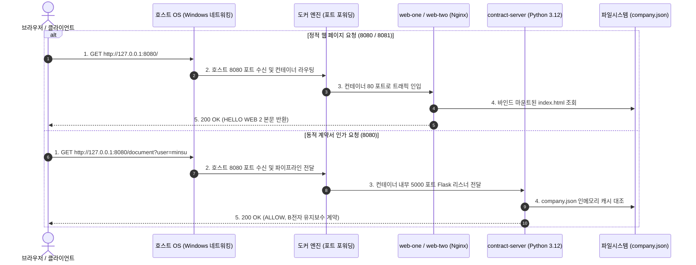

## 1. 개요 및 학습 개념 요약

[이전 실습](/security-agent-toolkit/blog/c02-network-zt-day06/)에서는 Cisco Packet Tracer 내부 가상 서버 환경에서 정책 결정 지점과 정책 집행 지점을 분리하여 사설 IP 경계 모델을 탈피하고 Zero Trust 6대 순차 검증을 실증했다. 하지만 시뮬레이터 안에서 동작하는 가상 장비는 실습 환경을 닫는 순간 휘발되며, 실제 운영체제 위에서 구동되는 독립된 서버 프로세스와 네트워크 스택을 완벽히 대변하지 못한다.

물리 호스트 자원을 격리하여 안정적으로 서버 런타임을 구동하는 방식은 하이퍼바이저 기반 가상 머신에서 리눅스 커널 네임스페이스 기반 경량 컨테이너 기술로 진화했다. 프로세스 실행 환경을 격리하고 파일 시스템 의존성을 패키징하지 않으면, 호스트 라이브러리 오염이나 포트 바인딩 충돌로 인해 다중 인스턴스 확장이 불가능해진다.

> 격리 환경의 오버헤드를 줄이면서 호스트 의존성을 완전히 차단하는 컨테이너화는 재현 가능한 인프라 배포의 출발점이다.

가상화의 동작 원리를 확인하기 위해 VirtualBox 기반 Ubuntu Server 환경을 먼저 기동하고, 이어 호스트 환경에서 Docker를 활용해 정적 웹 서버 및 동적 Flask 계약서 서버를 직접 패키징하여 구동했다. 브라우저 요청 실패 시 발생하는 4대 고장 유형을 단계별로 유발하여 진단하고, 대규모 B2B SaaS 환경에서 단일 호스트 컨테이너가 K8s 분산 오케스트레이션 체계로 확장되는 기술적 필연성을 도출했다.

- **가상 머신과 컨테이너 런타임의 계층 구조 분석:** 게스트 운영체제 전체를 가상화하는 무거운 하이퍼바이저 방식과 호스트 커널을 공유하며 프로세스를 격리하는 경량 컨테이너의 아키텍처 차이를 규명했다.
- **다중 웹 인스턴스 격리와 정적 콘텐츠 바인드 마운트:** 단일 호스트 위에서 독립된 로컬 포트를 부여하고 서로 다른 디렉터리를 마운트하여 정적 웹 서버를 충돌 없이 분리 운영했다.
- **네트워크 고장 진단 순서 확립:** 포트 미할당에 따른 연결 거부, 프로세스 비정상 종료, 포트 중복 바인딩 충돌, 라우팅 경로 부재에 따른 404 오류를 시스템 관점에서 명확히 판별했다.
- **계약서 서버 이미지 빌드 및 격리 실행:** Day 06에서 검증한 계약서 접근 제어 로직을 Python Flask로 구현하고 `Dockerfile`을 통해 독립 실행 이미지로 패키징했다.
- **단일 노드 도커 한계 규명 및 쿠버네티스 오케스트레이션 비교:** 노드 장애 시 자가 치유 부재, 동적 서비스 검색 한계, 네트워크 네임스페이스 공유 기반의 파드 단위 라이프사이클 관리 필요성을 확인했다.

## 2. 전체 산출물 구조 및 진단/파이프라인 체계

실습에서는 Windows 호스트와 Docker 엔진, 그리고 분리된 디렉터리 구조를 통해 정적 웹 서버 2종과 동적 계약서 서버 1종을 단계별로 빌드하고 격리 검증했다.

| 산출물 경로 | 실습 교시 | 핵심 엔지니어링 대상 | 보안 및 인프라 역할 |
|---|---|---|---|
| `network_zt/day07/site_one/index.html` | 4교시 정적 서빙 | `HELLO WEB 2` 응답 파일 | 8080 포트에 바인드된 첫 번째 격리 웹 서비스 |
| `network_zt/day07/site_one/about.html` | 4교시 라우팅 | `ABOUT` 페이지 정적 파일 | 하위 URL 경로 탐색 및 오타 발생 시 404 고장 진단 대상 |
| `network_zt/day07/site_two/index.html` | 4교시 다중 서빙 | `TEAM-B PAGE` 응답 파일 | 8081 포트에 독립 바인드된 두 번째 격리 웹 서비스 |
| `network_zt/day07/contract/server.py` | 6교시 판단 서버 | `GET /document?user=...` | 쿼리스트링 신원 확인 및 계약서 인가 제어 로직 |
| `network_zt/day07/contract/company.json` | 6교시 참조 데이터 | 사용자, 기기, 계약 목록 데이터 | 서버 인메모리 딕셔너리로 적재되는 정책 기준 데이터 |
| `network_zt/day07/contract/requirements.txt` | 6교시 의존성 명세 | `Flask>=3.1,<3.2` | 컨테이너 내부 빌드 타임에 주입할 파이썬 패키지 제약 |
| `network_zt/day07/contract/Dockerfile` | 6교시 이미지 명세 | `python:3.12-slim` 베이스 빌드 | 애플리케이션 코드와 종속성을 캡슐화한 불변 이미지 정의서 |
| `network_zt/day07/report.md` | 심화 아키텍처 리서치 | 도커 vs K8s 멀티노드 분석 | 단일 호스트 컨테이너 한계 및 K8s 파드·사이드카 구조 규명 |

클라이언트 브라우저에서 출발한 HTTP 요청이 Windows 호스트 포트 포워딩을 거쳐 컨테이너 내부 격리 프로세스 및 마운트된 볼륨에 도달하는 경로는 다음과 같다.



## 3. 기존 체계의 한계와 도전 과제: 가상 머신 자원 누수와 포트 충돌 병목

물리 머신 위에 게스트 운영체제를 통째로 올리는 가상 머신 방식은 커널과 시스템 데몬이 중복 구동되어 메모리와 스토리지 낭비가 극심했다. 수십 메가바이트의 파이썬 스크립트 하나를 배포하기 위해 수 기가바이트 크기의 가상 디스크 이미지를 생성해야 했고 부팅 지연 시간도 수십 초에 달했다.

또한 호스트 운영체제에 직접 웹 서버를 다중 구동하는 환경에서는 프로세스 간 포트 바인딩 충돌과 의존성 오염이 빈번하게 발생했다. 하나의 프로세스가 8080 포트를 점유하면 동일 포트를 요구하는 다른 애플리케이션은 소켓 바인딩 실패로 기동되지 못했으며, 전역 환경에 설치된 라이브러리 버전 불일치로 런타임 오류가 반복되었다.

네트워크 계층 진단 측면에서도 장애 지점에 대한 명확한 식별 체계가 부재했다. 브라우저 화면에 접속 실패가 출력되었을 때 이것이 포트 미리스닝에 의한 물리적 연결 거부인지, 프로세스 강제 종료인지, 경로 오타에 의한 HTTP 404 부재인지, 호스트 포트 충돌인지 구분하지 못해 시스템 전반을 무차별 재부팅하는 운영 비효율이 존재했다.

## 4. 엔지니어링 의사결정 및 리팩터링

### 4.1. 정적 파일 호스팅과 컨테이너 볼륨 바인드 마운트 격리

호스트의 작업 디렉터리를 컨테이너 내부 웹 루트 경로에 직접 매핑하는 볼륨 바인드 방식을 적용했다.

```bash
docker run -d --name web-one -p 127.0.0.1:8080:80   -v "C:/work/security-agent-toolkit/network_zt/day07/site_one:/usr/share/nginx/html:ro"   nginx:1.28

docker run -d --name web-two -p 127.0.0.1:8081:80   -v "C:/work/security-agent-toolkit/network_zt/day07/site_two:/usr/share/nginx/html:ro"   nginx:1.28
```

컨테이너 이미지를 매번 새로 빌드하지 않고도 호스트 측의 `index.html`과 `about.html` 수정 사항이 실시간으로 반영되도록 `:ro` 읽기 전용 옵션을 부여했다.

이를 통해 컨테이너 내부 웹 서버 데몬이 호스트 파일시스템을 오염시키는 보안 위협을 차단하는 동시에, 동일한 Nginx 이미지를 공유하면서도 서로 다른 포트와 콘텐츠를 서빙하는 독립 인스턴스 2기를 완전히 격리 배포했다.

### 4.2. 4단계 웹 서비스 고장 유형 체계화 및 결정론적 진단

서버 운영 중 빈번히 발생하는 비정상 접속 상황을 4가지 장애 모델로 분리하고, 화면 증상과 시스템 명령어를 결합한 진단 체계를 수립했다.

| 장애 단계 | 유발 조건 | 관찰된 증상 | 원인 규명 및 진단 명령어 | 복구 조치 |
|---|---|---|---|---|
| 1단계 | 미사용 포트(`:8088`) 호출 | 브라우저 '연결 거부' (ERR_CONNECTION_REFUSED) | `docker logs`에 무기록, 소켓 리스너 없음 | 요청 대상 포트 정정 |
| 1단계 | 파일명 오타(`/abot.html`) | Nginx 엔진 '404 Not Found' 화면 | `docker logs`에 `open() ... failed (2: No such file)` 출력 | URI 자원 경로 정정 |
| 2단계 | 대상 컨테이너 강제 중지 | 브라우저 '연결 거부' (ERR_CONNECTION_REFUSED) | `docker ps -a`에서 `Exited (0)` 확인 | `docker start`로 재기동 |
| 3단계 | 기사용 포트(`8080`) 중복 바인딩 | 컨테이너 기동 즉시 실패 및 소켓 에러 | `docker ps -a`에 미등록, 포트 충돌 시스템 메시지 | 포트 변경(`8082`) 또는 이전 컨테이너 정리 |
| 4단계 | 잘못된 볼륨 마운트 | Nginx 기본 환영 페이지 출력 | 마운트 경로 누락 또는 기본 파일 부재 | 올바른 디렉터리 경로 마운트 |

접속 실패 화면 하나만으로 시스템 전체를 의심하지 않고, 소켓 레벨 거부와 애플리케이션 계층 HTTP 에러를 엄격히 분리하여 조치 시간을 단축했다.

### 4.3. Dockerfile 기반 계약서 인가 서버 패키징 및 불변 이미지 생성

Day 06에서 검증한 계약서 접근 제어 로직을 Python Flask로 구현하고, 종속성을 캡슐화한 전용 Docker 이미지를 빌드했다.

```python
# network_zt/day07/contract/server.py
# 서버부: 요청 값을 검사한 뒤, 허용된 요청에만 계약서를 돌려준다.
import json
from flask import Flask, request

app = Flask(__name__)
app.json.ensure_ascii = False  # 응답의 한글을 그대로 표시

# 메모장으로 저장한 UTF-8 회사 파일을 딕셔너리로 읽는다.
with open("company.json", encoding="utf-8-sig") as file:
    company = json.load(file)

CONTRACT_ID = "C-1001"   # 제공할 계약서 번호
ALLOWED_USER = "minsu"  # 이번 실습에서 허용할 요청 값


@app.get("/document")  # GET /document 요청이 들어오면 실행
def document():
    # request: 현재 받은 요청. args: 주소의 ? 뒤에 담긴 값들
    # ?user=minsu → "minsu". user를 안 보내면 빈 문자열을 사용한다.
    user = request.args.get("user", "")

    if user != ALLOWED_USER:  # 지정한 값과 다르면 계약서를 주지 않는다.
        print(f"[DENY] user={user}", flush=True)
        return {"result": "DENY", "reason": "허용 대상이 아닙니다"}, 403

    # company 전체 → contracts → 계약서 번호에 해당하는 딕셔너리
    contract = company["contracts"][CONTRACT_ID]
    print(f"[ALLOW] user={user} contract={CONTRACT_ID}", flush=True)
    return {
        "result": "ALLOW",
        "title": contract["title"],
        "amount": contract["amount"]
    }, 200


if __name__ == "__main__":
    # 컨테이너 밖에서 전달되는 요청도 받는다. 입력할 접속 주소는 아니다.
    app.run(host="0.0.0.0", port=5000, debug=False)
```

서버 코드와 의존성 패키지를 런타임 환경으로 격리하기 위해 다음과 같이 다단계 지시자로 `Dockerfile`을 작성했다.

```dockerfile
# network_zt/day07/contract/Dockerfile
# Python 3.12가 준비된 작은 Linux 이미지에서 시작한다.
FROM python:3.12-slim

# 이미지 안에서 사용할 작업 폴더
WORKDIR /app

# 필요한 도구부터 설치한다. RUN은 이미지를 만들 때 실행된다.
COPY requirements.txt .
RUN pip install --no-cache-dir -r requirements.txt

# Windows 실습 폴더의 파일을 이미지 안 /app으로 복사한다.
COPY server.py company.json ./

# 컨테이너를 켤 때 실행할 명령
CMD ["python", "server.py"]
```

베이스 이미지로 `python:3.12-slim`을 지정하여 이미지 용량을 경량화하고, 소스코드 복사 이전에 `requirements.txt` 설치 단계를 선행시켜 도커 빌드 캐시를 극대화했다.

빌드 완료 후 `docker run -d --name contract-server -p 127.0.0.1:8080:5000 contract-lab:1` 명령을 통해 호스트 포트 8080을 컨테이너 내부 Flask 기본 포트 5000과 바인딩하여 안전한 외부 인입 통로를 확보했다.

### 4.4. 단일 서버 도커 한계 규명과 쿠버네티스 멀티노드 오케스트레이션 설계

실습 후반부 분석 보고서(`report.md`) 작성을 통해 단일 노드 도커 환경이 갖는 구조적 한계와 이를 극복하기 위한 K8s 엔터프라이즈 아키텍처를 심층 분석했다.

| 운영 지표 및 상황 | 단일 호스트 도커 엔진 | 멀티 노드 쿠버네티스 클러스터 |
|---|---|---|
| 물리 노드 하드웨어 결함 | 실행 중이던 모든 컨테이너 정지 및 엔지니어 수동 복구 필요 | 컨트롤 플레인 장애 감지 및 생존 노드로 파드 즉시 자동 자체 치유 재배치 |
| 급격한 트래픽 유입 | CPU·메모리 고갈 시 수동 컨테이너 추가 및 프록시 설정 갱신 | HPA 기반 CPU 메트릭 70% 초과 시 파드 자동 스케일아웃 및 L4 로드밸런싱 |
| 애플리케이션 무중단 배포 | 컨테이너 교체 주기 동안 다운타임 발생 및 롤백 복잡도 증가 | 롤링 업데이트 및 준비성 검사 통과 후 점진적 트래픽 전환 |
| 서비스 디스커버리 | 컨테이너 재생성 시마다 IP 변경으로 상위 호출부 설정 수동 변경 | CoreDNS 기반 불변 서비스 도메인(`service.namespace.svc`) 유지 |

컨테이너가 단일 서버 내부의 프로세스 격리 포장재라면, 쿠버네티스는 수백 대의 물리 노드를 단일 가상 컴퓨터 자원 풀로 추상화하는 분산 운영체제임을 규명했다.

특히 네트워크 네임스페이스와 볼륨을 공유하는 파드 단위 설계를 통해, 결제 비즈니스 로직 컨테이너와 통신 암호화를 담당하는 Envoy 프록시 사이드카가 원자적으로 동일 노드 메모리에 스케줄링되는 아키텍처 원리를 도출했다.

## 5. 검증 및 회고

### 5.1. 컨테이너 패키징 및 다중 웹 인스턴스 격리 동작 검증

정적 Nginx 웹 서버 2기와 Flask 계약서 서버 1기에 대한 격리 동작 검증을 완료했다.

`http://127.0.0.1:8080`과 `http://127.0.0.1:8081` 호출 시 각각 `site_one`의 `HELLO WEB 2`와 `site_two`의 `TEAM-B PAGE`가 독립적으로 출력됨을 확인했다.

이어 Flask 계약서 컨테이너에 대해 허용 대상 파라미터(`?user=minsu`)와 비인가 사용자(`?user=jiyeon`) 요청을 순차 전달했다.

```text
[ALLOW] user=minsu contract=C-1001
HTTP/1.1 200 OK
Content-Type: application/json
{
  "result": "ALLOW",
  "title": "B전자 유지보수 계약",
  "amount": "3,200만 원"
}

[DENY] user=jiyeon
HTTP/1.1 403 FORBIDDEN
Content-Type: application/json
{
  "result": "DENY",
  "reason": "허용 대상이 아닙니다"
}
```

터미널 출력 로그와 HTTP 응답 코드를 통해 계약서 조회 인가 가드가 컨테이너 내부에서 결정론적으로 집행됨을 실증했다.

### 5.2. 현실적 회고 및 교훈

가상 머신 스냅샷 방식의 복구는 디스크 상태 전체를 되돌려야 하므로 시간과 리소스 소모가 컸으나, 컨테이너 환경에서는 Dockerfile 지시서와 이미지 레이어 캐시를 통해 수 초 이내에 불변 인프라를 재생성할 수 있음을 확인했다.

하지만 로컬 호스트 환경의 `docker run`은 단일 서버 장애에 취약하며 컨테이너 비정상 종료 시 능동적 자가 치유를 지원하지 못한다는 한계를 실증했다.

결국 프로덕션 환경의 고가용성을 확보하기 위해서는 단일 컨테이너 단위 제어를 넘어선 파드 단위 라이프사이클 관리와 K8s 서비스 디스커버리 오케스트레이션이 필수적이라는 기술적 결론을 도출했다.
