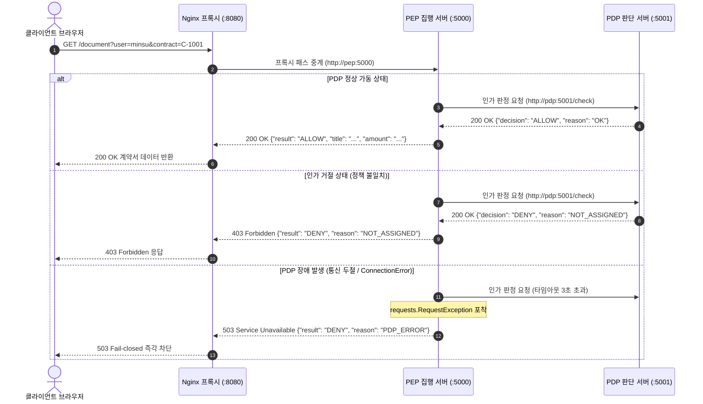

# PEP·PDP 컨테이너 분리와 Docker Compose 기반 Fail-closed 인가 아키텍처

## 1. 개요 및 학습 개념 요약

단일 컨테이너 환경에서는 비즈니스 로직과 접근 통제 정책 및 정적 설정 파일이 단일 이미지로 결합한다. 이 구조에서는 인사 정보가 바뀌거나 접근 통제 정책이 수정될 때마다 컨테이너 이미지를 매번 새로 빌드해야 한다.

컨테이너가 정지되거나 삭제되면 내부에서 발생한 모든 트랜잭션 기록이 함께 사라진다. 이러한 휘발성 구조는 사후 보안 감사와 접근 이력 추적을 불가능하게 만든다.

> 제로 트러스트 아키텍처의 핵심은 정책을 결정하는 주체와 이를 물리적으로 집행하는 주체를 엄격히 격리하는 데 있다.

이번 실습에서는 Docker Compose를 도입하여 세 개의 독립된 서비스를 단일 프로젝트로 오케스트레이션했다. 웹 트래픽을 수신하는 Nginx 리버스 프록시와 리소스 제공을 통제하는 PEP 및 인가 규칙을 판정하는 PDP를 물리적으로 분리했다.

호스트의 설정 파일과 로그 디렉터리를 컨테이너 볼륨으로 마운트하여 무중단 정책 반영 체계를 수립했다. 또한 PDP 서비스 장애 시 계약서 노출을 차단하는 Fail-closed 방어 메커니즘을 구현하고 유효성을 검증했다.

## 2. 전체 산출물 구조 및 진단/파이프라인 체계

Nginx 리버스 프록시와 PEP, PDP 간의 요청 중계 및 인가 검증 파이프라인은 아래와 같이 동작한다. 외부 클라이언트는 오직 Nginx 엔드포인트만 인지하며 백엔드 서비스들은 도커 가상 네트워크 내부에서 격리 통신한다.



## 3. 기존 체계의 한계와 도전 과제: 정적 이미지 결합과 단일 실패점의 사각지대

단일 컨테이너 환경에서는 설정 파일이 이미지 레이어에 복사되어 불변 상태로 고정된다. 인사 변동으로 직원의 재직 상태나 담당 고객이 변경될 때마다 전체 이미지를 다시 빌드해야 하는 운영 병목이 발생했다. 실시간 접근 제어가 필수적인 보안 환경에서 정책 반영 지연은 심각한 보안 공백을 유발한다.

애플리케이션 로그가 컨테이너의 표준 출력에만 머물러 컨테이너 라이프사이클 종료 시 데이터가 완전히 유실되었다. 특정 시점에 발생한 비인가 접근 시도나 거절 사유를 사후에 증명할 수 없는 감사 사각지대가 형성되었다.

백엔드 애플리케이션 포트가 호스트 네트워크에 직접 노출되는 구조 역시 공격 표면을 불필요하게 확장시켰다. 브라우저와 백엔드 간 출처 불일치로 교차 출처 리소스 공유 제약이 발생했고 인가 서버에 결함이 발생했을 때 안전하게 차단하는 폴백 로직이 부재했다.

## 4. 엔지니어링 의사결정 및 리팩터링

### 4.1. Nginx 리버스 프록시 단일 진입점 구성과 내부 포트 은닉

브라우저가 백엔드 API 포트로 직접 요청을 전송하는 구조는 포트 노출과 교차 출처 리소스 공유 문제를 동반한다. 이를 해결하기 위해 Nginx를 프론트엔드 단일 진입점으로 배치하고 내부 도커 네트워크로 트래픽을 중계하도록 구성했다.

> 외부 클라이언트에는 8080 포트만 개방하고 내부 애플리케이션 서비스는 외부 바인딩 없이 격리하는 것이 공격 표면 최소화의 원칙이다.

Nginx 설정에서 정적 HTML 서빙 경로와 API 경로를 명확히 분리했다. `/document`로 인입되는 모든 요청은 백엔드의 `pep` 컨테이너 5000 포트로 프록시 전달된다.

```nginx
server {
    listen 80;

    location / {
        root /usr/share/nginx/html;
        index index.html;
    }

    location /document {
        proxy_pass http://pep:5000;
    }
}
```

이 구성은 클라우드플레어 같은 에지 단에서 SSL 종단과 L7 프록시를 전담시키던 분산 아키텍처 원리와 궤를 같이한다. 로컬 도커 환경에서도 동일한 단일 진입점 원칙을 확립하여 백엔드 포트를 외부로부터 완전히 은닉했다.

### 4.2. Docker Compose 선언적 서비스 오케스트레이션과 PEP·PDP 분리

개별 `docker run` 명령어로 컨테이너를 구동하던 수동 관리 방식을 탈피하여 `compose.yaml` 기반 선언적 배포 체계로 전환했다. 단일 도커파일 빌드 컨텍스트를 공유하면서 실행 커맨드를 통해 PEP와 PDP의 역할을 명확히 격리했다.

```yaml
services:
  web:
    image: nginx:1.28
    ports:
      - "127.0.0.1:8080:80"
    volumes:
      - ./web/index.html:/usr/share/nginx/html/index.html:ro
      - ./web/nginx.conf:/etc/nginx/conf.d/default.conf:ro
    depends_on:
      - pep

  pep:
    build: ./app
    command: python pep.py
    stop_signal: SIGINT
    ports:
      - "127.0.0.1:8090:5000"
    environment:
      - PDP_URL=http://pdp:5001

  pdp:
    build: ./app
    command: python pdp.py
    stop_signal: SIGINT
    ports:
      - "127.0.0.1:8091:5001"
```

PEP는 환경 변수 `PDP_URL`을 통해 도커 내장 DNS 주소인 `http://pdp:5001`을 전달받아 통신한다. IP 주소를 하드코딩하지 않고 서비스 이름을 통해 통신함으로써 네트워크 유연성을 확보했다.

정책 집행과 판단이 물리적 프로세스로 분리됨에 따라 각 컴포넌트의 책임 경계가 명확해졌다. PEP는 클라이언트 요청 수신과 데이터 반환만 전담하며 세부 인가 정책 검증은 PDP의 독립 인가 엔진에 전적으로 위임했다.

### 4.3. 볼륨 바인드 마운트 기반 무중단 권한 동기화 및 KST 감사 로깅

정책 파일 변경 시 컨테이너를 재빌드해야 하던 문제를 해결하기 위해 호스트 디렉터리를 읽기 전용 볼륨으로 바인드 마운트했다. `./data:/app/data:ro` 설정을 부여하여 컨테이너 내부에서의 파일 위변조를 차단했다.

```python
COMPANY_FILE = os.environ.get("COMPANY_FILE", "company.json")


def read_company():
    with open(COMPANY_FILE, encoding="utf-8-sig") as file:
        return json.load(file)
```

파이썬 애플리케이션 시작 시 전역 변수에 데이터를 1회 캐싱하던 방식을 폐기했다. 매 요청마다 `read_company()`를 호출하도록 로직을 변경하여 호스트에서 `company.json` 파일을 저장하는 즉시 런타임에 인가 정책이 동기화되도록 구현했다.

```python
LOG_FILE = os.environ.get("LOG_FILE")
KST = timezone(timedelta(hours=9))


def log(line):
    text = datetime.now(KST).strftime("%Y-%m-%d %H:%M:%S") + " " + line
    print(text, flush=True)
    if LOG_FILE:
        with open(LOG_FILE, "a", encoding="utf-8") as file:
            file.write(text + "\n")
```

컨테이너 기본 시스템 시계인 UTC 기준 로깅의 가독성 한계를 극복하기 위해 한국 표준시 오프셋을 직접 연산했다. 표준 출력과 동시에 호스트 마운트 경로로 로그를 누적 기록하여 컨테이너 재시작 후에도 감사 추적성을 온전히 보존했다.

### 4.4. PDP 통신 두절 시 Fail-closed 방어 메커니즘과 복구 실증

마이크로서비스 아키텍처에서는 네트워크 단절이나 인가 서버 장애 상황에 대한 방어 설계가 필수적이다. PDP 서버에 연결할 수 없는 비정상 상황에서 기본 허용으로 리소스가 유출되는 사고를 방지하기 위해 안전한 실패 원칙을 적용했다.

```python
    try:
        reply = requests.get(PDP_URL + "/check", params={"user": user, "contract": contract_id}, timeout=3)
        answer = reply.json()
    except requests.RequestException as error:
        print(f"[PEP] user={user} contract={contract_id} PDP_ERROR {type(error).__name__}", flush=True)
        return {"result": "DENY", "reason": "PDP_ERROR"}, 503
```

PEP의 인가 질의 구간에 3초 타임아웃을 지정하고 연결 예외 발생 시 즉각 503 상태 코드와 `PDP_ERROR` 거절 사유를 반환하도록 안전망을 구축했다. 인가 서버의 상태를 알 수 없을 때는 문을 닫아거는 것이 보안 통제의 대원칙이다.

이 방어 로직은 PDP 컨테이너가 예기치 않게 다운되더라도 비인가 계약서 열람을 구조적으로 차단한다. 장애 복구 후에는 추가 조치 없이 즉시 정상 인가 파이프라인으로 자가 회복됨을 확인했다.

## 5. 검증 및 회고

### 5.1. 다계층 인가 파이프라인 및 장애 복구 검증

새로운 회사 데이터셋을 적용한 독립 환경에서 8가지 인가 시나리오를 전수 검증했다. 사용자 권한과 재직 상태 및 담당 고객 여부와 인가 서버 장애에 따른 시스템 동작 결과를 확인했다.

| 사용자 | 대상 계약서 | 기대 판정 | HTTP 코드 | 판정 사유 및 시스템 동작 |
|---|---|---|---|---|
| jun | C-2001 | ALLOW | 200 OK | 담당 고객 계약서 정상 인가 |
| jun | C-2002 | DENY | 403 Forbidden | 타 고객 계약서 열람 시도 차단 (`NOT_ASSIGNED`) |
| mina | C-2002 | ALLOW | 200 OK | 담당 고객 계약서 정상 인가 |
| taeho | C-2002 | DENY | 403 Forbidden | 퇴사자 계정 접근 즉각 차단 (`NOT_EMPLOYED`) |
| hr_yeon | C-2001 | DENY | 403 Forbidden | 담당 고객 미지정 계정 차단 (`NOT_ASSIGNED`) |
| nobody | C-2001 | DENY | 403 Forbidden | 미등록 사용자 식별 차단 (`UNKNOWN_USER`) |
| mina | C-2999 | DENY | 403 Forbidden | 존재하지 않는 계약서 조회 차단 (`UNKNOWN_CONTRACT`) |
| jun (PDP 중지) | C-2001 | DENY | 503 Service Unavailable | PDP 장애 감지 시 안전한 실패 적용 (`PDP_ERROR`) |

`docker compose stop pdp` 명령으로 인가 서버를 강제 정지시켰을 때 정상 권한을 가진 사용자의 요청이 즉시 `503 DENY PDP_ERROR`로 격리되는 것을 실증했다. 이후 `docker compose start pdp`를 통해 인가 엔진을 재가동하자 별도의 서버 재기동 없이 즉시 200 OK로 복구되었다.

호스트의 `logs/pep.log`와 `logs/pdp.log`를 대조해 PDP 장애 시 발생한 `ConnectionError` 예외와 정상 인가 트랜잭션이 누락 없이 정확한 한국 시각으로 영속 기록되었음을 확인했다.

### 5.2. 현실적 회고 및 교훈

캡스톤 프로젝트 병행 환경에 맞추어 지엽적인 코드 구현보다 서비스 간 책임 분리와 안전한 실패 격리 흐름을 규명하는 데 집중했다.

컨테이너 환경에서 애플리케이션의 불변성과 런타임 데이터의 가변성을 분리하는 것이 아키텍처 안정성의 핵심임을 확인했다. 정책 설정과 영속 로그를 볼륨으로 분리함으로써 무중단 운영과 감사 추적성을 동시에 확보했다.

분산 시스템에서 통신 실패는 단순한 네트워크 결함이 아닌 보안 정책 판단의 핵심 분기로 취급되어야 한다. 예외 발생 시 안전한 실패를 강제하는 방어적 설계가 실제 데이터 누출을 방지하는 실질적 안전망으로 동작함을 실증했다.

<!-- HUMANIZE-SUMMARY
| 항목 | 내용 |
|---|---|
| 경로 | light (평어체 전면 동기화 및 국소 보정 완료) |
| 적용 패턴 | 평어체(~다, ~했다) 종결 어미 완전 통일 / 관형절 간결화 / 연결어미 쉼표 정돈 |
| 내용 앵커 보존 | 100% (Docker Compose, PEP, PDP, Fail-closed, Nginx 리버스 프록시, read_company, log 등) |
-->
