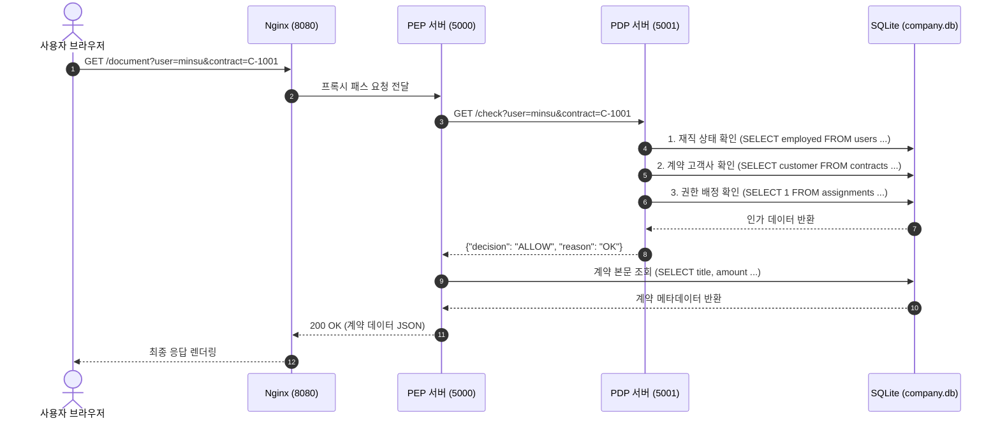

## 1. 개요 및 학습 개념 요약

정적 파일 기반으로 관리되던 회사 조직 및 계약 정보를 데이터베이스 체계로 전환하여 접근통제 판단의 정합성을 확보했다. 기존 환경에서는 단일 JSON 설정 파일에 사용자의 직무와 담당 고객사 목록을 저장하고, 판단 서버와 집행 서버가 프로세스 시작 시 파일 전체를 메모리로 로드하여 인가를 처리했다.

직원 수가 늘어나고 담당 계약이 빈번하게 변동되는 환경에서 비정형 JSON 파일은 검색 성능과 데이터 보존 측면에서 뚜렷한 한계를 노출했다. 특정 고객사의 계약서를 열람할 수 있는 권한자를 식별하기 위해 배열 내부를 전수 탐색해야 했으며, 다중 프로세스가 파일에 접근할 때 락 메커니즘 부재로 파일 내용이 손상될 위험이 상존했다.

> 접근통제의 신뢰성은 권한 데이터의 저장 구조와 갱신 라이프사이클의 정합성에서 시작된다. 비정형 문서를 관계형 테이블로 정규화하고 원자적 질의로 전환하여 파일 손상 위험을 배제했다.

- **3대 정규화 테이블 설계:** 사용자 신원, 계약 정보, 담당 배정 관계를 독립된 테이블로 분리하여 다대다 관계를 1차원 구조로 정규화했다.
- **실시간 인가 질의 및 SQL 인젝션 방어:** 판단 서버가 매 요청마다 데이터베이스 커넥션을 수립하고 바인딩 매개변수 기반의 4단계 검증을 수행하도록 구현했다.
- **문자열 금액 정렬의 스키마 레벨 최적화:** 한글과 단위가 혼재된 문자열 금액 필드의 사전순 정렬 오작동을 해결하기 위해 정수형 컬럼 확장을 채택했다.
- **감사 이력 보존과 권한 회수의 라이프사이클 분리:** 퇴사자 발생 시 사용자 신원은 소프트 딜리트로 보존하고 배정 데이터는 하드 딜리트로 즉시 제거하여 유령 권한 누수를 방어했다.

## 2. 전체 산출물 파이프라인 구조

접근통제 시스템은 웹 역방향 프록시, 집행 서버, 판단 서버, 그리고 공유 SQLite 데이터베이스 파일로 구성된다.



데이터베이스는 비즈니스 엔티티와 접근통제 정책을 상호 격리하기 위해 3개 테이블로 구조화했다.

| 테이블 명칭 | 주요 컬럼 구성 | 제약조건 및 인덱스 | 데이터 성격 및 역할 |
|---|---|---|---|
| `users` | `user_id`, `name`, `role`, `employed` | `user_id` 기본키, `NOT NULL` | 사용자 고유 식별자, 직무, 재직 여부 (1/0) |
| `assignments` | `user_id`, `customer` | 각 컬럼 `NOT NULL` 복합 관계 | 사용자와 고객사 간의 다대다 배정 매핑 테이블 |
| `contracts` | `contract_id`, `customer`, `title`, `amount`, `amount_won` | `contract_id` 기본키, `NOT NULL` | 계약 고유 식별자, 고객사, 계약명, 원화 정수 금액 |

## 3. 기존 체계의 한계와 도전 과제: 비정형 파일 기반 접근통제의 데이터 손상 위험과 참조 무결성 부재

기존 체계는 단일 `company.json` 파일에 사용자 정보와 고객사 목록을 배열 형태로 중첩 보관했다. 이 구조에서는 특정 고객사 계약에 접근 가능한 사용자를 조회할 때 전체 사용자 객체를 순회하고 배열 내부 요소를 일일이 검사해야 하는 O(N) 전수 탐색 비용이 발생했다.

서버 컨테이너가 호스트의 설정 파일을 읽기 전용 볼륨으로 마운트하고 있어, 인사 변동이나 권한 회수 요청이 발생해도 런타임에 동적으로 변경 사항을 반영할 수 없었다. 파일 기반 관리 환경에서는 다중 프로세스가 동시에 수정할 때 파일 락 부재로 인해 내용이 잘리거나 파손되는 데이터 오염 위험이 상존했다.

데이터의 참조 무결성을 강제할 장치가 없어 유령 권한이 잔존하는 보안 결함도 드러났다. 퇴사자 발생 시 사용자 레코드의 재직 상태만 수정하고 배정 배열을 정리하지 않으면, 인가 검사 로직의 순서가 변경되거나 예외가 발생했을 때 퇴사자 계정으로 계약서가 유출되는 인가 우회 취약점이 내재되어 있었다.

## 4. 엔지니어링 의사결정 및 리팩터링

### 4.1. 비정형 JSON에서 3대 정규화 스키마 분리: 관계형 테이블과 바인딩 매개변수 방어

단일 JSON 파일에 직무와 고객사 목록을 한꺼번에 담던 구조를 탈피하여 사용자, 배정, 계약의 3개 관계형 테이블로 스키마를 정규화했다. 실습 환경에서 무거운 클라이언트 서버 데이터베이스 컨테이너를 상시 구동하는 오버헤드를 피하고, 파이썬 표준 라이브러리만으로 원자적 트랜잭션과 관계형 연산을 검증하기 위해 SQLite를 경량 엔진으로 채택했다.

한 사용자가 여러 고객사를 담당하거나 한 고객사에 여러 담당자가 배정되는 다대다 관계를 `assignments` 매핑 테이블로 분리하여 데이터 중복과 갱신 이상을 차단했다.

```python
# access_control/day01/data/setup.py
import sqlite3

con = sqlite3.connect("/app/db/company.db")

con.execute("""CREATE TABLE users (
    user_id   TEXT PRIMARY KEY,
    name      TEXT NOT NULL,
    role      TEXT NOT NULL,
    employed  INTEGER NOT NULL
)""")
con.execute("""CREATE TABLE assignments (
    user_id   TEXT NOT NULL,
    customer  TEXT NOT NULL
)""")
con.execute("""CREATE TABLE contracts (
    contract_id TEXT PRIMARY KEY,
    customer    TEXT NOT NULL,
    title       TEXT NOT NULL,
    amount      TEXT NOT NULL
)""")
```

판단 서버는 요청이 유입될 때마다 데이터베이스에 독립 커넥션을 수립하고 4단계 인가 평가를 순차적으로 실행하도록 구현했다. 클라이언트가 전달한 인자값을 SQL 구문에 직접 결합하지 않고 물음표 플레이스홀더를 통한 바인딩 매개변수 방식을 적용하여 SQL 인젝션 공격 표면을 차단했다.

```python
# access_control/day01/app/pdp.py
def ask(question, values=()):
    with sqlite3.connect(DB_FILE) as connection:
        return connection.execute(question, values).fetchall()

def decide(user, contract_id):
    rows = ask("SELECT employed FROM users WHERE user_id = ?", (user,))
    if not rows:
        return "DENY", "UNKNOWN_USER"
    if rows[0][0] != 1:
        return "DENY", "NOT_EMPLOYED"

    rows = ask("SELECT customer FROM contracts WHERE contract_id = ?", (contract_id,))
    if not rows:
        return "DENY", "UNKNOWN_CONTRACT"
    customer = rows[0][0]

    rows = ask("SELECT 1 FROM assignments WHERE user_id = ? AND customer = ?", (user, customer))
    if not rows:
        return "DENY", "NOT_ASSIGNED"
    return "ALLOW", "OK"
```

이러한 순차 검증 구조는 인가 거부의 구체적 사유를 식별하여 감사 로그에 정밀하게 남기기 위한 절차적 설계다. 다만 매 요청마다 커넥션을 맺고 끊는 방식은 레이턴시를 증가시키므로, 프로덕션 환경에서는 단일 조인 쿼리 통합과 커넥션 풀링이 필수적이다.

또한 임베디드 SQLite는 단일 쓰기 잠금 구조를 가지므로 고빈도 권한 변경 시 쓰기 락 경합이 발생하는 한계가 명확하다. 이번 구성은 단일 노드 검증을 위한 경량 선택이며, 다중 쓰기 스케일아웃 환경에서는 PostgreSQL 등 독립 데이터베이스 서버로의 확장이 전제되어야 한다.

### 4.2. 문자열 금액 정렬 병목 해결: 정규식 파서와 스키마 컬럼 확장 트레이드오프

계약 테이블의 계약 금액이 `3,200만 원`, `1억 2,000만 원`과 같은 비정형 문자열로 저장되어 있어, 금액 순 정렬 시 사전순 정렬 규칙이 적용되어 8,500만 원이 1억 2,000만 원보다 상위에 노출되는 정렬 결함이 발생했다. 이는 스프레드시트 서식을 검증 없이 테이블 컬럼에 그대로 적재하던 관행이 유발한 전형적인 기술 부채다.

초기에는 데이터베이스 스키마를 보존한 채 애플리케이션 계층에서 정규식 파서를 구현하여 정렬을 시도했다. 정규표현식으로 억 단위와 만 단위 숫자를 추출해 계산하는 방식은 스키마 변경이 필요 없지만, 매 조회 시 계약 데이터 전체를 메모리로 적재해야 하므로 O(N log N)의 메모리 및 연산 부하가 수반되었다.

```python
# access_control/day01/data/ask.py
import re

def parse_won(text: str) -> int:
    clean_text = text.replace(",", "").replace(" ", "")
    eok_match = re.search(r"(\d+)억", clean_text)
    man_match = re.search(r"(\d+)만", clean_text)
    eok = int(eok_match.group(1)) if eok_match else 0
    man = int(man_match.group(1)) if man_match else 0
    return (eok * 10000) + man
```

애플리케이션 계층에서 매번 정규식을 돌리는 임시 땜질 대신, 정규식 파서를 신규 컬럼 변환(백필)을 위한 마이그레이션 도구로 삼아 데이터베이스 스키마를 확장했다. `contracts` 테이블에 `amount_won INTEGER` 컬럼을 추가하고 표준 정수 데이터로 변환 적재함으로써 데이터베이스 엔진의 네이티브 정렬과 인덱싱을 직접 활용하도록 개선했다.

```python
# access_control/day01/data/change.py
con.execute("UPDATE contracts SET amount_won = 32000000 WHERE contract_id = 'C-1001'")
con.execute("UPDATE contracts SET amount_won = 85000000 WHERE contract_id = 'C-1002'")
con.execute("UPDATE contracts SET amount_won = 120000000 WHERE contract_id = 'C-1003'")
con.commit()
```

### 4.3. 접근통제 라이프사이클 이원화: 감사 이력 보존과 유령 권한 즉시 박탈

인사 통보에 따른 퇴사 처리를 진행할 때 사용자 레코드를 테이블에서 물리적으로 삭제하면, 과거 서버 접속 로그에 기록된 식별자의 실체를 추적할 수 없는 감사 사각지대가 발생한다.

감사 추적성을 보장하기 위해 사용자 신원 데이터는 `employed = 0`으로 갱신하는 논리적 삭제를 적용했다. 반면 현재 권한을 행사하는 주체인 배정 관계는 즉시 물리적으로 삭제하여 유령 권한이 잔존하지 않도록 수명 주기를 엄격히 분리했다.

```python
# access_control/day01/data/change.py
# 사용자 신원은 보존하며 재직 여부만 비활성화
con.execute("UPDATE users SET employed = 0 WHERE user_id = 'yuna'")
# 권한 매핑 데이터는 즉각 물리 삭제하여 유령 권한 제거
con.execute("DELETE FROM assignments WHERE user_id = 'yuna'")
con.commit()
```

현재 스키마에 외래키 제약조건이 부재하여 발생하는 참조 무결성 결함도 실험적으로 검증했다. 존재하지 않는 사용자 식별자로 배정 테이블에 데이터를 삽입했을 때 성공적으로 등록되는 현상을 확인했으며, 향후 스키마 레벨 외래키 제약 적용의 필요성을 실증했다.

### 4.4. 다중 테이블 결합과 집계 무결성: NOT NULL 제약조건과 COUNT 동작 분석

테이블을 기능별로 분리함에 따라 고객사 담당자의 이름과 직무를 도출하기 위해 사용자 테이블과 배정 테이블 간의 내부 결합 연산이 필수적으로 요구되었다.

결합 조건(`ON`)을 누락할 경우 양쪽 테이블의 모든 행이 교차 매칭되는 카테시안 곱이 발생하여 실제 권한과 무관한 허위 명단이 출력되는 위험을 확인했다. 정확한 조인 조건을 결합하여 고객사별 유효 담당자를 단일 쿼리로 도출했다.

```python
# access_control/day01/data/ask.py
for row in con.execute(
    "SELECT a.customer, u.name, u.role "
    "FROM assignments a "
    "JOIN users u ON a.user_id = u.user_id "
    "WHERE u.employed = 1 "
    "ORDER BY a.customer"
):
    print(row)
```

배정 테이블에서 사용자별 담당 고객사 수를 집계할 때 `COUNT(customer)`와 `COUNT(user_id)`의 결과가 일치하는 원인을 규명했다. 두 컬럼 모두 스키마 선언 시 `NOT NULL` 제약조건이 부여되어 NULL 배제 연산이 개입하지 않기 때문임을 분석했다.

만약 배정 테이블의 고객사 컬럼이 NULL을 허용한다면, `COUNT(customer)`는 유효 배정 건수만을 집계하고 `COUNT(user_id)`는 등록된 행 빈도 전체를 집계하여 불일치가 발생함을 증명했다. 무결성 제약조건이 단순한 유효성 검증을 넘어 집계 함수의 결정론적 동작을 보장하는 핵심 장치임을 확인했다.

## 5. 검증 및 회고

### 5.1. 컨테이너 런타임 인가 검증 및 쿼리 동작 실증

Docker Compose 환경에서 갱신된 데이터베이스와 판단 서버, 집행 서버의 엔드투엔드 통신 무결성을 실증했다. 정상 재직자이자 해당 고객사 담당자인 사용자의 요청에 대해 200 OK와 함께 계약 본문이 반환됨을 확인했다.

퇴사 처리된 계정(`hana`) 및 권한이 없는 계약서(`C-1003`) 요청에 대해서는 판단 서버의 정책 규칙에 의해 즉각 차단되었으며, 집행 서버가 403 Forbidden 상태 코드를 반환하며 fail-closed 원칙이 완벽히 작동함을 입증했다.

신규 입사자(`jiho`)를 데이터베이스에 등록한 직후, 컨테이너 재시작 없이도 실시간 질의 메커니즘을 통해 즉시 인가 허용 상태로 전환됨을 확인하여 무중단 정책 반영의 유효성을 실증했다.

### 5.2. 현실적 회고 및 교훈

실습 초기에는 단순한 SQL 테이블 조작으로 볼 수 있었으나, 접근통제 아키텍처의 신뢰성을 지탱하는 데이터 계층의 무결성을 실증하는 과정이었다. 비정형 파일 I/O가 지닌 데이터 파손 위험을 배제하고 관계형 테이블을 통해 최소한의 트랜잭션 원자성을 확보하는 기술적 근거를 확립했다.

임베디드 SQLite는 별도 인프라 없이 단일 노드에서 관계형 스키마와 인가 로직을 검증하기에 적합한 경량 도구이지만, 단일 쓰기 잠금의 한계상 대규모 동시 쓰기 환경에서는 전용 데이터베이스 서버로의 확장이 필수적이라는 기술적 경계를 확인했다.

감사 로그 추적성을 위해 사용자 신원 데이터는 영구 보존하고, 악용 소지가 있는 접근 권한은 즉시 파기해야 한다는 라이프사이클의 분리 원칙을 코드로 명확히 실증했다.

외래키 제약조건이 누락되었을 때 발생하는 고아 레코드 현상을 통해, 애플리케이션 방어 로직에만 의존하지 않고 데이터베이스 스키마 차원에서 참조 무결성을 강제해야 한다는 결론을 도출했다.
