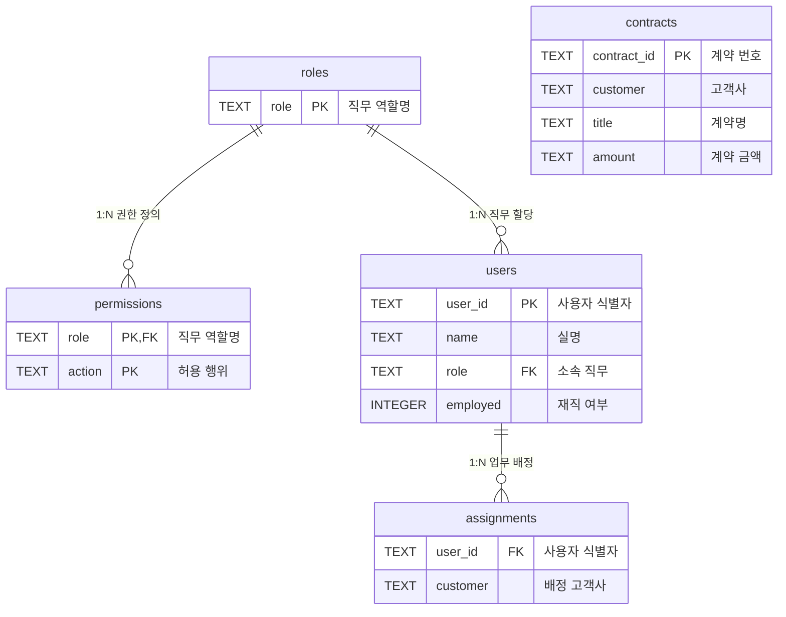

## 1. 개요 및 학습 개념 요약

정규화된 관계형 데이터베이스 환경에서 조직 확장에 따른 세분화된 접근통제 요구를 수용하기 위해 역할 기반 접근통제 모델을 구축했다. 기존 환경에서는 영업 담당 배정 테이블에 사용자가 등록되어 있어야만 계약 데이터 조회가 허용되었다.

회계팀 직원이 모든 고객사의 계약 금액만 검토해야 하는 업무가 주어졌을 때, 기존 구조는 회계 직원을 개별 고객사의 담당자로 억지로 등록해야만 하는 치명적인 한계를 노출했다. 이로 인해 실제 영업 담당자 명단이 왜곡되고 고객사 및 직원이 늘어날 때마다 배정 레코드가 폭증하는 병목이 발생했다.

> 접근통제 정책을 특정 비즈니스 데이터의 배정 관계와 결합하면 조직 변경 시 데이터 오염이 발생한다. 신원, 직무 역할, 인가 권한, 담당 데이터 범위를 테이블 수준에서 완전히 분리하여 최소 권한 원칙을 달성했다.

- **RBAC 스키마 분리와 룩업 테이블 모델링:** 역할 마스터와 권한 매핑 테이블을 독립 설계하여 애플리케이션 하드코딩 없는 동적 정책 관리 체계를 확립했다.
- **데이터베이스 외래키 무결성 강제:** 외래키 활성화와 테이블 교체 마이그레이션으로 유효하지 않은 직무나 고아 계정 등록을 스키마 레벨에서 원천 차단했다.
- **PDP 다계층 동적 인가 엔진:** 광역 열람 권한과 개별 배정 권한을 단계별로 평가하여 허용 여부를 판정하는 4단계 인가 파이프라인을 구현했다.
- **PEP 동적 필드 단위 마스킹:** 인가 성공 시 PDP가 반환하는 열람 플래그를 기준으로 민감 항목을 동적으로 선별 은닉하도록 집행 계층을 구성했다.

## 2. 전체 산출물 및 접근통제 스키마 체계

역할 기반 접근통제 시스템은 직무와 권한, 비즈니스 배정 관계를 정규화된 관계형 스키마로 분리하여 데이터 무결성을 유지한다.

각 엔티티는 외래키 제약조건으로 유효한 참조 범위를 엄격히 한정하며, 미등록 직무나 고아 데이터의 유입을 원천 차단한다.



데이터베이스는 신원, 직무 역할, 권한 행위, 고객 배정, 계약 데이터를 5개 테이블로 정규화하여 관리한다.

| 테이블 명칭 | 주요 컬럼 구성 | 제약조건 및 인덱스 | 데이터 성격 및 역할 |
|---|---|---|---|
| `roles` | `role` | `role` 기본키 | 허용된 직무 역할을 정의하는 룩업 및 마스터 테이블 |
| `permissions` | `role`, `action` | 복합 기본키 `(role, action)`, `role` 외래키 | 역할별 허용 행위를 다대다로 매핑하는 권한 매핑 테이블 |
| `users` | `user_id`, `name`, `role`, `employed` | `user_id` 기본키, `role` 외래키, `NOT NULL` | 사용자 계정 식별자, 실명, 소속 역할, 재직 여부 플래그 |
| `assignments` | `user_id`, `customer` | `user_id` 외래키, `NOT NULL` 복합 관계 | 영업 담당자와 고객사 간의 다대다 업무 배정 테이블 |
| `contracts` | `contract_id`, `customer`, `title`, `amount` | `contract_id` 기본키, `NOT NULL` | 계약 고유 번호, 고객사, 계약서 제목, 계약 체결 금액 |

## 3. 기존 체계의 한계와 도전 과제: 담당자 명단 오염과 데이터베이스 참조 무결성 부재

초기 시스템 구조에서는 인가 여부가 오직 `assignments` 테이블의 고객사 배정 여부로만 결정되었다. 그러나 회계팀 직원이 모든 고객사의 계약 금액을 대조해야 하는 업무가 주어졌을 때, 시스템은 회계 직원을 개별 고객사의 담당자로 억지로 등록해야만 조회를 허용하는 결함을 드러냈다.

이로 인해 실제 영업 실무를 담당하지 않는 지원 부서 직원이 영업 담당자 명단에 혼입되어 데이터의 진실성이 심각하게 왜곡되었다. 또한 고객사가 추가되거나 회계 인력이 증원될 때마다 매번 다대다 배정 레코드를 수작업으로 증설해야 하므로 관리 복잡도가 기하급수적으로 폭증했다.

더 나아가 기존 테이블 스키마에는 물리적 외래키 제약조건이 없어 오타가 포함된 임의의 역할 문자열이나 실존하지 않는 계정 식별자가 무제한으로 적재될 수 있었다. 또한 계약서 열람 권한이 주어지면 계약 제목과 금액이 통째로 노출되어 회계팀에게 불필요한 영업 기밀까지 공개되는 최소 권한 원칙 위배 문제가 상존했다.

## 4. 엔지니어링 의사결정 및 리팩터링

### 4.1. 역할과 권한 분리 모델링: 단일 컬럼 룩업 테이블과 다대다 권한 매핑 설계 (`roles.py`, `permissions.py`)

애플리케이션 소스코드나 SQL 쿼리 조건문에 권한을 하드코딩하는 방식은 조직 개편 시마다 백엔드 재배포를 강제하고 로직 파편화에 따른 권한 우회를 유발한다. 이를 방지하기 위해 직무 역할을 정의하는 `roles` 테이블과 인가 행위를 매핑하는 `permissions` 테이블을 분리 영속화했다.

`roles` 테이블은 직무 식별자만을 단일 기본키 컬럼으로 두는 룩업 테이블로 설계했다. 단순한 목차가 아니라 외래키 무결성으로 유효한 직무 도메인 범위를 한정하는 마스터 역할을 수행한다. 향후 대리키 식별자나 UI 표시명, 활성화 플래그 등 엔터프라이즈 메타데이터로 확장 가능한 기준점을 마련했다.

```python
# access_control/day02/data/roles.py
import sqlite3

con = sqlite3.connect("/app/db/company.db")
con.execute("""
    CREATE TABLE roles (
        role TEXT PRIMARY KEY
    )
""")
con.execute("INSERT INTO roles VALUES ('sales')")
con.execute("INSERT INTO roles VALUES ('account_admin')")
con.commit()
con.close()
```

`permissions` 테이블은 `(role, action)`을 복합 기본키로 지정하여 단일 역할이 복수의 인가 행위를 가질 수 있도록 다대다 관계를 모델링했다. 영업 직무(`sales`)에는 배정된 계약서 열람 권한(`view_assigned_contracts`)을, 회계 직무(`account_admin`)에는 전체 계약 금액 열람 권한(`view_all_amounts`)을 격리 부여했다.

```python
# access_control/day02/data/permissions.py
import sqlite3

con = sqlite3.connect("/app/db/company.db")
con.execute("""
    CREATE TABLE permissions (
        role    TEXT NOT NULL,
        action  TEXT NOT NULL,
        PRIMARY KEY (role, action)
    )
""")
con.execute("INSERT INTO permissions VALUES ('sales', 'view_assigned_contracts')")
con.execute("INSERT INTO permissions VALUES ('account_admin', 'view_all_amounts')")
con.commit()
con.close()
```

### 4.2. 데이터베이스 물리 외래키 제약조건 적용과 고가용성 트레이드오프 (`*_fk.py`)

초기 스키마의 무결성 부재를 해결하기 위해 SQLite 환경에서 외래키 제약조건을 강제했다. SQLite는 기본적으로 외래키 검사가 비활성화되어 있으므로 커넥션 수립 즉시 `PRAGMA foreign_keys = ON`을 실행해야 한다.

또한 기존 테이블에 `ALTER TABLE`로 제약조건을 직접 추가할 수 없는 SQLite의 엔진 제약을 극복하기 위해 신규 테이블 생성, 데이터 이관, 기존 테이블 삭제, 신규 테이블 리네이밍의 4단계 마이그레이션을 적용했다. `users`와 `permissions`의 `role` 컬럼이 반드시 `roles` 마스터 테이블을 참조하도록 강제했다.

```python
# access_control/day02/data/permissions_fk.py
import sqlite3

con = sqlite3.connect("/app/db/company.db")
con.execute("PRAGMA foreign_keys = ON")

con.execute("""
    CREATE TABLE permissions_new (
        role TEXT NOT NULL,
        action TEXT NOT NULL,
        PRIMARY KEY (role, action),
        FOREIGN KEY (role) REFERENCES roles(role)
    )
""")
con.execute("INSERT INTO permissions_new SELECT * FROM permissions")
con.execute("DROP TABLE permissions")
con.execute("ALTER TABLE permissions_new RENAME TO permissions")
con.commit()
con.close()
```

동시에 대규모 엔터프라이즈 환경에서 물리 외래키 제약조건을 의도적으로 생략하는 실제 아키텍처 트레이드오프를 검토했다. 자식 테이블에 쓰기가 발생할 때 부모 레코드에 공유 락이 걸리며, 이는 동시 쓰기 환경에서 배타적 락과 충돌하여 데드락 빈도를 급증시키는 원인이 된다.

또한 데이터베이스를 수평 분할하는 샤딩 환경이나 마이크로서비스 환경에서는 크로스 인스턴스 외래키 검사가 물리적으로 불가능하다. 따라서 대규모 트래픽 환경에서는 물리 제약조건을 배제하고 외래 참조 컬럼에 B-Tree 인덱스만 부여하여 조인 속도를 확보한 뒤, 데이터 정합성은 소프트 딜리트와 정합성 검증 배치로 방어하는 패턴이 채택된다. 본 실습에서는 단일 인스턴스 환경의 엄격한 데이터 무결성을 위해 물리 외래키를 완전히 적용했다.

### 4.3. PDP 인가 엔진 질의 고도화: 동적 권한 해석과 4단계 검증 파이프라인 (`app/pdp.py`)

판단 서버는 사용자가 속한 역할의 권한을 동적으로 조합하여 인가 여부를 결정하도록 질의 파이프라인을 전면 리팩터링했다. 기존의 단순 배정 테이블 조회를 걷어내고 사용자, 역할, 권한을 조인하는 4단계 인가 로직을 구현했다.

검증은 철저히 결정론적 순서로 진행된다. 첫째, 사용자의 재직 여부를 확인하여 미등록 계정이거나 퇴사자일 경우 즉시 거절한다. 둘째, 요청 대상 계약서의 존재 유무를 확인한다.

셋째, 사용자의 역할에 매핑된 권한 목록을 조회하여 광역 열람 권한(`view_all_amounts`, `view_all_contract_titles`)이 존재하는지 검사한다. 광역 권한이 확인되면 고객사 배정 여부와 무관하게 즉시 허용을 반환한다. 넷째, 광역 권한이 없는 경우에만 배정 전용 권한(`view_assigned_contracts`)과 `assignments` 테이블의 고객사 매핑을 최종 대조한다.

```python
# access_control/day02/app/pdp.py
def decide(user, contract_id):
    rows = ask("SELECT employed FROM users WHERE user_id = ?", (user,))
    if not rows:
        return "DENY", "UNKNOWN_USER"
    if rows[0][0] != 1:
        return "DENY", "NOT_EMPLOYED"

    rows = ask("SELECT customer FROM contracts WHERE contract_id = ?", (contract_id,))
    if not rows:
        return "DENY", "UNKNOWN_CONTRACT"
    customer = rows[0][0]

    rows = ask("""
        SELECT permissions.action
        FROM users
        JOIN permissions ON users.role = permissions.role
        WHERE users.user_id = ?
        AND permissions.action IN ('view_all_amounts', 'view_all_contract_titles')
    """, (user,))
    if rows:
        return "ALLOW", "OK"

    rows = ask("""
        SELECT 1
        FROM users
        JOIN permissions ON users.role = permissions.role
        WHERE users.user_id = ?
        AND permissions.action = 'view_assigned_contracts'
    """, (user,))
    if not rows:
        return "DENY", "NO_VIEW_PERMISSION"

    rows = ask("SELECT 1 FROM assignments WHERE user_id = ? AND customer = ?", (user, customer))
    if not rows:
        return "DENY", "NOT_ASSIGNED"
    return "ALLOW", "OK"
```

### 4.4. PEP 동적 필드 마스킹 및 무중단 역할 확장 검증 (`app/pep.py`, `data/change.py`)

접근통제는 데이터 접근의 전면 허용과 차단뿐만 아니라 응답 필드의 세분화된 통제를 요구한다. PDP의 `/check` 엔드포인트는 인가 결정뿐만 아니라 클라이언트에 공개 가능한 필드 플래그(`show_title`, `show_amount`)를 계산하여 함께 응답하도록 설계했다.

집행 서버는 PDP의 인가 응답을 수신한 뒤, 반환된 메타데이터 플래그에 따라 계약서 딕셔너리를 동적으로 재구성한다. 허용 플래그가 참인 필드만 응답 본문에 포함함으로써 회계 직무에는 계약 제목을 완전히 은닉하고 계약 금액만 노출하는 최소 권한 집행을 실현했다.

```python
# access_control/day02/app/pep.py
    rows = ask("""
        SELECT title, amount
        FROM contracts
        WHERE contract_id = ?
    """, (contract_id,))
    title, amount = rows[0]

    result = {"result": "ALLOW", "amount": amount}
    if answer.get("show_title", False) is True:
        result["title"] = title
    if answer.get("show_amount", False) is True:
        result["amount"] = amount
    return result, 200
```

이 구조는 신규 조직과 역할이 신설될 때 애플리케이션 코드를 한 줄도 수정하지 않고 데이터베이스 조작만으로 정책을 확장할 수 있는 무배포 유연성을 제공한다. 정기 점검을 수행하는 감사팀(`auditor`)과 담당 직원(`doyun`)을 등록하여 두 서버의 재시작 없이 즉시 전체 계약 정보 열람이 활성화됨을 검증했다.

이때 감사 직무의 권한을 단일한 '모든 계약 보기'로 묶지 않고 '모든 금액 보기(`view_all_amounts`)'와 '모든 계약 제목 보기(`view_all_contract_titles`)'라는 원자적 행위로 분리 모델링했다. 만약 통짜 권한을 신설하면 기존 회계 직무가 보유한 금액 열람 권한을 재사용하지 못해 역할별 전용 권한이 중복 양산되는 권한 비대화가 발생한다.

또한 필드 열람 행위를 세분화해두어야 향후 계약 제목만 점검하는 법무 직무처럼 중간 수준의 열람 요구가 신설되어도 백엔드 로직 수정 없이 N:M 권한 매핑 조합만으로 최소 권한 원칙을 엄격히 충족할 수 있다.

```python
# access_control/day02/data/change.py
import sqlite3

con = sqlite3.connect("/app/db/company.db")
con.execute("PRAGMA foreign_keys = ON")

con.execute("INSERT INTO roles VALUES ('auditor')")
con.execute("INSERT INTO users VALUES ('doyun', '김도윤', 'auditor', 1)")
con.commit()
con.close()
```

## 5. 검증 및 회고

### 5.1. 역할별 필드 노출 차등 및 참조 무결성 방어 실증

완성된 인가 시스템을 컨테이너 환경에서 구동하고 직무별 열람 범위와 무결성 제약조건의 방어 동작을 실증했다.

```text
2026-09-21 14:07:18 [PDP] user=jiyeon contract=C-1002 ALLOW OK
2026-09-21 14:07:18 [PEP] user=jiyeon contract=C-1002 ALLOW OK
2026-09-21 15:17:01 [PDP] user=minsu contract=C-1003 DENY NOT_ASSIGNED
2026-09-21 15:17:01 [PEP] user=minsu contract=C-1003 DENY NOT_ASSIGNED
2026-09-21 15:18:41 [PDP] user=minsu contract=C-1001 ALLOW OK
2026-09-21 15:18:41 [PEP] user=minsu contract=C-1001 ALLOW OK
```

회계 직무 박지연과 이수진은 고객사 배정 정보가 전혀 없음에도 모든 계약서에 대해 인가를 획득했다. 반환된 JSON 응답에는 `amount` 필드만 포함되었고 `title` 필드는 완전히 제외되어 필드 수준의 데이터 격리가 정상 작동했다.

영업 직무 김민수는 자신이 배정된 B전자 계약서 C-1001 요청 시 제목과 금액이 모두 포함된 전체 데이터를 수신했다. 반면 미배정 고객사인 D물산 계약서 C-1003 요청 시에는 PDP와 PEP 로그에 `DENY NOT_ASSIGNED`가 기록되며 403 응답으로 정확히 차단되었다.

또한 외래키 제약조건 검증에서 `roles` 마스터 테이블에 등록되지 않은 임의의 역할 문자열을 `users` 테이블에 삽입하려 시도할 때 `FOREIGN KEY constraint failed` 예외가 발생하며 데이터 오염이 스키마 수준에서 원천 차단됨을 확인했다.

### 5.2. 현실적 회고 및 교훈

인가 정책을 비즈니스 로직에서 분리하여 관계형 스키마와 역할 테이블로 외재화했고, 소스코드 변경이나 서비스 재배포 없는 정책 유연성을 실증했다. 비즈니스 배정 테이블에 관리 권한을 억지로 끼워 넣던 구조적 안티패턴을 걷어내고 데이터의 진실성을 회복했다.

물리적 외래키 제약조건이 제공하는 데이터베이스 수준의 엄격한 무결성과, 분산 대규모 환경에서 락 경합을 회피하기 위한 애플리케이션 레벨 정합성 관리 간의 엔지니어링 트레이드오프를 명확히 도출했다. 소규모 모놀리스 환경에서는 데이터베이스 엔진의 엄격한 규칙이 최선의 방어벽이지만, 분산 확장을 염두에 둔다면 인덱스 기반의 논리적 정합성 관리 체계로의 전환점이 필요함을 파악했다.

판단 서버가 단순한 허용·거절 판정을 넘어 응답 필드 제어 플래그까지 함께 산출하도록 설계하여 집행 서버의 구현 복잡도를 낮췄다. 네트워크 경계와 데이터 응답 단계 모두에서 최소 권한 원칙을 빈틈없이 충족하는 접근통제 파이프라인을 완결했다.
