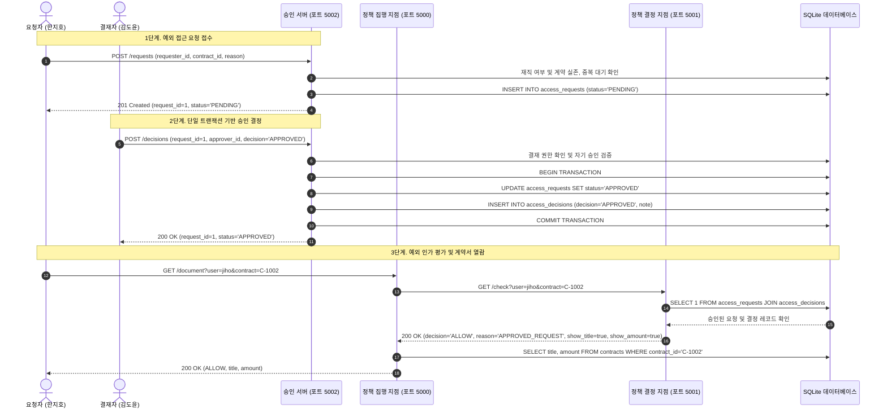

## 1. 개요 및 학습 개념 요약

역할 기반 접근제어 체계가 확립된 환경에서도 일시적 비즈니스 협업이나 긴급 장애 대응을 위한 예외 접근 요구는 상시 발생한다.
이전 [Day 02 포스트](/security-agent-toolkit/blog/c03-access-control-day02/)에서는 역할과 권한을 정규화 룩업 테이블로 분리하고 데이터베이스 외래키 무결성 제약을 적용해 정적 권한 체계를 안정화했다.
하지만 영업 사원이 타 부서 계약 장애 대응을 긴급 지원해야 하는 상황처럼, 정적 권한 모델만으로는 특정 단일 리소스에 대한 일회성 접근 요구를 유연하게 통제하기 어렵다.

이러한 예외를 처리하기 위해 계약 담당자 테이블에 해당 직원을 임시 등록하면 비즈니스 계약의 실제 소유권 데이터가 영구히 오염된다.
반대로 전역 열람 권한을 가진 상위 역할을 임시 부여하면 회사 전체 계약과 재무 정보까지 열람 범위가 과도하게 확장되어 최소 권한 원칙이 무너진다.
따라서 기존의 정적 역할과 담당자 기준선은 변경하지 않은 채, 특정 리소스에 한정된 임시 접근을 요청하고 정당한 결재권자가 승인하는 독립 승인 체계가 필수적이다.

> 비정형 예외 권한을 부여하기 위해 영구 기준선인 담당자나 역할 스키마를 수정하는 것은 접근통제 모델 오염의 주원인이다.
> 요청 의도와 승인 결정을 별도 테이블로 분리하고 단일 트랜잭션 원자성으로 상태를 동기화해야만 감사 추적성과 최소 권한을 동시에 보장할 수 있다.

본 실습에서는 접근 요청 테이블과 결정 테이블을 물리적으로 분리하고, 요청 접수와 승인을 전담하는 승인 REST API 서비스를 구축했다.
또한 요청 대기, 승인, 반려로 이어지는 엄격한 상태 머신 전이 규칙을 수립하고, 결재자 권한 검증과 자기 승인 방지 로직을 구현했다.
특히 상태 변경과 결정 기록을 단일 데이터베이스 트랜잭션으로 묶어 부분 실패에 따른 유령 권한 생성을 방지하고, 정책 결정 지점의 최우선 평가 규칙에 승인 예외 분기를 연동했다.

---

## 2. 전체 산출물 구조 및 진단/파이프라인 체계

시스템은 웹 게이트웨이, 정책 집행 지점, 정책 결정 지점, 그리고 신규 추가된 승인 서비스 등 총 4개의 독립 컨테이너로 구성된다.
모든 서비스는 도커 내부 네트워크를 통해 격리 통신하며, 단일 파일 데이터베이스를 공유하여 정합성을 유지한다.



---

## 3. 기존 체계의 한계와 도전 과제: 정적 RBAC의 예외 권한 부여 병목과 다중 테이블 갱신 불일치

정적 역할과 계약 담당 정보에 기반한 기존 접근통제 체계는 일시적인 비즈니스 협업 상황에서 극단적인 이원화를 강제했다.
임시 작업을 위해 담당자 테이블에 직원을 추가하면 실제 계약 소유권 정보가 영구히 오염되며, 지원 작업이 끝난 후 수동 회수가 누락되면 유령 권한이 영구 잔존한다.
반대로 전역 조회 권한을 가진 상위 역할을 임시 부여하면 단 한 건의 계약 확인을 위해 회사 전체 3대 계약과 재무 정보가 전면 개방되어 최소 권한 원칙이 근본적으로 무너진다.

또한 사용자가 데이터베이스를 직접 조작하거나 검증 없는 엔드포인트에 의존하면 다각도의 입력 오염 공격 표면에 노출된다.
퇴사자가 여전히 접근 요청을 생성하거나, 존재하지 않는 허위 계약 식별자를 지정하거나, 동일 계약에 대해 승인 대기 중인 요청을 중복으로 대량 생성하는 행위를 데이터베이스 기본 제약만으로는 방어하기 어렵다.
특히 요청자가 자신이 올린 요청을 스스로 승인하는 이해상충 행위는 데이터 계층의 단순한 제약조건을 우회할 수 있어 심각한 거버넌스 붕괴를 초래한다.

가장 치명적인 기술적 결함은 요청 상태 갱신과 결재 이력 저장을 별도의 데이터베이스 연결로 분리 실행할 때 발생하는 부분 실패 현상이다.
요청 상태는 승인으로 갱신되었으나 결재자 기록 삽입 도중 외래키 위반이나 네트워크 단절로 예외가 발생하면, 결재 기록이 없는 유령 승인 상태가 데이터베이스에 고착된다.
이 경우 인가 엔진이 승인 상태만 조회하여 접근을 허용하게 되면, 누가 언제 어떤 사유로 권한을 부여했는지 입증할 수 없는 치명적인 감사 사각지대가 형성된다.

---

## 4. 엔지니어링 의사결정 및 리팩터링

### 4.1. 예외 접근 모델링과 상태 전이 스키마 분리

비즈니스 요청 의도와 관리자의 결재 판정은 데이터의 수명 주기와 책임 주체가 완전히 다른 독립 엔티티다.
따라서 단일 테이블에 승인 정보를 혼재하지 않고, 요청을 관리하는 `access_requests` 테이블과 결재 결과를 기록하는 `access_decisions` 테이블로 스키마를 정규화 분리했다.

```python
# access_control/day03/data/create_request_table.py
con.execute("""
    CREATE TABLE access_requests (
        request_id INTEGER PRIMARY KEY AUTOINCREMENT,
        requester_id TEXT NOT NULL,
        contract_id TEXT NOT NULL,
        reason TEXT NOT NULL,
        status TEXT NOT NULL CHECK (
            status IN ('PENDING', 'APPROVED', 'REJECTED')
        ),
        requested_at TEXT NOT NULL DEFAULT CURRENT_TIMESTAMP,
        FOREIGN KEY (requester_id) REFERENCES users(user_id),
        FOREIGN KEY (contract_id) REFERENCES contracts(contract_id)
    )
""")
```

`access_requests` 테이블에는 `CHECK` 제약조건을 걸어 오직 `PENDING`, `APPROVED`, `REJECTED` 세 가지 상태 문자열만 허용했다.
이를 통해 유효하지 않은 임의의 상태 문자열이 데이터베이스에 유입되는 것을 원천 차단했다.

```python
# access_control/day03/data/create_decision_table.py
con.execute("""
    CREATE TABLE access_decisions (
        request_id INTEGER PRIMARY KEY,
        approver_id TEXT NOT NULL,
        decision TEXT NOT NULL CHECK (
            decision IN ('APPROVED', 'REJECTED')
        ),
        note TEXT NOT NULL,
        decided_at TEXT NOT NULL DEFAULT CURRENT_TIMESTAMP,
        FOREIGN KEY (request_id) REFERENCES access_requests(request_id),
        FOREIGN KEY (approver_id) REFERENCES users(user_id)
    )
""")

con.execute("""
    INSERT INTO permissions
    VALUES ('auditor', 'approve_access_requests')
""")
```

`access_decisions` 테이블의 기본키는 `request_id` 자체로 지정하여 단일 요청당 오직 하나의 결정만 매핑되는 1:1 관계를 강제했다.
또한 감사 역할에 `approve_access_requests`라는 명시적 세부 권한을 추가하여, 직무 기반 인가 검증의 토대를 확립했다.

### 4.2. 접수 서버 격리와 4단계 방어적 입력 유효성 검증

엔드유저가 데이터베이스에 직접 접근하는 구조를 배제하고, `approval` REST 서비스를 전면에 배치하여 요청 접수 파이프라인을 캡슐화했다.
`approval.py`의 `create_access_request` 함수는 필수값 누락, 재직 상태, 계약 실존, 중복 요청 등 4단계에 걸쳐 방어적 검증을 수행한다.

```python
# access_control/day03/app/approval.py
@app.post("/requests")
def create_access_request():
    body = request.get_json(silent=True) or {}
    requester_id = body.get("requester_id", "").strip()
    contract_id = body.get("contract_id", "").strip()
    reason = body.get("reason", "").strip()

    # 1단계. 필수 필드 존재 검증
    if not requester_id or not contract_id or not reason:
        return {"result": "ERROR", "reason": "REQUIRED_FIELDS"}, 400

    with connect_db() as con:
        # 2단계. 요청자 실존 및 재직 상태(employed=1) 검증
        user = con.execute("SELECT employed FROM users WHERE user_id = ?", (requester_id,)).fetchone()
        if user is None:
            return {"result": "ERROR", "reason": "UNKNOWN_USER"}, 404
        if user[0] != 1:
            return {"result": "ERROR", "reason": "NOT_EMPLOYED"}, 403

        # 3단계. 대상 계약 실존 여부 검증
        if not con.execute("SELECT 1 FROM contracts WHERE contract_id = ?", (contract_id,)).fetchone():
            return {"result": "ERROR", "reason": "UNKNOWN_CONTRACT"}, 404

        # 4단계. 동일 건 대기 중인 중복 요청 차단
        pending = con.execute("""
            SELECT request_id FROM access_requests
            WHERE requester_id = ? AND contract_id = ? AND status = 'PENDING'
        """, (requester_id, contract_id)).fetchone()
        if pending is not None:
            return {"result": "ERROR", "reason": "ALREADY_PENDING", "request_id": pending[0]}, 409

        cursor = con.execute("""
            INSERT INTO access_requests (requester_id, contract_id, reason, status)
            VALUES (?, ?, ?, 'PENDING')
        """, (requester_id, contract_id, reason))
        request_id = cursor.lastrowid

    return {"result": "CREATED", "request_id": request_id, "status": "PENDING"}, 201
```

1차 구현처럼 무검증 삽입을 허용하면 `invalid_requests.py`에서 확인한 바와 같이 미등록 계정, 퇴사자 계정, 유령 계약 번호가 무제한 접수되는 치명적 결함이 발생한다.
반면 리팩터링된 4단계 검증 파이프라인은 미등록자(404), 퇴사자(403), 부존재 계약(404), 기 대기 중인 중복 요청(409)을 명확한 HTTP 상태 코드로 즉각 차단한다.

### 4.3. 결재자 권한 인가와 단일 트랜잭션 원자성 보장

승인 처리 함수인 `decide_access_request`에서는 직무 권한 검증과 자기 승인 방지, 상태 전이 잠금, 그리고 데이터베이스 트랜잭션 원자성을 구현했다.
감사 부서 소속 여부만 보지 않고 `permissions` 테이블과 조인하여 `approve_access_requests` 권한이 유효하며 재직 중인 결재자인지 판정한다.

```python
# access_control/day03/data/decide_access_request.py
def decide_access_request(request_id, approver_id, decision, note):
    decision = decision.upper()
    if decision not in ("APPROVED", "REJECTED"):
        return "UNKNOWN_DECISION"

    con = sqlite3.connect(DB_FILE)
    con.execute("PRAGMA foreign_keys = ON")
    try:
        con.execute("BEGIN")
        # 1. 결재자 권한 및 재직 여부 인가
        permission = con.execute("""
            SELECT 1 FROM users JOIN permissions ON users.role = permissions.role
            WHERE users.user_id = ? AND users.employed = 1 AND permissions.action = 'approve_access_requests'
        """, (approver_id,)).fetchone()
        if permission is None:
            con.rollback()
            return "NO_APPROVAL_PERMISSION"

        # 2. 요청 실존, 자기 승인 방지, 상태 전이 검증
        row = con.execute("SELECT requester_id, status FROM access_requests WHERE request_id = ?", (request_id,)).fetchone()
        if row is None:
            con.rollback()
            return "UNKNOWN_REQUEST"
        if row[0] == approver_id:
            con.rollback()
            return "SELF_APPROVAL_NOT_ALLOWED"
        if row[1] != "PENDING":
            con.rollback()
            return "ALREADY_DECIDED"

        # 3. 상태 변경 및 결정 이력 단일 트랜잭션 동시 반영
        con.execute("UPDATE access_requests SET status = ? WHERE request_id = ?", (decision, request_id))
        con.execute("""
            INSERT INTO access_decisions (request_id, approver_id, decision, note)
            VALUES (?, ?, ?, ?)
        """, (request_id, approver_id, decision, note))
        con.commit()
    except Exception:
        con.rollback()
        raise
    finally:
        con.close()
    return "RECORDED"
```

비트랜잭션 분리 실행 환경(`partial_failure.py`)에서는 요청 상태를 수정한 뒤 결정 기록 삽입 시 오류가 발생하면 요청 상태만 `APPROVED`로 남는 심각한 데이터 불일치가 발생한다.
반면 `transaction_failure.py`와 `decide_access_request.py`에서 적용한 `BEGIN - COMMIT - ROLLBACK` 블록은 후속 쿼리 실패 시 요청 상태 변경까지 즉각 롤백하여 데이터베이스의 원자성을 보장한다.

```python
# access_control/day03/data/transaction_failure.py
try:
    con.execute("BEGIN")
    con.execute("UPDATE access_requests SET status = 'APPROVED' WHERE request_id = 2")
    con.execute("""
        INSERT INTO access_decisions (request_id, approver_id, decision, note)
        VALUES (2, 'ghost', 'APPROVED', '오류 시험')
    """)
    con.commit()
except sqlite3.IntegrityError:
    con.rollback()
    print("결정 저장 실패: 전체 변경을 취소했습니다.")
```

실행 결과, 외래키 위반 발생 시 전체 변경이 취소되어 2번 요청 상태가 `PENDING`으로 유지되고 결정 레코드 수도 0건으로 보존됨을 확인했다.

### 4.4. PDP 인가 파이프라인 연동과 드라이빙 테이블 쿼리 최적화

인가 판정 엔진인 PDP에서는 기존 RBAC 판정에 앞서 승인된 예외 요청이 실재하는지 검증하는 `approved_request_exists` 함수를 선행 배치했다.
단순히 `access_requests`의 상태값만 보지 않고, 반드시 `access_decisions`의 결정값까지 일치하는지 교차 검증한다.

```python
# access_control/day03/app/pdp.py
def approved_request_exists(user, contract_id):
    rows = ask("""
        SELECT 1
        FROM access_requests
        JOIN access_decisions
        ON access_requests.request_id = access_decisions.request_id
        WHERE access_requests.requester_id = ?
        AND access_requests.contract_id = ?
        AND access_requests.status = 'APPROVED'
        AND access_decisions.decision = 'APPROVED'
    """, (user, contract_id))

    return bool(rows)
```

`decide` 함수 내에서 이 검증이 성공하면 `ALLOW, APPROVED_REQUEST`를 반환하고, PEP는 이에 응답하여 해당 계약의 제목과 금액을 모두 노출한다.
만약 승인 내역이 없다면 기존의 역할 권한 및 담당 고객 검증 로직으로 자연스럽게 폴백하여 기본 거절 원칙을 유지한다.

한편 실무 SQL 질의 최적화 관점에서 `challenge.py`에 남겨진 인라인 주석 리서치 블록의 쿼리 구조를 분석했다.
대규모 트랜잭션 테이블인 `access_requests`와 차원 테이블인 `users`를 결합할 때, 질의 주체가 되는 테이블을 드라이빙 테이블로 배치해야 한다.

```python
# access_control/day03/data/challenge.py
# SELECT a.status FROM users u JOIN access_requests a ON u.user_id = a.requester_id WHERE u.name = ? AND a.contract_id = ?
# 위 쿼리도 논리적으로 동일하지만, access_requests 테이블을 FROM 절에 배치하는 것이 최적이다.
cur = con.execute("""
    SELECT a.status
    FROM access_requests a
    JOIN users u
    ON a.requester_id = u.user_id
    WHERE u.name = ?
    AND a.contract_id = ?
""", (employee_name, contract_id))
```

일반적으로 요청 테이블은 지속적으로 누적되는 대규모 데이터이며, 계약 식별자에 인덱스가 존재할 경우 특정 계약 대상 행들을 먼저 필터링한 후 `requester_id` 단일 행 기본키 조회를 수행하는 것이 검색 범위를 대폭 축소하는 데 유리하다.
또한 결재 현황 보고서 질의 시에는 `users` 테이블을 두 번 조인하여 별칭을 분리(`AS requester`, `AS approver`)함으로써, 결재자와 요청자의 실명을 단일 인덱스 포인트 룩업으로 안전하게 추출하도록 구성했다.

---

## 5. 검증 및 회고

### 5.1. 대표 시나리오 단언문 검증 및 무결성 실증

구현된 다중 계층 접근통제 엔진의 무결성을 입증하기 위해, `verify_flow.py` 스크립트를 작성하여 대표적인 6가지 비즈니스 시나리오를 자동 검증했다.
단순 상태 코드뿐만 아니라 반환되는 JSON 본문의 필드 구성까지 집합 연산으로 일치 여부를 판정했다.

```python
# access_control/day03/data/verify_flow.py
cases = [
    ("jiho", "C-1002", 200, {"result", "title", "amount"}),
    ("jiho", "C-1001", 403, {"result", "reason"}),
    ("sora", "C-1003", 403, {"result", "reason"}),
    ("minsu", "C-1002", 200, {"result", "title", "amount"}),
    ("jiyeon", "C-1003", 200, {"result", "amount"}),
    ("hana", "C-1002", 403, {"result", "reason"}),
]

for user, contract_id, expected_status, expected_fields in cases:
    reply = requests.get(
        "http://pep:5000/document",
        params={"user": user, "contract": contract_id},
        timeout=3,
    )
    body = reply.json()
    assert reply.status_code == expected_status
    assert set(body) == expected_fields
    print("PASS", user, contract_id, reply.status_code)
```

도커 컨테이너 내부에서 실행한 결과, 6개 테스트 케이스가 단 한 건의 단언문 실패 없이 전원 통과했다.

```text
PASS jiho C-1002 200
PASS jiho C-1001 403
PASS sora C-1003 403
PASS minsu C-1002 200
PASS jiyeon C-1003 200
PASS hana C-1002 403
```

런타임 시점의 `logs/pep.log`와 `logs/pdp.log` 기록을 대조하여 의도한 보안 정책이 정확히 동작했음을 실증했다.

```text
# access_control/day03/logs/pdp.log
2026-09-22 16:51:47 [PDP] user=jiho contract=C-1002 ALLOW APPROVED_REQUEST
2026-09-22 16:51:47 [PDP] user=jiho contract=C-1001 DENY NOT_ASSIGNED
2026-09-22 16:51:47 [PDP] user=sora contract=C-1003 DENY NOT_ASSIGNED
2026-09-22 16:51:47 [PDP] user=minsu contract=C-1002 ALLOW ASSIGNED_CUSTOMER
2026-09-22 16:51:48 [PDP] user=jiyeon contract=C-1003 ALLOW ROLE_PERMISSION
2026-09-22 16:51:48 [PDP] user=hana contract=C-1002 DENY NOT_EMPLOYED
```

승인된 한지호의 C-1002 요청은 `APPROVED_REQUEST` 사유로 허용되어 제목과 금액이 모두 노출되었다.
반면 미승인된 C-1001 요청과 반려된 정소라의 C-1003 요청은 기존 담당 규칙으로 폴백된 후 `NOT_ASSIGNED`로 차단되었다.
또한 영업 담당자의 계약 조회(`ASSIGNED_CUSTOMER`), 회계 담당자의 금액 전용 조회(`ROLE_PERMISSION`), 퇴사자의 즉각 차단(`NOT_EMPLOYED`) 등 기존 기준선 규칙 역시 침해 없이 유지되었다.

### 5.2. 현실적 회고 및 교훈

비정형 예외 권한을 관리하기 위해 영구적인 역할이나 계약 담당자 테이블을 수정하는 방식은 데이터 왜곡과 권한 누수를 초래하는 위험한 지름길임을 규명했다.
요청 의도와 결재 판정을 정규화된 스키마로 분리하고, 전용 서비스 계층을 두어 4단계 입력 검증과 자기 승인 방지를 적용함으로써 접근통제의 통제력을 비약적으로 강화했다.

특히 다중 테이블 갱신 환경에서 데이터베이스 트랜잭션의 원자성이 결여될 경우 발생하는 결재 없는 유령 승인 현상을 직접 확인했다.
단일 연결 컨텍스트 내에서 명시적인 롤백 제어를 구현함으로써, 시스템 결함 발생 시에도 데이터의 상호 참조 무결성을 완벽하게 방어할 수 있음을 실증했다.

다만 이번 실습에서 완성된 승인 예외 모델은 사용 횟수나 시간제한 없이 영구 유효하다는 한계를 안고 있다.
실무 프로덕션 환경에서는 승인된 예외 권한이 방치되지 않도록 유효 기간이 경과하면 자동으로 실효되는 시한부 접근통제 및 만료 권한 회수 파이프라인으로 고도화해야 한다는 결론을 도출했다.
