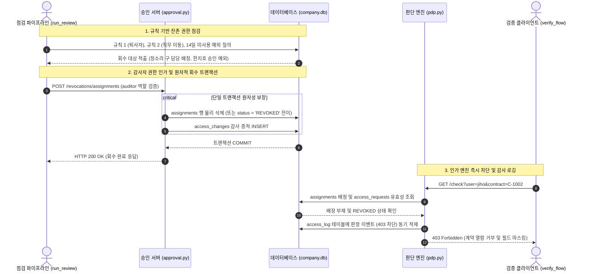

## 1. 개요 및 학습 개념 요약

정적 RBAC와 예외 요청 승인 파이프라인을 구축했으나, 권한 부여 이후의 수명주기 관리 부재로 인해 심각한 권한 잔존 결함이 발생했다.
특정 장애 대응을 위해 임시 승인된 예외 권한이나, 인사이동으로 인해 담당 업무가 변경된 직원의 기존 담당 데이터 접근 권한이 회수되지 않고 영구 방치되는 현상이다.

권한을 부여할 때는 정밀한 다단계 검증과 결재 절차를 거치지만, 회수 단계에서는 담당자의 수동 인지에만 의존하는 구조적 비대칭이 원인이었다.
영업 부서에서 회계 부서로 이동한 직원이 과거 영업 담당 고객의 상세 계약 정보를 여전히 조회하거나, 조치가 완료된 장애 대응용 일회성 예외 권한이 시스템에 무기한 잔존하여 최소 권한 원칙을 정면으로 위반했다.

본 실습에서는 권한 수명주기를 완결하기 위해 다섯 가지 핵심 엔지니어링 파이프라인을 설계하고 실증했다.
첫째, 시스템 내 분산된 모든 인가 근거를 통합 수집하여 전수 권한 상태를 가시화하는 현황 조회 인터페이스를 구현했다.
둘째, 퇴사자 및 역할-담당 불일치 데이터를 관계 대수 질의로 즉각 식별하는 2대 규칙 기반 점검 엔진을 수립했다.

셋째, PDP 인가 엔진의 판단 이벤트를 관계형 데이터베이스에 동기 적재하여 권한별 사용 빈도와 최종 접근 시점을 정량화했다.
넷째, 단순 물리 삭제의 감사 증적 누락 한계를 극복하기 위해 감사자 역할에 한정된 회수 권한 인가와 상태 전이 기반 원자적 회수 트랜잭션을 구현했다.
다섯째, 점검부터 회수, 거절 검증, 영향도 시뮬레이션까지 단일 실행 흐름으로 묶어내는 회귀 검증 파이프라인을 완결했다.

---

## 2. 전체 산출물 구조 및 진단/파이프라인 체계

권한 점검과 동적 회수는 점검 스크립트의 불일치 탐지, 감사자 역할 기반의 승인 서버 호출, 단일 트랜잭션 내 데이터 삭제 및 감사 증적 적재, PDP의 즉각적인 인가 차단이 유기적으로 맞물려 동작한다.
규칙 기반 점검부터 원자적 회수 트랜잭션, 인가 엔진 재검증으로 이어지는 컴포넌트 간 상호작용 시퀀스는 다음과 같다.



---

## 3. 기존 체계의 한계와 도전 과제: 정적 현황 조회의 사각지대와 감사 증적 없는 물리 삭제의 결함

이전 단계([c03-access-control-day03](/posts/c03-access-control-day03))까지 구축된 접근통제 체계는 개별 요청 시점에 사용자의 재직 여부, 정적 역할 권한, 담당 정보, 승인된 동적 예외를 결합하여 허용 여부를 정확히 판정했다.
그러나 이러한 판정은 특정 시점의 정적 조건만을 평가할 뿐, 부여된 권한이 시간이 흐름에 따라 유효성을 상실했는지는 전혀 감지하지 못했다.
결과적으로 영업 부서에서 회계 부서로 이동한 직원의 과거 담당 고객 권한이 그대로 유지되거나, 완료된 장애 대응용 예외 권한이 영구히 잔존하는 과다권한 누적 결함이 발생했다.

접근 현황표를 단순 조회하는 방식으로는 이 문제를 근본적으로 해결할 수 없었다.
현황표는 "현재 시점에 누구에게 접근이 허용되는가"라는 사실만을 나열할 뿐, "해당 사용자가 그 권한을 보유하는 것이 조직 규찰상 정당한가"라는 맥락적 타당성을 제공하지 못하기 때문이다.
또한 실제 해당 권한을 활발히 사용하고 있는지, 수개월간 단 한 번도 사용하지 않은 사장된 권한인지에 대한 런타임 사용 이력이 분리되어 있어 정량적 회수 판단이 불가능했다.

더욱 심각한 문제는 권한 제거 과정에서 나타났다.
초기 구현에서는 단순 데이터베이스 조작으로 담당 행을 삭제하는 방식을 취했으나, 이는 시스템에 치명적인 감사 증적 결손을 초래했다.

누가, 언제, 어떠한 업무적 근거로 특정 직원의 권한을 박탈했는지에 대한 기록이 전혀 남지 않아 침해 사고 발생 시 책임 추적성이 완전히 붕괴되었다.
동시에 권한 삭제 쿼리와 이력 기록 쿼리가 분리될 경우, 네트워크 단절이나 런타임 예외로 인해 권한만 박탈되고 이력이 유실되거나 그 반대로 동작하는 원자성 결함이 상존했다.

---

## 4. 엔지니어링 의사결정 및 리팩터링

### 4.1. 전수 접근 현황 도출과 정적 검증 한계 분석 (`list_access.py`)

시스템 내에 존재하는 모든 사용자와 계약 간의 접근 권한 상태를 단일 뷰로 도출하기 위해, PDP 인가 엔드포인트를 전수 순회하는 현황 수집 도구를 구현했다.
이 도구는 데이터베이스의 사용자 목록과 계약 목록을 읽은 뒤, 각 쌍에 대해 HTTP 질의를 전송하여 판정 결과와 허용 근거, 노출 대상 필드(제목, 금액)를 집계한다.

```python
# access_control/day04/data/list_access.py (핵심 인가 전수 순회 로직)
for contract_id, customer in contracts:
    for user_id, name in users:
        reply = requests.get(
            PDP_URL + "/check",
            params={"user": user_id, "contract": contract_id},
            timeout=3,
        )
        answer = reply.json()
        decision = answer["decision"]  # ALLOW 또는 DENY
        fields = received(answer) if decision == "ALLOW" else "-"
        print(f"  {name}  {decision}  {answer['reason']}  {fields}")
```

이 현황 조회를 통해 특정 계약을 조회할 수 있는 직원 명단과 근거가 정확히 출력되었다.
과거에는 `assignments` 테이블 하나만 확인하여 담당자가 아니면 배제했으나, 이제는 정적 역할 권한과 승인된 동적 예외까지 결합된 실제 허용 상태를 한눈에 확인할 수 있게 되었다.

그러나 이 도구는 "현재 허용 여부"라는 단면만 보여줄 뿐, 왜 이 권한이 아직 존재하는지, 또는 직무 변경 후에도 남아있는 불합리한 권한인지에 대해서는 답하지 못했다.
정소라가 회계팀으로 옮겨졌음에도 과거 B전자 담당 정보가 유지되어 여전히 B전자 계약의 제목과 금액을 모두 볼 수 있다는 모순이 가시화되었고, 이를 기계적으로 식별할 규칙의 필요성이 대두되었다.

### 4.2. 불일치 권한 탐지를 위한 규칙 기반 점검 쿼리 설계 (`review_access.py`)

인사 데이터와 인가 정책 간의 불일치를 자동으로 적출하기 위해 두 가지 명시적 점검 규칙을 관계 대수 질의로 공식화했다.
규칙 1은 재직 상태(`employed = 0`)가 아닌 퇴사자에게 남아있는 담당 배정 및 승인 예외를 추출하며, 규칙 2는 직무 변경으로 인해 담당 조회 권한이 박탈된 직원의 잔존 담당 배정을 식별한다.

```sql
-- [규칙 1] 퇴사자(employed = 0)의 잔존 배정 및 승인 예외 적출
SELECT users.name, assignments.customer
FROM assignments
JOIN users ON assignments.user_id = users.user_id
WHERE users.employed = 0;

-- [규칙 2] 안티 조인(LEFT JOIN ... IS NULL)을 통한 권한 불일치 담당 줄 적출
SELECT users.name, users.role, assignments.customer
FROM assignments
JOIN users ON assignments.user_id = users.user_id
LEFT JOIN permissions ON users.role = permissions.role
    AND permissions.action = 'view_assigned_contracts'
WHERE permissions.action IS NULL;
```

규칙 2의 핵심은 `LEFT JOIN`과 `IS NULL`을 결합한 안티 조인 패턴이다.
직원의 현재 역할이 `permissions` 테이블에서 `view_assigned_contracts`라는 권한 행을 보유하고 있는지 대조하고, 조인 결과가 `NULL`인 행만 선별함으로써 담당 업무가 배정되어서는 안 되는 역할(예: 회계팀, 감사팀)의 직원을 정확히 잡아낸다.

이 쿼리를 실행한 결과, 영업팀에서 회계팀(`account_admin`)으로 인사 발령이 난 정소라의 B전자 담당 배정이 즉각 추출되었다.
역할 테이블과 권한 테이블이 분리 정규화되어 있었기에([c03-access-control-day02](/posts/c03-access-control-day02)), 복잡한 애플리케이션 연산 없이 단일 SQL 질의만으로 정책 위반 대상을 결정론적으로 탐지할 수 있었다.

### 4.3. 접근 로그 데이터베이스 적재와 미사용 권한 분석 파이프라인 (`app/pdp.py`, `data/load_log.py`)

규칙만으로는 해결할 수 없는 영역이 존재했다.
한지호의 C-1002 승인 예외처럼, 데이터베이스 상으로는 여전히 유효한 재직자이고 정상 승인된 건이지만 실제 장애 대응 업무가 종료되어 더 이상 사용되지 않는 예외 권한이다.
이를 식별하기 위해서는 실제 인가 엔진의 호출 이력을 정량화해야 했다.

기존의 단순 파일 로그 기록 방식을 개편하여, PDP 서버가 인가 판단을 내릴 때마다 관계형 데이터베이스의 `access_log` 테이블에 동기식으로 기록하도록 엔진을 리팩터링했다.

```python
# access_control/day04/app/pdp.py (실시간 판정 이벤트의 access_log 동기 적재)
def log(user, contract_id, decision, reason):
    now = datetime.now(KST).strftime("%Y-%m-%d %H:%M:%S")
    with sqlite3.connect(DB_FILE) as connection:
        connection.execute(
            "INSERT INTO access_log (logged_at, user_id, contract_id, decision, reason) VALUES (?, ?, ?, ?, ?)",
            (now, user, contract_id, decision, reason)
        )
```

또한 기존 파일 시스템에 축적되어 있던 비정형 텍스트 로그(`pdp.log.1`)를 데이터베이스로 안전하게 마이그레이션하기 위해 `load_log.py`를 제작했다.
단순 삽입 시 발생할 수 있는 중복 적재를 방지하기 위해 복합 튜플(`logged_at, user_id, contract_id`)을 메모리 셋으로 구성하여 멱등 적재를 구현했다.

```python
# access_control/day04/data/load_log.py (복합키 튜플 대조를 통한 멱등 적재)
existing = set(con.execute("SELECT logged_at, user_id, contract_id FROM access_log"))
new_rows = [row for row in rows if (row[0], row[1], row[2]) not in existing]
con.executemany(
    "INSERT INTO access_log (logged_at, user_id, contract_id, decision, reason) VALUES (?, ?, ?, ?, ?)",
    new_rows
)
con.commit()
```

접근 기록이 정규화된 테이블로 수렴됨에 따라, SQL 집계 함수(`COUNT`, `MAX`)를 활용하여 각 승인 예외의 실제 활용도를 산출할 수 있게 되었다.
한지호의 1번 승인 예외는 최근 14일간 호출 횟수가 0회로 나타났고, 마지막 사용 시각이 과거 시점에 머물러 있음을 수치로 입증하여 회수 심사의 객관적 근거를 확보했다.

### 4.4. 감사 권한 격리와 원자적 회수 트랜잭션 엔진 구현 (`data/revoke_access.py`, `app/approval.py`)

권한 회수 단계에서 가장 경계해야 할 패턴은 데이터 무결성과 감사 증적을 고려하지 않은 무차별 물리 삭제였다.
초기 검증 코드(`delete_then_restore.py`)에서 확인된 바와 같이, 단순 `DELETE` 문은 실행 즉시 복구 불가능한 상태를 만들고 행위 주체와 사유를 소멸시킨다.

```python
# 1차 단순 물리 삭제 구현의 한계 (access_control/day04/data/delete_then_restore.py)
con.execute("DELETE FROM assignments WHERE user_id = 'sora' AND customer = 'B전자'")
con.commit()
# 결함: 누가, 언제, 왜 삭제했는지 기록이 전혀 남지 않아 감사 불가능
```

이를 해결하기 위해 `access_changes` 감사 테이블을 구축하고, 권한 회수를 수행하는 원자적 트랜잭션 함수를 구현했다.
회수 실행자(`actor_id`)가 실제로 `auditor` 역할을 맡고 있으며 `revoke_access` 권한을 보유하고 있는지 먼저 검증하도록 강제했다.

```python
# access_control/day04/data/revoke_access.py (단일 트랜잭션 원자적 회수)
con.execute("BEGIN")
# 감사자 권한(revoke_access) 검증 통과 후 단일 트랜잭션 내 원자적 실행
con.execute("DELETE FROM assignments WHERE user_id = ? AND customer = ?", (user_id, customer))
con.execute(
    "INSERT INTO access_changes (target_kind, target_key, action, actor_id, reason) VALUES ('assignment', ?, 'REVOKE', ?, ?)",
    (f"{user_id}/{customer}", actor_id, reason)
)
con.commit()  # 삭제와 감사 이력 적재가 단일 원자적 단위로 커밋
```

특히 승인 예외(`access_requests`) 회수에서는 물리 삭제 대신 소프트 회수 방식을 채택했다.
행을 삭제해 버리면 과거에 어떤 사유로 예외가 요청되고 승인되었는지에 대한 거버넌스 히스토리가 훼손되기 때문이다.
따라서 `status = 'REVOKED'`로 상태 머신 전이를 수행하고 이력을 남기도록 설계했다.

```python
# access_control/day04/data/revoke_access.py (승인 예외 상태 전이 소프트 회수)
con.execute("BEGIN")
con.execute("UPDATE access_requests SET status = 'REVOKED' WHERE request_id = ? AND status = 'APPROVED'", (request_id,))
con.execute(
    "INSERT INTO access_changes (target_kind, target_key, action, actor_id, reason) VALUES ('request', ?, 'REVOKE', ?, ?)",
    (str(request_id), actor_id, reason)
)
con.commit()
```

이 트랜잭션 로직을 HTTP 인터페이스로 개방하기 위해 승인 서버(`app/approval.py`)에 `/revocations/assignments` 및 `/revocations/requests` 엔드포인트를 증설했다.
비인가자의 접근은 HTTP 403(`NO_REVOKE_PERMISSION`), 존재하지 않는 대상은 404(`UNKNOWN_REQUEST`), 이미 회수되었거나 승인되지 않은 건은 409(`NOT_APPROVED`)로 엄격히 분기하여 예외를 완벽히 격리했다.

### 4.5. 정기 점검 자동화 파이프라인과 인사이동 시뮬레이션 (`data/run_review.py`, `data/what_if.py`)

개별적으로 구축된 점검 질의, 회수 API, 접근 제어 재검증, 사용 이력 분석, 변경 보고 단계를 단일 오케스트레이션 파이프라인(`run_review.py`)으로 통합했다.
스크립트를 구동하면 1단계에서 규칙 2 위반 행을 탐지하고, 2단계에서 승인 서버 회수 엔드포인트를 호출하며, 3단계에서 PDP에 재질의하여 즉각적인 403 차단을 확인하고, 4~5단계에서 사용 통계와 감사 이력을 최종 출력한다.

나아가 향후 발생할 인사이동의 파급 효과를 사전 검증하기 위해 `what_if.py` 시뮬레이터를 개발했다.
데이터베이스에 영구 반영을 가하지 않고 런타임 반응을 관찰하기 위해 파이썬의 `try...finally` 구조를 채택했다.
영업팀 김민수가 회계팀으로 발령받는 상황을 데이터베이스에 임시 반영한 뒤, 점검 엔진과 자동 회귀 검사기가 어떻게 반응하는지 확인하고 `finally` 블록에서 즉시 원상 복구한다.

```python
# access_control/day04/data/what_if.py (try...finally 무격리 롤백 시뮬레이션)
con = sqlite3.connect(DB_FILE)
try:
    con.execute("UPDATE users SET role = 'account_admin' WHERE user_id = 'minsu'")
    con.commit()
    print("김민수가 회계로 옮겼다면:")
    review(con)  # 규칙 2: [김민수/B전자, 김민수/C상사] 불일치 적출
    verify()     # 회귀 검사: C-1002 FAIL (금액만 노출되어 기대 불일치 감지)
finally:
    # 어떤 예외가 발생해도 반드시 원래 상태로 원복
    con.execute("UPDATE users SET role = 'sales' WHERE user_id = 'minsu'")
    con.commit()
    con.close()
```

이 시뮬레이션을 통해 점검 질의(`review`)는 "있어서는 안 되는 권한(규칙 2 위반)"을 적출하여 회수 후보를 식별했고, 자동 검사(`verify`)는 "기존 정책 기대치와 달라진 반환 필드(FAIL)"를 검출하여 정책 동기화 필요성을 알렸다.
두 도구가 상호보완적으로 동작하여 데이터베이스 상태를 안전하게 보호할 수 있음을 입증했다.

---

## 5. 검증 및 회고

### 5.1. 대표 시나리오 단언문 검증 및 무결성 실증 (`data/verify_flow.py`)

정소라의 B전자 담당 배정 회수와 한지호의 C-1002 승인 예외 회수를 완결한 뒤, 전체 8개 사용자-계약 조합에 대해 엔드투엔드 회귀 검증을 수행했다.
검증 기준은 HTTP 응답 코드 일치와 JSON 본문의 노출 필드 키 셋 일치다.

```python
# access_control/day04/data/verify_flow.py (회수 후 대표 시나리오 단언 검증)
cases = [
    ("jiho", "C-1002", 403, {"result", "reason"}),           # 예외 회수로 즉각 403 차단
    ("jiho", "C-1003", 200, {"result", "title", "amount"}),  # 기존 담당 계약 정상 유지
    ("sora", "C-1001", 200, {"result", "amount"}),          # 담당 회수 후 회계 권한(금액만) 유지
    ("sora", "C-1003", 200, {"result", "amount"}),          # 회계 권한 정상 인가
    ("minsu", "C-1002", 200, {"result", "title", "amount"}), # 기존 영업 담당 유지
    ("hana", "C-1002", 403, {"result", "reason"}),           # 감사팀 타 부서 계약 차단
]
for user, contract_id, expected_status, expected_fields in cases:
    reply = requests.get(PEP_URL + "/document", params={"user": user, "contract": contract_id}, timeout=3)
    assert reply.status_code == expected_status and set(reply.json()) == expected_fields
```

검증 결과는 다음과 같이 완벽한 격리를 실증했다.

```text
PASS jiho C-1002 403
PASS jiho C-1001 403
PASS jiho C-1003 200
PASS sora C-1001 200
PASS sora C-1003 200
PASS minsu C-1002 200
PASS jiyeon C-1003 200
PASS hana C-1002 403
```

한지호의 C-1002 요청은 예외가 소프트 회수됨에 따라 즉각 403으로 차단되었고, 원래 담당하던 C-1003은 정상적으로 제목과 금액이 모두 인가되었다.
정소라는 B전자 담당이 회수되었으나 회계팀 역할에 따른 `view_all_amounts` 권한이 유효하여, C-1001과 C-1003에 대해 제목이 은닉되고 오직 금액 필드만 정확히 반환되는 동적 필드 마스킹 무결성을 유지했다.
김민수, 박지연, 이하나는 이번 회수 작업의 영향을 전혀 받지 않고 기존 인가 상태를 견고히 유지했다.

동시에 비정상 회수 시도 검증(`invalid_revocations.py`)을 통해 감사 권한이 없는 박지연의 요청은 403 `NO_REVOKE_PERMISSION`, 존재하지 않는 99번 요청은 404 `UNKNOWN_REQUEST`, 이미 회수된 요청에 대한 중복 회수는 409 `NOT_APPROVED`로 차단됨을 확인했다.

### 5.2. 현실적 회고 및 교훈

접근통제 체계에서 권한을 부여하는 것보다 적시에 회수하는 것이 훨씬 높은 시스템 복잡성을 요구한다는 기술적 결론을 도출했다.
승인은 사용자의 명시적 요청과 결재자의 단일 행위로 완료되지만, 회수는 직무 이동, 계약 만료, 업무 종료 등 다양한 외부 비즈니스 이벤트와 상태 불일치를 지속적으로 감시해야 하기 때문이다.

단순 `DELETE` 연산에 의존하던 1차 접근은 감사 증적을 상실시키고 롤백을 불가능하게 만드는 안티패턴임을 실증했다.
감사자 역할 기반의 인가 제약, 상태 머신 전이를 통한 소프트 회수, 단일 트랜잭션 내 이력 강제화를 적용함으로써 분산 인가 환경에서도 데이터 무결성과 규정 준수 요건을 동시에 충족할 수 있었다.

또한 정적 현황표와 동적 감사 로그가 결합되어야만 비로소 권한의 유효성을 판단할 수 있다는 점을 규명했다.
다만 현재의 수동 점검 파이프라인은 여전히 감사자의 주기적 실행에 의존하므로, 향후 예외 요청 생성 시점에 만료 시한(TTL)을 필수로 지정하여 기한 경과 시 PDP 엔진이 자동으로 차단하는 시간 기반 접근통제 메커니즘으로 고도화해야 할 필요성을 도출했다.
