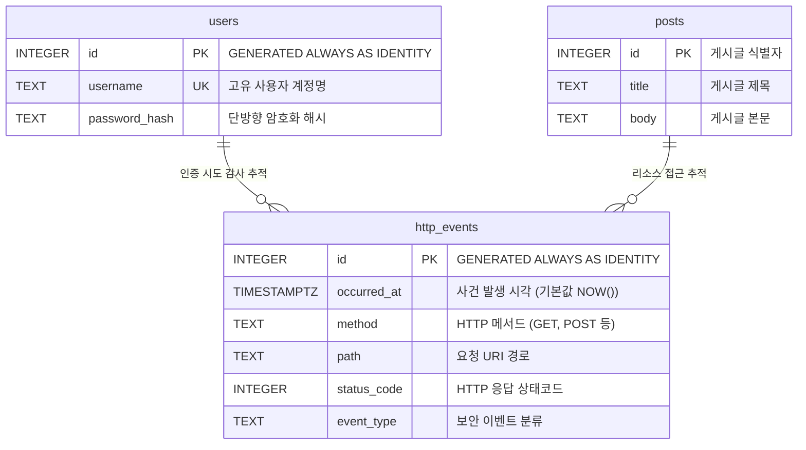

## 1. 개요 및 학습 개념 요약

보안 관제 파이프라인의 핵심은 애플리케이션 계층에서 발생하는 보안 사건을 누락 없이 식별하고 감사 증적을 영속화하는 데 있다.
1일차 실습(협업 환경 구성 및 단순 프록시 중계)은 표준 출력 로깅에 그쳐 독립 아티클로 분리하기보다, RDBMS 영속화와 상태코드 분류 엔진을 확립한 이번 2일차 엔지니어링 과정에 통합하여 전개 과정을 완성했다.

> 프로세스 재시작 시 휘발되는 표준 출력(`stdout`) 프로토타입의 한계를 진단하고, 관계형 데이터베이스(`http_events`) 기반의 영속 적재 파이프라인으로 전환한다.

실제 프로덕션 환경의 침해 사고 대응 체계는 이벤트 발생 시점, HTTP 메서드, 요청 경로, 응답 상태코드, 그리고 보안 도메인별 이벤트 분류(`event_type`)를 엄격한 스키마로 강제해야 한다.
이번 엔지니어링 과정에서는 PostgreSQL 데이터베이스를 연동하여 감사 이벤트 전용 테이블(`http_events`)을 설계하고, 웹 서비스와 독립된 관제 수집 백엔드를 구축했다.

일반 서비스 계층에서는 로그인 요청 실패와 비정상 엔드포인트 접근을 포착하여 관제 백엔드로 비동기 전송할 수 있는 기반을 다졌다.
또한 사용자 인증 체계의 보안성을 보장하기 위해 단방향 해시 알고리즘을 적용하고, 데이터베이스 접근 시 SQL 주입 공격을 원천 차단하는 파라미터화 쿼리 패턴을 적용했다.

## 2. 전체 산출물 구조 및 진단/파이프라인 체계

감사 이벤트 영속화 파이프라인은 일반 웹 서비스(`general`)와 관제 수집 백엔드(`monitor/backend`), 그리고 중앙 관계형 데이터베이스(`PostgreSQL`) 간의 데이터 흐름 및 테이블 모델로 구성된다.



## 3. 기존 체계의 한계와 도전 과제: 인메모리 표준 출력의 휘발성과 감사 증적 부재

초기 프로토타입 환경에서는 웹 프록시 계층이 업스트림 요청을 중계한 뒤 파이썬 표준 라이브러리의 `print(json.dumps(event))` 구문을 활용해 콘솔 화면에 감사 로그를 직렬화하여 출력하는 방식에 머물렀다.
이러한 표준 출력 기반 로깅은 터미널 버퍼에만 의존하므로 호스트 데몬 재시작, 파이프라인 크래시, 터미널 세션 종료 시점에 모든 감사 증적이 휘발되는 치명적인 데이터 유실 결함을 내포한다.
동시에 파이프 기반 로그 수집기가 결합되지 않은 상태에서는 과거 시점의 로그인 실패 이력이나 특정 IP 대역의 요청 패턴을 역추적할 수 있는 인덱싱 쿼리 자체가 불가능했다.

일반 서비스 애플리케이션의 메모리 내 딕셔너리나 전역 리스트(`POSTS`, `events = []`)에 감사 로그를 임시 적재하는 구조는 단일 프로세스 컨텍스트에 갇혀 다중 워커 프로세스 환경에서 데이터 동기화가 성립하지 않는다.
운영체제 메모리 점유율이 지속적으로 증가하여 OOM 장애를 유발할 위험이 높았고, 악의적인 사용자가 다량의 무차별 대입 공격을 시도할 경우 서비스 전체가 응답 불능에 빠지는 취약점이 노출되었다.

감사 증적의 무결성과 영속성을 보장하기 위해서는 표준 출력을 걷어내야 했다.
타임존이 보정된 시계열 데이터 저장소와 트랜잭션 무결성을 보장하는 관계형 스키마 격리가 필수적이었다.

## 4. 엔지니어링 의사결정 및 리팩터링

### 4.1. 관제 이벤트 스키마 분리와 관계형 영속화 테이블 설계

보안 감사 데이터의 무결성을 보장하기 위해 데이터베이스 수준에서 시계열 타임스탬프와 강타입 컬럼을 정의하는 전용 테이블을 구축했다.
감사 로그는 애플리케이션 서버의 시계 오차나 로컬 타임존 왜곡으로 인해 사건 발생 순서가 뒤바뀌는 현상을 방지해야 하므로 `TIMESTAMPTZ` 타입을 채택하고 기본값으로 `NOW()`를 지정했다.
식별자 컬럼에는 PostgreSQL 표준인 `GENERATED ALWAYS AS IDENTITY`를 적용하여 시퀀스 조작이나 외부 임의 주입을 물리적으로 차단했다.

```sql
CREATE TABLE http_events (
    id INTEGER GENERATED ALWAYS AS IDENTITY PRIMARY KEY,
    occurred_at TIMESTAMPTZ NOT NULL DEFAULT NOW(),
    method TEXT NOT NULL,
    path TEXT NOT NULL,
    status_code INTEGER NOT NULL,
    event_type TEXT NOT NULL
);
```

이 설계는 비정형 텍스트 로그 파일과 달리 SQL 기반의 집계 함수(`COUNT`, `GROUP BY`) 및 범위 조건 검색(`WHERE occurred_at >= ...`)을 가능하게 만든다.
수집되는 모든 요청은 단순 HTTP 통계를 넘어 보안 도메인 관점의 `event_type` 컬럼을 필수(`NOT NULL`)로 요구하도록 제약 조건을 부여했다.
이로써 파싱 에러 없는 결정론적 이상 징후 분석 기반을 데이터베이스 레이어에서 확립했다.

### 4.2. 안전한 데이터베이스 커넥션 라이프사이클과 바인딩 매개변수 적용

감사 이벤트가 유입될 때마다 데이터베이스 커넥션 풀의 고갈을 방지하고 트랜잭션 경계를 명확히 통제하기 위해 컨텍스트 매니저 기반의 커넥션 관리 함수를 모듈화했다.
`psycopg` 라이브러리의 최신 커넥션 규격을 적용하여 연결 타임아웃을 3초로 강제하고, 딕셔너리 기반 행 팩토리(`dict_row`)를 설정하여 비즈니스 로직과의 인터페이스 정합성을 확보했다.
또한 SQL 구문 작성 시 문자열 포맷팅(`f-string`, `%`)을 전면 금지하고 데이터베이스 드라이버의 위치 기반 플레이스홀더(`%s`)를 사용하여 SQL 인젝션을 원천 차단했다.

```python
with connect_db() as conn:
    event = conn.execute(
        """INSERT INTO http_events (method, path, status_code, event_type)
           VALUES (%s, %s, %s, %s) RETURNING id""",
        ("GET", "/posts/1", 200, "http_request"),
    ).fetchone()
    row = conn.execute(
        "SELECT id, method, path, status_code, event_type FROM http_events WHERE id = %s",
        (event["id"],),
    ).fetchone()
```

`RETURNING id` 절을 활용하여 데이터베이스에 삽입된 직후의 레코드 식별자를 단일 라운드트립으로 회수하도록 구현했다.
`with connect_db() as conn` 블록은 내부 연산이 정상 종료되면 변경 사항을 자동으로 커밋(`COMMIT`)하고 연결 객체를 회수하며, 예외 발생 시에는 즉시 롤백(`ROLLBACK`)을 수행한다.
이러한 라이프사이클 격리는 트랜잭션 누수와 데드락 발생 가능성을 최소화하고 고빈도 감사 로그 유입 시 데이터 무결성을 유지한다.

### 4.3. 상태코드 기반 보안 이벤트 분류 엔진과 관제 백엔드 격리

관제 백엔드 애플리케이션(`monitor/backend/app.py`)은 수신된 원시 HTTP 메타데이터를 검증하고 보안 이벤트 도메인으로 사상하는 검증 엔진(`make_event`)을 독립시켰다.
외부 입력 데이터의 타입, 허용된 HTTP 메서드 목록, 경로 길이 및 상태코드 유효 범위를 엄격하게 단언한 뒤, 비정상적인 페이로드는 데이터베이스 적재 전 즉시 거부(`400 Bad Request`)하도록 방어 로직을 구성했다.
특히 인증 엔드포인트(`/auth/login`)에서 발생하는 응답 상태코드를 기준으로 일반 요청과 보안 감사 이벤트를 분기했다.

```python
def make_event(data):
    if not isinstance(data, dict):
        return None
    method, path, status = data.get("method"), data.get("path"), data.get("status_code")
    if method not in {"GET", "POST", "PUT", "PATCH", "DELETE", "HEAD", "OPTIONS"}:
        return None
    if not isinstance(path, str) or not path.startswith("/") or len(path) > 500:
        return None
    if type(status) is not int or not 100 <= status <= 599:
        return None

    if method == "POST" and path == "/auth/login" and status == 200:
        event_type = "login_success"
    elif method == "POST" and path == "/auth/login" and status == 401:
        event_type = "login_failure"
    else:
        event_type = "http_request"
    return {"method": method, "path": path, "status_code": status, "event_type": event_type}
```

이 분류 로직을 통해 비밀번호 미입력으로 인한 요청 거부(`400`)나 존재하지 않는 게시글 조회(`404`)는 일반 트래픽인 `http_request`로 분류된다.
반면 동일한 인증 엔드포인트에서 자격 증명 불일치로 발생한 `401 Unauthorized` 응답은 침해 징후의 단서가 되는 `login_failure`로 정밀 태깅된다.
관제 서버는 이 분류 결과를 바탕으로 영속화 테이블에 레코드를 적재하므로, 향후 SIEM이나 보안 대시보드에서 무차별 대입 공격을 단일 쿼리로 격리 필터링할 수 있다.

### 4.4. 단방향 비밀번호 해싱과 보안 이벤트 조회 API

인증 시스템의 자격 증명 탈취 공격을 방어하기 위해 일반 서비스 데이터베이스에는 평문 비밀번호 저장을 영구 금지하고 솔트가 결합된 단방향 암호화 해시 알고리즘을 적용했다.
사용자 생성 스크립트(`create_user.py`)는 `generate_password_hash`를 통해 고엔트로피 솔트와 해시 다이제스트를 결합하여 저장한다.
로그인 검증 시에는 `check_password_hash`를 활용하여 타이밍 공격에 안전한 상수 시간 비교를 수행하도록 설계했다.

또한 관제 백엔드에는 적재된 보안 이벤트를 외부 보안 담당자가 필터링할 수 있는 REST API 엔드포인트(`GET /api/events`)를 구현했다.
이 엔드포인트는 저장소에 적재된 감사 로그를 조회하는 공식 관제 창구 역할을 담당한다.

```python
@app.get("/api/events")
def get_events():
    event_type = request.args.get("event_type")
    allowed = {"login_success", "login_failure", "http_request"}
    if event_type is not None and event_type not in allowed:
        return {"error": "지원하지 않는 이벤트 종류입니다."}, 400

    try:
        with connect_db() as conn:
            query = "SELECT * FROM http_events ORDER BY id DESC LIMIT 50"
            params = ()
            if event_type is not None:
                query = "SELECT * FROM http_events WHERE event_type = %s ORDER BY id DESC LIMIT 50"
                params = (event_type,)
            rows = conn.execute(query, params).fetchall()
    except psycopg.Error:
        return {"error": "감시 기록을 조회할 수 없습니다."}, 503
```

API 조회 시 메모리 과부하를 방지하기 위해 최신 50건으로 조회를 제한하는 윈도우 쿼리(`ORDER BY id DESC LIMIT 50`)를 강제했다.
`event_type` 쿼리 파라미터를 허용 화이트리스트와 대조 검증하여 악의적인 쿼리 주입을 사전에 차단하고, 타임스탬프 필드는 직렬화 표준인 ISO 8601 문자열로 변환하여 반환하도록 구성했다.
이로써 관제 담당자는 전체 트래픽 속에서 `login_failure` 사건만을 분리 추출하여 실시간 침해 징후를 모니터링할 수 있는 감사 조회 체계를 완성했다.

## 5. 검증 및 회고

### 5.1. 대표 시나리오 동작 검증

완성된 이벤트 적재 파이프라인의 종단간 정합성을 검증하기 위해 일반 서비스로 4가지 대표 시나리오 요청을 발송하는 클라이언트 스크립트(`try_events.py`)를 구동했다.
테스트는 잘못된 자격 증명을 이용한 로그인 실패(`401`), 정상 자격 증명을 이용한 로그인 성공(`200`), 존재하는 게시글 조회(`200`), 존재하지 않는 임의 게시글 조회(`404`) 순서로 실행되었다.
일반 서비스의 후처리 훅(`@app.after_request`)은 각 응답 상태코드를 수집하여 관제 백엔드로 전송했으며, 관제 백엔드는 유효성 검증 후 데이터베이스에 정상 적재했다.

```text
POST /auth/login (Wrong123!) -> 401 Unauthorized -> event_type: login_failure 적재 완료
POST /auth/login (Learn123!) -> 200 OK           -> event_type: login_success 적재 완료
GET  /posts/1                -> 200 OK           -> event_type: http_request  적재 완료
GET  /posts/999              -> 404 Not Found    -> event_type: http_request  적재 완료
```

적재된 감사 레코드를 검증하기 위해 데이터베이스 질의(`SELECT * FROM http_events ORDER BY id DESC LIMIT 10`)를 수행한 결과, 최신 역순으로 모든 이벤트가 유실 없이 저장되었음을 확인했다.
특히 관제 백엔드 데몬을 재시작한 이후에도 동일한 조회를 실행했을 때 기존 레코드가 그대로 보존되어 인메모리 방식의 휘발성 문제가 완전히 해결되었음을 실증했다.

### 5.2. 현실적 회고 및 교훈

기존의 단순 표준 출력 로깅에서 관계형 데이터베이스 기반 영속화로 전환하면서, 관제 데이터의 생명주기와 시스템 결합도에 대한 중요한 엔지니어링 기준을 도출했다.
일반 서비스에서 관제 백엔드로 감사 이벤트를 동기 HTTP 요청(`requests.post`)으로 전송하는 현재의 구조는 관제 서버에 장애가 발생하거나 지연이 생길 경우 주 서비스의 응답 지연으로 전파될 위험이 존재한다.
코드 레벨에서는 `timeout=0.5` 설정과 예외 포획 블록을 통해 일반 비즈니스 로직의 실패를 방어했으나, 트래픽 폭증 상황에서는 메시지 브로커를 활용한 비동기 버퍼링 계층의 필요성을 확인했다.

또한 데이터베이스 단에서 `ORDER BY id DESC LIMIT 50`과 같은 윈도우 쿼리를 안전하게 수행하려면 데이터 누적에 따른 인덱스 설계가 선행되어야 함을 확인했다.
단순 기본키 역순 조회는 클러스터 인덱스를 활용하지만, `event_type`과 `occurred_at` 복합 조건 검색이 빈번해지는 대규모 환경에서는 복합 B-Tree 인덱스 구축이 성능 병목을 예방하는 필수 요건임을 규명했다.
결과적으로 표준 출력의 휘발성을 걷어내고 관계형 스키마와 분류 엔진을 구축함으로써 프로덕션 레벨 이상탐지 파이프라인의 기초 골격을 완결했다.
