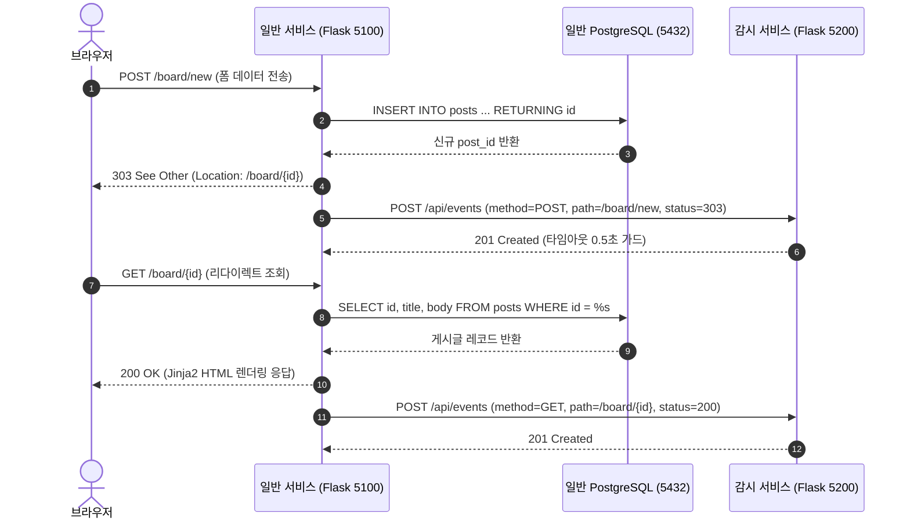

## 1. 개요 및 학습 개념 요약

보안 관제 및 이상탐지 시스템을 검증하려면 먼저 관측 대상이 되는 실제 웹 애플리케이션의 트래픽 원천이 준비되어야 한다. 2일차까지는 터미널과 스크립트 기반의 JSON API 수준에서 로그인 검증과 단일 조회를 다루었으나, 3일차 실습에서는 브라우저 사용자의 실제 인터랙션을 모사하는 웹 표면을 구축했다.

일반 서비스에 HTML 화면과 게시글 작성·조회·수정·삭제를 수행하는 Jinja2 템플릿 기반 서버 사이드 렌더링(SSR) 체계를 구현했다. 이 과정에서 일반 비즈니스 트래픽을 관제 시스템으로 중계하기 위해 플라스크 요청 수명주기를 활용한 4단계 코드 정돈을 병행했다.

- **사용자 행동 표면과 입력값 정제 (`mini-watch/day03/general/post_rules.py`)**: 게시글 작성과 수정 폼에서 제목과 본문의 공백을 검사하고 필수 입력을 강제하는 검증 로직 구현.
- **데이터베이스 실행 쿼리 함수 분리 (`mini-watch/day03/general/repositories/posts.py`)**: 단일 파일에 인라인으로 뒤섞이던 SQL 질의를 전용 모듈로 모아 라우트 핸들러의 데이터베이스 결합 완화.
- **Flask Blueprint 라우팅 모듈화 (`mini-watch/day03/general/routes/posts.py`)**: 게시판 엔드포인트를 블루프린트로 묶고 폼 중복 제출을 차단하는 PRG(Post-Redirect-Get) 패턴 적용.
- **비침투적 감사 로깅 수명주기 훅 격리 (`mini-watch/day03/general/request_logging.py`)**: `@app.after_request` 훅을 활용하여 비즈니스 라우트 수정 없이 감사 이벤트를 감시 서버로 중계하는 모듈 추출.

> 핵심 목표는 관제 대상이 될 웹 서비스의 CRUD 동작 모델을 완성하면서 비즈니스 코드와 감사 로깅 경로의 관심사를 분리하고 동기 네트워크 전송이 내포한 트레이드오프를 규명하는 데 있다.

---

## 2. 전체 산출물 구조 및 진단/파이프라인 체계

일반 서비스(5100 포트)는 브라우저로부터 폼 입력을 받아 PostgreSQL에 저장하고 Jinja2 템플릿으로 응답을 렌더링한다. 모든 HTTP 요청 수명주기가 완료되는 시점에는 `@app.after_request` 훅이 구동되어 감시 서비스(5200 포트)로 감사 로그를 중계한다.

브라우저에서 게시글을 작성하고 상세 화면으로 이동할 때 발생하는 HTTP 요청, 데이터베이스 영속화, 그리고 감시 백엔드 간의 상호작용 흐름은 다음과 같다.



---

## 3. 기존 체계의 한계와 도전 과제: 단일 파일 내 뷰 처리와 감사 로깅 혼재에 따른 병목

초기 구현에서는 단일 `mini-watch/day03/general/app.py` 스크립트 안에 템플릿 렌더링, 데이터베이스 질의, 입력 검증, 원격 로깅 호출이 직렬로 누적되었다. 화면 수가 늘어나고 작성·수정·삭제 폼이 추가되면서 진입점 파일의 복잡도가 급격히 상승했다.

가장 두드러진 결함은 폼 제출 후 브라우저 새로고침 시 동일한 데이터가 중복 삽입되는 문제였다. 단순 렌더링으로 폼 제출 결과를 반환하면, 사용자가 새로고침을 누를 때 브라우저가 직전의 POST 요청을 재전송하여 데이터베이스에 중복 레코드가 쌓이고 감사 로그에도 불필요한 이벤트가 연쇄 발생했다.

동시에 각 엔드포인트마다 인라인 SQL 질의와 연결 관리가 얽혀 있어 비즈니스 흐름을 파악하기 어려웠다. 특히 감시 서버로 이벤트를 전송하는 네트워크 코드가 라우트 내부나 진입점 중심에 흩어져 있으면, 로깅 정책 변경 시 전체 웹 서비스 코드를 수정해야 하는 구조적 결함으로 이어졌다.

---

## 4. 엔지니어링 의사결정 및 리팩터링

관제 대상 서비스의 안정성을 확보하고 로깅 경로를 정돈하기 위해 폼 수명주기 통제, 파일 분리, 비침투적 로깅 훅 구축을 순차적으로 진행했다.

### 4.1. 사용자 행동 표면 구성과 PRG 패턴 적용

게시글 생성과 수정 폼에서 발생할 수 있는 중복 제출을 차단하기 위해 PRG(Post-Redirect-Get) 패턴을 도입했다. 데이터를 처리한 뒤 즉시 HTML을 반환하지 않고 브라우저를 상세 조회 주소로 리다이렉트시켰다.

```python
# mini-watch/day03/general/routes/posts.py
@posts_bp.route("/board/new", methods=["GET", "POST"])
def new_post():
    if request.method == "GET":
        return render_template("new.html", title="", body="", error=None)

    title, body, error = validate_post(
        request.form.get("title", ""), request.form.get("body", "")
    )
    if error:
        return render_template("new.html", title=title, body=body, error=error), 400

    post = create_post(title, body)
    return redirect(f"/board/{post['id']}", code=303)
```

리다이렉트 응답 코드는 전통적인 302 대신 HTTP 1.1 표준인 `303 See Other`를 명시했다. 303 상태 코드는 직전 요청의 메서드와 상관없이 브라우저가 반드시 GET 메서드로 후속 요청을 보내도록 규정하므로 중복 INSERT 사고를 결정론적으로 방지한다.

입력 검증은 `mini-watch/day03/general/post_rules.py`의 `validate_post` 함수로 일원화했다. 원시 입력값의 앞뒤 공백을 정제하고 누락 여부를 판단하여, 공백만 입력된 불량 요청에 대해 데이터베이스 접근 전에 400 Bad Request를 반환하도록 방어했다.

### 4.2. 라우트 핸들러와 데이터베이스 실행 코드의 모듈 분리

단일 파일에 인라인으로 포함되어 있던 데이터베이스 조작 로직을 `mini-watch/day03/general/repositories/posts.py` 모듈로 분리했다. 라우트 핸들러가 SQL 문법이나 커넥션 수명주기를 직접 제어하지 않도록 물리적 경계를 설정했다.

```python
# mini-watch/day03/general/repositories/posts.py
from db import connect_db

def create_post(title, body):
    with connect_db() as conn:
        return conn.execute(
            "INSERT INTO posts (title, body) VALUES (%s, %s) RETURNING id",
            (title, body),
        ).fetchone()

def update_post(post_id, title, body):
    with connect_db() as conn:
        return conn.execute(
            "UPDATE posts SET title = %s, body = %s WHERE id = %s RETURNING id",
            (title, body, post_id),
        ).fetchone()
```

모든 질의 함수는 `with connect_db() as conn:` 블록 내부에서 실행되어 예외가 없으면 정상 커밋되고 작업 종료 시 커넥션을 닫는다.

라우트 핸들러는 단순 함수 호출을 통해 결과 딕셔너리만을 수신한다. 이로써 `mini-watch/day03/general/routes/posts.py`는 오직 HTTP 요청 해석, 입력 검증 호출, 템플릿 렌더링이라는 웹 프레젠테이션 역할에만 집중하게 되었다.

### 4.3. 수명주기 훅을 활용한 비침투적 관제 로깅 추출

개별 비즈니스 엔드포인트에 로깅 코드를 삽입하지 않고 플라스크의 수명주기 훅인 `@app.after_request`를 활용하여 `mini-watch/day03/general/request_logging.py`로 격리했다.

```python
# mini-watch/day03/general/request_logging.py
import json, requests
from flask import request

MONITOR_URL = "http://127.0.0.1:5200/api/events"

def init_request_logging(app, monitor_url=MONITOR_URL):
    @app.after_request
    def record_request(response):
        event = {
            "method": request.method,
            "path": request.path,
            "status_code": response.status_code,
        }
        print(json.dumps(event, ensure_ascii=False), flush=True)
        try:
            result = requests.post(monitor_url, json=event, timeout=0.5)
            result.raise_for_status()
        except requests.RequestException:
            app.logger.warning("감시 서비스에 요청 기록을 보내지 못했습니다.")
        return response
```

팩토리 함수 `init_request_logging` 구조를 적용하여 플라스크 앱 인스턴스에 로거를 등록했다. 비즈니스 라우트는 감시 서버의 존재나 엔드포인트를 전혀 알 필요가 없다.

응답이 클라이언트로 전송되기 직전의 표준 수명주기에서 `method`, `path`, `status_code` 메타데이터만을 추출함으로써 비즈니스 로직을 전혀 훼손하지 않는 비침투적 관제 파이프라인을 구축했다.

### 4.4. 안전 실패 처리와 동기 HTTP 로깅의 구조적 한계

원격 감시 서버가 다운되거나 네트워크 지연이 발생할 때 일반 서비스의 가용성을 보호하기 위해 `timeout=0.5`와 `requests.RequestException` 예외 포획을 구성했다. 감시 서비스 전송 실패 시 경고 로그만 남기고 원래의 HTTP 응답을 반환하는 안전 실패를 달성했다.

> 그러나 이 동기 HTTP 전송 방식은 구조적인 성능 병목과 서비스 거부 취약점을 내포한다.

플라스크의 단일 워커 환경에서 매 요청마다 외부 HTTP 호출이 동기 블로킹 방식으로 실행된다. 감시 서버가 다운되어 매번 0.5초의 타임아웃이 발생하면, 동시 요청이 몰릴 때 웹 워커 풀 전체가 대기 상태에 빠져 일반 사용자의 정상 요청까지 지연되는 취약점이 존재한다. 미니프로젝트 단계에서는 구현 단순성을 위해 채택했으나 실무 환경에서는 반드시 개선되어야 할 트레이드오프다.

---

## 5. 검증 및 회고

### 5.1. 12개 시나리오 통합 검증과 감사 로그 중계 확인

모듈화와 로깅 분리 이후 기존 비즈니스 로직과 관제 파이프라인이 온전히 작동하는지 플라스크 내장 테스트 클라이언트(`mini-watch/day03/general/test_posts_crud.py`)로 검증했다.

1. **목록 및 폼 렌더링 (`GET /`, `GET /board/new`)**: 메인 목록 HTML 및 글쓰기 폼 정상 응답(200 OK) 확인.
2. **입력 유효성 방어 (`POST /board/new`)**: 공백 문자열 입력 시 400 Bad Request 및 에러 문구 렌더링 확인.
3. **신규 생성 및 303 리다이렉트 (`POST /board/new`)**: DB 삽입 성공 후 `Location: /board/{id}` 303 응답 확인.
4. **상세 조회 및 수정·삭제 라이프사이클 (`GET /board/{id}`, `POST edit/delete`)**: 상세 데이터 표출, 수정 폼 pre-fill, 삭제 후 DB 제거 및 루트 경로 303 이동 확인.
5. **삭제 후 404 차단**: 삭제된 게시글 ID로의 후속 접근 시 404 Not Found 정상 반환 확인.
6. **감사 로깅 연동**: 모든 테스트 요청에 대해 `@app.after_request` 훅이 트리거되어 콘솔 출력 및 감시 서버로의 이벤트 전송 무결성 확인.

### 5.2. 현실적 회고 및 교훈

기초 웹 프로그래밍 실습을 진행하며 뷰 템플릿과 폼 처리를 구축하는 동시에, 이를 관제 시스템의 트래픽 원천으로 바라보는 관점의 전환을 실증했다. 폼 제출 시 브라우저 동작 특성을 고려하여 PRG 패턴을 적용하고 303 상태 코드로 중복 제출을 차단한 결정은 웹 표준 라이프사이클에 기반한 필수 조치였다.

가장 중요한 아키텍처적 결론은 감사 로깅 방식의 트레이드오프 규명에 있다. `@app.after_request` 훅을 사용한 비침투적 추출은 비즈니스 코드 격리 측면에서 유효했으나, 동기 `requests.post()` 호출은 감시 서버 장애 시 워커 블로킹을 유발할 수 있는 명백한 한계를 드러냈다.

프로덕션 수준의 관제 인프라라면 웹 애플리케이션 수명주기 내부에서 직접 HTTP를 호출하지 않고 표준 로그 파일이나 메모리 큐에 기록한 뒤 비동기 수집 에이전트(Fluentbit, Filebeat)가 전송하는 파이프라인으로 전환해야 한다는 기술적 결론을 도출했다.
