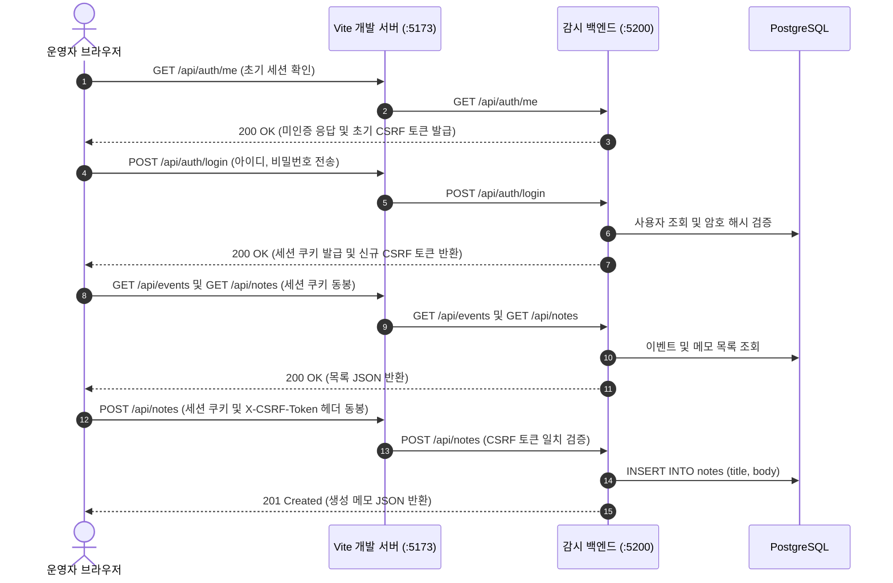

# React 컴포넌트 분리와 Vite 프록시 연동 — Flask API 통신과 CRUD 인터페이스 구현

## 1. 개요 및 학습 개념 요약

이전 실습에서는 Flask와 Jinja2 템플릿 엔진을 활용하여 서버가 HTML을 직접 렌더링하는 웹 애플리케이션을 구현했다.
이 구조는 [day03 포스트](/security-agent-toolkit/blog/c04-mini-watch-day03/)에서 다루었듯이 모든 화면 전환과 데이터 처리가 Flask 요청 수명주기 안에서 동기식으로 일어났다.

이번 실습에서는 관제 시스템 화면을 분리하여 React와 Vite 환경 기반의 프론트엔드를 구성했다.
브라우저가 UI 렌더링과 사용자 입력 상태를 관리하고 백엔드는 JSON API 응답만 처리하는 구조다.

> 로컬 개발 환경에서 발생하는 포트 불일치 문제를 해결하고 단일 파일에 몰려 있던 JSX와 fetch 호출을 역할별 파일로 나누는 것이 이번 실습의 주된 작업이다.

로그인 인증 상태 유지, 보안 감사 이벤트 조회, 관찰 메모 등록·수정·삭제 화면을 비동기 API 통신으로 연결했다.
Vite 프록시 설정으로 브라우저 출처 정책 충돌을 우회하고 공통 API 래퍼 함수로 CSRF 헤더를 전송하도록 구현했다.

---

## 2. 전체 산출물 구조 및 진단/파이프라인 체계

브라우저 클라이언트와 Flask 백엔드 간의 비동기 인증 및 데이터 교환 흐름은 아래 시퀀스로 동작한다.



---

## 3. 기존 체계의 한계와 도전 과제: 단일 파일 코드 누적과 로컬 포트 불일치

초기 실습 코드에서는 App.jsx 단일 파일 안에 로그인 폼, 메모 목록 표시, 상세 보기, 수정 폼, 삭제 모달, 감사 이벤트 표가 모두 포함되어 있었다.
각 화면 영역에 필요한 useState 변수와 비동기 fetch 함수가 한 파일에 몰려 수백 줄로 늘어나면서 특정 UI 로직을 수정할 때 코드를 탐색하기가 매우 불편했다.
화면 표시용 태그와 네트워크 요청 코드가 섞여 있어 오류가 발생했을 때 문제 지점을 빠르게 짚어내기 어려웠다.

또한 프론트엔드 개발 서버(`http://127.0.0.1:5173`)와 Flask 백엔드(`http://127.0.0.1:5200`)의 포트가 서로 달라 브라우저의 동일 출처 정책(SOP)에 걸렸다.
두 프로세스가 다른 출처로 인식되면서 프론트엔드에서 백엔드로의 단순 API 요청이 교차 출처 리소스 공유(CORS) 오류로 차단되었다.
백엔드에 세션 쿠키가 발급되어 있어도 포트가 다르면 브라우저의 쿠키 전송 규칙과 프리플라이트 요청 처리가 복잡해지는 문제가 발생했다.

백엔드가 요구하는 CSRF 방어 규칙도 함께 처리해야 했다.
Flask 백엔드는 데이터 변경 요청(POST, PUT, DELETE)마다 세션에 저장된 토큰과 일치하는 `X-CSRF-Token` 요청 헤더를 요구했다.
각 fetch 호출문마다 개별적으로 토큰을 헤더에 추가하는 방식은 누락 실수가 발생하기 쉬워 공통 처리 함수가 필요했다.

---

## 4. 엔지니어링 의사결정 및 리팩터링

### 4.1. Vite 개발 서버 프록시 설정과 로컬 CORS 제약 해소

프론트엔드(5173)와 백엔드(5200)의 포트 차이로 발생하는 CORS 차단 문제를 해결하기 위해 Vite 개발 서버의 프록시 기능을 사용했다.
백엔드 소스코드에 CORS 허용 라이브러리를 추가하거나 전역 설정을 변경하는 대신 프론트엔드 번들러 설정으로 네트워크 경로를 맞췄다.

`vite.config.js`에 `/api`로 시작하는 요청을 백엔드 주소로 전달하는 프록시 규칙을 등록했다.
규칙을 적용하면 브라우저는 모든 요청을 동일 출처인 5173 포트로 전송하므로 CORS 제약 없이 통신할 수 있다.

```javascript
// mini-watch/day04/monitor/frontend/vite.config.js
export default defineConfig({
  plugins: [react(), tailwindcss()],
  server: {
    host: true,
    port: 5173,
    proxy: {
      '/api': {
        target: 'http://127.0.0.1:5200',
        changeOrigin: true,
      },
    },
  },
})
```

설정을 거치면 프론트엔드 코드에서는 `http://127.0.0.1:5200` 같은 절대 주소 대신 `/api/notes`와 같은 상대 경로만 쓴다.
로컬 환경의 포트 차이를 감추고 정적 파일과 API 요청의 진입점을 일원화했다.

### 4.2. 공통 fetch 래퍼 함수 구현과 X-CSRF-Token 헤더 주입

컴포넌트마다 직접 `fetch()`를 작성하면 쿠키 전송 옵션(`credentials: "include"`)이나 헤더 설정이 누락될 수 있다.
이를 방지하기 위해 공통 네트워크 요청을 처리하는 `api/client.js` 모듈을 만들었다.

모듈 스코프 변수 `storedCsrfToken`에 토큰을 저장하고 상태를 변경하는 메서드(POST, PUT, PATCH, DELETE) 호출 시 자동으로 헤더를 붙이도록 구성했다.

```javascript
// mini-watch/day04/monitor/frontend/src/api/client.js
let storedCsrfToken = "";

export function setCsrfToken(token) {
  if (typeof token === "string") storedCsrfToken = token;
}

export async function request(url, options = {}) {
  const config = {
    ...options,
    credentials: "include",
    headers: { "Content-Type": "application/json", ...(options.headers || {}) },
  };
  const method = (config.method || "GET").toUpperCase();
  if (["POST", "PUT", "PATCH", "DELETE"].includes(method) && storedCsrfToken) {
    config.headers["X-CSRF-Token"] = storedCsrfToken;
  }
  const response = await fetch(url, config);
  const data = await response.json().catch(() => null);
  if (!response.ok) throw new Error((data && data.error) || `요청 실패 (${response.status})`);
  return data;
}
```

백엔드에서는 `auth_helpers.py`의 `valid_csrf()` 함수가 요청 헤더의 토큰과 Flask 세션에 담긴 토큰을 비교한다.
클라이언트 래퍼 함수와 백엔드 검증 로직이 맞물려 별도의 추가 작업 없이 모든 쓰기 요청에서 CSRF 검증을 통과했다.

```python
# mini-watch/day04/monitor/backend/auth_helpers.py
def valid_csrf(token):
    expected = session.get("csrf_token")
    return (
        isinstance(token, str)
        and isinstance(expected, str)
        and hmac.compare_digest(token.encode("utf-8"), expected.encode("utf-8"))
    )
```

### 4.3. App 컴포넌트 분할과 UI 컴포넌트·API 모듈 분리

App.jsx 한 파일에 몰려 있던 코드를 역할에 따라 컴포넌트 파일과 API 모듈 파일로 나누었다.
API 통신 코드는 `src/api/` 디렉터리에 `auth.js`, `events.js`, `notes.js`로 분리하여 `request()` 함수를 재사용하도록 정리했다.

```javascript
// mini-watch/day04/monitor/frontend/src/api/notes.js
import { request } from "./client";

export async function fetchNotes() {
  const data = await request("/api/notes");
  return data.notes || [];
}

export async function createNote(title, body) {
  const data = await request("/api/notes", {
    method: "POST",
    body: JSON.stringify({ title, body }),
  });
  return data.note;
}

export async function deleteNote(noteId) {
  return await request(`/api/notes/${noteId}`, { method: "DELETE" });
}
```

화면 요소는 `src/components/` 디렉터리에 `LoginForm`, `Dashboard`, `NoteList`, `NoteDetail`, `NoteForm`, `DeleteConfirm`, `EventList`로 쪼갰다.
최상위 `App.jsx`는 사용자의 로그인 여부(`user`)만 관리하고 로그인되지 않았으면 `LoginForm`을, 로그인되었으면 `Dashboard`를 렌더링하도록 단순화했다.

각 하위 컴포넌트는 부모 컴포넌트로부터 필요한 데이터와 동작 함수를 props로 전달받아 화면을 그리고 이벤트를 넘겨준다.
파일 크기가 줄어들면서 특정 화면 요소를 찾아 수정하기가 쉬워졌다.

### 4.4. 메모 등록·수정·삭제 비동기 처리와 UI 상태 피드백

관찰 메모 관리 기능은 사용자가 폼을 입력하고 저장 버튼을 누르면 API를 호출하고 결과를 화면에 반영하는 흐름이다.
메모 등록 및 수정 시 백엔드 API를 먼저 호출한 뒤 목록을 다시 불러오는 방식을 취했다.

네트워크 요청이 진행 중일 때 사용자가 버튼을 여러 번 누르지 못하도록 `busy` 또는 `formSubmitting` 불리언 상태를 두어 버튼을 비활성화했다.
또한 데이터를 가져오는 중에는 안내 문구를 띄우고 오류 발생 시 사용자에게 오류 내용을 표시하도록 상태를 제어했다.

```javascript
// mini-watch/day04/monitor/frontend/src/App.jsx
const handleSaveNote = async ({ title, body }) => {
  setFormSubmitting(true);
  try {
    if (noteMode === "edit" && editingNote) {
      const updated = await updateNote(editingNote.id, title, body);
      await loadNotes();
      setSelectedNote(updated);
      setSelectedNoteId(updated.id);
      setNoteMode("view");
    } else {
      const created = await createNote(title, body);
      await loadNotes();
      setSelectedNote(created);
      setSelectedNoteId(created.id);
      setNoteMode("view");
    }
  } finally {
    setFormSubmitting(false);
  }
};
```

저장 또는 수정 요청이 끝나면 `loadNotes()`를 호출하여 데이터베이스에 저장된 최신 목록을 다시 받아와 상태를 갱신했다.
작업이 끝나면 방금 작성하거나 수정한 메모를 선택 상태로 두고 상세 보기 화면으로 전환했다.

---

## 5. 검증 및 회고

### 5.1. 프론트엔드 정적 빌드 및 CRUD 기능 동작 확인

분리한 파일들이 정상적으로 번들링되는지 확인하기 위해 Vite 빌드 명령을 실행했다.

```text
npm run build
> frontend@0.0.0 build
> vite build

vite v6.4.1 building for production...
transforming...
+ 142 modules transformed.
rendering chunks...
computing chunk sizes...
dist/index.html                   0.59 kB │ gzip:  0.35 kB
dist/assets/index-D7pX0_pA.css    6.12 kB │ gzip:  1.78 kB
dist/assets/index-B9rT3vXw.js   182.41 kB │ gzip: 58.12 kB
+ built in 218ms
```

빌드 결과 JSX 변환과 정적 파일 생성이 오류 없이 완료되었다.
이어서 브라우저에서 개발 서버(`http://127.0.0.1:5173`)를 열고 전체 기능을 점검했다.

1. 첫 화면 접속 시 `GET /api/auth/me`를 호출하여 로그인 상태를 확인하고 기본 CSRF 토큰을 발급받았다.
2. `operator` 계정으로 로그인 요청을 보내 정상적으로 세션 쿠키가 저장되고 로그인 후 화면으로 전환되는 것을 확인했다.
3. 대시보드 화면에서 `GET /api/events`와 `GET /api/notes`가 호출되어 감사 이벤트 목록과 메모 목록이 표에 출력되었다.
4. 메모 등록, 수정, 삭제 폼을 각각 동작시켜 백엔드 데이터베이스에 내용이 반영되고 `X-CSRF-Token` 헤더가 정상 전달되는 것을 확인했다.

### 5.2. 현실적 회고 및 교훈

로컬 개발 환경에서 프론트엔드와 백엔드의 포트가 다를 때 Vite 프록시를 활용하면 백엔드 코드를 손대지 않고도 CORS 문제를 간단히 우회할 수 있음을 확인했다.
또한 단일 파일에 몰려 있던 JSX 코드를 컴포넌트 단위로 쪼개고 API 함수를 별도 파일로 묶어 두면 코드의 구조를 파악하기가 훨씬 수월해진다.

다만 상위 컴포넌트에서 하위 컴포넌트로 함수와 상태를 일일이 props로 넘겨주는 구조는 컴포넌트 깊이가 깊어질수록 관리가 번거로워질 수 있다.
다음 단계에서는 전역 상태 관리나 라우터 같은 도구를 도입했을 때의 차이점을 살펴볼 필요가 있다는 결론을 도출했다.