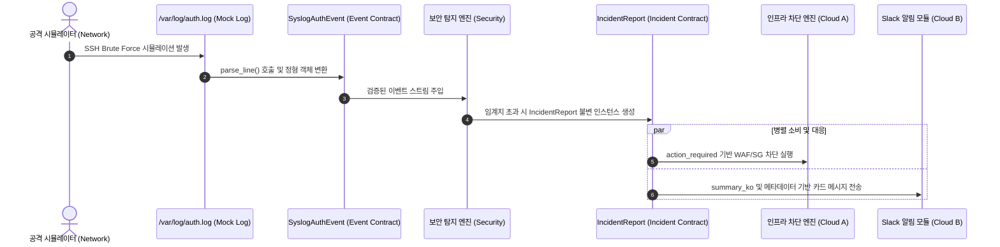

## 1. 개요 및 프로젝트 배경

보안 운영 자동화 부트캠프 캡스톤 프로젝트로 진행된 CloudShield는 AWS 클라우드 환경에서 발생하는 SSH 무차별 대입 공격을 탐지하고 WAF IP 차단, EC2 보안 그룹 격리, Slack 알림으로 이어지는 능동 침해사고 대응 파이프라인을 구축하는 것을 목표로 설정했다. 이번 프로젝트의 가장 두드러진 운영 제약은 팀원 전원이 코덱스, 클로드 코드, 안티그래비티 등 AI 코딩 에이전트를 개발 전 과정에 전면 도입했다는 점이다.

에이전트 도입은 생산성을 비약적으로 끌어올리는 도구였으나, 다자간 협업 환경에서는 심각한 리스크를 동반했다.

1. **테스트 회피를 위한 스키마 드리프트:** 코딩 에이전트는 단위 테스트 실패를 해결하는 과정에서 원래 합의된 입출력 스키마를 준수하기보다, 에러를 회피하기 위해 기존 데이터 필드 타입을 임의로 완화하거나 새 필드를 묵시적으로 추가하는 경향이 짙었다.
2. **비동기 병렬 개발을 위한 인프라 부재:** 프로젝트 1일차에는 실제 AWS 리소스(EC2, CloudWatch, Lambda, WAF)가 프로비저닝되지 않은 상태였다. 클라우드 A/B, 보안 분석, 네트워크 등 4개 직무가 동시에 개발을 진행하려면 배포 전 단계에서 각자의 입출력을 독립적으로 검증할 수 있는 가상 인터페이스가 필수적이었다.
3. **협업 경험 편차와 깃허브 거버넌스 부재:** 팀원 중 GitHub 협업 흐름에 익숙하지 않은 인원이 포함되어 있었다. 에이전트의 무분별한 파일 수정과 비정형 커밋이 겹칠 경우 브랜치 충돌과 메인 브랜치 오염을 통제하기 어려웠다.

사후에 인터페이스 불일치 장애를 수습하는 방식은 막대한 재작업 비용을 발생시킨다. 이에 따라 프로젝트 착수 단계에서부터 침해사고 시나리오를 바탕으로 노션 칸반에 최소 작업 단위를 정의하고, 코딩 에이전트의 탈선을 물리적으로 통제하는 **최소 실행 가능 하네스(MVH, Minimum Viable Harness)** 체계를 선제 구축했다.

## 2. 전체 산출물 구조 및 진단/파이프라인 체계

하네스의 핵심은 실제 AWS 인프라가 없는 환경에서도 4개 직무가 사전에 합의된 데이터 계약과 Mock 데이터셋을 매개로 격리 개발을 진행할 수 있도록 단방향 파이프라인을 고정하는 것이다.



파이프라인은 네트워크 직무가 생성하는 원문 로그에서 출발하여 이벤트 계약(`events.py`)을 거쳐 보안 탐지 엔진으로 흐른다. 탐지 엔진이 생성한 결과물은 다시 인시던트 계약(`incident.py`)을 통해 동결된 불변 객체 형태로 차단 엔진과 알림 모듈로 동시 전파된다. 이 구조를 통해 각 직무는 타 도메인의 내부 구현을 알 필요 없이 오직 계약 객체의 스펙만을 바라보고 개발을 완결할 수 있다.

## 3. 기존 체계의 한계와 도전 과제: 학원 OS 제약과 에이전트 탈선 위험

초기 하네스 구상 단계에서는 로컬 Git pre-commit 훅을 강제하여 에이전트의 잘못된 커밋을 사전에 차단하려 했다. 그러나 부트캠프 교육장 PC의 강력한 윈도우 OS 보안 정책인 AppLocker가 복병으로 작용했다. `uv run pytest`와 같이 서브프로세스를 동적으로 호출하는 명령어가 바이너리 실행 차단 정책(`os error 4551`)에 걸려 로컬 테스트 실행 자체가 중단되는 현상이 지속되었다.

여기에 더해 팀원마다 개별 업데이트한 PowerShell 버전 편차가 존재했고, 코덱스나 클로드 코드, 안티그래비티 등 각자 사용하는 코딩 에이전트의 동작 특성도 제각각이었다. 로컬 Git Hook은 에이전트가 `--no-verify` 플래그로 임의 우회할 수 있어 신뢰할 수 있는 거버넌스 가드로 기능하지 못했다.

또한 코딩 에이전트에게 구현 작업을 지시했을 때, 테스트를 통과시키기 위해 기존 계약 모델의 제약조건을 완화하거나 파싱 데이터 리스트를 내부적으로 변경하여 후속 파이프라인으로 전달하는 참조 오염 문제가 도출되었다. 로컬 환경의 제약과 에이전트의 비결정적 행동을 통제하기 위해, 언어 레벨의 강력한 타입 동결과 완전히 통제된 원격 CI 중심의 단일 게이트웨이 전략이 불가피했다.

## 4. 엔지니어링 의사결정 및 리팩터링

### 4.1. Pydantic V2 불변 계약 동결 및 컬렉션 타입 방어

탐지 엔진과 차단/알림 엔진 사이의 인터페이스 역할을 하는 `IncidentReport` 모델에는 Pydantic V2의 강력한 스키마 봉인 옵션을 부여했다. 에이전트가 테스트를 통과하기 위해 임의의 추가 필드를 넘기거나 생성된 인스턴스의 속성을 변경하는 것을 방지하기 위해 `extra="forbid"`와 `frozen=True`를 선언했다.

특히 공격 대상 계정 목록(`target_accounts`)과 권고 조치(`recommendations`) 필드는 일반적인 `list[str]` 대신 불변 시퀀스인 `tuple[str, ...]`로 선언했다. `IncidentReport`는 클라우드 A의 차단 엔진과 클라우드 B의 Slack 알림 모듈이 동시에 참조하는 공유 객체다. 만약 가변 리스트를 노출할 경우, 알림 모듈을 구현하는 에이전트가 메시지 서식을 꾸미는 과정에서 `report.target_accounts.append(...)`나 내부 정렬 같은 참조 변조를 일으켜 차단 엔진이 바라보는 원본 데이터를 오염시킬 위험이 컸다.

```python
# src/contracts/incident.py
class IncidentReport(BaseModel):
    model_config = ConfigDict(extra="forbid", frozen=True)

    incident_id: str = Field(..., description="사건 고유 식별자")
    attack_type: str = Field(..., description="공격 유형")
    mitre_id: str = Field(..., description="MITRE ATT&CK 기법 ID")
    risk_level: Literal["HIGH", "MEDIUM", "LOW"] = Field(...)
    source_ip: str = Field(..., description="공격자 출발지 IPv4")
    target_identifier: str = Field(..., description="EC2 Instance ID")
    target_accounts: tuple[str, ...] = Field(default_factory=tuple)
    summary_ko: str = Field(..., description="침해 상황 한글 요약")
    action_required: Literal[
        "BLOCK_WAF", "QUARANTINE_EC2", "REVOKE_IAM_SESSION",
        "BLOCK_AND_QUARANTINE", "BLOCK_IP_ONLY", "ALERT_ONLY", "NONE",
    ] = Field(...)
    recommendations: tuple[str, ...] = Field(default_factory=tuple)
```

`tuple`로 타입을 잠그면 에이전트가 변조를 시도하는 순간 런타임에 `AttributeError`를 발생시켜 즉시 실행을 멈춘다. 비결정적으로 코드를 생성하는 AI 에이전트 협업 환경에서는 이러한 엄격한 불변성 강제가 실무적인 안전마진으로 작용했다.

### 4.2. 파이썬 표준 라이브러리 일원화 및 정규식 오버엔지니어링 제거

초기 IP 검증 로직은 복잡한 정규식 매칭을 거친 후 `ipaddress.IPv4Address`를 다시 호출하는 2중 검사 구조였다. 대용량 로그 스트림이 유입될 때 정규식 컴파일과 백트래킹으로 인한 리소스 낭비가 우려되었고, 정규식 자체의 옥텟 범위(0~255) 검증 결함 가능성도 상존했다.

정규식 검사를 전면 삭제하고, C 레벨로 최적화된 파이썬 표준 라이브러리 `ipaddress.IPv4Address` 단일 호출로 통합했다.

```python
# src/contracts/incident.py
    @field_validator("source_ip")
    @classmethod
    def validate_source_ip(cls, v: str) -> str:
        try:
            ipaddress.IPv4Address(v)
        except ValueError as exc:
            raise ValueError(f"유효하지 않은 IPv4 주소: {v}") from exc
        return v
```

CPython 환경에서 `try-except` 블록은 예외 발생 시 프레임 스택을 풀고 트레이스백을 생성하므로 단순 분기보다 연산 오버헤드가 크다. 초당 수만 건의 비정상 트래픽이 쏟아지는 인라인 수집 레이어라면 정규식이나 단순 분기가 더 유리할 수 있다.

그러나 `IncidentReport`는 원문 로그 전체를 파싱하는 수집기가 아니라, 보안 룰 엔진이 임계치를 계산하여 침해사고로 최종 판정한 결과물에 한해 단발성으로 생성되는 최종 계약 모델이다. 수집 레이어의 고속 파싱(`SyslogAuthEvent`)과 계약 레이어의 엄격한 무결성 검증(`IncidentReport`)을 분리하여 설계함으로써, 예외 처리 비용에 대한 병목 우려 없이 표준 라이브러리의 옥텟 무결성과 유지보수성을 확보했다.

### 4.3. 미지 환경에 대한 방어적 역직렬화 설계

AWS 배포 경험이 없는 상태에서 공식 문서를 기반으로 이벤트를 파싱해야 했으므로, 환경 편차에 따른 장애를 최소화해야 했다. `SyslogAuthEvent`에서는 전통적인 BSD 포맷(`Sep 03 14:20:01`) 외에도 최신 Ubuntu rsyslog 및 systemd-journald 환경에서 표준으로 사용하는 ISO 8601 타임스탬프 포맷을 단일 정규식 그룹으로 동시 파싱하도록 설계했다.

```python
# src/contracts/events.py
        pattern = (
            r"^(?P<time>(?:[A-Z][a-z]{2}\s+\d{1,2}\s+\d{2}:\d{2}:\d{2}|\d{4}-\d{2}-\d{2}T[^\s]+))\s+"
            r"(?P<host>[^\s]+)\s+"
            r"(?P<proc>[^\[:]+)\[(?P<pid>\d+)\]:\s+"
            r"Failed password for (?P<invalid>invalid user )?(?P<user>[^\s]+)\s+"
            r"from (?P<ip>\d{1,3}\.\d{1,3}\.\d{1,3}\.\d{1,3})\s+"
            r"port (?P<port>\d+)\s+"
            r"(?P<proto>\S+)"
        )
```

더불어 CloudWatch Logs Subscription Filter가 Lambda로 전달하는 Gzip 압축 및 Base64 인코딩 페이로드를 역직렬화하는 `from_awslogs_data()` 팩토리 메서드와 이를 재인코딩하는 `to_awslogs_data()`를 구현하여 왕복 압축 무결성을 확보했다.

### 4.4. AppLocker 우회 및 원격 CI 단일 게이트웨이 전략

학원 Windows PC 환경에서 `uv run pytest` 실행 시 발생하는 `os error 4551` 보안 정책 차단을 극복하기 위해 통합 검증 스크립트(`scripts/check.ps1`)의 실행 메커니즘을 수정했다. 바이너리를 직접 호출하는 대신 표준 파이썬 모듈 인터페이스인 `python -m pytest`로 호출 방식을 단일화하여 정책 충돌을 우회했다.

```powershell
# scripts/check.ps1
Write-Host "[4/5] Pytest 단위 및 계약 테스트 실행 중..." -ForegroundColor Cyan
if ($hasUv) {
    uv run python -m pytest -v
} elseif (Test-Path ".\.venv\Scripts\python.exe") {
    & ".\.venv\Scripts\python.exe" -m pytest -v
} else {
    python -m pytest -v
}
```

로컬 Git Hook을 강제하지 않는 대신, 팀원들이 푸시 전 단 1초 만에 린트와 단위 테스트를 검증할 수 있도록 `scripts/check.ps1`을 제공했다. 이를 통해 원격 CI 큐 대기 시간으로 인한 피드백 루프 지연을 로컬 단계에서 선제 차단했다.

동시에 원격 GitHub Actions 러너를 단일 게이트웨이로 설정하여, Conventional Commit 규격을 검증하는 `pr_title_lint.yml`, 변경 파일 경로에 따라 직무 라벨을 부여하는 `labeler.yml`, 코드 포맷과 계약 테스트를 수행하는 `ci.yml`을 구성했다. 이로써 GitHub 협업에 미숙한 팀원과 코딩 에이전트가 작성한 PR이 기계적인 검증을 반드시 통과하도록 구조화했다.

## 5. 검증 및 회고

### 5.1. 4개 직무 인터페이스 무결성 및 단위 테스트 통과 실증

구축된 하네스는 `tests/mock_data/`에 준비된 모의 데이터셋을 바탕으로 실제 클라우드 인프라 연결 없이도 철저한 회귀 검증을 완결했다.

```powershell
# 단위 및 계약 테스트 검증 실행 결과
tests/test_contracts.py::test_incident_report_from_mock_json PASSED
tests/test_contracts.py::test_incident_report_invalid_ip_rejected PASSED
tests/test_contracts.py::test_incident_report_invalid_instance_id_rejected PASSED
tests/test_contracts.py::test_syslog_auth_log_parsing PASSED
tests/test_contracts.py::test_syslog_auth_log_parsing_iso8601 PASSED
tests/test_contracts.py::test_cw_event_from_mock_json_and_roundtrip PASSED
tests/test_contracts.py::test_cw_batch_event_decoding_and_roundtrip PASSED
tests/test_contracts.py::test_noisy_auth_log_parsing PASSED
```

`IncidentReport`의 `frozen` 및 `extra="forbid"` 속성으로 인해 비인가 필드가 포함된 목데이터나 비정상 IPv4 주소가 유입되었을 때 Pydantic의 `ValidationError`가 정확히 발생하는 것을 확인했다. 또한 전통 BSD Syslog뿐만 아니라 Ubuntu의 ISO 8601 로그 및 노이즈가 섞인 13개 원문 로그 중 실패 이벤트 6건만 정확히 추출되는 필터링 성능을 실증했다.

### 5.2. 현실적 회고 및 교훈

하네스를 구축한 초기에는 팀원들이 PR 본문 템플릿을 채우지 않거나 사소한 컨벤션 실수가 발생하기도 했다. 그러나 이슈 생성부터 브랜치 작업, PR 생성, 상호 리뷰, 머지로 이어지는 표준 사이클을 반복하면서 코딩 에이전트를 다루는 팀원들의 숙련도가 동반 상승했다. 실제 AWS 배포가 이루어지지 않은 상태였음에도 데이터 인터페이스가 단단히 동결되어 있었기에, 4개 직무가 2주 동안 단 한 번의 스키마 충돌 없이 각자의 컴포넌트를 병렬로 완성할 수 있었다.

다만 Mock 데이터셋 기반 하네스는 1일차 격리 개발을 위한 1차 안전장치일 뿐이며, 실제 AWS 리소스 간 통합 단계에서 발생할 수 있는 페이로드 포맷 불일치나 IAM 권한 예외를 온전히 대변할 수는 없다. 이러한 한계를 보완하고 실제 배포 오차를 줄이기 위해, 차기 플랫폼 공정으로 Moto 기반 가상 AWS 리소스(EC2, WAFv2, IAM) 픽스처 구축과 통합 테스트 단계로 파이프라인을 확장하기로 결정했다.

아울러 자연어 문서(`AGENTS.md`)에 정의된 R&R 헌법만으로는 에이전트의 물리적 파일 침범을 100% 막을 수 없다는 한계도 확인했다. "규칙을 명시해 두었으니 에이전트가 지킬 것"이라는 기대는 이후 발생한 PR #45(플랫폼 도구 침범 사고)를 통해 깨지게 되었으며, 이는 향후 커밋 작성자의 직무를 검증하는 결정론적 스코프 하드가드(`verify_rnr_scope.py`)를 개발하게 되는 중요한 엔지니어링 도화선으로 작용했다.
