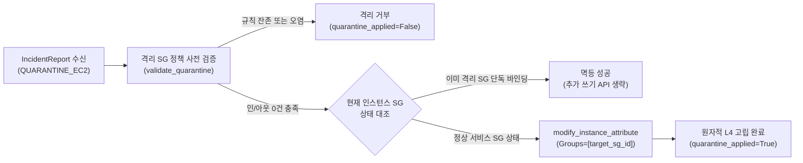

## 1. 개요 및 프로젝트 배경

이전 단계([proj-aleph-project-01-contract-governance-harness](/posts/proj-aleph-project-01-contract-governance-harness))에서 Pydantic V2 기반 불변 계약을 확립하고 테스트 하네스를 구축하여 다중 에이전트 간 스키마 드리프트를 통제했다. 인터페이스가 동결됨에 따라, 침해사고 보고서(`IncidentReport`)의 지시어(`QUARANTINE_EC2`, `BLOCK_AND_QUARANTINE`)를 수신하여 침해된 호스트를 네트워크 레벨에서 즉각 무력화하는 L4 차단 엔진 구현 단계로 진입했다.

보안 관제 파이프라인에서 탐지된 침해 호스트(SSH 무차별 대입 성공, 원격 명령 실행 등)를 방치할 경우, VPC 내부의 타 인스턴스 및 데이터베이스로의 공격 확산과 C2 서버로의 핵심 데이터 유출이 초 단위로 전개된다. 따라서 침해 징후 식별 즉시 10초 이내에 타깃 EC2 인스턴스를 완전 고립시키는 대응 체계가 요구되었다.

클라우드 A 역할로서, Boto3 SDK를 활용하여 타 정상 워크로드에 무중단을 보장하면서 침해 인스턴스만을 핀포인트 격리하는 단일 트랜잭션 차단 로직을 직접 구현했다. 실제 AWS 콘솔 의존성 없이 로컬 단위 테스트를 완결할 수 있도록 Moto 기반 가상 AWS 테스트베드를 병행 프로비저닝하여 검증을 마쳤다.

## 2. 전체 산출물 구조 및 진단/파이프라인 체계

L4 격리 파이프라인은 상위 오케스트레이터의 지시를 수신하여 사전 정책 검증, 멱등성 검사, 원자적 보안 그룹 교체를 단일 동기 흐름으로 완결한다.



파이프라인의 핵심은 침해 호스트의 식별자를 조회한 후, 곧바로 교체를 단행하지 않고 격리 대상 보안 그룹의 규칙 무결성을 선제 검증하는 단계에 있다. 격리 보안 그룹의 인/아웃바운드 규칙이 전면 차단 상태임을 확인한 뒤, 현재 인스턴스의 보안 그룹 목록과 대조하여 불필요한 중복 쓰기 API 호출을 방지하는 상태 기반 멱등성을 적용했다.

모든 네트워크 변경은 단일 API 호출 트랜잭션으로 집행되며, AWS API 호출 실패가 발생하더라도 상위 오케스트레이터로 예외를 전파하지 않고 결과 모델 내 불리언 플래그로 결함을 격리한다.

## 3. 기존 체계의 한계와 도전 과제: 공유 보안 그룹의 폭발 반경과 침해 호스트의 횡적이동

전통적인 인프라 운영 환경에서 침해 인스턴스를 격리하기 위해 흔히 검토되는 방식은 공격에 악용된 포트(예: 22/tcp)의 인바운드 규칙을 기존 보안 그룹에서 삭제(`revoke_security_group_ingress`)하는 접근이다. 그러나 AWS 환경에서 보안 그룹은 단일 인스턴스에 종속되지 않고 다수의 EC2 인스턴스가 공유하는 N:M 구조를 가진다. 침해된 호스트 1대를 차단하기 위해 공유 보안 그룹의 인바운드 규칙을 회수하면, 동일한 보안 그룹을 부여받아 정상 가동 중이던 수십 대의 서비스 인스턴스까지 인바운드 트래픽이 일제히 차단되는 대규모 서비스 장애가 유발된다.

더욱이 규칙 개별 삭제 방식은 인바운드와 아웃바운드에 등록된 다수의 규칙을 반복적인 네트워크 API 호출로 제거해야 하므로 수 초 이상의 실행 지연이 불가피하다. API 호출 도중 일시적 네트워크 순단이나 권한 오류로 일부 규칙만 삭제되고 중단되는 부분 실패가 발생하면, 관리자는 차단이 완료된 것으로 오판하지만 실제로는 백도어 포트나 아웃바운드 경로가 잔존하는 보안 홀이 형성된다.

또한 침해 호스트는 장악된 즉시 내부 VPC 서브넷을 스캔하여 인접 호스트나 미인증 내부 캐시, 데이터베이스로 무차별 스프레잉을 감행한다. 외부 유출 경로를 차단함과 동시에 내부 횡적이동을 10초 이내에 단일 트랜잭션으로 봉쇄하지 못하면, 침해 사고의 영향 범위는 단일 호스트를 넘어 VPC 전체 인프라로 확산되는 구조적 한계에 직면한다.

## 4. 엔지니어링 의사결정 및 리팩터링

### 4.1. N:M 보안 그룹 공유 환경의 폭발 반경과 modify_instance_attribute 원자적 전면 교체

공유 보안 그룹의 규칙 회수로 인한 정상 인스턴스 연쇄 장애를 원천 차단하기 위해, 인스턴스 단위의 전면 교체 API인 `modify_instance_attribute`를 채택했다. 보안 그룹 자체의 내부 규칙을 변경하는 대신, 타깃 인스턴스에 바인딩된 보안 그룹 목록을 사전에 정의된 격리 전용 보안 그룹(`CloudShield-Quarantine-SG`) 단일 요소 배열로 즉시 덮어쓰는 방식을 취했다.

```python
# src/remediation/remediation.py
        # 4. 멱등성 검사: 이미 격리 SG 단독 적용 상태인지 확인
        if current_sgs == [target_sg_id]:
            logger.info("인스턴스 %s는 이미 유효한 격리 보안 그룹(%s)에 배치되어 있음 (멱등 처리)", instance_id, target_sg_id)
            return True

        # 5. 원자적 보안 그룹 전면 교체 (기존 보안 그룹 목록을 격리 SG 1개로 단독 대체)
        ec2_client.modify_instance_attribute(
            InstanceId=instance_id,
            Groups=[target_sg_id],
        )
        logger.info("인스턴스 %s 격리 완료: SG %s -> [%s]", instance_id, current_sgs, target_sg_id)
        return True
```

`Groups=[target_sg_id]` 파라미터는 선언적 목표 상태를 전달하므로, 기존 인스턴스에 연결되어 있던 임의의 복수 보안 그룹 목록을 단 1회의 AWS API 트랜잭션으로 완전히 치환한다. 이를 통해 동일한 보안 그룹을 공유하는 타 정상 인스턴스에는 단 1바이트의 트래픽 단절도 초래하지 않으면서, 침해 대상 인스턴스만을 밀리초 단위로 핀포인트 고립시켰다.

한 가지 인프라적 제약은 `modify_instance_attribute` API가 인스턴스의 주 네트워크 인터페이스인 eth0의 보안 그룹만을 교체한다는 점이다. 컨테이너 노드나 다중 서브넷 워크로드처럼 보조 ENI가 부착된 인스턴스의 경우 보조 통로로 트래픽이 잔존할 수 있으므로, 다중 ENI 환경에서는 `describe_network_interfaces`를 통해 모든 ENI를 순회하며 개별 수정하거나 보조 ENI를 강제 분리하는 확장 로직이 요구된다. 본 1차 구현에서는 단일 ENI 기반 범용 인스턴스를 기준으로 단순화하여 결함 표면을 통제했다.

### 4.2. AWS 기본 아웃바운드 허용 함정과 전면 차단 사전 정책 검증

AWS EC2 보안 그룹은 콘솔이나 API를 통해 신규 생성할 때 기본 규칙으로 모든 아웃바운드 트래픽(-1, `0.0.0.0/0`) 허용을 자동 주입한다. 만약 격리 엔진이 보안 그룹의 이름(`CloudShield-Quarantine-SG`)이나 ID 식별자만 확인하고 교체를 단행할 경우, 외형상 격리가 성공한 것처럼 보고되더라도 실제로는 아웃바운드가 열려 있어 침해 호스트가 C2 서버로 민감 데이터를 탈취하거나 리버스 셸을 유지하는 보안 실패가 발생한다.

이를 방지하기 위해 교체 트랜잭션을 실행하기 전 `validate_quarantine_security_group` 함수를 통해 격리 보안 그룹의 규칙 상태를 엄격히 검증하는 방어선을 구축했다.

```python
# src/remediation/remediation.py
        sg = security_groups[0]
        ingress_rules = sg.get("IpPermissions", [])
        egress_rules = sg.get("IpPermissionsEgress", [])

        if ingress_rules:
            logger.error("격리 보안 그룹(%s)에 인바운드 허용 규칙(%d건)이 잔존하여 부적합함", sg_id, len(ingress_rules))
            return False

        if egress_rules:
            logger.error("격리 보안 그룹(%s)에 아웃바운드 허용 규칙(%d건)이 잔존하여 부적합함", sg_id, len(egress_rules))
            return False

        return True
```

`IpPermissions`와 `IpPermissionsEgress`가 모두 빈 리스트(`[]`)인 상태만을 유효한 격리 그룹으로 판정했다. 또한 관리자의 수동 조작이나 외부 스크립트로 인해 22/tcp 포트와 같은 인바운드 규칙이 사후 주입된 오염 상태(`test_quarantine_ec2_instance_fails_when_already_attached_sg_is_contaminated`)인 경우, 이미 해당 그룹이 바인딩되어 있더라도 단순 멱등 통과를 거부하고 즉시 실패(`False`)를 반환하여 관제팀이 사후 오염을 인지하도록 조치했다.

### 4.3. AWS Stateful 보안 그룹의 Connection Tracking 한계와 호스트 OS 세션 단절의 분리

보안 그룹을 전면 차단 SG로 교체하더라도 즉시 모든 침해 행위가 중단되는 것은 아니다. AWS 보안 그룹은 상태 저장 방화벽으로 동작하며, 저수준 하이퍼바이저 레벨에서 연결 추적인 Connection Tracking 테이블을 유지한다. 보안 그룹 규칙이 변경되면 신규(NEW) 인입 및 송출 패킷은 즉시 드롭되지만, 규칙 교체 시점에 이미 `ESTABLISHED` 상태로 수립되어 있던 기존 활성 세션(공격자의 기존 SSH 인터랙티브 세션, 지속형 역방향 C2 터널)은 즉시 강제 종료되지 않고 TCP 유휴 타임아웃 만료 전까지 유지되는 물리적 한계가 존재한다.

신규 연결 차단과 활성 세션 종료는 서로 다른 계층의 메커니즘이다. 1차 마일스톤의 엔지니어링 스코프를 'AWS 네트워크 패브릭 차원의 신규 인/아웃바운드 트래픽 즉시 차단'으로 명확히 한정했다.

기존 세션의 완전한 단절은 L4 보안 그룹 교체만으로는 불가능하므로, 차기 고도화 과제로 역할을 분리했다. AWS Systems Manager Run Command를 연계하여 호스트 OS 내부의 의심 프로세스를 강제 종료(`pkill`)하거나 `sshd` 데몬을 재시작하는 방안, 또는 인스턴스의 가상 네트워크 인터페이스인 ENI를 강제 분리하여 연결 테이블을 하드웨어 레벨에서 초기화하는 다계층 방어선으로 책임을 분리하는 아키텍처 결정을 내렸다.

### 4.4. 제로 트러스트 하에서의 포렌식 접근 경로와 복구 메타데이터 보존 유예

네트워크 트래픽이 전면 차단된 격리 호스트는 외부로부터의 추가 공격은 차단하지만, 침해 사고 원인을 분석해야 하는 보안 대응팀의 접근까지 완전히 차단하는 트레이드오프를 수반한다. 인바운드 22번 포트를 관제 IP 대역에 예외 허용하는 방식은 격리 무결성을 훼손할 위험이 있었다.

이에 따라 인바운드 규칙을 일체 개방하지 않고, 호스트 내 SSM 에이전트가 VPC 엔드포인트(HTTPS 443)를 통해 AWS 백본망으로 아웃바운드 세션을 맺는 AWS Systems Manager Session Manager를 표준 포렌식 채널로 정의했다. 침해된 호스트에 대해 셸 포트를 열지 않고도 IAM 기반 인증 및 감사 로깅을 유지하면서 안전한 라이브 메모리 덤프와 프로세스 트레이싱을 수행할 수 있는 기반을 마련했다.

다만 현재 구현된 격리 SG는 데이터 유출을 원천 봉쇄하기 위해 아웃바운드 규칙까지 0건으로 비워두었으므로, 이 상태에서는 호스트 내부의 SSM 에이전트 역시 VPC 엔드포인트로 패킷을 송출할 수 없다. 따라서 침해 직후에는 외부 유출 및 횡적이동을 막는 '완전 고립(인/아웃 0건)'을 우선 집행하고, 이후 포렌식이 요구되는 시점에 한해 관제 파이프라인이 SSM VPC 엔드포인트 방향 443 아웃바운드만 제한적으로 개방된 '포렌식 전용 SG'로 2차 전이하는 단계적 접근이 필수적이라는 엔지니어링 한계를 도출했다.

한편, 교체 시점에 기존 인스턴스가 보유하고 있던 보안 그룹 목록(`current_sgs`)을 영구 보존하는 복구 기능은 의도적으로 1차 마일스톤에서 유예했다. 1차 마일스톤의 핵심 목표는 10초 이내에 단방향으로 원자적 침해를 차단하는 데 집중되어 있었기 때문이다.

외부 DynamoDB 상태 저장소나 인스턴스 태그 쓰기 연동을 결합할 경우, 태그 권한 부족이나 데이터베이스 지연으로 인해 정작 최우선 과제인 네트워크 격리가 실패할 위험(실패 지점 증식)이 존재했다. 따라서 격리 트랜잭션의 순수성을 보존하고, 복구 메타데이터 영속화는 격리가 완결된 이후의 2차 배치 작업으로 분리했다.

## 5. 검증 및 회고

### 5.1. Moto 기반 가상 AWS 단위 테스트 및 10초 격리 검증

격리 엔진의 정밀 검증을 위해 `tests/unit/test_remediation.py`에서 Moto 프레임워크를 기반으로 가상 VPC, 서브넷, 타깃 EC2 인스턴스, 정상 보안 그룹, 격리 보안 그룹을 사전 프로비저닝하는 테스트베드를 구축했다.

| 테스트 함수 | 검증 목적 | 결과 |
| :--- | :--- | :---: |
| `test_find_quarantine_security_group_success` | 표준 명칭(`CloudShield-Quarantine-SG`) 기반 격리 SG 동적 조회 검증 | **PASS** |
| `test_find_quarantine_security_group_not_found` | 비존재 보안 그룹 명칭 질의 시 예외 없이 None 반환 검증 | **PASS** |
| `test_validate_quarantine_security_group_success` | 인/아웃바운드가 전면 차단된 정상 격리 SG의 유효성 검증 성공 | **PASS** |
| `test_validate_quarantine_security_group_fails_with_ingress` | 22/tcp 인바운드 허용 잔존 SG에 대한 격리 부적합 판정 확인 | **PASS** |
| `test_validate_quarantine_security_group_fails_with_egress` | 0.0.0.0/0 기본 아웃바운드 허용 잔존 SG에 대한 격리 거부 확인 | **PASS** |
| `test_quarantine_ec2_instance_success` | 인스턴스 SG가 전면 차단 Quarantine SG 1개로 원자적 교체 실시간 검증 | **PASS** |
| `test_quarantine_ec2_instance_idempotent` | 연속 호출 시 중복 쓰기 API 생략 및 상태 유지(멱등성) 검증 | **PASS** |
| `test_quarantine_ec2_instance_fails_when_sg_policy_invalid` | 오염된 SG로 격리 시도 시 작업 거부 및 기존 정상 SG 보존 검증 | **PASS** |
| `test_quarantine_ec2_instance_fails_when_already_attached_sg_is_contaminated` | 이미 연결된 SG의 사후 오염 발생 시 멱등 성공이 아닌 실패 처리 검증 | **PASS** |
| `test_quarantine_ec2_instance_not_found` | 비존재 인스턴스 ID 전달 시 ClientError 예외 격리 및 False 반환 검증 | **PASS** |
| `test_apply_remediation_quarantine_integration` | IncidentReport(`QUARANTINE_EC2`) 기반 apply_remediation 통합 연동 검증 | **PASS** |

총 11개 단위 테스트 케이스를 100% 통과하여, 정상 격리 시나리오뿐만 아니라 기본 아웃바운드 잔존, 사후 보안 그룹 오염, 비존재 인스턴스 질의 등 다양한 런타임 예외 상황에서도 시스템이 안전하게 실패하고 기존 상태를 보존함을 실증했다.

### 5.2. 현실적 회고 및 교훈

클라우드 네이티브 환경에서 보안 그룹은 단순한 호스트 방화벽이 아닌 소프트웨어 정의 네트워크(SDN) 계층의 분산 패킷 필터로 동작한다. 인프라의 N:M 공유 토폴로지를 고려하지 않은 채 레거시 온프레미스 방식의 방화벽 규칙 회수를 답습할 경우 정상 인프라 전체로 서비스 다운 장애가 번질 수 있음을 분석했다.

또한 AWS가 기본 제공하는 아웃바운드 전체 허용(`0.0.0.0/0`) 설정과 하이퍼바이저 레벨의 Stateful Connection Tracking 특성은 단순 선언적 방화벽 정책과 실제 런타임 통신 간의 괴리를 발생시키는 대표적인 함정이었다. 룰셋의 외형적 명칭에 의존하지 않고 실제 허용 규칙이 비어 있는지 여부를 사전 검증하는 방어적 인터페이스를 구축함으로써 정책 오염으로 인한 격리 실패를 원천 차단했다.

아울러 대규모 동시다발 침해 상황에서 단일 타깃 격리를 넘어 수십 대의 호스트를 동시 처리할 경우, AWS EC2 제어 평면의 API 레이트 리밋(`RequestLimitExceeded`)에 직면할 수 있는 운영 리스크를 식별했다. 현재 코드는 결함 격리 원칙에 따라 ClientError 발생 시 상위 중단을 막고 False를 반환하도록 설계되었으나, 일시적 스로틀링으로 인한 조치 누락을 방지하기 위해 Boto3의 Adaptive 재시도 모드와 데드 레터 큐(DLQ)를 결합하는 프로덕션 레벨 복원력 설계가 병행되어야 한다는 결론을 도출했다.

결과적으로 단일 `modify_instance_attribute` API 트랜잭션과 선행 정책 검증 로직을 결합하여 10초 이내 원자적 L4 고립 파이프라인의 엔지니어링 타당성을 실증했으며, 호스트 OS 세션 단절과 포렌식 경로 분리를 위한 차기 아키텍처 경계를 명확히 규정했다.
