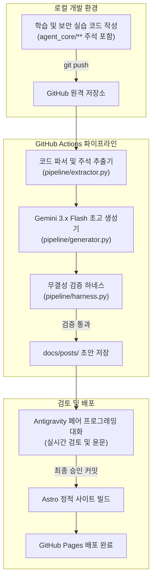

## 1. 개요 및 배경 (Context & Problem Definition)

보안 자동화 엔지니어링 과정을 수강하면서 기술 블로그를 통한 지속적인 기록의 필요성을 확인했다. 그러나 시중에 흔한 단순 문법 정리나 강의 예제 코드를 그대로 복사해 붙여넣는 포스팅은 작성자에게도, 읽는 이에게도 차별화된 가치를 전달하지 못한다.

컴퓨터공학 전공자로서 진정으로 남겨야 할 자산은 완성된 코드가 아니라, 기존 구현의 취약점과 병목을 고민하며 리팩터링한 의사결정 과정이었다. 특히 소스코드 주석에 기록해 둔 구조적 고민과 인공지능 페어 프로그래밍을 통한 최적화 과정을 온전히 블로그 포스트로 변환하고 싶었다.

매일 반복되는 실습 코드를 수작업으로 정리하여 발행하는 과정은 피로도가 높고 지속성을 유지하기 어렵다. 이에 따라 소스코드의 주석과 변경 내역을 파싱하여 정제된 기술 문서를 스스로 생성하고 배포하는 'DevLog 에이전트 파이프라인'을 직접 구축하기로 결정했다.

## 2. 핵심 도전 과제 및 기술적 제약 (Core Challenges & Constraints)

파이프라인을 설계하며 직면한 핵심 제약과 도전 과제는 다음과 같다.

1. **운영 비용 0원 원칙 (Zero-Cost Operation):** 학생 및 개인 프로젝트로서 상시 가동되는 유료 클라우드 인프라나 고비용 대규모 언어 모델(LLM) API 과금을 완전히 배제해야 했다.
2. **별도 서버 유지보수 배제 (Zero-Maintenance):** 블로그 작성을 관리하기 위한 별도 관리자 웹 애플리케이션이나 데이터베이스 서버를 띄우지 않고, Git 저장소 자체를 단일 진실 공급원(SSOT)으로 삼는 'Everything-as-Code' 원칙을 만족해야 했다.
3. **콘텐츠 무결성과 고유성 확보:** AI가 생성한 문장이 흔한 튜토리얼 텍스트로 퇴행하지 않도록, 작성자가 코드에 남긴 주석 의사결정과 문제의식을 중심축으로 삼는 구조적 추출 장치가 요구되었다.

## 3. 엔지니어링 의사결정 및 해결 방안 (Engineering Decisions & Trade-offs)

### 트레이드오프 1. 전용 결재 웹 대시보드 vs GitHub Actions Native

* **고민:** 초안 검토와 최종 승인을 위해 로그인, 데이터베이스, 웹소켓이 결합된 독립 웹 대시보드를 구축할 것인가.
* **분석:** 전용 웹 애플리케이션은 사용자 인터페이스 구성의 자유도가 높지만, 백엔드 서버 호스팅 비용과 데이터베이스 마이그레이션 등 지속적인 유지보수 부채를 야기한다.
* **결정:** GitHub 플랫폼 자체를 대시보드로 활용하는 방식을 채택했다. 코드가 푸시되면 GitHub Actions가 백그라운드에서 초고를 생성하고, 개발자는 저장소 내에서 Antigravity 에이전트와 대화하며 초안을 검토 및 승인하도록 구성했다. 모든 상태는 Git 커밋과 PR로 관리되므로 서버 인프라 비용이 전혀 발생하지 않는다.

### 트레이드오프 2. 고비용 상용 모델 vs 무료 티어 고성능 모델

* **고민:** 한국어 문장 유연성이 높은 Anthropic Claude API와 최신 추론 역량을 제공하는 Google Gemini Flash 계열 사이의 선택.
* **분석:** 일일 단위로 코드가 푸시될 때마다 파이프라인이 자동 동작하므로 유료 API 토큰 과금은 누적 비용 부담을 준다.
* **결정:** 개발자 무료 티어(Free Tier)를 넉넉하게 제공하면서도 뛰어난 코드 파싱 및 추론 성능을 가진 Google Gemini 3.6/3.7 Flash 모델을 기본 엔진으로 채택했다. 이를 통해 파이프라인의 API 운영 비용을 0원으로 묶어두었다.

### 트레이드오프 3. Next.js 문서 프레임워크 vs Astro 기반 Bento 테마

* **고민:** 기술 문서 표준처럼 쓰이는 Next.js Fumadocs vs 정적 사이트 생성에 최적화된 Astro 기반 Bento 테마.
* **분석:** Next.js 기반 문서 사이트는 API 레퍼런스나 대규모 계층 구조에는 적합하지만, 개인 개발자의 엔지니어링 프로젝트를 직관적이고 시각적으로 보여주는 포트폴리오 성격에는 다소 무겁고 정형화되어 있다.
* **결정:** 제로 자바스크립트 빌드를 지향하여 로딩 속도가 빠르고, 카드형 벤토 레이아웃을 통해 프로젝트와 실습 일차를 유려하게 시각화할 수 있는 Astro Bento Blog 아키텍처를 채택했다.

## 4. 시스템 아키텍처 및 워크플로우 (System Architecture & Workflow)

파이프라인은 소스코드 커밋부터 최종 웹 배포까지 유기적으로 연결된 다단계 파이프라인으로 구성된다.

워크플로우 단계별 동작은 다음과 같다.
1. 개발자가 일차별 보안 실습 코드를 작성하고 주석에 설계 의도를 기록한 뒤 저장소에 푸시한다.
2. GitHub Actions가 트리거되어 코드베이스를 분석하고, 작성자의 주석과 코드 구조를 프롬프트 템플릿에 주입한다.
3. Gemini 엔진이 초안을 생성한 뒤, 정적 린터(Harness)가 이모지 여부와 필수 섹션 포함 상태를 검증한다.
4. 로컬 환경에서 Antigravity 에이전트와 대화하며 세부 내용을 다듬고 최종 승인하면, Astro 빌드 엔진이 정적 페이지를 생성하여 GitHub Pages로 무중단 배포한다.

## 5. 성과 및 회고 (Results & Lessons Learned)

이번 프로젝트를 통해 얻은 주요 성과와 공학적 교훈은 다음과 같다.

1. **운영 비용 0원의 자동화 완성:** 유료 인프라와 상용 API 과금 없이 GitHub Actions, Gemini 무료 티어, GitHub Pages의 조합만으로 무결한 배포 파이프라인을 구축했다.
2. **도구 선택의 실용주의:** 화려한 풀스택 대시보드를 만들고 싶은 충동을 억제하고, 이미 익숙한 Git 인터페이스와 에이전트 대화를 결합하여 엔지니어링 복잡도를 대폭 낮췄다.
3. **단순 요약을 넘어선 기록 체계:** 코드를 기계적으로 설명하는 것이 아니라, 베이스라인 코드의 한계와 리팩터링 의사결정을 중심으로 글을 구조화함으로써 실질적인 기술 성장 기록을 남길 수 있게 되었다.
