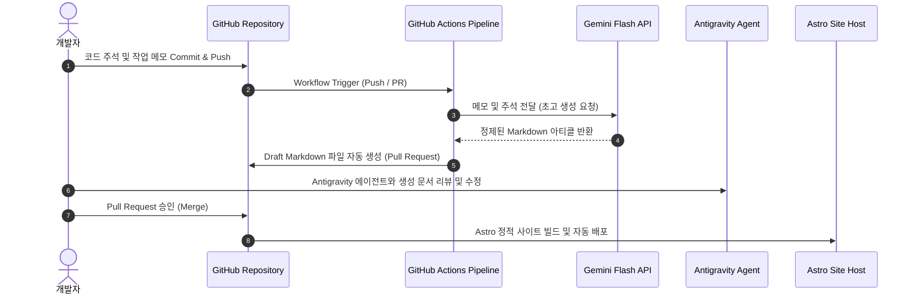

## 1. 개요 및 배경 (Context & Problem Definition)

보안 자동화 교육 과정을 이수하며 기술 블로그를 작성하라는 조언을 자주 접했다. 하지만 단순 문법 요약이나 수업 시간에 다룬 예제 코드를 그대로 복사해 게시하는 글은 개발자로서 뚜렷한 변별력을 지니기 어렵다. 실무나 프로젝트에서 직면한 문제 해결 과정, 코드 리팩터링 도중 남긴 주석, 그리고 AI와의 협업(Pair Programming) 결과물이 산발적으로 남아버리는 문제를 해결하고 싶었다.

이에 따라 개발 작업 중 산출되는 실질적인 기록을 유기적으로 엮어 정리하고, 작성부터 검토 및 배포까지 이어지는 연속적인 흐름을 자동화하는 파이프라인 구축을 계획했다. 개발자가 핵심 로직 작성과 문제 해결에 집중하는 동안, 지식 자산화 과정은 시스템이 보조하는 구조를 만드는 것이 이 프로젝트의 출발점이다.

## 2. 핵심 도전 과제 및 기술적 제약 (Core Challenges & Constraints)

자동화 시스템을 설계하면서 고려한 핵심 원칙과 제약 조건은 다음과 같다.

- **유지보수 오버헤드 최소화**: 개인 프로젝트 특성상 불필요한 인프라 관리 부담을 지지 않아야 한다. 별도의 상시 가동 서버나 복잡한 웹 애플리케이션 프레임워크를 운영하는 방식을 지양한다.
- **운영 비용 제약**: 일일 혹은 작업 단위로 정기 실행되는 파이프라인 특성상 지속적인 API 호출 비용이 발생할 수 있다. 인프라 호스팅 및 LLM API 비용을 최소화(목표: 0원)해야 한다.
- **개발 환경과의 밀접한 통합**: 새로운 작업 환경이나 툴에 적응할 필요 없이, 기존 Git 기반 개발 워크플로우(Commit, Push, Pull Request) 내에서 검토 및 배포 승인이 이뤄져야 한다.
- **정적 빌드 성능 및 가독성**: 퍼블리싱되는 블로그 결과물은 로딩 속도가 빠르고 기술 아티클에 최적화된 레이아웃을 제공해야 한다.

## 3. 엔지니어링 의사결정 및 해결 방안 (Engineering Decisions & Trade-offs)

### 플랫폼 구조: 전용 결재 웹 대시보드 vs GitHub Actions Native

초기에는 초고 생성 후 내용을 검토하고 최종 승인(Confirm)하기 위해 인증, DB, 소켓 통신을 포함한 별도의 웹 대시보드를 구축하는 방안을 검토했다. 하지만 웹 서비스를 직접 구축하고 배포하는 방식은 호스팅 비용과 데이터베이스 관리 오버헤드를 발생시킨다.

따라서 개발 환경과 결합도가 높은 GitHub Native 방식을 채택했다. 코드를 저장소에 푸시하면 GitHub Actions가 백그라운드에서 실행되어 초고 마크다운을 자동 생성한다. 작성자는 로컬 혹은 웹 인터페이스에서 Antigravity 에이전트를 활용해 생성된 파이프라인 결과를 검토하고, Pull Request 합병 조작만으로 퍼블리싱을 완료하도록 워크플로우를 간소화했다.

### LLM 엔진: Anthropic Claude vs Google Gemini Flash

블로그 초고 가공 및 텍스트 윤문을 담당할 LLM 선정 과정에서 Anthropic Claude 계열과 Google Gemini 계열을 비교 분석했다. Claude API는 우수한 한국어 표현력을 보여주지만 사용량에 비례해 비용이 가중되는 구조다.

반면 Google Gemini 3.6 / 3.7 Flash 모델은 일정량의 일일 API 호출에 대해 안정적인 Free Tier를 제공한다. 기술 아티클 정제와 같이 구조화된 텍스트 변환 작업에서 Gemini Flash 계열은 충분한 추론 정확도와 전송 속도를 보였다. 이에 따라 추가 과금 없이 파이프라인을 운영할 수 있는 Gemini Flash 모델을 최우선 엔진으로 채택했다.

### 프론트엔드 프레임워크: Next.js Fumadocs vs Astro Bento Blog

기술 블로그의 프론트엔드 엔진으로 Next.js 기반의 Fumadocs와 Astro 기반의 Bento 블로그 테마를 검토했다. Fumadocs는 대규모 문서 사이트를 구성하는 데 강점이 있으나 상대적으로 클라이언트 번들 크기가 크고 자바스크립트 의존성이 높다.

Astro는 필요한 최소한의 자바스크립트만 클라이언트에 전송하는 아일랜드 아키텍처를 채택하고 있어 정적 사이트 생성(SSG) 시 최고 수준의 렌더링 속도를 확보할 수 있다. 포트폴리오 성격을 겸한 기술 블로그 특성에 맞춰 초경량 정적 빌드와 깔끔한 Bento 레이아웃을 지원하는 Astro를 최종 확정했다.

## 4. 시스템 아키텍처 및 워크플로우 (Mermaid Diagram)

전체 시스템은 코드가 저장소에 푸시되는 시점부터 정적 사이트로 배포되기까지의 과정을 자동화한다.

## 5. 성과 및 회고 (Results & Lessons Learned)

이번 프로젝트 설계 과정에서 아키텍처를 결정할 때 기능의 화려함보다 시스템의 지속 가능성과 운영 효율성에 집중했다.

웹 대시보드 구축 대신 GitHub Actions와 Astro 프레임워크를 조합하여 별도의 서버 유지보수 비용을 없앴으며, Gemini Flash API의 무료 할당량을 활용해 운영 비용 0원으로 파이프라인을 가동할 수 있게 되었다.

불필요한 인프라 복잡도를 덜어내고 개발자가 사용하는 기존 워크플로우 내에 자동화 도구를 안착시킴으로써, 기록에 드는 공수를 획기적으로 낮추면서도 높은 질의 기술 아티클을 꾸준히 생성할 수 있는 기반을 마련했다.