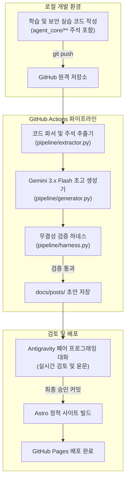

## 1. 개요 및 배경

보안 자동화 과정을 밟으면서 배운 내용을 기술 블로그에 꾸준히 남길 필요성을 느꼈다. 하지만 시중에 흔한 단순 문법 정리나 강사 예제 코드를 복사해 붙여넣는 글은 작성자에게도 읽는 이에게도 차별성을 주지 못한다.

컴퓨터공학 전공자로서 진정으로 남겨야 할 자산은 완성된 코드가 아니라 기존 구현의 취약점과 병목을 분석하며 고쳐나간 의사결정 과정이었다. 특히 소스코드 주석에 적어둔 구조적 고민과 인공지능 페어 프로그래밍으로 코드를 다듬은 과정을 고스란히 기술 블로그 포스트로 변환하고 싶었다.

매일 이어지는 실습 코드를 손으로 일일이 정리해 올리는 작업은 번거롭고 금방 지치기 마련이다. 이에 소스코드 주석과 변경 내역을 스스로 읽어 정제된 기술 문서로 생성하고 배포까지 끝내는 'DevLog 에이전트 파이프라인'을 설계했다.

## 2. 핵심 도전 과제 및 기술적 제약

파이프라인을 설계하며 마주한 핵심 제약과 도전 과제는 다음과 같다.

1. **운영 비용 0원 원칙:** 개인 프로젝트 특성상 상시 가동하는 유료 클라우드 서버나 호출당 요금이 나가는 LLM API 과금을 완전히 배제해야 했다.
2. **별도 서버 유지보수 배제:** 블로그 작성을 관리하기 위한 별도 관리자 웹이나 데이터베이스 서버를 두지 않고, Git 저장소 자체를 단일 진실 공급원(SSOT)으로 삼는 Everything-as-Code 원칙을 지켜야 했다.
3. **콘텐츠 무결성과 고유성 확보:** 생성 모델이 뻔한 튜토리얼 문장을 만들어내지 않도록, 작성자가 코드에 남긴 주석 속 문제의식을 핵심 축으로 삼는 구조화된 추출 장치가 필요했다.

## 3. 엔지니어링 의사결정 및 해결 방안

### 트레이드오프 1. 전용 결재 웹 대시보드 vs GitHub Actions Native

* **고민:** 초안 검토와 최종 승인을 위해 로그인, 데이터베이스, 웹소켓이 결합된 독립 웹 대시보드를 따로 구축할 것인가.
* **분석:** 전용 웹은 화면을 자유롭게 꾸밀 수 있지만 백엔드 서버 호스팅 비용과 DB 마이그레이션 같은 관리 부담이 계속 뒤따른다.
* **결정:** GitHub 플랫폼 자체를 대시보드로 쓰기로 했다. 코드를 푸시하면 GitHub Actions가 백그라운드에서 초고를 만들고, 로컬에서는 Antigravity 에이전트와 대화하며 초안을 검토하고 승인한다. 모든 상태를 Git 커밋과 PR로 관리하므로 별도 인프라 비용이 전혀 들지 않는다.

### 트레이드오프 2. 고비용 상용 모델 vs 무료 티어 고성능 모델

* **고민:** 한국어 문장 처리가 유연한 Anthropic Claude API와 최신 추론 역량을 갖춘 Google Gemini Flash 계열 사이의 선택.
* **분석:** 일일 단위로 코드를 푸시할 때마다 파이프라인이 돌기 때문에 유료 API 토큰 과금은 누적될수록 부담이 커진다.
* **결정:** 무료 티어 할당량이 넉넉하면서도 코드 파싱과 추론 성능이 뛰어난 Google Gemini 3.6/3.7 Flash 모델을 기본 엔진으로 채택했다. 그 결과 파이프라인 API 운영 비용을 0원으로 유지할 수 있었다.

### 트레이드오프 3. Next.js 문서 프레임워크 vs Astro 기반 Bento 테마

* **고민:** 기술 문서 표준처럼 쓰이는 Next.js Fumadocs vs 정적 사이트 빌드에 최적화된 Astro Bento 테마.
* **분석:** Next.js 기반 문서 사이트는 API 명세나 대규모 계층 구조에는 잘 맞지만 개인 개발자의 엔지니어링 프로젝트를 직관적이고 시각적으로 드러내야 하는 포트폴리오 성격에는 다소 무겁고 정형화되어 있다.
* **결정:** 제로 자바스크립트 빌드로 로딩 속도가 빠르고 카드형 벤토 레이아웃으로 프로젝트와 실습 일차를 깔끔하게 보여주는 Astro Bento Blog를 채택했다.

## 4. 시스템 아키텍처 및 워크플로우

파이프라인은 소스코드 커밋부터 웹 배포까지 하나로 이어진 워크플로우로 동작한다.

워크플로우 단계별 동작은 다음과 같다.
1. 개발자가 일차별 보안 실습 코드를 작성하고 주석에 설계 의도를 기록한 뒤 저장소에 푸시한다.
2. GitHub Actions가 트리거되어 코드베이스를 분석하고, 작성자의 주석과 코드 구조를 프롬프트 템플릿에 넣는다.
3. Gemini 엔진이 초안을 생성한 뒤, 정적 린터 하네스가 이모지 포함 여부와 필수 섹션 구조를 검증한다.
4. 로컬 환경에서 Antigravity 에이전트와 대화하며 세부 내용을 다듬고 최종 승인하면, Astro 빌드 엔진이 정적 페이지를 빌드하여 GitHub Pages로 무중단 배포한다.

## 5. 성과 및 회고

이번 프로젝트로 얻은 성과와 공학적 교훈은 다음과 같다.

1. **운영 비용 0원의 자동화 완성:** 유료 인프라와 상용 API 과금 없이 GitHub Actions, Gemini 무료 티어, GitHub Pages 조합만으로 견고한 배포 파이프라인을 구축했다.
2. **도구 선택의 실용주의:** 풀스택 대시보드를 구축하려는 유혹을 걷어내고 익숙한 Git 인터페이스와 에이전트 대화를 결합하여 불필요한 엔지니어링 복잡도를 줄였다.
3. **단순 요약을 넘어선 기록 체계:** 코드를 기계적으로 나열하지 않고 기존 코드의 한계와 리팩터링 의사결정을 중심으로 글을 구조화하여 실질적인 기술 성장 기록을 남길 수 있게 되었다.
