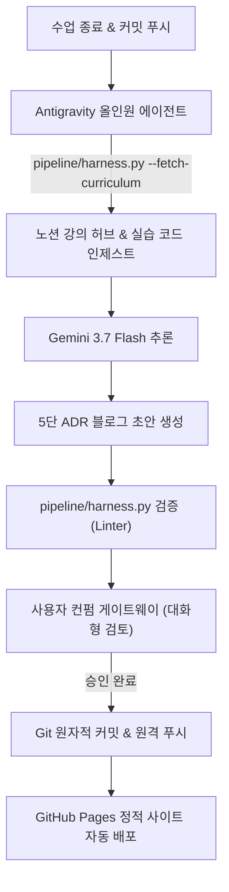

## 1. 개요 및 프로젝트 배경

보안 자동화 과정을 수강하며 학습한 기술과 실습 코드를 블로그에 지속적으로 기록하는 일은 장기적 성장에 필수적이다. 그러나 시중의 단순 문법 요약이나 강사 예제 코드를 복사해 붙여넣는 포스팅은 작성자에게도 독자에게도 차별성을 주지 못한다.

컴퓨터공학 관점에서 진정으로 기록해야 할 자산은 완성된 코드가 아니라, 기존 구현의 취약점과 병목을 분석하며 개선해 나간 엔지니어링 의사결정 과정이다. 특히 소스코드 주석에 기록한 구조적 고민과 단계별 리팩터링 및 구조 개선 과정을 누락 없이 포스트로 변환하고, 작성 및 배포 전 과정을 자동화하는 파이프라인 구축을 목표로 삼았다.

## 2. 전체 산출물 파이프라인 구조

DevLog 에이전트 파이프라인은 Everything-as-Code 철학에 따라 별도의 외부 유료 SaaS 없이 GitHub Native 인프라와 로컬 에이전트 오케스트레이션만으로 동작한다.

## 3. 기본 구현의 한계점

프로젝트 초기에는 GitHub Actions Cron을 사용하여 1회성 파이썬 스크립트(`generate_draft.py`)를 실행하고 Gemini API를 호출하도록 구성했다.

그러나 이 단순 스크립트 방식은 다음과 같은 치명적 한계를 드러냈다.

1. **심층 맥락 인제스트의 부재:** 단순 파이썬 스크립트 호출로는 커리큘럼 명세 블록의 동적 렌더링 데이터나 실습 디렉토리의 다층 파일 구조를 유연하게 파악하지 못해 피상적인 글이 생성되었다.
2. **실시간 대화형 자가 교정 불가:** 정적 CI 스크립트는 생성된 글이 하네스 린터 검증에 실패했을 때 에이전트가 자체적으로 오류를 분석하고 수정하는 피드백 루프를 수행할 수 없었다.
3. **독립 인프라 운영 비용:** 별도의 전용 웹 대시보드나 백엔드 서버를 구축하는 방식은 유지보수 부담과 클라우드 호스팅 비용을 발생시켰다.

## 4. 엔지니어링 의사결정 및 리팩터링

이러한 한계를 극복하기 위해 ADR-0002 아키텍처 결정을 통해 Antigravity 올인원 에이전트 오케스트레이션으로 전면 전환했다.

### 4.1. Antigravity 에이전트 올인원 오케스트레이션 전환 (ADR-0002)
CI 서버의 단순 실행 대신, 로컬 Antigravity 에이전트가 파일 시스템 탐색, 커리큘럼 컨텍스트 로더 실행(`--fetch-curriculum`), 실습 소스코드 분석, 하네스 자가 교정을 일괄 수행하는 올인원 워크플로우를 채택했다.

CI 서버의 완전 독립 실행을 일부 양보하는 대신, 로컬 에이전트의 멀티모달 컨텍스트 인제스트, 실시간 대화형 검토 및 무결성 제어 능력을 완벽히 확보하는 실용적 트레이드오프를 선택했다.

### 4.2. Gemini 3.7 Flash 및 Zero-Key 구동 체계
초고속 추론 성능을 제공하는 Gemini 3.7 Flash 모델을 채택하고, Antigravity 내장 엔진을 활용하여 별도의 유료 API 키 발급 및 관리 부담이 없는 Zero-Key 로컬 에이전트 런타임을 달성했다.

### 4.3. Astro Bento Blog 기반의 Monorepo 구축
초경량 정적 빌드 성능과 세련된 UI를 제공하는 Astro 프레임워크를 기반으로 블로그를 구축했다. 실습 코드와 블로그 문서를 단일 레포지토리로 통합하여 소스코드 변경과 문서화 사이의 원자적 정합성을 보장했다.

## 5. 검증 및 회고

GitHub Actions를 통한 정적 빌드와 GitHub Pages 배포 파이프라인을 성공적으로 연동했다. 별도의 인프라 비용 0원으로 완전히 자동화된 블로그 발행 시스템을 완성했다.

화려한 외부 도구에 의존하기보다, 버전 관리 시스템과 IDE 네이티브 기능을 극한으로 활용하는 것이 유지보수성 높은 개발자 도구를 만드는 핵심임을 입증했다.
