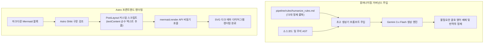

## 1. 개요 및 배경

블로그 자동화 파이프라인과 프론트엔드 정적 빌드 환경을 구축하는 과정은 순탄하지 않았다. 정적 사이트 생성기 Astro 6 빌드부터 클라이언트 다이어그램 렌더링, 파이썬 패키지 배포, 그리고 생성된 텍스트 품질 관리에 이르기까지 여러 레이어에서 기술 결함이 발생했다.

특히 생성 모델이 작성한 글 특유의 번역투와 어색한 어휘는 기술 블로그의 신뢰도를 떨어뜨리는 주원인이었다. 로컬 환경에만 머물던 휴머나이징 룰북을 지속적 통합 러너 환경으로 끌어올리고, 프론트엔드와 빌드 시스템의 결함을 외과적으로 해결한 과정을 정리한다.

## 2. 핵심 도전 과제 및 기술적 제약

파이프라인 구축 중 직면한 핵심 문제들은 다음과 같다.

1. **Astro 6 런타임 호환성 결함:** GitHub Actions 기본 러너 환경과 최신 Astro 6 요구사항 간의 Node.js 버전 불일치로 배포가 중단되는 현상.
2. **구문 강조기와 다이어그램 렌더러 간의 HTML 충돌:** 마크다운 내 Mermaid 코드 블록이 Shiki 하이라이팅을 거치며 HTML 태그로 분해되어 브라우저에서 다이어그램이 깨지는 문제.
3. **Setuptools 다중 패키지 빌드 충돌:** 여러 모듈 디렉토리가 공존하는 플랫 레이아웃 환경에서 `pip install` 빌드 실패.
4. **클라우드 러너의 룰북 부재로 인한 텍스트 품질 저하:** 로컬 에디터 스킬에 의존하던 텍스트 정제 규칙이 원격 CI 러너에서는 동작하지 않아 AI 특유의 괄호 영어와 상투어가 유입되는 현상.

## 3. 엔지니어링 의사결정 및 해결 방안

### 결함 1. Node.js 버전 불일치로 인한 Astro 6 배포 실패

* **증상:** 배포 워크플로우 실행 시 `Node.js v20 is not supported by Astro! Please upgrade to >=22.12.0` 에러가 발생하며 정적 사이트 빌드가 실패했다.
* **원인:** 최신 Astro 6 엔진은 안정적인 빌드를 위해 Node.js 22 LTS 이상을 필수로 요구하지만, 워크플로우 기본 노드 버전이 20으로 설정되어 있었다.
* **해결:** 배포 워크플로우 설정 파일의 노드 환경 셋업 단계를 `node-version: 22`로 상향 지정하여 호환성 문제를 즉시 해결했다.

### 결함 2. Shiki 구문 강조와 Mermaid 다이어그램 렌더러 충돌

* **증상:** 마크다운에 삽입한 Mermaid 다이어그램이 브라우저에서 렌더링되지 않고 깨진 코드 텍스트나 문법 오류로 노출되었다.
* **원인:** Astro의 빌트인 구문 강조기 Shiki가 Mermaid 블록 내부 텍스트를 파싱하여 여러 개의 HTML `span` 태그로 감싸면서, 클라이언트 Mermaid 라이브러리가 순수 텍스트 대신 HTML 엔티티를 전달받아 문법 파싱에 실패했다.
* **해결:** 레이아웃 컴포넌트에서 Shiki가 생성한 코드 블록의 `textContent`를 순수 문자열로 추출한 뒤, `mermaid.render()` 비동기 API를 직접 호출하여 다크 테마 SVG 컨테이너로 동적 치환하는 커스텀 클라이언트 렌더러를 구현했다.

### 결함 3. Setuptools 플랫 레이아웃 다중 패키지 빌드 충돌

* **증상:** 로컬 및 CI 환경에서 `pip install .` 실행 시 `Multiple top-level packages discovered in a flat-layout` 에러가 발생했다.
* **원인:** 저장소 루트에 `blog`, `pipeline`, `agent_core` 등 여러 디렉토리가 평평하게 공존하면서 빌드 도구가 패키지 루트를 식별하지 못했다.
* **해결:** `pyproject.toml` 파일에 `[tool.setuptools.packages.find]` 설정을 추가하고 빌드 대상을 `pipeline*` 디렉토리로 명시적으로 한정하여 충돌을 해소했다.

### 거버넌스 4. 한국어 휴머나이징 룰북 레포 내재화

* **증상:** 생성 모델이 `손상(Broken)`, `부작용(Side-Effect)` 등 불필요한 괄호 영어를 남발하고, 기계적인 접속사와 번역투를 반복했다.
* **원인:** 로컬 개발 도구에만 설치되어 있던 휴머나이징 스킬이 원격 클라우드 러너에는 전달되지 못하는 환경 격차가 존재했다.
* **해결:** 72대 핵심 텍스트 정제 룰북을 `pipeline/rules/humanize_rules.md` 파일로 저장소에 직접 내재화했다. 초고 생성 시 이 룰북을 시스템 프롬프트에 자동 주입하여 불필요한 괄호 영어를 차단하고, 공인 대문자 표준 약어만 선별 허용하도록 거버넌스를 확립했다.

## 4. 시스템 아키텍처 및 워크플로우

렌더링 파이프라인과 휴머나이징 거버넌스 주입 워크플로우는 다음과 같이 상호 보완적으로 작동한다.

워크플로우 단계별 동작은 다음과 같다.
1. 초고 생성기가 저장소 내재화된 룰북을 읽어와 프롬프트에 주입하고, 번역투가 제거된 정제 텍스트를 생성한다.
2. 마크다운 빌드 시 Shiki가 코드를 하이라이팅한 후 브라우저로 전달한다.
3. 클라이언트 스크립트가 Mermaid 블록에서 오염된 HTML 태그를 걷어내고 순수 텍스트만 뽑아 비동기 렌더러로 넘긴다.
4. 브라우저 화면에 깨짐 없이 완벽한 SVG 다이어그램이 주입된다.

## 5. 성과 및 회고

이번 트러블슈팅과 품질 거버넌스 수립을 통해 다음과 같은 공학적 교훈을 얻었다.

1. **외과적 문제 해결의 중요성:** 라이브러리 간의 간섭(Shiki와 Mermaid)이나 런타임 버전 충돌을 마주했을 때, 불필요한 서드파티 패키지를 추가하기보다 순수 표준 API와 설정 조정으로 최소 변경 해결책을 도출했다.
2. **규칙의 레포 내재화:** 개발 환경에 종속된 도구는 클라우드 자동화 환경에서 실패한다. 품질 검증 규칙과 린터를 저장소 내 자산으로 함께 관리할 때 일관된 산출물 무결성을 보장할 수 있다.
3. **독자 중심의 가독성 확보:** 괄호 영어를 걷어내고 자연스러운 한국어 문장 구조를 확립함으로써, 기술적 깊이를 유지하면서도 읽기 편한 블로그 포스트를 지속 생산할 수 있는 기반을 마련했다.
