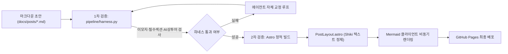

## 1. 개요 및 배경

블로그 자동화 파이프라인과 프론트엔드 정적 빌드 환경을 구축하는 과정은 순탄하지 않았다. 정적 사이트 생성기 Astro 6 빌드부터 클라이언트 다이어그램 렌더링, 파이썬 패키지 배포, 그리고 생성된 텍스트 무결성 관리에 이르기까지 여러 계층에서 결함이 발생했다.

특히 생성 모델이 작성한 글 특유의 번역투와 어색한 어휘는 기술 블로그의 신뢰도를 떨어뜨리는 주요 원인이었다. 로컬 환경에 머물던 휴머나이징 룰북을 레포지토리 내부 린터(`pipeline/harness.py`)로 내재화하고, 프론트엔드와 빌드 시스템의 결함을 정밀하게 해결한 과정을 기록한다.

## 2. 전체 산출물 파이프라인 구조

트러블슈팅과 품질 거버넌스가 결합된 2중 검증 및 정적 렌더링 아키텍처는 다음과 같이 동작한다.

## 3. 기본 구현의 한계점

초기 파이프라인 환경에서는 5가지 핵심적인 기술 결함이 발생하여 배포와 가독성을 저해했다.

1. **Astro 6 런타임 호환성 결함:** Node.js 20 환경에서 최신 Astro 6 빌드 시도 시 버전 불일치 에러(`Node.js v20 is not supported by Astro`)가 발생하며 CI가 중단되었다.
2. **Shiki 하이라이터와 Mermaid 충돌:** Astro의 Shiki 구문 강조기가 Mermaid 코드 블록을 HTML span 태그로 분해하여, 브라우저의 Mermaid 렌더러가 문법 에러를 일으키며 다이어그램이 깨졌다.
3. **Setuptools Flat-Layout 빌드 충돌:** `pip install .` 실행 시 `Multiple top-level packages discovered` 에러가 발생해 파이썬 패키지 배포가 실패했다.
4. **SPA 렌더링 명세 수집 한계:** 커리큘럼 허브 웹페이지가 JavaScript SPA로 렌더링되어 단순 HTTP 요청으로는 빈 스켈레톤 HTML만 반환되었다.
5. **전역 Git Hook 마찰:** 커밋 훅이 실습 소스코드나 파이프라인 스크립트 수정까지 무차별 차단하여 개발 생산성을 저해했다.

## 4. 엔지니어링 의사결정 및 리팩터링

다섯 가지 결함을 외과적으로 해결하고 품질 린터를 내재화했다.

### 4.1. 5대 기술 결함 해결
- **Node.js 버전 상향:** `.github/workflows/deploy-blog.yml`의 `setup-node` 스텝을 `node-version: 22`로 상향하여 Astro 6 엔진 호환성을 확보했다.
- **Mermaid 커스텀 클라이언트 렌더러 구축:** `PostLayout.astro`에서 Shiki 코드 블록의 `textContent`를 순수 텍스트로 정제한 후 `mermaid.render()` 비동기 API를 호출하여 다크 테마 SVG 컨테이너로 교체하는 로직을 구현했다.
- **패키지 빌드 스코프 한정:** `pyproject.toml`에 `[tool.setuptools.packages.find]` 설정을 추가하여 빌드 대상을 `pipeline*` 디렉토리로 명시 한정했다.
- **커리큘럼 컨텍스트 로더 개발 (`context_loader.py`):** 원격 엔드포인트를 호출하여 메인 과목/일차 맵을 구축하고 세부 실습 명세를 재귀적으로 파싱하는 컨텍스트 로더를 구현했다. 특정 허브 식별자는 `.env` 환경변수로 격리하여 보안성을 확보했다.
- **선택적 Git Hook 가드레일 확립:** `git diff --cached`를 검사하여 `docs/posts/` 수정이 포함된 경우에만 `.user_confirmed` 토큰을 요구하고, 일반 코드 커밋은 자유롭게 통과시키는 선택적 물리 차단 체계를 구축했다.

### 4.2. 한국어 휴머나이징 거버넌스 및 결정론적 하네스 (`harness.py`)
`im-not-ai` 기준의 룰북을 레포지토리 내에 통합하고, `pipeline/harness.py`를 통해 다음 규칙을 엄격히 검증하도록 강제했다.
- 유니코드 이모지 및 특수 픽토그램 일체 배제
- 필수 ADR 마크다운 헤더(`#`, `##`) 포함 여부
- Mermaid 다이어그램 블록 문법 유효성
- 기계적 대구 및 상투적 도입부/결미 표현 검출
- 불필요한 번역투 괄호 영어 병기 차단 (공인 대문자 약어 IDS, SOAR, REST 등만 허용)

## 5. 검증 및 회고

`pipeline/harness.py` 검증과 `npm --prefix blog run build`를 순차 실행하여 8개 포스트 전체가 2중 검증을 100% 통과함을 확인했다.

다이어그램 렌더링부터 텍스트 품질 검증까지 다계층 결함을 체계적으로 격리하고 해결함으로써, 안정적이고 신뢰할 수 있는 개발 블로그 자동화 환경을 구축했다.
