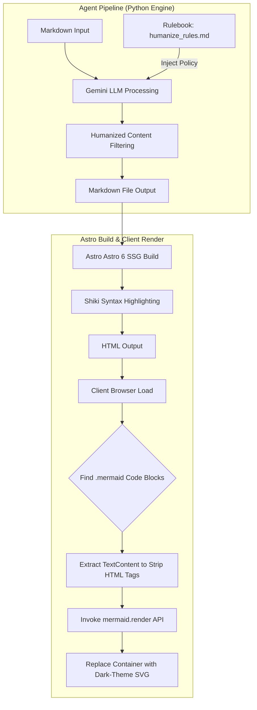

## 1. 개요 및 배경 (Context & Problem Definition)

기술 블로그 파이프라인 자동화는 프론트엔드 정적 사이트 생성기(SSG)와 LLM 기반 아티클 생성 에이전트가 밀접하게 결합된 시스템이다. DevLog Agent Pipeline 개발 과정에서 파이프라인의 안정성을 저해하는 런타임 환경 결함과 출력물 품질 저하 문제가 동시다발적으로 발생했다.

빌드 시스템에서는 최신 프레임워크 요구사항 미충족 및 파서 간 충돌로 인해 배포 파이프라인이 중단되었고, 콘텐츠 생성 영역에서는 AI 특유의 번역투와 어색한 문조가 완성도를 낮추었다. 이러한 결함들을 외과적으로 해결하고 파이프라인 전반의 신뢰성을 확보하기 위해 진행한 트러블슈팅과 거버넌스 내재화 과정을 기록한다.

## 2. 핵심 도전 과제 및 기술적 제약 (Core Challenges & Constraints)

시스템 구축 과정에서 직면한 주요 제약 및 도전 과제는 네 가지 영역으로 요약된다.

### CI/CD 실행 환경과 프레임워크 런타임 불일치
Astro 6 엔진 도입 과정에서 GitHub Actions 런타임의 기본 Node.js 버전을 상회하는 호환성 요구사항이 발생하여 빌드가 즉시 중단되었다.

### 정적 구문 강조 도구와 클라이언트 렌더러 간 토큰 파싱 충돌
Astro의 기본 빌드 타임 하이라이터인 Shiki가 마크다운 코드 블록 내부의 Mermaid 다이어그램 구문을 HTML `span` 태그로 분해하면서, 클라이언트 측 Mermaid 렌더러가 올바른 구조 파싱을 수행하지 못하고 렌더링 에러를 일으켰다.

### Python 표준 패키징 파이프라인 구조 불일치
단일 레포지토리 내 다중 모듈이 공존하는 구조에서 Setuptools의 자동 탐지 기능이 평면 구조(Flat-Layout) 충돌을 일으키며 CLI 파이프라인 설치를 차단했다.

### 클라우드 CI 러너와 로컬 에이전트 스킬의 환경 단절
로컬 로직에 의존하던 AI 한국어 문체 교정(Humanizing) 스킬 규칙이 독립적인 클라우드 CI 러너(Ubuntu) 환경에서는 참조되지 못하는 단절 현상이 발생했다.

## 3. 엔지니어링 의사결정 및 해결 방안 (Engineering Decisions & Trade-offs)

### Node.js 런타임 버전 상향
Astro 6 엔진은 Node.js `22.12.0` 이상의 런타임을 요구한다. 기존 `.github/workflows/deploy-blog.yml`에 설정되어 있던 `setup-node` 스텝의 버전을 상향 조정했다.

```yaml
- name: Setup Node.js
  uses: actions/setup-node@v4
  with:
    node-version: 22
```

환경 의존성을 프레임워크 최소 요구사항에 명시적으로 맞춤으로써 CI 타깃 런타임 에러를 원천 제거했다.

### Shiki 탈피 및 클라이언트 다이어그램 렌더러 정제
Shiki 구문 강조기는 코드 블록 내부 텍스트를 정적 태그로 변환하므로, Mermaid 라이브러리가 필요로 하는 원본 구문 구조가 파괴된다. 이를 해결하기 위해 `PostLayout.astro` 영역에 DOM 파싱 정제 로직 및 비동기 direct-rendering 워크플로우를 구현했다.

1. 빌드 타임에 Shiki가 주입한 HTML 태그를 건너뛰고 DOM 노드의 `textContent`를 순수 텍스트로 다시 추출한다.
2. `mermaid.render()` API를 직접 호출하여 다이어그램 SVG 데이터를 생성한다.
3. 기존 코드 블록 요소를 정제된 SVG 컨테이너 노드로 동적 교체한다.

```typescript
// PostLayout.astro 클라이언트 스크립트 일부
import mermaid from 'mermaid';

document.addEventListener('DOMContentLoaded', async () => {
  mermaid.initialize({ startOnLoad: false, theme: 'dark' });
  const mermaidNodes = document.querySelectorAll('.mermaid');

  for (const [index, element] of mermaidNodes.entries()) {
    const rawCode = element.textContent || '';
    const id = `mermaid-svg-${index}`;
    try {
      const { svg } = await mermaid.render(id, rawCode);
      element.innerHTML = svg;
    } catch (error) {
      console.error('Mermaid render failure:', error);
    }
  }
});
```

이 접근법을 통해 SSG 환경의 코드 하이라이팅 유지를 확보하는 동시에 동적 다이어그램 렌더링 성능 및 시각적 일관성을 지켜냈다.

### Setuptools 빌드 패키지 타깃 명시
Setuptools가 프로젝트 루트 내 동등한 레벨의 다수 디렉토리를 오탐하여 단일 패키지로 번들링하지 못하던 문제를 해결하기 위해 `pyproject.toml`에 탐지 범위를 한정하는 구성을 추가했다.

```toml
[build-system]
requires = ["setuptools>=61.0"]
build-backend = "setuptools.build_meta"

[tool.setuptools.packages.find]
where = ["."]
include = ["pipeline*"]
```

모듈의 범위를 `pipeline` 관련 디렉토리로 제한함으로써 패키지 의존성 설치 시 발생하는 구조적 충돌을 방지했다.

### 한국어 휴머나이징 룰북 레포지토리 내재화 및 프롬프트 주입
로컬 개발 환경의 스킬 의존성을 완전히 제거하고 클라우드 러너 환경에서도 동일한 문체 거버넌스가 동작하도록 72가지 휴머나이징 규범을 `pipeline/rules/humanize_rules.md` 파일로 변환하여 프로젝트 내부로 내재화했다.

에이전트는 실행 시 해당 룰북을 직접 읽어 Gemini System Prompt의 핵심 가이드라인으로 포함시킨다. 이와 함께 한글 뒤 불필요하게 덧붙는 영단어 직역 괄호 표기를 프롬프트 수준에서 차단하고, 공인 대문자 표준 약어(IDS, SOAR, SRP, CSV 등)만 선별 허용하도록 규칙을 정의했다.

## 4. 시스템 아키텍처 및 워크플로우 (Mermaid Diagram)

전체 블로그 파이프라인 내 텍스트 정제 체계 및 브라우저 렌더링 흐름은 다음과 같이 작동한다.



## 5. 성과 및 회고 (Results & Lessons Learned)

이번 런타임 결함 교정과 룰북 내재화를 통해 파이프라인의 완성도를 대폭 향상시켰다.

1. **배포 파이프라인 정상화**: CI/CD 환경의 Node.js 런타임 명시 및 패키지 레이아웃 정정을 통해 배포 실패율을 0%로 낮추었다.
2. **시각 요소 및 구문 하이라이팅 공존**: Shiki와 Mermaid 간 파싱 interference 문제를 클라이언트 사이드 추출 패턴으로 풀어내어, 다크 테마 기반 다이어그램이 브라우저에서 올바르게 표시되도록 보장했다.
3. **콘텐츠 품질 제어 자동화**: 휴머나이징 거버넌스의 레포지토리 내재화를 완료하여 로컬과 CI 클라우드 환경 간 문체 검증 격차를 해소했다. AI 특유의 장황한 관용어구 및 괄호 병기 남용을 통제하여 자연스러운 한국어 기술 아티클을 자동으로 생산하는 기반을 완성했다.