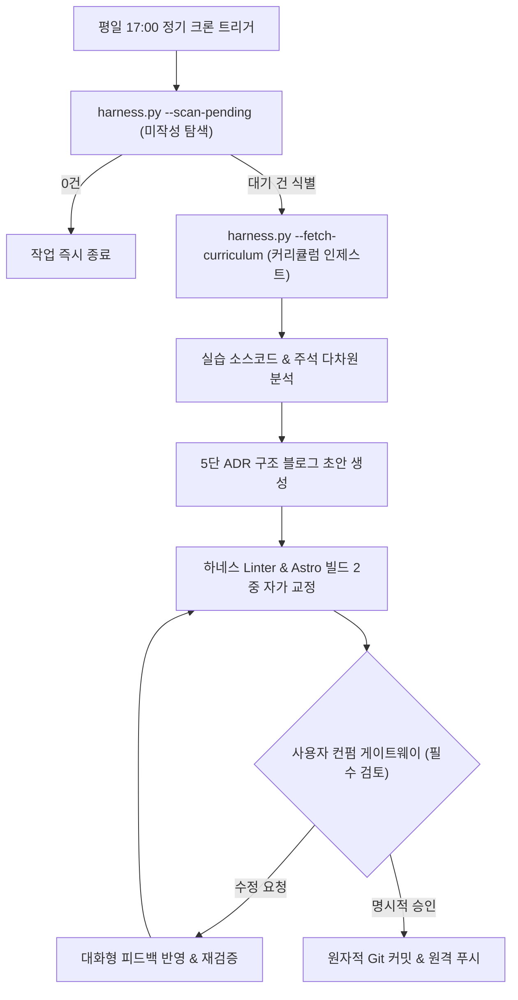

## 1. 개요 및 배경

완전 무인 배치 스케줄러 기반 자동화는 이론상 매력적이지만 실제 운영 환경에서는 여러 취약점을 드러낸다. 정해진 시간에만 일방적으로 실행되는 배치 스케줄러는 개발자의 커밋 리듬과 일치하지 않으며, 클라우드 인프라의 스케줄 지연으로 적시에 초안을 검토하기 어렵다.

또한 인공지능이 작성한 초안을 인간의 검증 없이 그대로 발행하는 방식은 환각이나 맥락 왜곡 위험을 피할 수 없다. 이에 따라 개발자가 별도의 명령을 내리지 않아도 정기 스케줄에 맞춰 초안이 백그라운드에서 준비되고, Antigravity 에이전트와 실시간 대화로 수정하고 확정하는 대화형 공동 저작 워크플로우를 설계했다.

## 2. 전체 산출물 파이프라인 구조

DevLog 에이전트의 자율 스케줄링 및 공동 저작 파이프라인은 다음과 같은 제로 커맨드 흐름으로 가동된다.

## 3. 기본 구현의 한계점

GitHub Actions의 무료 Cron 스케줄러에 의존하던 초기 구현은 다음과 같은 운영상 결함을 겪었다.

1. **클라우드 스케줄러의 실행 지연 및 누락:** GitHub Actions Cron은 피크 시간대에 수십 분에서 수 시간까지 실행이 지연되거나 간헐적으로 누락되는 문제가 발생했다.
2. **단방향 텍스트 생성의 한계:** CI 러너 내에서의 단순 스크립트 실행은 사람이 개입하여 초안의 기술적 논리를 보정하거나 질문을 던질 수 있는 인터랙션 창구가 전무했다.
3. **무검증 자동 배포의 위험성:** 인간의 명시적 승인 절차 없이 생성된 글이 곧바로 원격 브랜치에 배포될 경우 오개념이나 오타가 외부에 그대로 노출되었다.

## 4. 엔지니어링 의사결정 및 리팩터링

세 가지 핵심 설계를 통해 개발자와 에이전트가 협업하는 안정적인 저작 환경을 확립했다.

### 4.1. Antigravity Scheduled Tasks 전환 및 제로 커맨드 환경
클라우드 Cron의 불확실성을 배제하고, Antigravity IDE의 `Scheduled Tasks` 기능(평일 17:00: `0 17 * * 1-5`)을 채택했다. 수업 종료 시점에 에이전트가 스스로 깨어나 당일 실습 코드를 분석하고 초안을 대기시킨다. 개발자는 수동으로 명령을 내릴 필요가 없다.

### 4.2. 강제 확인 게이트웨이 설계
에이전트가 하네스 검증과 빌드 테스트를 100% 통과한 초고를 작성하더라도, **사용자의 명시적 승인이 있기 전에는 절대로 `git commit` 및 `git push`를 실행하지 못하도록** 정책을 강제했다. 사용자가 수정을 요구하면 대화를 통해 즉각 반영하고, 최종 승인 시에만 원자적 커밋 시퀀스로 안전하게 배포한다.

### 4.3. 3단 비교 스토리라인 및 주석 다차원 분석 공식화
포스트의 기술적 설득력을 확보하기 위해 3단 대조 스토리라인을 체계화했다.
1. **베이스라인 코드 제시:** 커리큘럼 명세에서 추출한 나이브한 베이스라인 코드 스니펫 제시.
2. **실무적 결함 분석:** 대용량 트래픽 및 운영 환경에서 해당 코드가 유발하는 병목, 예외 미처리, 메모리 누수 분석.
3. **단계별 구현 대조:** 1차 동작 중심 구현(`*practice.py`)과 구조를 고도화한 클린 코드(`*llm.py`)의 차이점 및 교훈 서술.

또한 소스코드 주석을 '개념 및 원리 메모'(1번 섹션)와 '설계 고민 및 문제의식'(3·4번 섹션)으로 분리 배치하여 기술적 깊이를 확보했다.

## 5. 검증 및 회고

평일 17:00 정기 크론 트리거부터 커리큘럼 인제스트, 하네스 자가 교정, 사용자 컨펌 대기까지의 전 사이클이 매끄럽게 동작함을 검증했다.

인공지능을 단순한 텍스트 생성 도구가 아닌 엔지니어링 동료로 격상시키고, 엄격한 품질 게이트웨이와 대화형 피드백을 결합할 때 비로소 진정한 자율 소프트웨어 개발 파이프라인이 완성됨을 확인했다.
