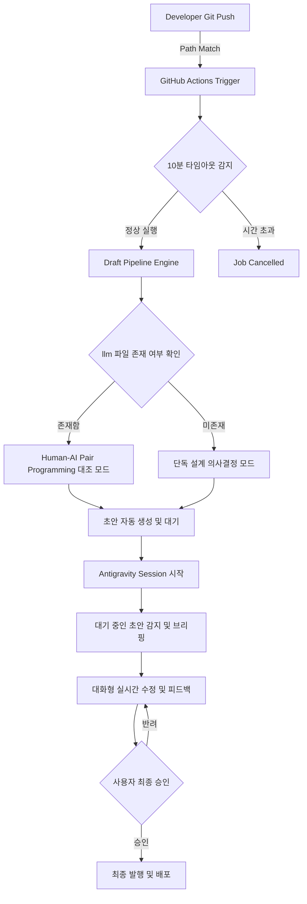

## 1. 개요 및 배경 (Context & Problem Definition)

개발 파이프라인에서 기술 블로그 아티클을 자동으로 작성하는 파이프라인을 운영할 때, 초기에는 주기적 Cron 스케줄러 방식으로 초안을 자동 생성하도록 구성했습니다. 그러나 Cron 기반 작업은 배포 일정의 정시성을 보장하기 어렵고, 실제 코드 변경 시점과 아티클 생성 시점 사이의 불일치를 유발했습니다.

더불어 사용자가 매번 "아티클을 작성하라"는 명령어를 터미널이나 에이전트 인터페이스에 직접 입력해야 하는 번거로움이 존재했습니다. 명령 기반 방식은 개발자의 작업 흐름을 끊고, 작성 대상이 되는 코드 변경 내용을 수동으로 짚어주어야 하는 한계를 지녔습니다.

이 문제를 해결하기 위해 코드 변경을 감지하는 순간 즉시 초안을 자동 생성하는 파이프라인으로 전환했습니다. 나아가 에이전트 세션 접속 시 대기 중인 초안을 바로 브리핑하고 대화형으로 내용을 수정해 최종 발행까지 이어지는 Co-Authoring 구조를 설계했습니다.

## 2. 핵심 도전 과제 및 기술적 제약 (Core Challenges & Constraints)

스케줄링 방식의 전환과 대화형 공저 아키텍처를 도입하는 과정에서 크게 세 가지 기술적 과제가 드러났습니다.

첫째, GitHub Actions의 기본 Cron 스케줄러가 지닌 실행 지연 문제입니다. 무료 플랜 환경에서 Cron 작업은 작업 큐 적체 상황에 따라 수 시간 이상 실행이 딜레이되거나 아예 실행이 누락되는 현상이 빈번했습니다. 실시간성에 의존하는 자동화 파이프라인에는 치명적이었습니다.

둘째, 무한 대기 및 리소스 낭비 위험성입니다. 특정 경로에 코드 변경이 일어날 때마다 LLM 파이프라인이 호출되므로, 러너 스케줄링이 지연되거나 내부 로직에서 병목이 발생할 경우 작업 세션이 무한히 대기 상태로 남아 빌드 크레딧을 소모할 수 있었습니다.

셋째, 생성되는 기술 문서의 환각 및 개연성 부족 문제입니다. 코드베이스의 맥락 없이 LLM이 아티클을 작성하도록 두면, 존재하지 않는 함수나 설계를 지어내는 문제가 발생했습니다. 특히 단순한 교재용 모범 답안 수준의 코드와 실제 운영 환경을 고려한 코드 사이의 차이를 명확히 비교 서술하는 장치가 필요했습니다.

## 3. 엔지니어링 의사결정 및 해결 방안 (Engineering Decisions & Trade-offs)

### 트리거 체계 재편 및 제한 시간 설정
기존 Cron 중심의 스케줄링 구조를 이벤트 기반 트리거로 재편했습니다. 코드가 관리되는 핵심 경로인 `agent_core/**`, `network_zt/**`, `projects/**` 범위 내에서 변경사항이 발생하여 `git push`가 이루어지면 파이프라인이 즉시 가동하도록 바꿨습니다. 기존 Cron 스케줄링은 매일 18시에 동작하는 보조 백업 수단으로만 남겨두었습니다.

또한 러너 지연으로 인한 작업 교착을 막기 위해 워크플로우 레벨에 `timeout-minutes: 10` 타임아웃을 강제했습니다. 10분 이내에 완료되지 않는 프로세스는 즉시 종료하도록 처리하여 리소스 낭비를 방지했습니다.

```yaml
on:
  push:
    paths:
      - 'agent_core/**'
      - 'network_zt/**'
      - 'projects/**'
  schedule:
    - cron: '0 9 * * *' # 보조 백업 (UTC 09:00 = KST 18:00)

jobs:
  generate-draft:
    runs-on: ubuntu-latest
    timeout-minutes: 10
    steps:
      - name: Checkout Code
        uses: actions/checkout@v4
      # 파이프라인 실행 로직 생략
```

### Zero-Command 대화형 공저 워크플로우 설계
사용자가 파이프라인을 직접 호출하지 않는 Zero-Command 경험을 구축했습니다.

1. 개발자가 코드를 작성하고 푸시하면 백그라운드 파이프라인이 즉시 초안을 작성하여 가상 작업 공간에 저장해 둡니다.
2. 사용자가 개발 환경에서 Antigravity 세션을 열면, 에이전트가 "대기 중인 초안" 존재 여부를 먼저 탐지합니다.
3. 에이전트가 생성된 초안의 개요를 사용자에게 브리핑합니다.
4. 사용자는 대화창에서 "개념 설명 보강", "다이어그램 수정"과 같은 피드백을 전달하며 실시간 윤문을 진행합니다.
5. 최종 검토가 완료되면 사용자의 승인 명령 하나로 발행과 배포가 실행됩니다.

### 3단 대조 스토리라인 및 조건부 분기 로직
콘텐츠의 품질과 기술적 깊이를 보장하기 위해 글 구조를 3단 대조 프레임워크(Baseline -> Problem -> Solution)로 표준화했습니다.

- Baseline: 일반적인 교재 수준의 기초 코드를 제시합니다.
- Problem: 비정형 데이터 처리 실패, 메모리 누수, 예외 미처리 등 대용량 운영 환경에서 해당 코드가 깨지는 지점과 문제의식을 밝힙니다.
- Solution: 이를 해결하기 위한 엔지니어링 개선 시도와 최적화 결과를 대조하여 기술합니다.

여기서 AI 환각을 방지하기 위해 파일 명명 규칙에 따른 조건부 분기 방식을 적용했습니다. 작업 디렉토리 내에 `*llm*.py`와 같이 AI 페어 프로그래밍 흔적이 남은 파일이 실제 존재할 때만 단독 개발과 AI 협업의 대조 분석을 수행하도록 로직을 구현했습니다. 해당 조건에 부합하는 파일이 없으면 에이전트는 단독 설계 의사결정 모드로 자동 전환되어 추측성 서술을 배제합니다.

## 4. 시스템 아키텍처 및 워크플로우 (Mermaid Diagram)

전체 파이프라인의 흐름은 아래 다이어그램과 같습니다. Push 이벤트 수신부터 초안 대기, Antigravity 에이전트와의 실시간 세션 대화 및 최종 배포까지 일관된 구조로 이어집니다.



## 5. 성과 및 회고 (Results & Lessons Learned)

이번 파이프라인 개편을 통해 수동 명령 입력 없이도 최신 코드 변경사항이 담긴 기술 문서 초안을 지속해서 확보하는 체계를 마련했습니다. Cron 스케줄러의 실행 미흡이나 지연 이슈에 영향을 받지 않고, 푸시 시점 바로 초안 작성이 이루어져 작업 신뢰도가 향상되었습니다.

대화형 Co-Authoring 방식을 도입함에 따라 완전히 무인으로 동작할 때 발생하던 환각 현상이나 맥락 누락 문제를 크게 개선했습니다. 백그라운드에서 작성된 초안을 바탕으로 에이전트와 교정 대화를 나누는 형태는 작성 시간을 단축하면서도 문서의 세밀함을 유지해 주었습니다.

또한 `*llm*.py` 조건부 분기와 같은 제약 조건을 파이프라인 내부 로직으로 구현함으로써, 생성형 모델이 자의적으로 맥락을 지어낼 위험을 사전에 차단할 수 있었습니다. 자동화의 범위를 늘리는 것만큼이나 적절한 통제 장치를 설계에 포함하는 일이 안정적인 파이프라인 구축의 핵심임을 확인했습니다.