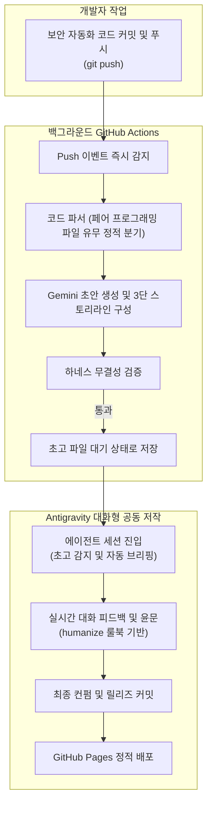

## 1. 개요 및 배경

완전 무인 스케줄러 기반 자동화는 이론상 매력적이지만 실제 운영 환경에서는 여러 취약점을 드러낸다. 정해진 시간에만 실행되는 배치 스케줄러는 개발자의 커밋 리듬과 일치하지 않으며, 클라우드 환경의 스케줄 지연으로 적시에 초안을 받아보기 어렵다.

또한 인공지능이 혼자서 처음부터 끝까지 작성한 글은 미묘한 문맥 오류나 환각을 내포하기 쉽다. 이에 따라 개발자가 별도의 명령을 내리지 않아도 코드를 푸시하는 순간 초안이 백그라운드에서 준비되고, Antigravity 에이전트와 실시간 대화로 수정하고 확정하는 공동 저작 워크플로우를 설계했다.

## 2. 핵심 도전 과제 및 기술적 제약

안정적이고 실시간성 높은 파이프라인을 구축하기 위해 풀어야 했던 과제는 다음과 같다.

1. **클라우드 스케줄러의 실행 지연과 미실행 위험:** GitHub Actions의 무료 크론 스케줄러는 트래픽에 따라 수 시간의 지연이 발생하거나 아예 실행되지 않고 누락되는 현상이 빈번했다.
2. **명령 입력의 인지적 비용:** 매번 개발자가 에이전트에게 "오늘 학습한 코드로 블로그 글을 써달라"고 지시하는 행위 자체가 자동화의 본질을 훼손하는 번거로움이었다.
3. **조건부 페어 프로그래밍 코드 부재 시의 모델 환각:** 페어 프로그래밍 비교 대상 코드가 없는 날에도 인공지능이 가상의 대조군을 지어내어 비교하는 거짓 생성 위험이 존재했다.
4. **글의 개연성과 스토리라인 부재:** 단순 코드 나열만으로는 독자가 왜 이 코드가 필요한지 공감하기 어려웠다.

## 3. 엔지니어링 의사결정 및 해결 방안

### 의사결정 1. Cron 스케줄러에서 실시간 Push 이벤트로의 전환

* **고민:** 특정 시각에 일괄 동작하는 크론 스케줄러를 유지할 것인가, 코드 변경 즉시 반응하는 이벤트 주도 방식으로 전환할 것인가.
* **분석:** 크론 스케줄러는 정시성을 보장하지 못하며 개발자가 작업을 마친 시점과 발행 시점 사이에 긴 간극을 만든다.
* **결정:** 주요 코드 경로에 `git push`가 일어나는 즉시 트리거되는 Push 이벤트를 메인 파이프라인으로 전환했다. 기존 18시 크론은 보조 백업으로 두고, 워크플로우에 10분의 실행 제한 시간을 부여하여 무한 대기 현상을 차단했다.

### 의사결정 2. 제로 커맨드 초안 대기와 실시간 대화형 컨펌

* **고민:** 생성된 초안을 사람의 검토 없이 즉시 배포할 것인가, 웹 UI를 둘 것인가.
* **분석:** 완전 자동 배포는 기술적 오류나 환각을 검증할 수 없고, 별도 웹 검토 화면은 관리 비용을 초래한다.
* **결정:** 제로 커맨드 아키텍처를 도입했다. 개발자는 글 작성을 요청할 필요가 없다. 코드를 푸시하면 백그라운드에서 초안을 생성해 저장해 둔다. 이후 개발자가 에이전트 세션에 접속하면 에이전트가 대기 중인 초고를 스스로 감지하여 브리핑하고, 개발자는 채팅창에서 실시간으로 피드백을 주며 글을 가다듬은 뒤 승인 커밋을 생성한다.

### 의사결정 3. 3단 대조 스토리라인과 조건부 분기 로직

* **고민:** 다양한 성격의 실습 코드에 대해 일관되면서도 설득력 있는 기술 서사를 어떻게 부여할 것인가.
* **분석:** 단순히 최종 코드만 보여주면 개선의 가치가 드러나지 않으며, 페어 프로그래밍 파일이 없는데도 억지로 비교를 시도하면 환각이 발생한다.
* **결정:** 베이스라인, 문제의식, 최종 해결책으로 이어지는 3단 대조 스토리라인을 템플릿에 공식화했다. 튜토리얼 수준의 기본 코드가 실제 트래픽이나 예외 상황에서 깨지는 이유를 서술하고, 나의 개선 코드와 최적화 로직을 대조하도록 구성했다. 특히 페어 프로그래밍 소스 파일이 존재하는 경우에만 비교 섹션을 활성화하고, 없을 때는 단독 설계 의사결정 모드로 자동 전환하도록 파서에 정적 분기를 구현했다.

## 4. 시스템 아키텍처 및 워크플로우

Push 이벤트 트리거부터 대화형 컨펌까지의 전체 흐름은 다음과 같다.

워크플로우 단계별 동작은 다음과 같다.
1. 개발자가 작업을 마치고 저장소에 푸시하면 GitHub Actions가 즉각 반응하여 실행을 시작한다.
2. 파서가 코드 디렉터리를 스캔하여 페어 프로그래밍 파일 존재 여부를 판별하고 적합한 프롬프트 템플릿을 선택한다.
3. 3단 스토리라인에 맞춰 초안이 생성되고 하네스 검증을 거쳐 저장소에 대기한다.
4. 개발자가 에이전트 세션을 시작하면 에이전트가 대기 중인 초안을 불러와 브리핑하고, 실시간 피드백을 반영해 완벽한 글로 다듬은 뒤 최종 배포한다.

## 5. 성과 및 회고

이번 아키텍처 개편을 통해 얻은 공학적 성과는 다음과 같다.

1. **인지적 마찰 제거:** 글을 써달라는 프롬프트를 고민할 필요 없이, 코드를 푸시하고 에이전트 세션을 켜는 것만으로 글 작성이 시작되는 매끄러운 개발자 경험을 확립했다.
2. **환각 없는 결정론적 분기:** 인공지능의 자율성에만 의존하지 않고 소스코드 파일 구조에 따른 정적 분기 로직을 파이프라인에 둠으로써 잘못된 정보 생성을 근본적으로 차단했다.
3. **독자 설득력 강화:** 베이스라인 코드의 한계와 실무 제약을 먼저 짚고 해결책을 제시하는 3단 서사 구조를 통해, 기술적 깊이와 학습 맥락을 동시에 갖춘 양질의 포스트를 꾸준히 발행할 수 있게 되었다.
