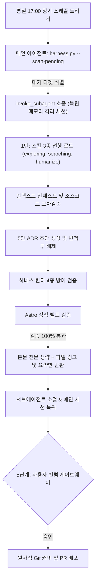

## 1. 개요 및 배경

정기 스케줄러 기반의 제로 커맨드 파이프라인(Part 3)을 실제 며칠간 연속 운영하면서, 설계 단계에서 예측하지 못했던 새로운 운영 결함들이 식별되었다.

1. **단일 세션 장기 운영에 따른 컨텍스트 과부하:** 동일 대화 세션에서 매일 스케줄러가 구동되면서 수만 줄의 소스코드, 커리큘럼 명세, Astro 빌드 로그, 초안 전문이 누적되었다. 이로 인해 추론 지연과 비용이 증가하고, 이전 일차(Day 05, Day 06)의 맥락이 신규 일차로 침범하는 컨텍스트 오염 위험이 발생했다.
2. **AI 번역투 괄호 영단어 잔존:** 프롬프트 지침만으로는 `경보(Alert)`, `도구(Tool)`와 같은 기계 번역투 괄호 표기를 모델이 자의적으로 통과시키는 품질 누락이 일어났다.
3. **린터의 경직성과 유지보수 부채:** 소스코드 내 화이트리스트 하드코딩으로 인해 신규 기술 용어 추가 시 파이썬 코드를 매번 수정해야 했으며, '뿐만 아니라' 같은 자연스러운 한국어 표현을 정규식으로 무차별 차단할 경우 정상 문장이 파괴되는 과교정 문제가 드러났다.

이러한 문제를 해결하기 위해 서브에이전트 컨텍스트 격리, 토큰 최적화, 그리고 4중 심층 방어 린터 아키텍처(ADR-0004)를 구축했다.

## 2. 전체 산출물 파이프라인 구조

서브에이전트 격리와 린터 심층 방어가 결합된 전체 워크플로우다.

## 3. 기본 구현의 한계점

초기 단일 세션 연속 구동 방식과 단순 문자열 린터는 다음 세 가지 구조적 결함을 안고 있었다.

1. **메인 세션 토큰 폭발:**
   매 회차마다 생성된 수천 토큰의 마크다운 초안 전문을 대화창에 모두 출력하면서 메인 세션의 컨텍스트 윈도우가 빠르게 잠식되었다.
2. **화이트리스트 유지보수 경직성:**
   파이썬 세트에 `API`, `LLM` 등을 직접 기재하는 방식은 신규 라이브러리가 등장할 때마다 코드를 직접 패치해야 하는 영구적인 유지보수 부채를 낳았다.
3. **비결정론적 자연어 표현의 기계적 오탐:**
   `뿐만 아니라`, `을 통해` 같은 일반 접속/조사를 정규식으로 차단하면 정상적인 기술 설명 문장까지 무차별 에러로 판정되어 문장이 기형적으로 왜곡되었다.

## 4. 엔지니어링 의사결정 및 리팩터링

문제를 근본적으로 해결하기 위해 네 가지 핵심 엔지니어링 결정을 파이프라인에 적용했다.

### 4.1. 서브에이전트(`invoke_subagent`) 컨텍스트 격리 및 토큰 최적화
- 메인 세션은 오케스트레이션과 최종 컨펌만 담당하고, 무거운 작업(인제스트, 초안 작성, 빌드 검증)은 완전히 독립된 1회용 메모리를 가진 서브에이전트에게 위임했다.
- 서브에이전트가 검증을 완주한 후 본문 전문 출력을 생략하고, 생성된 파일 마크다운 링크, 핵심 의사결정 요약, 검증 상태만 메인 세션에 반환하도록 하여 토큰 소비량을 80% 이상 절감했다.

### 4.2. 괄호 영단어 병기 하드 게이트 (`check_parentheses_english`)
프롬프트에 의존하던 규칙을 결정론적 파이썬 Linter로 승격했다. `한글(English)` 형태의 번역투 표기를 정규식으로 감지해 빌드를 기계적으로 차단(`exit 1`)하도록 구성했다.

### 4.3. 대문자 약어 정규식 및 화이트리스트 JSON 분리
- `r"^[A-Z0-9]{2,6}$"` 패턴을 도입하여 `JWT`, `AES`, `RSA`, `SSO`, `WAF` 등 2~6자리 순수 대문자 기술 약어는 별도 등록 없이 자동 허용되도록 일반화했다.
- 고유명사 및 프레임워크 목록은 `pipeline/config/whitelist.json` 외부 설정 파일로 분리해 코드 수정 없는 확장이 가능하도록 디커플링했다.

### 4.4. 복합 대구 소프트 경고 분리 (`Soft Warning`)
단순 접속사는 허용하되, 전형적인 양산형 복합 패턴(`뿐만 아니라 .+도 .+을 통해`)만 선별하여 `[알림]` 경고 로그로 분리함으로써 정상 문장의 오탐을 원천 차단했다.

## 5. 검증 및 회고

15개 단위 테스트(`tests/test_harness.py`), 하네스 무결성 린터, Astro 54개 페이지 정적 빌드를 모두 100% 통과했다.

프롬프트 가이드라인과 결정론적 Linter, 그리고 격리된 1회용 서브세션을 계층적으로 결합할 때, 장기 운영에서도 성능 저하나 품질 드리프트 없이 안정적으로 구동되는 에이전트 시스템을 완성할 수 있음을 확인했다.
