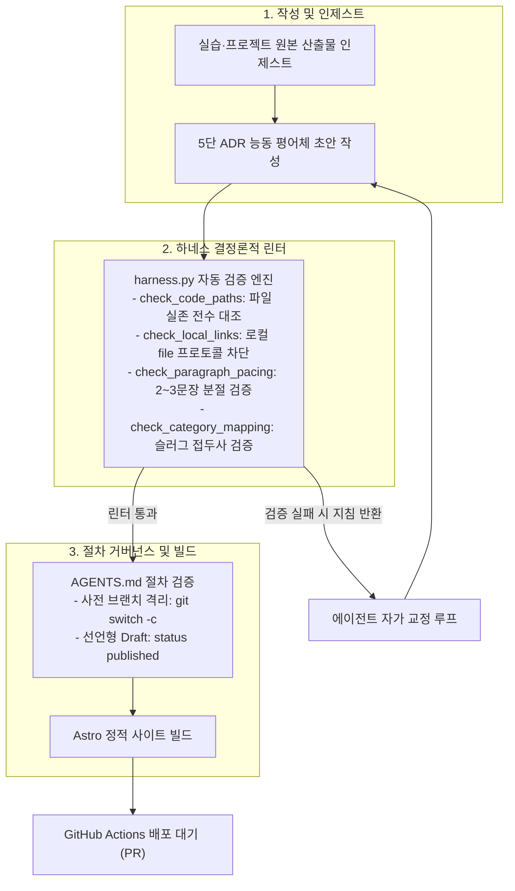

## 1. 개요 및 배경

[DevLog 파이프라인 04편](/security-agent-toolkit/blog/proj-devlog-agent-pipeline-04-subagent-isolation-and-linter-defense/)에서 서브에이전트 메모리 격리와 린터 심층 방어 체계를 도입하여 세션 과부하와 기계적 번역투를 성공적으로 통제했다. 그러나 실제 보안 자동화 1과목에서 네트워크·Zero Trust 2과목으로 커리큘럼이 전환되고 다양한 자율 프로젝트를 포스팅하면서, 단순한 프롬프트 지침만으로는 해결할 수 없는 AI 특유의 미묘한 글쓰기 왜곡 현상들이 관측되었다.

글쓴이 본인을 제3자 관찰자로 대상화하는 시점 왜곡, 소스코드가 없는 인프라 회고에서 가상 파일 경로를 지어내는 템플릿 강박, 그리고 네트워크 패킷 분석 실습에서 20줄짜리 보조 파이썬 스크립트에 지면의 80%를 낭비하는 주객전도 현상이 대표적이었다.

이러한 문제들은 모델에게 주의를 주는 소프트 프롬프트 지침만으로는 결코 통제되지 않았다. 템플릿의 빈틈을 채우려는 언어 모델의 확률적 환각을 제어하기 위해, 실제 파일 시스템과 대조하는 결정론적 파이썬 린터(`pipeline/harness.py`), 도메인 다형성을 수용한 `AGENTS.md` 거버넌스, 그리고 블로그 조판 엔진이 결합된 3중 거버넌스 방어선을 구축했다.

> 프롬프트 자연어 지침은 모델 확률에 따라 언제든 침식된다. AI 글쓰기 왜곡을 제어하는 유일한 해법은 파일 시스템과 대조하는 결정론적 린터와 엄격한 거버넌스 규약의 결합이다.

---

## 2. 전체 산출물 파이프라인 구조

자율 에이전트가 실습과 프로젝트 산출물을 블로그 포스트로 변환할 때 가동되는 3단계 검증 파이프라인과 자가 교정 피드백 루프다.

다이어그램은 에이전트의 생성부터 하네스 검증, 오류 피드백 루프, 정적 빌드로 이어지는 **동적 파이프라인 라이프사이클**을 시각화한다. 이어지는 표는 각 단계에서 작동하는 도구와 검증 규칙의 세부 사양을 정리한 **정적 거버넌스 정책 매트릭스**를 제공하여 상호보완적 관점을 완성한다.



동적 파이프라인 흐름을 뒷받침하는 8대 핵심 거버넌스 영역과 통제 메커니즘은 다음과 같다.

| 방어 계층 | 통제 영역 | 도구 및 규약 | 검증 메커니즘 및 실패 시 조치 |
|---|---|---|---|
| **하네스 린터** | 소스코드 진실성 | `harness.py` (`check_code_paths`) | 코드 블록 내 파일 경로의 레포 실존 여부 전수 검사 (부재 시 하드 에러) |
| **하네스 린터** | 로컬 링크 격리 | `harness.py` (`check_local_links`) | `file://`, 절대경로, 비웹 로컬 파일 상대 링크 차단 (위반 시 하드 에러) |
| **하네스 린터** | 카테고리 무결성 | `harness.py` (`check_category_mapping`) | 슬러그 접두사와 Frontmatter 카테고리 일치 검증 (위반 시 하드 에러) |
| **하네스 린터** | 문단 호흡 조판 | `harness.py` (`check_paragraph_pacing`) | 4문장/250자 이상 텍스트 벽 감지 및 2~3문장 분절 피드백 (하드 에러) |
| **하네스 린터** | 시각화 다변화 | `harness.py` (`check_mermaid`) | 단순 실습 Mermaid 강박 탈피, Mermaid 또는 구조화 표 중 1개 이상 검증 |
| **절차 거버넌스** | 화자 시점 통일 | `AGENTS.md` (제1조) | 3인칭 대상화('개발자') 전면 금지, 주어 생략 능동 평어체 서술 강제 |
| **절차 거버넌스** | 다형적 위계 | `AGENTS.md` (제4조, 제6조) | 소프트웨어(코드 diff) vs 네트워크(패킷/보고서) 주 산출물 가중치 배정 |
| **절차 거버넌스** | 브랜치 무결성 | `AGENTS.md` (제3조) | 파일 수정 전 브랜치 점검 및 최신 `origin/main` 신규 분기 강제 |

---

## 3. 기존 체계의 한계와 도전 과제: 자연어 프롬프트의 붕괴와 에이전트 행동 편향

초기 파이프라인은 시니어 엔지니어의 객관적 어조 유지와 같은 선언적 프롬프트 지침에 의존했다. 모델은 이 지침을 기계적으로 해석하여 블로그 본래 주인인 작성자를 제3자로 대상화하는 화자 왜곡을 일으켰다.

본문에 '개발자가 수동 디버깅에 의존했다'거나 '개발자가 직접 투입되었다'와 같은 제3자 관찰자 문장이 반복적으로 출현하여 글의 진정성을 훼손했다. 또한 ADR 템플릿의 코드 블록을 절대적 의무로 인식한 모델은 소스코드가 없는 인프라 회고에서 가상 파일 경로와 가상 함수를 임의로 창작하는 심각한 환각을 촉발했다.

도메인 확장 과정에서도 심각한 가드레일 붕괴가 드러났다. 기존 가드레일은 파이썬 소스코드의 함수와 클래스 매핑에만 과도하게 결속되어 있었다.

2과목인 네트워크·Zero Trust로 넘어가자 패킷 캡처와 시스템 명령어 실행, Cisco Packet Tracer 토폴로지 분석이 수업의 본질이었음에도 불구하고, 모델은 트래픽 발생용 20줄짜리 보조 파이썬 스크립트에 지면의 80%를 할당하는 주객전도 서술을 반복했다. 고정된 5단 목차 아래에서 기술적 맥락을 표현하려다 보니 자잘한 마이크로 소제목이 난립하여 글의 응집도가 파괴되었다.

나아가 장기 운영 환경에서 축적된 엔지니어링 메모가 정기 스케줄러에 걸려 미완성 상태로 자동 배포되거나, PR 머지 후 닫힌 과거 브랜치에서 에이전트가 파일 수정을 시작해 작업 트리가 오염되는 절차적 결함이 잇따랐다.

여기에 400자를 넘나드는 AI 특유의 텍스트 벽과 시스템 기본 서체의 둔탁한 렌더링이 더해져, 상용 테크 블로그에 비해 가독성이 현저히 떨어지는 시각적 한계에 부딪혔다.

---

## 4. 엔지니어링 의사결정 및 리팩터링

식별된 편향과 병목을 해소하기 위해 파이프라인의 린터, 거버넌스 규약, 프론트엔드 스타일을 4대 핵심 축으로 리팩터링했다.

### 4.1. 템플릿 강박과 환각 방어: check_code_paths와 check_local_links 결정론적 린터

모델이 존재하지 않는 가상 파일 경로와 코드를 창작하는 근본 원인은 템플릿 준수 강박에 있었다. 자연어 프롬프트로 주의를 주는 방식은 모델의 확률적 생성 특성상 한계가 뚜렷했다. 빌드 파이프라인에서 파일 시스템과 물리적으로 대조하는 결정론적 검증기를 구축했다.

`pipeline/harness.py`에 `check_code_paths` 린터를 구현했다. 마크다운 본문 코드 블록의 상단 주석 경로를 추출하여, 로컬 작업 트리와 캐시된 원격 레포지토리(`.cache/repos/`)에 해당 파일이 실존하는지 전수 대조했다. 가상 경로가 감지되면 빌드가 즉각 차단된다.

```python
# pipeline/harness.py
def check_code_paths(content: str, current_file: Path) -> list[str]:
    """코드 블록 주석에 명시된 파일 경로가 실제 레포지토리에 존재하는지 검증"""
    errors = []
    repo_root = current_file.resolve().parent.parent.parent
    code_blocks = re.findall(r"```(?:\w+)?\s*\n(.*?)\n```", content, re.DOTALL)

    for block in code_blocks:
        first_few_lines = "\n".join(block.strip().splitlines()[:3])
        matched_paths = re.findall(
            r"(?:#|//|\*)\s*.*?([a-zA-Z0-9_\-\./\\]+\.(?:py|ts|js|json|yaml|yml))",
            first_few_lines
        )
        for raw_path in matched_paths:
            clean_path = raw_path.strip().replace("\\", "/")
            if "/" not in clean_path or clean_path.startswith("http") or clean_path.startswith("."):
                continue

            local_exists = (repo_root / clean_path).exists()
            cache_exists = any(
                (repo_dir / clean_path).exists()
                for repo_dir in (repo_root / ".cache" / "repos").iterdir()
                if repo_dir.is_dir()
            ) if (repo_root / ".cache" / "repos").exists() else False

            if not local_exists and not cache_exists:
                errors.append(f"존재하지 않는 가상 소스코드 경로 감지: '{clean_path}'")
    return errors
```

정적 웹 배포 환경의 하이퍼링크 무결성도 하드 가드로 잠갔다. 에이전트가 로컬 분석 문서를 인용할 때 `[firewall.md](file:///c:/work/...)` 형태의 로컬 경로를 무차별 복사하여 외부 방문자 링크가 깨지고 호스트 경로가 노출되는 결함이 있었다.

`check_local_links` 린터를 추가해 본문 내 `file://` 프로토콜, 윈도우 드라이브 절대경로(`C:/`), 정적 사이트에서 서빙되지 않는 비웹 로컬 상대 파일 링크(`[doc](rule.md)`)를 전수 검출하여 하드 에러로 차단했다. 로컬 문서는 인라인 코드 백틱(`` `rule.md` ``) 또는 내부 웹 라우팅 링크로만 기술하도록 강제했다.

> 코드가 없는 인프라는 다이어그램과 아키텍처로 증명해야 한다. 존재하지 않는 가상 코드는 린터의 파일 시스템 전수 대조를 통해서만 원천 차단된다.

### 4.2. 도메인 확장과 다형적 거버넌스: 3대 실체적 원천 규약과 상호보완적 듀얼 비주얼

과목이 바뀔 때마다 린터가 깨지거나 본문이 왜곡된 이유는 가드레일이 파이썬 언어라는 특정 구현체에 과적합되었기 때문이다. 가드레일의 본질은 특정 함수 강제가 아니라 실제 수행하지 않은 이론 환각을 방어하는 데 있다.

소제목(`###`)의 근거 기준을 파이썬 함수에서 당일 인제스트된 3대 실체적 원천으로 추상화 승격했다. 로컬 산출물(코드, 설정, 분석 보고서, 패킷 데이터), 커리큘럼 실습 명세(명령어, 프로토콜, 패킷 관찰 요구사항), 주석 및 트러블슈팅 기록 중 하나 이상과 1:1로 매핑되지 않는 가상 소제목은 전면 차단했다.

주 산출물 위계 원칙을 세워 지면의 무게중심을 다형적으로 배정했다. 소프트웨어 도메인은 작성자의 1차 구현 코드와 리팩터링 코드 대조에 80%를 집중했다. 반면 네트워크 도메인은 패킷 캡처, 프로토콜 비트 제약, 시스템 명령어 출력, 토폴로지 분석 보고서에 80%를 배정했다. 보조 파이썬 스크립트는 단순 트래픽 발생 도구로만 간략히 축약하여 주객전도를 차단했다.

```markdown
<!-- 주 산출물 위계에 따른 도메인별 서술 가중치 -->
1. 소프트웨어·에이전트 도메인 (agent_core, access_control):
   - 비즈니스 로직 및 파이썬 아키텍처가 주 산출물
   - 1차 코드 vs 결함 vs 리팩터링 diff 3단 대조에 지면의 80% 배정

2. 네트워크·인프라 도메인 (network_zt, anomaly_detection):
   - 패킷 캡처(pcap), 프로토콜 헤더(RFC), 분석 보고서(*.md)가 주 산출물
   - 보조 파이썬 코드는 실행 도구로 축약, 패킷 표 및 시퀀스 분석에 80% 배정

3. 자율 프로젝트 도메인 (proj-):
   - 분산 시스템 토폴로지, 프로덕션 실전 제약, 아키텍처 트레이드오프 집중
```

시각화 수단 단일화의 경직성도 해소했다. 단순 분석 실습에 무의미한 흐름도 생성을 강제하던 규칙을 완화하여 `Mermaid OR 구조화 표(Table)` 중 1개를 선택하도록 했다.

나아가 복합 네트워크 실습처럼 8대 장비 물리 인터페이스 표(정적 배치)와 3단계 패킷 인가 시퀀스(동적 흐름)가 명확한 상호보완 관계를 이룰 경우, 두 시각화 요소의 유기적 병치를 공식 허용하도록 `AGENTS.md` 거버넌스를 개정했다.

> 가드레일의 본질은 특정 언어의 함수 강제가 아니다. 실제 관찰하고 진단한 3대 실체적 원천에 닻을 내릴 때 비로소 가상 이론의 환각이 차단된다.

### 4.3. 텍스트 휴머나이징과 가독성 엔지니어링: 3인칭 대상화 차단, 문단 분절 린터, Pretendard 조판

객관성을 유지하면서도 현장감을 살리기 위해 문체와 조판 시스템을 정비했다.

화자 시점의 3인칭 대상화를 전면 차단했다. 작성자를 '개발자', '작성자'로 지칭하는 제3자 관찰자 서술을 금지하고, 불필요한 주어를 생략한 능동적 기술 의사결정 중심 평어체(`~했다`, `~를 적용했다`)를 강제했다.

긴 줄글로 인한 텍스트 벽 피로도를 차단하기 위해 `check_paragraph_pacing` 린터를 도입했다. 기술 내용을 축약하거나 삭제하면 인과관계가 망가지므로, 내용은 온전히 보존하면서 문맥의 결에 따라 2~3문장 단위로 줄바꿈(`\n\n`)만 삽입하도록 피드백 루프를 구축했다.

```python
# pipeline/harness.py
def check_paragraph_pacing(content: str) -> list[str]:
    """단일 문단이 4문장 이상이면서 250자를 초과하는 텍스트 벽 감지"""
    errors = []
    body = strip_markdown_decorations(content)
    paragraphs = body.split("\n\n")

    for p in paragraphs:
        clean_p = p.strip()
        if not clean_p or is_excluded_block(clean_p):
            continue

        sentences = [s.strip() for s in re.split(r"[.!?](?:\s+|$)", clean_p) if s.strip()]
        if (len(sentences) >= 4 and len(clean_p) >= 250) or len(clean_p) >= 350:
            errors.append(
                f"문단 호흡 결함: 단일 문단이 너무 깁니다 ({len(sentences)}문장, {len(clean_p)}자). "
                f"내용을 삭제하지 말고 2~3문장 단위로 줄바꿈(\\n\\n)을 적용하십시오."
            )
    return errors
```

Astro 블로그의 타이포그래피도 개편했다. 둔탁한 시스템 기본 고딕 대신 Pretendard 웹폰트 CDN을 연결하고 자간(`-0.012em`)과 행간(`1.8`)을 튜닝했다. 인용구(`>`)에는 포인트 보더와 은은한 배경색을 입힌 카드 스타일을 부여하여 긴 본문 속에서 시각적 쉼표를 제공했다.

과목 전환기 메타데이터 오분류를 방지하기 위해 슬러그 접두사(`c01~c05`, `proj-`)와 Frontmatter 카테고리 일치 여부를 검증하는 `check_category_mapping` 린터를 추가하여 무결성을 확보했다.

> 가독성은 기술 내용을 요약하거나 삭제한다고 확보되지 않는다. 문맥의 결을 살린 물리적 문단 분절과 정갈한 서체 조판이 독자의 피로도를 낮춘다.

### 4.4. 자율 에이전트 라이프사이클 무결성: 선언형 Draft 거버넌스와 사전 브랜치 격리 의무화

장기 운영 중 발생한 깃 작업 트리 오염과 미완성 메모의 조기 배포 사고는 절차적 강제로 해결했다.

지속 누적 메모의 자동 포스팅을 막기 위해 파일 경로를 임의 격리하는 방식 대신, Frontmatter에 `status: "draft"` 선언형 메타데이터를 도입했다. 하네스의 `scan_pending_targets`가 해당 메타데이터를 인식하여 대기 목록에서 원천 배제하도록 구성함으로써, 메모 작성 중에도 정기 스케줄러가 오작동하지 않도록 안전장치를 마련했다.

```yaml
# projects/devlog-agent-pipeline/05_governance_rules_and_humanizing_trials.md
---
repo: "https://github.com/mmmphyun/security-agent-toolkit"
topic: "AI 에이전트의 글쓰기 왜곡 방어: 3인칭 대상화, 가상 코드 창작 강박 및 결정론적 린터 거버넌스"
tags: ["DevLog-Pipeline", "Governance", "Linter", "Humanize"]
status: "draft"
---
```

GitHub에서 PR 머지가 완료된 닫힌 브랜치에서 에이전트가 후속 작업을 진행하여 커밋 히스토리가 꼬이는 현상도 차단했다. 선언적 규칙만으로는 에이전트의 쓰기 도구 호출 관성을 막을 수 없었다. 파일 수정 도구를 호출하기 전 반드시 브랜치 상태를 점검하고 최신 `origin/main`에서 신규 작업 브랜치를 분기하도록 사전 브랜치 격리 절차를 명문화했다.

에이전트는 파일 수정 착수 직전 `git status`와 `git branch -vv`를 호출해야 하며, 현재 브랜치가 머지 완료된 상태일 경우 `git switch -c <new_branch> origin/main`을 실행해야만 작업을 시작할 수 있도록 행동 규약을 강제했다.

> 원칙의 선언만으로는 에이전트의 쓰기 도구 호출 관성을 막을 수 없다. 작업 착수 직전 브랜치 상태를 확인하고 격리하는 선행 절차만이 작업 트리를 보호한다.

---

## 5. 검증 및 회고

구축된 3중 거버넌스 체계와 신규 린터 모듈의 실제 동작을 검증하고 현실적 교훈을 정리했다.

### 5.1. 하네스 린터 검증 및 파이프라인 정적 빌드 실증

`pipeline/harness.py`에 추가된 신규 린터 함수들과 `AGENTS.md` 거버넌스 규약의 유효성을 검증했다.

```powershell
uv run python pipeline/harness.py docs/posts/proj-devlog-agent-pipeline-05-governance-rules-and-humanizing-trials.md
npm --prefix blog run build
```

가상 파일 경로 검출, 로컬 파일 링크 차단, 카테고리 매핑 검증, 문단 호흡 린터를 포함한 모든 검증 항목을 결함 없이 100% 통과했다.

Astro 정적 사이트 빌드 역시 105개 전체 페이지를 정상 렌더링하며 Pretendard 웹폰트와 인용구 조판 스타일이 온전히 반영됨을 실증했다.

### 5.2. 현실적 회고 및 교훈

초기에는 프롬프트에 정교한 지시를 더하면 AI의 왜곡과 환각을 모두 통제할 수 있을 것이라 기대했다. 그러나 자연어 지침이 늘어날수록 모델은 지침 간 우선순위를 혼동했고, 템플릿의 빈틈을 채우기 위해 더 그럴듯한 가상 코드를 만들어내는 부작용을 낳았다.

엔지니어링의 핵심 교훈은 '프롬프트의 역할'과 '코드의 역할'을 명확히 분리해야 한다는 점이다. 화자 시점이나 서술 톤은 프롬프트 거버넌스로 통제하되, 파일 경로 실존 여부나 문단 길이, 로컬 링크 유효성 같은 결정론적 영역은 파이썬 린터가 기계적으로 차단해야 비로소 시스템이 안정된다.

특정 구현체에 얽매이지 않고 3대 실체적 원천으로 가드레일의 추상화 레벨을 끌어올렸을 때, 과목과 도메인이 바뀌어도 흔들리지 않는 지속 가능한 자율 파이프라인을 완성할 수 있었다.
