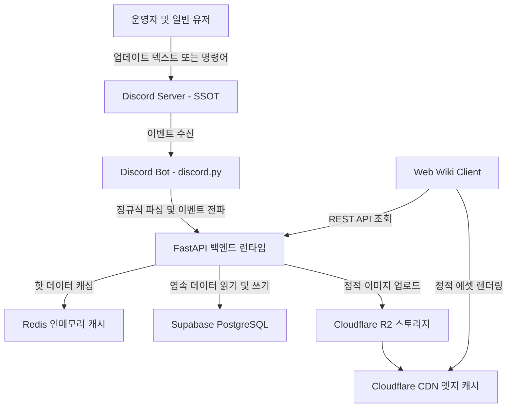

## 1. 개요 및 프로젝트 배경

동시 접속자 20명 규모의 마인크래프트 스토리 RPG 서버는 80개 이상의 방대한 직업군과 독자적인 세계관 시스템을 운영하고 있었다. 시스템의 깊이에 비해 운영 구조는 심각한 수작업 병목에 갇혀 있었다.

1. **수동 온보딩 병목:** 신규 유입자가 발생할 때마다 관리자가 음성이나 텍스트로 세계관, 규칙, 80여 개 직업을 1:1로 직접 설명해야 했다. 유저 유입이 늘어날수록 운영 리소스가 온보딩에 전적으로 매몰되었다.
2. **정보 파편화와 진입 장벽:** 직업과 스킬 정보가 디스코드 여러 텍스트 채널에 흩어져 있어 신규 유저가 정보를 탐색하고 직업을 선택하는 과정에서 높은 피로를 겪었다.
3. **단일 진실 공급원(SSOT) 부재:** 커뮤니티의 모든 활동과 데이터가 이미 디스코드에 누적되어 있었다. 별도의 웹사이트를 제작하더라도 운영자가 디스코드와 웹 양쪽에 데이터를 중복 입력해야 한다면 데이터 불일치와 관리 피로가 불가피했다.

이러한 문제를 해결하기 위해 다음 세 가지 엔지니어링 목표를 설정했다.

- **온보딩 프로세스 자동화:** 웹 기반 인터랙티브 가이드를 통해 규칙 설명과 직업 탐색을 처리하고, 가이드 완료 시 디스코드 역할 및 권한을 자동 부여.
- **Discord to Web 단방향 동기화:** 디스코드를 단일 진실 공급원(SSOT)으로 유지하고, 봇과 파서를 통해 웹 위키로 데이터가 자동 전파되는 파이프라인 구축.
- **비용 제로 기반 분산 인프라:** 제한된 예산 안에서 클라우드 프리티어와 오픈소스 캐싱/스토리지 레이어를 조합해 물리적 지연시간과 부하를 극복.

## 2. 전체 산출물 파이프라인 구조

RPG Sync 시스템은 디스코드 봇(`discord.py`), 웹 백엔드(`FastAPI`), 캐싱 계층(`Redis`), 데이터베이스(`Supabase PostgreSQL`), 그리고 에셋 스토리지(`Cloudflare R2 + CDN`)로 구성된 분산 파이프라인을 구축했다.



## 3. 기본 구현의 한계점

프로젝트 기획 초기 검토된 단순 웹 어드민 구축 및 직접 쿼리 방식은 다음과 같은 구조적 한계를 노출했다.

1. **조직 변화 관리 실패:** 운영진에게 완전히 새로운 웹 관리자 콘솔을 학습시키고 사용을 강제하는 방식은 높은 전환 비용과 입력 누락을 야기한다.
2. **원격 DB 네트워크 RTT 및 커넥션 풀 고갈:** GCP 프리티어 인스턴스와 원격 관리형 PostgreSQL(Supabase) 간의 물리적 거리로 인해 왕복 네트워크 지연시간(RTT)이 발생했고, 위키 트래픽 증가 시 커넥션 풀이 빠르게 고갈되었다.
3. **스토리지 용량 제한 및 Egress 비용:** 80여 개 직업과 고해상도 장비 이미지를 데이터베이스 또는 기본 파일 스토리지에 직접 호스팅할 경우 대역폭 비용과 페이지 로딩 지연이 발생했다.

## 4. 엔지니어링 의사결정 및 리팩터링

현실적인 제약 조건을 극복하기 위해 네 가지 핵심 엔지니어링 결정을 아키텍처에 적용했다.

### 4.1. "Discord to Web" 단방향 동기화 파이프라인 채택

운영자의 기존 작업 환경을 변경하지 않는 설계를 최우선으로 두었다. 운영자가 디스코드 전용 채널에 지정된 템플릿으로 업데이트 글을 작성하면, 봇의 정규식 파서가 이를 감지해 데이터베이스와 웹 위키에 실시간 반영하도록 단방향 파이프라인을 구현했다.

### 4.2. Redis 캐싱 레이어와 핑 보호 전략

읽기 요청이 대다수를 차지하는 위키 특성에 맞춰 Redis 캐싱 레이어를 구축했다. 저사양 GCP 프리티어 인스턴스의 OOM을 방지하기 위해 `docker-compose.yml`에서 Redis 메모리를 50MB로 제한하고 `volatile-lru` 축출 정책을 적용했다.

```python
# 인메모리 캐시 및 Redis 쿨다운을 통한 서버 상태 보호 (src/web/routers/server.py)
CACHE_TTL = 60

@router.get("/status")
async def get_server_status():
    current_time = time.time()
    ttl = CACHE_TTL
    # 오프라인 상태일 때는 핑 요청을 120초로 늘려 비정상 서버에 대한 불필요한 부하 방지
    if cache["data"] and not cache["data"].get("online", False):
        ttl = 120

    if cache["data"] and (current_time - cache["last_updated"] < ttl):
        return cache["data"]

    try:
        mc_server = await JavaServer.async_lookup(SERVER_ADDRESS, timeout=2.0)
        status = await mc_server.async_status()
        result = {"online": True, "players": {"online": status.players.online, "max": status.players.max}}
    except Exception:
        result = {"online": False, "players": {"online": 0, "max": 0}}

    cache["data"] = result
    cache["last_updated"] = current_time
    return result
```

또한 `src/database/cache.py`에서는 Redis 연결 실패 시 프로세스가 다운되지 않고 즉시 DB 직접 조회로 폴백(Fail-Open)하는 **서킷 브레이커**와 백그라운드 PING을 통한 **자가 치유** 로직을 구현해 캐시 장애 상황에서도 전체 서비스 가용성을 보장하도록 설계했다.

### 4.3. Cloudflare R2와 CDN을 통한 에셋 오프로딩

고용량 이미지 에셋을 Cloudflare R2 Object Storage로 격리하고 앞단에 Cloudflare CDN을 연결했다. 이를 통해 Egress 비용 0원을 달성하고, 엣지 캐싱을 통해 전 세계 어디서든 지연 없는 이미지 렌더링 성능을 확보했다.

### 4.4. 봇 비동기 런타임 튜닝

`discord.py` 봇 초기화 시 Stale Connection을 방지하기 위한 `TCPConnector` 옵션과 블로킹 I/O 분리를 위한 전용 스레드 풀 익스큐터를 구성했다.

```python
# 커넥션 풀 관리 및 스레드 풀 확장 (src/bot/main.py)
connector = aiohttp.TCPConnector(limit=10, ttl_dns_cache=300)
self.session = aiohttp.ClientSession(connector=connector)

loop = asyncio.get_running_loop()
executor = concurrent.futures.ThreadPoolExecutor(max_workers=20)
loop.set_default_executor(executor)
```

## 5. 검증 및 회고

구축된 파이프라인을 실제 운영 환경에 배포하여 유의미한 성과를 도출했다.

1. **운영 비용 절감:** 신규 유저 온보딩이 웹 가이드와 봇 자동 권한 부여로 전환되어 관리자의 수동 설명 시간이 0분으로 단축되었다.
2. **데이터 일관성 확보:** 디스코드 채널 업데이트만으로 웹 위키가 즉각 동기화되어 이중 작업 없이 SSOT를 확립했다.
3. **인프라 비용 통제:** Docker, Redis, Cloudflare R2, GCP 프리티어 조합을 통해 유의미한 서버 트래픽을 호스팅하면서도 인프라 비용 0원을 유지했다.

단순한 기능 구현을 넘어 운영 주체의 행동 패턴과 물리적 인프라의 제약 조건을 동시에 고려하는 시스템 설계의 중요성을 확인했다.
