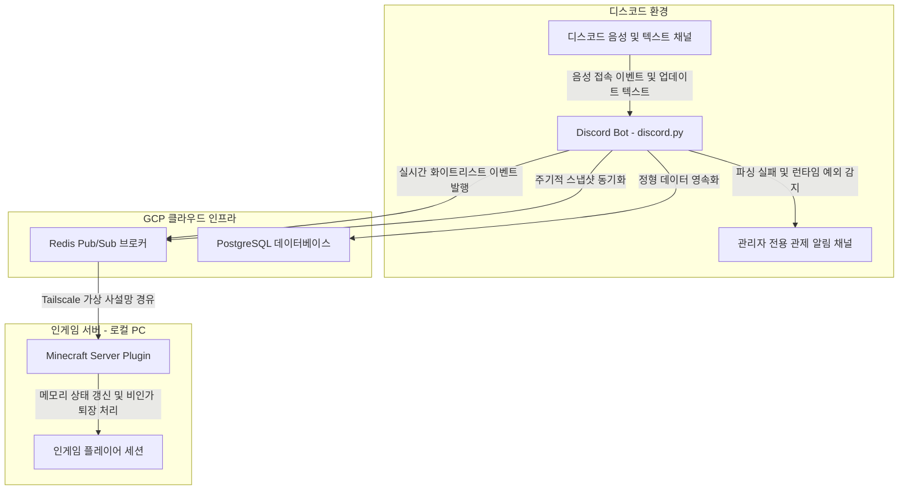
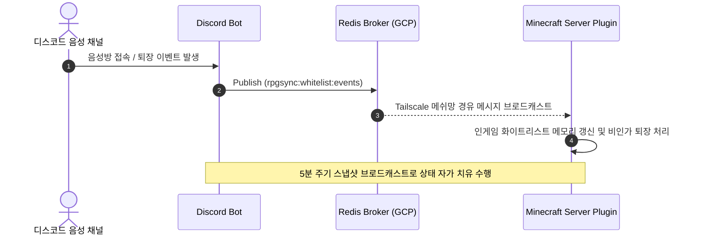

## 1. 개요 및 프로젝트 배경

[RPG Sync 아키텍처 포스트](/blog/proj-rpg-sync-project-01-problem-definition-and-architecture)에서 디스코드를 단일 진실 공급원 SSOT로 삼고 웹 위키 및 캐싱 레이어를 구축하여 운영 비용을 절감한 기본 설계를 다루었다. 그러나 초기 시스템을 실제 운영 환경에 배포한 후 예기치 못한 운영 병목과 분산 인프라 간의 기술적 난관이 발생했다.

- **조용한 실패로 인한 운영 블랙박스:** 정규식 파싱 실패 시 DB 오염은 막았으나 에러가 내부 로그에만 묻혀 운영자는 데이터 누락을 인지하지 못했고, 원인 조사를 위해 수동 디버깅을 반복해야 했다.
- **분산 환경의 실시간 상태 불일치:** 디스코드 음성 통화방 접속자만 게임 서버에 입장할 수 있도록 제어하는 실시간 화이트리스트 동기화 요구가 추가되었다.
- **물리적 네트워크 장벽과 보안 제약:** 게임 서버가 고정 IP를 지원하지 않는 비개발자 운영자의 개인 PC 환경에서 구동되어 공인 포트 노출 없이 안전한 통신 터널을 뚫어야 했다.
- **모호한 커뮤니케이션과 기획 정체:** 비개발자 클라이언트의 모호한 피드백으로 인해 구체적인 기능 스펙을 도출하기 어려웠다.

이러한 문제를 해결하기 위해 관제 알림 구축, Redis 기반 이벤트 브로커 및 사설 메쉬 VPN 조합, 그리고 직접 현장 실무에 투입되는 도그푸딩을 결합한 엔지니어링 해결책을 적용했다.

## 2. 전체 산출물 파이프라인 구조

디스코드 이벤트 감지부터 클라우드 브로커, 사설 메쉬망, 로컬 인게임 서버로 이어지는 상태 동기화 및 관제 파이프라인을 구축했다.

## 3. 1차 구현의 한계점

시스템 초기 운영 단계에서 드러난 세 가지 핵심 한계점은 다음과 같다.

1. **조용한 실패와 디버깅 병목:** 데이터 무결성을 위해 파싱 오류 발생 시 트랜잭션을 중단하고 터미널에 로그만 남겼다. 이로 인해 운영자는 업데이트가 왜 반영되지 않았는지 알지 못했고, 원인 조사를 위해 매번 GCP VM에 SSH로 접속해 도커 로그를 수동 추적해야 했다.
2. **단순 소켓 통신의 구현 복잡도와 메시지 유실:** 봇과 게임 서버 간 1:1 직접 소켓 통신을 도입할 경우 양방향 세션 관리와 재연결 핸들링 등 불필요한 보일러플레이트가 급증했다. 반면 Redis 단순 브로드캐스트는 네트워크 단절 시 이벤트 유실로 게임과 디스코드 간 정합성이 깨질 위험이 있었다.
3. **포트포워딩의 보안 취약성과 가변 IP:** 서버장의 로컬 공유기에 포트포워딩을 설정하는 방식은 외부 무차별 대입 공격에 무방비로 노출되는 위험이 있었고, 수시로 변경되는 통신사 가변 IP를 추적하는 동적 DNS 관리 비용이 컸다.

## 4. 엔지니어링 의사결정 및 리팩터링

현실적인 제약 조건과 분산 환경의 불안정성을 극복하기 위해 세 가지 핵심 엔지니어링 의사결정을 단행했다.

### 관제 알림 체계 구축과 결정론적 데이터 무결성 방어

도커 컨테이너 내부의 런타임 오류 및 파싱 실패 이벤트를 감지하여 관리자 전용 관제 채널로 즉시 전송하는 웹훅 알림 체계를 구축했다. 이전에는 정규식 파싱에 실패하면 데이터 오염을 막기 위해 DB 적재를 중단하고 터미널에 로그만 남겼으나, 이는 운영자가 데이터 누락을 인지하지 못하는 조용한 실패를 낳았다.

관제 채널 알림을 통해 예외 발생 시 스택트레이스와 실패 원인을 즉각 전파함으로써, 매번 서버에 SSH로 접속해 도커 로그를 수동 조회하지 않고도 장애를 실시간 인지할 수 있는 옵저버빌리티를 확보했다.

이 과정에서 비정형 텍스트를 LLM API로 자동 교정하는 방안도 검토했다. 그러나 도메인 설정과 직업별 수치 데이터가 AI의 환각으로 왜곡될 경우 게임 밸런스에 치명적인 영향을 미칠 수 있었다. 자동화 편의성보다 데이터 정확성과 결정론적 무결성이 우선이므로, 모호한 자동 보정을 배제하고 명시적 에러 피드백을 전달해 사람이 직접 템플릿을 수정하도록 유도했다.

### Redis Pub/Sub 메시징과 Tailscale 기반 종단간 암호화 메쉬 네트워크

인게임 실시간 화이트리스트 동기화를 위해 직접 소켓 연결 대신 기존 인프라에 상주하던 Redis를 메시지 브로커로 활용했다. Discord Bot(발행자)과 Game Plugin(구독자)이 서로의 물리적 IP나 포트를 몰라도 토픽을 통해 비동기 통신할 수 있어 컴포넌트 간 결합도를 낮추었다.

Redis Pub/Sub은 인메모리 브로드캐스트 특성상 메시지 영속성이나 수신 확인을 보장하지 않는다. 플러그인 재시작이나 일시적 네트워크 단절 시 이벤트가 유실되어 상태 정합성이 어긋나는 문제를 방어하기 위해, 실시간 이벤트 외에도 5분 주기로 전체 음성방 접속자 스냅샷을 전송하여 마인크래프트 서버의 화이트리스트를 덮어쓰는 자가 치유 로직을 병행 구축했다.

네트워크 보안 측면에서는 Tailscale을 도입했다. 게임 서버가 고정 IP가 없는 개인 PC 환경에서 구동되었기에, WireGuard 기반 NAT 통과 기술을 적용하여 공유기 포트포워딩 없이 GCP 인스턴스와 로컬 PC를 1:1 종단간 암호화 가상 사설망으로 연결했다. 이를 통해 외부 침입 위험을 원천 차단하고 고정된 내부 사설 IP로 안전한 통신 경로를 확보했다.

### 도그푸딩 기반의 요구사항 엔지니어링과 자립형 운영 체계 구축

클라이언트의 모호한 요구사항에 직면했을 때 회의를 통한 설득 대신 2~3주간 직접 관리자 실무에 투입되는 도그푸딩을 수행했다.

- **실무 현장 투입:** 유저 응대, 수동 직업 가이드 안내, 디스코드 채널 관리를 직접 수행하며 운영 피로도가 집중되는 병목 구간을 체감하고 실질적인 시스템 스펙을 정의했다.
- **비개발자 눈높이의 인터페이스 및 문서화:** 복잡한 CLI 대신 직관적인 디스코드 명령어와 단계별 트러블슈팅 가이드를 작성했다.
- **온보딩 세션 의무화:** 모든 운영진이 최소 1회 이상 직접 템플릿을 작성하고 동기화 과정을 실습하도록 하여 특정 1인에게 의존하지 않는 자립적 운영 체계를 확립했다.

## 5. 검증 및 회고

구축된 시스템의 실질적인 운영 성과와 엔지니어링 교훈은 다음과 같다.

1. **옵저버빌리티를 통한 운영 비용 절감:** 조용한 실패를 관제 알림 채널로 전환하여 장애 인지 및 대응 시간을 수 시간에서 수 초 단위로 단축했다.
2. **도메인 제약에 최적화된 도구 조합:** 신규 인프라 도입 대신 기존 Redis의 Pub/Sub 기능을 활용하고, 복잡한 VPN 구축 대신 Tailscale을 조합하여 최소 공수로 분산 동기화를 완결했다.
3. **현장 중심의 요구사항 도출:** 탁상공론식 인터뷰보다 직접 현장 업무를 경험하는 도그푸딩이 모호한 요구사항을 명확한 기술 스펙으로 전환하는 가장 확실한 방법임을 확인했다.
