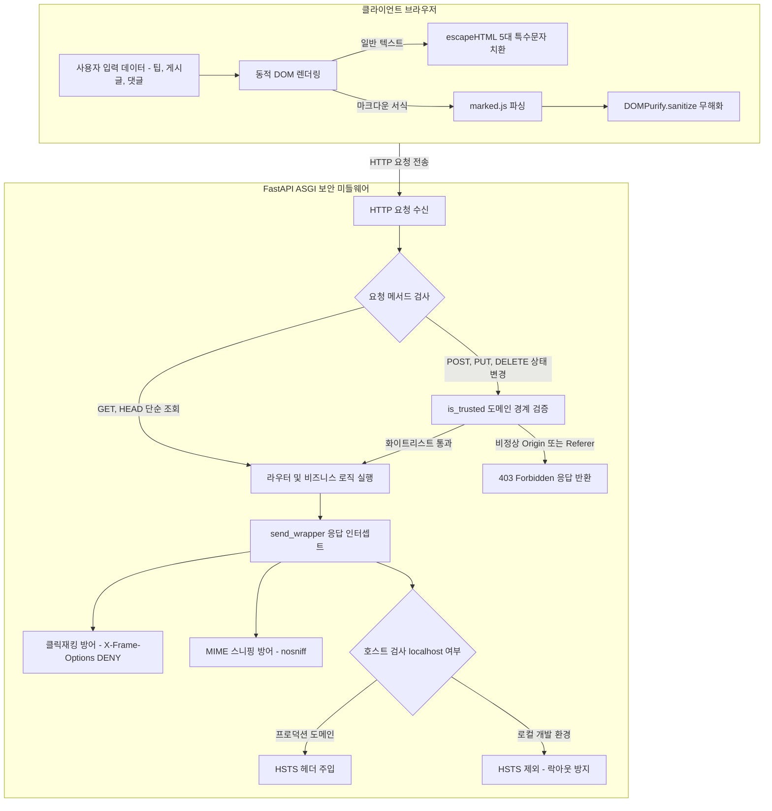

## 1. 개요 및 프로젝트 배경

[Part 1 아키텍처 포스트](/security-agent-toolkit/blog/proj-rpg-sync-project-01-problem-definition-and-architecture/)에서 디스코드 중심 SSOT 파이프라인을 설계하고, [Part 2 트러블슈팅 포스트](/security-agent-toolkit/blog/proj-rpg-sync-project-02-troubleshooting-and-collaboration/)에서 분산 상태 동기화와 관제 체계를 완성했다. 시스템이 안정화되어 실제 유저들이 직업 리뷰, 자유 게시판, 팁 공략을 활발히 등록하기 시작하면서 새로운 엔지니어링 과제가 부상했다. 바로 사용자 입력 데이터의 확장과 웹 대시보드 노출에 따른 애플리케이션 보안 위협이었다.

프로젝트 개발 당시 학부 과정에서 네트워크 및 웹 보안 과목을 수강하고 있었다. 교재와 강의에서 다루는 공격 벡터인 교차 사이트 스크립팅 XSS, 교차 사이트 요청 위조 CSRF, 클릭재킹, MIME 스니핑, HSTS 미적용 취약점 등을 단순한 시험 대비용 지식으로 소비하지 않고, 실제 라이브 운영 중인 시스템에 공격자의 시선으로 침투해보는 셀프 레드티밍을 감행했다.

점검 결과 프레임워크의 기본 설정에만 의존하던 초기 코드베이스에서 다수의 보안 사각지대가 식별되었다. 동적 자바스크립트 렌더링 환경에서의 XSS 실행 위험, 단순 문자열 비교 기반 도메인 검증의 우회 가능성, 로컬 개발 환경과 프로덕션 환경 간의 HSTS 충돌 문제 등이 대표적이었다. 이를 해결하기 위해 프론트엔드부터 백엔드 미들웨어, 인프라 거버넌스에 이르는 다층 방어 아키텍처를 구축했다.

## 2. 전체 산출물 파이프라인 구조

RPG Sync 웹 보안 아키텍처는 클라이언트 브라우저의 입력 검증 및 렌더링 소독부터 백엔드 순수 ASGI 미들웨어의 엄격한 경계 검사 및 보안 헤더 주입까지 다계층 심층 방어 구조로 동작한다.



## 3. 1차 구현의 한계점과 보안 위협 모델링

프레임워크가 제공하는 기본 편의 기능에만 의존했던 초기 구현에서는 세 가지 핵심 공격 표면이 존재했다.

첫째, 비동기 API 통신 기반의 동적 렌더링 환경에서 발생하는 클라이언트 사이드 XSS 취약점이었다. 서버 사이드 템플릿 엔진인 Jinja2는 HTML을 렌더링할 때 기본적으로 악성 태그를 이스케이프한다. 그러나 싱글 페이지 인터랙션을 위해 Fetch API로 JSON 데이터를 받아와 브라우저 단에서 템플릿 리터럴로 innerHTML을 구성할 때는 Jinja2의 보호막이 전혀 작동하지 않았다. 악의적인 스크립트가 포함된 직업 리뷰나 닉네임이 그대로 실행될 수 있는 구조였다.

둘째, 상태 변경 요청에 대한 출처 검증의 허점이었다. 단순 도메인 문자열 접두사 비교 방식을 사용할 경우, 공격자가 허용 도메인 뒤에 공격자 도메인을 덧붙인 유사 도메인(예: `https://allowed-domain.com.attacker.com`)을 제작하여 CSRF 방어선을 무력화할 수 있었다.

셋째, 일괄적인 보안 헤더 적용으로 인한 개발 생산성 저해와 HSTS 락아웃 위험이었다. `Strict-Transport-Security` 헤더를 환경 구분 없이 전역 적용하면, SSL 인증서가 없는 로컬 개발 환경(`localhost`, `127.0.0.1`)에서 브라우저가 평문 HTTP 접근을 영구 차단하여 개발 서버 테스트가 불가능해지는 실무적 병목이 발생했다.

## 4. 엔지니어링 의사결정과 풀스택 방어 아키텍처

식별된 취약점을 제거하기 위해 프론트엔드 이스케이프와 소독 파이프라인 구축, Pure ASGI 미들웨어 기반 엄격한 도메인 경계 검증, 환경 인식형 보안 헤더 주입, 그리고 보안 거버넌스 확립을 차례로 적용했다.

### 4.1. Jinja2 서버 템플릿과 DOMPurify를 결합한 프론트엔드 다계층 XSS 소독 파이프라인 (`escapeHTML`, `DOMPurify.sanitize`)

서버 사이드 렌더링과 클라이언트 동적 렌더링의 특성에 맞추어 2단계 XSS 방어선을 구축했다. 초기 뼈대 HTML은 Jinja2의 자동 이스케이프를 활용하여 서버 단에서 무해화했다. 이후 비동기 Fetch 통신으로 전달받은 JSON 데이터를 브라우저에 마운트할 때는 `public/base.js`에 정의한 `escapeHTML` 함수를 거치도록 표준화했다.

```javascript
// public/base.js:64
function escapeHTML(str) {
    if (!str) return "";
    return String(str).replace(/[&<>'"]/g, match => {
        const escapeMap = { '&': '&amp;', '<': '&lt;', '>': '&gt;', "'": '&#39;', '"': '&quot;' };
        return escapeMap[match];
    });
}
```

그러나 줄바꿈과 볼드체 등 마크다운 서식을 허용해야 하는 팁 및 공략 게시판에서는 단순 텍스트 치환만으로 요구사항을 만족할 수 없었다. 텍스트 이스케이프를 적용하면 마크다운 서식이 깨지고, HTML 렌더링을 허용하면 XSS 위험에 노출되는 딜레마였다. 이를 해결하기 위해 `public/tips.js`에서 `marked.parse()` 변환 직후 `DOMPurify.sanitize()`를 체이닝하는 파이프라인을 구축했다.

```javascript
// public/tips.js:106
const escapedContent = tip.content ? tip.content.replace(/^\s*>>/gm, match => match.replace(/>/g, '\\>')) : '';
const parsedContent = typeof marked !== 'undefined' 
    ? DOMPurify.sanitize(marked.parse(escapedContent, { breaks: true })) 
    : `<p>${escapeHTML(tip.content)}</p>`;
```

DOMPurify 라이브러리를 통해 허용된 서식 태그(`<strong>`, `<em>`, `<code>`, `<blockquote>`)만 남기고 `<script>` 태그나 `onerror`, `onload` 같은 악성 인라인 이벤트 핸들러를 실행 직전에 완벽히 제거하여 기능성과 보안성을 동시에 확보했다.

### 4.2. 엄격한 도메인 경계 검증을 통한 상태 변경 요청 CSRF 차단 (`SecurityMiddleware.is_trusted`)

외부 라이브러리에 의존하지 않고 Starlette ASGI 표준 사양을 직접 준수하는 `SecurityMiddleware`를 구현하여 모든 HTTP 요청의 진입로를 단일 통제했다. 특히 데이터베이스를 변경하는 `POST`, `PUT`, `PATCH`, `DELETE` 요청에 대해 엄격한 출처 검증을 수행했다.

과거의 단순 startswith 검증은 유사 도메인 우회 공격에 취약했다. 이를 방어하기 위해 도메인 문자열이 화이트리스트와 완전 일치하거나 슬래시(`/`)로 끝나는 하위 경로일 때만 신뢰하도록 경계 검사 함수 `is_trusted`를 설계했다.

```python
# src/web/main.py:53-74
if request.method in ["POST", "PUT", "PATCH", "DELETE"]:
    origin = request.headers.get("origin")
    referer = request.headers.get("referer")
    
    def is_trusted(value: str):
        if not value: return False
        # 단순 startswith가 아닌, 도메인 끝이 /이거나 정확히 일치하는지 체크하여 .attacker.com 우회 차단
        for allowed in self.allowed_origins:
            if value == allowed or value.startswith(f"{allowed}/"):
                return True
        return False

    if not (is_trusted(origin) or is_trusted(referer)):
        print(f"[Security Block] CSRF 시도 차단: Method={request.method}, Origin={origin}, Referer={referer}")
        response = JSONResponse(
            status_code=403,
            content={"detail": "비정상적인 접근입니다. (CSRF 차단)"}
        )
        await response(scope, receive, send)
        return
```

이를 통해 브라우저 외부에서 위조된 세션으로 전송되는 비정상 상태 변경 요청을 라우터 진입 전에 403 Forbidden 상태 코드로 즉각 차단했다.

### 4.3. 클릭재킹 차단과 개발 환경 HSTS 락아웃 방지를 위한 조건부 보안 헤더 주입 (`SecurityMiddleware.send_wrapper`)

웹 애플리케이션의 응답 헤더는 클라이언트 브라우저의 렌더링 행위를 강제하는 가장 강력한 보안 제어 수단이다. `SecurityMiddleware`의 `send_wrapper` 코루틴에서 모든 HTTP 응답 헤더를 가로채어 필수 보안 헤더를 전면 주입했다.

```python
# src/web/main.py:75-96
async def send_wrapper(message):
    if message["type"] == "http.response.start":
        headers = MutableHeaders(scope=message)
        
        # 3. Security Headers
        process_time = time.time() - start_time
        headers["X-Process-Time"] = str(process_time)
        headers["X-Frame-Options"] = "DENY"
        headers["Content-Security-Policy"] = "frame-ancestors 'none'"
        headers["X-Content-Type-Options"] = "nosniff"
        headers["Referrer-Policy"] = "strict-origin-when-cross-origin"
        headers["Permissions-Policy"] = "geolocation=(), microphone=(), camera=()"
        
        # 4. HSTS Lockout 방지: localhost/127.0.0.1일 경우 HSTS 제외
        host = url.hostname or ""
        if host not in ["localhost", "127.0.0.1"]:
            headers["Strict-Transport-Security"] = "max-age=31536000; includeSubDomains"
        
        if process_time > 0.5:
            print(f"[Warning] Slow API Call: [{request.method}] {request.url.path} - {process_time:.4f}s")

    await send(message)
```

`X-Frame-Options: DENY`와 CSP의 `frame-ancestors 'none'`을 병행 지정하여 외부 사이트가 `<iframe>` 태그 내부에 위키 대시보드를 임베드하여 유저 클릭을 유도하는 클릭재킹 공격을 원천 봉쇄했다. 또한 `X-Content-Type-Options: nosniff`를 통해 브라우저의 MIME 타입 오해석을 차단했다.

특히 `url.hostname`을 검사하여 로컬 호스트일 때는 `Strict-Transport-Security` 주입을 생략하고 프로덕션 도메인에만 1년 유효기간(`max-age=31536000`)의 HSTS를 적용함으로써, 개발자 환경의 락아웃 문제를 예방하면서 운영 환경의 전송 구간 암호화를 강제했다.

### 4.4. 모호함을 통한 보안 안티패턴 탈피와 시크릿 거버넌스 확립 (`.env`, Git Commit Convention)

코드 레벨의 방어선 구축과 더불어 운영 인프라와 협업 프로세스 전반의 보안 거버넌스를 정비했다. Supabase API 키, Redis 인증 비밀번호, Discord Bot Token, JWT Secret 등 모든 민감 정보는 `.env` 파일로 격리하고 소스코드 형상 관리 대상에서 원천 배제했다. 로컬 개발 데이터베이스와 클라우드 운영 데이터베이스를 물리적으로 분리하여 개발 테스트 중 운영 데이터가 오염되는 사고를 방지했다.

개발 초기에는 보안 취약점을 패치한 커밋 내역이 외부에 노출될 경우 공격자에게 취약점 힌트를 제공할 수 있다는 막연한 우려 때문에 보안 관련 수정을 일반 리팩터링이나 사소한 버그 수정으로 위장하여 커밋하는 관행이 있었다. 그러나 이는 전형적인 모호함을 통한 보안이라는 안티패턴이었다.

변경 이력의 추적성을 심각하게 저해하고 동료 개발자의 코드 리뷰와 감사 효율을 떨어뜨리는 문제를 깨달은 후 정책을 전면 전환했다. 구체적인 익스플로잇 기법은 커밋 메시지에 기재하지 않되, 방어의 목적과 영향 범위를 명확히 서술하는 Git 커밋 컨벤션을 확립하여 투명성과 안전성을 동시에 확보했다.

## 5. 검증 및 회고

구축된 다층 방어 체계를 검증하기 위해 실제 악성 페이로드를 활용한 셀프 모의 침투 테스트를 수행했다.

1. **XSS 및 인젝션 침투 검증:** 직업 리뷰 및 팁 게시판 입력창에 `<script>alert(1)</script>` 및 `` 페이로드를 전송했다. 일반 텍스트 영역에서는 `escapeHTML`에 의해 안전한 엔티티 문자로 치환되어 평문 출력되었고, 마크다운 팁 영역에서는 DOMPurify에 의해 유해 스크립트가 완전히 제거된 채 무해한 HTML 구조만 렌더링됨을 확인했다.
2. **CSRF 도메인 우회 검증:** 허용 도메인 뒤에 공격자 도메인을 결합한 헤더(`Origin: https://rpg-sync-wiki.example.com.attacker.com`)로 게시글 삭제 API를 호출한 결과, 미들웨어의 `is_trusted` 함수에서 도메인 경계 검증에 실패하여 즉각 403 Forbidden 상태 코드가 반환되었다.
3. **보안 헤더 및 HSTS 호환성 검증:** 브라우저 개발자 도구의 네트워크 탭에서 응답 헤더를 점검한 결과 클릭재킹 방어 헤더와 MIME 스니핑 방지 헤더가 정상 주입됨을 확인했다. 로컬 환경(`localhost:8000`)에서는 HSTS가 제외되어 원활한 디버깅이 유지되었고, 배포 도메인에서는 HSTS 헤더가 정확히 활성화되었다.

수업에서 배운 보안 이론을 방치하지 않고 라이브 서비스에 직접 대입하여 취약점을 점검한 경험은 방어적 엔지니어링 감수성을 크게 확장시켰다. 단일 방어선에 의존하지 않고 프론트엔드, 백엔드, 미들웨어, 인프라 계층이 단계별로 위협을 걸러내는 심층 방어의 가치를 체득했으며, 숨기는 것이 아니라 명확하고 견고한 아키텍처로 증명하는 보안이 진정한 엔지니어링임을 배웠다.
