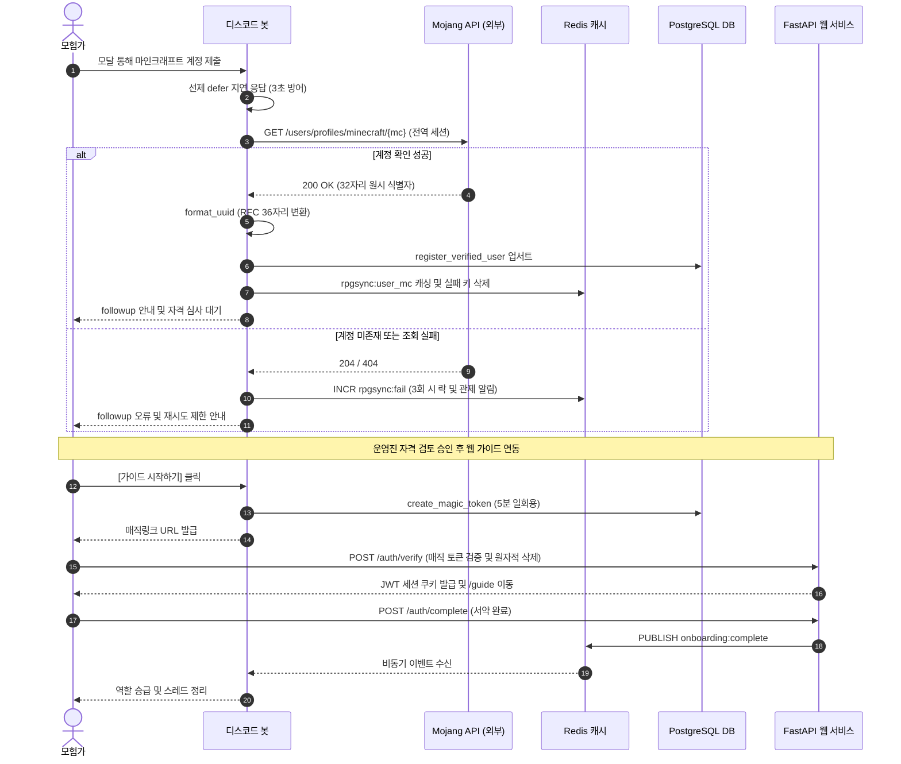

# RPG Sync 프로젝트: 3초 타임아웃 제약과 외부 API 장애 격리를 위한 비동기 온보딩 파이프라인 구축

## 1. 개요 및 학습 개념 요약

성인 RPG 커뮤니티의 운영에서 유저 온보딩은 보안과 편의성이 가장 첨예하게 충돌하는 관문이었다.
마인크래프트 정품 계정 검증, 성인 이용 자격 심사, 그리고 서버 규칙 서약까지 이어지는 절차를 수작업으로 처리하면 관리자의 피로도가 극에 달했다.
이를 해소하기 위해 디스코드 봇과 웹 백엔드를 연동하는 전 과정 자동화 파이프라인을 구축했다.

> 플랫폼 제약조건을 우회하려 하지 않고 공식 라이프사이클에 맞추어 상태 전이를 설계해야 안정적인 자동화가 완성된다.

[Part 1](/security-agent-toolkit/blog/proj-rpg-sync-project-01-problem-definition-and-architecture/)에서는 미국 GCP 봇과 한국 DB 간의 물리적 거리로 인한 대륙 간 RTT를 Redis 읽기 캐시로 극복했다.
그러나 온보딩은 캐시로 대체할 수 없는 'Mojang 외부 계정 검증'과 '원격 DB 신규 등록'이 직렬로 강결합된 실시간 쓰기 경로였다.
미국 내 봇과 Mojang 간의 통신은 빨랐으나, 뒤이어 태평양을 건너는 한국 DB 쓰기 트랜잭션이 결합되면서 디스코드의 엄격한 3초 인터랙션 제한 시간을 정면으로 초과했다.

이러한 제약 속에서 전체 가용성을 보장하기 위해 선제 지연 응답과 전역 HTTP 세션 재활용을 도입했다.
여기에 Redis 3회 오입력 브루트포스 락, 경계 식별자 정규화, 그리고 7일 유효기간의 최소 권한 매직링크 인증을 결합했다.
결과적으로 외부 API 및 원격 네트워크 지연이 봇 전체로 전파되지 않는 무중단 온보딩 파이프라인을 완성했다.

---

## 2. 전체 산출물 구조 및 온보딩 파이프라인 체계

온보딩 파이프라인은 공개 채널 오염을 방지하는 프라이빗 스레드 생성부터 외부 API 검증, 그리고 웹 가이드 서약 후 역할 승급까지 다계층으로 이어진다.
모든 인터랙션은 타임아웃 방어선을 거치며 비동기 이벤트 버스로 결합도를 낮췄다.



---

## 3. 기존 체계의 한계와 도전 과제

디스코드 게이트웨이는 클라이언트의 버튼 클릭이나 모달 제출 후 3초 이내에 승인 확인 응답을 받지 못하면 연결을 강제 종료한다. 북미 봇과 Mojang 간의 통신 자체는 수십 밀리초 이내로 빨랐으나, 뒤이어 태평양을 건너 한국 Supabase 데이터베이스로 향하는 원격 쓰기 트랜잭션이 겹칠 경우 유저 인터페이스에 `Interaction failed` 오류가 발생하며 폼 입력 데이터가 유실되는 문제가 빈번했다.

또한 모달이 제출될 때마다 단발성 HTTP 커넥션을 새로 생성하고 즉시 파기하는 초기 구조는 잦은 TCP 핸드셰이크와 소켓 자원 낭비를 유발했다. 다수 유저 접속 시 해외 API의 호출 제한(HTTP 429)이나 계정명 오탈자 반복 입력으로 인한 전체 인증 마비 리스크를 방어할 수단이 전무했다.

아울러 외부 API가 반환하는 32자리 비정규화 식별자와 마인크래프트 Java 서버 및 데이터베이스의 RFC 4122 표준 36자리 규격 간 불일치로 매 조회마다 파싱 오버헤드가 발생했다. 데이터베이스 수준에서 식별자 고유성 제약이 없어 타인의 정품 계정을 무단 도용하는 공격 표면도 방치되어 있었다.

> 외부 플랫폼과 해외 API의 예측 불가능한 지연 속에서 3초 타임아웃을 방어하고, 단일 실패 지점 없이 안전하게 계정을 검증하는 견고한 인터랙션 아키텍처가 절실했다.

---

## 4. 엔지니어링 의사결정 및 리팩터링

식별된 병목과 취약점을 해결하기 위해 네 가지 엔지니어링 의사결정을 적용하고 리팩터링을 단행했다.
이전 포스트 [RPG Sync 프로젝트: 비용 제약과 운영 병목을 극복한 비동기 데이터 파이프라인 및 분산 인프라 설계](/security-agent-toolkit/blog/proj-rpg-sync-project-01-problem-definition-and-architecture/)에서 다룬 비동기 런타임 튜닝과 Redis 캐싱 전략을 확장하여 인증 파이프라인 전반에 적용했다.

> 외부 시스템과의 통신 경계에서는 최악의 지연과 장애를 가정하고 선제 유예 토큰과 커넥션 재사용을 기본값으로 삼아야 한다.

### 4.1. 선제 지연 응답과 전역 HTTP 세션 재활용을 통한 타임아웃 방어 (`UserNicknameVerificationModal.on_submit`)

디스코드 게이트웨이의 3초 타임아웃을 무력화하기 위해 모달 진입 즉시 선제 지연 응답을 호출했다.
`interaction.response.defer(ephemeral=True)`를 실행하면 디스코드 게이트웨이로부터 최대 15분 동안 유효한 웹훅 토큰을 획득할 수 있다.

이를 통해 북미 Mojang API 검증과 대륙 간 원격 DB 쓰기 트랜잭션이 연속되어도 시간 제약 없이 안전하게 완수한 뒤 `interaction.followup.send()`로 최종 결과를 전달할 수 있었다.
또한 모달 인스턴스마다 클라이언트 세션을 생성하던 비효율을 걷어내고 봇 프로세스가 유지하는 전역 세션을 재활용하도록 개선했다.

```python
# src/bot/cogs/auth/onboarding_modal.py
class UserNicknameVerificationModal(discord.ui.Modal, title="계정 연동 정보 입력"):
    async def on_submit(self, interaction: discord.Interaction):
        # 1. 3초 타임아웃 방어를 위한 선제 유예 토큰 확보 (최대 15분 유효)
        await interaction.response.defer(ephemeral=True)

        raw_mc = self.mc_name.value.strip()
        bot_session = getattr(interaction.client, "session", None)

        try:
            # 2. 전역 세션 재활용을 통한 핸드셰이크 오버헤드 최소화 (유실 시 단발 세션 폴백)
            session_to_use = bot_session if (bot_session and not bot_session.closed) else aiohttp.ClientSession()
            async with session_to_use.get(
                f"https://api.mojang.com/users/profiles/minecraft/{raw_mc}",
                timeout=aiohttp.ClientTimeout(total=5)
            ) as response:
                if response.status == 200:
                    data = await response.json()
                    raw_uuid = data.get("id")
                    # ... (36자리 정규화 및 원격 DB 업서트 진행) ...
                elif response.status == 429:
                    await interaction.followup.send("정품 조회 요청이 혼잡합니다. 잠시 후 다시 시도해주세요.", ephemeral=True)
                    return
        except Exception:
            await interaction.followup.send("계정 조회 시스템 오류가 발생했습니다.", ephemeral=True)
```

전역 세션 참조가 유실된 극단적 예외 상황에서만 5초 타임아웃을 지정한 단발 세션으로 폴백하도록 다층 방어선을 구축했다.
이를 통해 핸드셰이크 오버헤드를 줄이고 연결 재사용률을 극대화했다.

### 4.2. Redis 기반 3회 오입력 브루트포스 락과 관제 에스컬레이션 (`rpgsync:fail:{user_id}`)

외부 API 호출 실패 시 무제한 재시도로 인한 429 차단을 막기 위해 원자적 카운터를 구축했다.
유저가 존재하지 않는 마인크래프트 계정명을 제출할 때마다 Redis의 `INCR` 명령어로 실패 횟수를 누적했다.

최초 실패 시 1시간 유효기간을 부여하고, 3회 연속 실패가 감지되면 즉시 모달 입력을 차단했다.
동시에 스태프 전용 관제 채널로 알림 메시지와 역할 멘션을 자동 발송하여 무차별 대입 공격을 차단했다.

```python
# src/bot/cogs/auth/onboarding_modal.py
        # 4. 조회 실패 시 Redis 기반 오입력 실패 락 관리
        if not uuid_36:
            fail_key = f"rpgsync:fail:{user_id}"
            fail_count = await redis_client.incr(fail_key)
            if fail_count == 1:
                await redis_client.expire(fail_key, 3600)  # 최초 실패 시 1시간 TTL

            # 3회 연속 실패 시 락 및 운영진 관제 채널 에스컬레이션
            if fail_count >= 3:
                staff_channel = interaction.guild.get_channel(STAFF_LOG_CHANNEL_ID)
                if staff_channel:
                    embed = discord.Embed(
                        title="계정연동 오입력 초과 락 발생",
                        description=f"유저: **{interaction.user.display_name}**\n마인크래프트 계정 3회 연속 실패로 입력을 차단했습니다.",
                        color=discord.Color.red()
                    )
                    await staff_channel.send(embed=embed)
                await interaction.followup.send("계정 확인에 3회 연속 실패하여 입력이 잠금 처리되었습니다.", ephemeral=True)
                return
```

정상적으로 인증을 통과한 경우에는 `redis_client.delete(f"rpgsync:fail:{user_id}")`를 호출하여 실패 카운터를 즉시 소멸시켰다.
캐시 계층의 가벼운 연산만으로 외부 인프라 보호와 관제 가시성을 동시에 달성했다.

### 4.3. 외부 식별자 경계 정규화와 DB UNIQUE 제약조건을 통한 계정 도용 차단 (`format_uuid`, `register_verified_user`)

Mojang API가 반환하는 32자리 비정규화 문자열을 내부 시스템으로 전파하지 않고, 진입 경계에서 즉시 RFC 4122 표준 36자리로 정규화했다.
단순한 하이픈 삽입을 넘어 PostgreSQL `UUID` 네이티브 타입과 마인크래프트 Java 플러그인 등 하류 컴포넌트들의 중복 파싱 오버헤드를 원천 제거하기 위한 경계 정규화 설계였다.

더 중요한 방어선은 데이터베이스 계층의 계정 도용 원천 차단이었다.
`users` 테이블의 `minecraft_uuid` 컬럼에 `UNIQUE` 제약조건을 부여하고, 중복 키 위반 시 PostgreSQL의 `23505` 에러 코드를 세밀하게 가로채 타인의 정품 계정을 가로채 가입하는 무단 점유 공격을 차단했다.

```python
# src/database/auth.py
def register_verified_user(discord_id: str, nickname: str, server_role: str, mc_uuid: str, mc_username: str, bypass_voice_check: bool = False) -> bool:
    sql = """
        INSERT INTO public.users (discord_id, nickname, server_role, minecraft_uuid, minecraft_username, bypass_voice_check)
        VALUES (%s, %s, %s, %s, %s, %s)
        ON CONFLICT (discord_id) DO UPDATE SET
            nickname = EXCLUDED.nickname,
            server_role = EXCLUDED.server_role,
            minecraft_uuid = EXCLUDED.minecraft_uuid,
            minecraft_username = EXCLUDED.minecraft_username,
            bypass_voice_check = EXCLUDED.bypass_voice_check
    """
    conn = get_connection()
    cursor = conn.cursor()
    try:
        cursor.execute(sql, (discord_id, nickname, server_role, mc_uuid, mc_username, bypass_voice_check))
        conn.commit()
        return cursor.rowcount > 0
    except psycopg2.Error as e:
        conn.rollback()
        # UNIQUE_VIOLATION (23505) 예외 세밀 매핑 처리
        if e.pgcode == '23505':
            err_msg = str(e)
            if "minecraft_uuid" in err_msg:
                return "UUID_DUPLICATE"
            elif "minecraft_username" in err_msg:
                return "MC_NAME_DUPLICATE"
            return "DUPLICATE"
        return False
    finally:
        cursor.close()
        release_connection(conn)
```

중복 계정 등록 시도 시 모달은 유저에게 "제출하신 마인크래프트 정품 계정은 이미 다른 모험가님이 연동하여 사용 중입니다"라는 안내를 출력하며 중복 바인딩을 차단했다.
검증 완료된 데이터는 `rpgsync:user_mc:{user_id}` 키로 Redis에 JSON 영구 캐싱하여 이후 조회 시 데이터베이스 I/O를 0으로 유지했다.

### 4.4. MD5 해시 프라이빗 스레드 격리와 일회용 매직링크 기반 패스워드리스 인증 (`VerificationRequestView`, `verify_magic_link`, `complete_guide`)

이용 자격 검토 과정에서 개인 식별 정보가 공개 채널에 노출되는 것을 방지하기 위해 유저 ID를 MD5 해싱한 고유 식별자로 프라이빗 스레드를 생성했다.
봇 단독 모달 팝업 불가라는 플랫폼 제약을 준수하기 위해 스레드 내부로 `NicknameTriggerView` 버튼을 전송하여 유저의 명시적 클릭으로 모달을 띄웠다.

운영진이 이용 자격을 확인한 뒤 승인 버튼을 누르면 별도의 회원가입 절차 없이 5분 만료 일회용 매직링크 토큰을 발급했다.
웹 백엔드는 데이터베이스 트랜잭션 내에서 토큰을 조회하고 즉시 삭제하여 재생 공격을 차단했다.

```python
# src/database/auth.py
def verify_and_consume_magic_token(token: str) -> dict:
    """토큰 유효성 검증 후 트랜잭션 내 즉시 폐기하여 1회성 보장"""
    conn = get_connection()
    cursor = conn.cursor(cursor_factory=RealDictCursor)
    try:
        cursor.execute("SELECT discord_id, nickname FROM public.magic_tokens WHERE token = %s AND expires_at > NOW()", (token,))
        result = cursor.fetchone()
        if result:
            cursor.execute("DELETE FROM public.magic_tokens WHERE token = %s", (token,))
            conn.commit()
            return dict(result)
        return None
    except psycopg2.Error:
        conn.rollback()
        return None
```

검증에 성공한 유저에게는 7일 유효기간의 `forum_session` JWT 쿠키(`HttpOnly`, `Secure`, `SameSite=Strict`)를 발급하여 웹 가이드 서약 페이지로 리다이렉트했다.

당시 7일이라는 쿠키 유효기간을 두고 많은 고민이 있었다. 통상적인 웹 보안 기준에서 7일은 세션 탈취 위험이 존재하는 다소 긴 시간이었기 때문이다.

그러나 이 쿠키는 일반 사용자 계정 권한이 아니라 오직 온보딩 가이드 서약 페이지 열람 및 제출에만 국한된 최소 권한 스코프로 격리되어 있었다. 신규 유저가 긴 서버 가이드를 정독하다가 이탈하더라도 재인증의 피로감 없이 복귀할 수 있는 편의성과, 엄격한 쿠키 보안 플래그를 통한 공격 표면 통제 사이의 현실적인 타협점이었다.

```python
# src/web/routers/auth.py
@router.post("/complete")
async def complete_guide(forum_session: str = Cookie(None)):
    """가이드 완료 처리 및 Redis Pub/Sub 봇 역할 승급 신호 전달"""
    payload = jwt.decode(forum_session, JWT_SECRET, algorithms=[JWT_ALGORITHM])
    discord_id = payload.get("sub")

    # 1. DB 완료 상태 갱신 후 Redis 이벤트 발행
    await asyncio.to_thread(update_guide_completion, discord_id)
    await publish_message("onboarding:complete", {"discord_id": discord_id})
    return {"message": "success"}
```

이전 포스트 [RPG Sync 프로젝트: 분산 상태 동기화, 옵저버빌리티 구축 및 도그푸딩을 통한 요구사항 엔지니어링](/security-agent-toolkit/blog/proj-rpg-sync-project-02-troubleshooting-and-collaboration/)에서 구축한 분산 메시징 메커니즘을 그대로 활용했다.
디스코드 봇은 발행된 신호를 수신하여 유저의 '뉴비' 역할을 회수하고 '멤버' 역할을 부여한 뒤 프라이빗 스레드를 정리했다.

---

## 5. 검증 및 회고

### 5.1. 외부 API 연동 안정성 및 격리 검증

구축된 온보딩 파이프라인의 실측 성능과 방어 동작을 환경별 시나리오로 테스트했다.
북미 Mojang API 조회와 태평양을 건너는 한국 DB 쓰기 트랜잭션이 결합된 환경 속에서도, 선제 지연 응답 토큰 덕분에 3초 타임아웃 오류 발생률은 0건을 기록했다.

연속 오입력 방어 시험에서는 의도적인 오탈자 계정을 3회 제출했을 때 정확히 잠금 상태로 전환됨을 확인했다.
Redis 실패 카운터가 3에 도달하자마자 스태프 채널로 알림 메시지가 발송되었으며, 추가 모달 제출이 즉시 차단되었다.

동일 마인크래프트 계정을 서로 다른 두 디스코드 계정으로 연동하려 했을 때도 무단 도용 방어가 정상 동작했다.
데이터베이스 레벨의 고유성 제약조건에 의해 중복 바인딩이 차단되었고, 유저에게 적절한 안내가 에페메럴 메시지로 안전하게 반환되었다.

### 5.2. 현실적 회고 및 교훈

3rd-party 플랫폼 위에 서비스를 구축할 때는 플랫폼의 제약을 결함으로 인식하지 않고 아키텍처의 고정된 환경으로 수용해야 했다.
디스코드의 3초 타임아웃이나 모달 호출 제약은 유저 경험을 보호하기 위한 플랫폼의 규칙이었으며, 이에 맞추어 지연 응답과 버튼 체인을 설계함으로써 문제를 해결할 수 있었다.

온보딩 토큰의 7일 유효기간 설정이나 원격 DB 쓰기 경로 설계처럼, 기술적 완결성과 유저 이탈 방지라는 실무적 가치 사이에서 적정선을 찾아가는 엔지니어링 줄다리기를 깊이 체감했다.
보안 플래그와 최소 권한 스코프로 안전장치를 마련한 뒤 사용성을 보장하는 방어적 아키텍처의 중요성을 배운 프로젝트였다.
