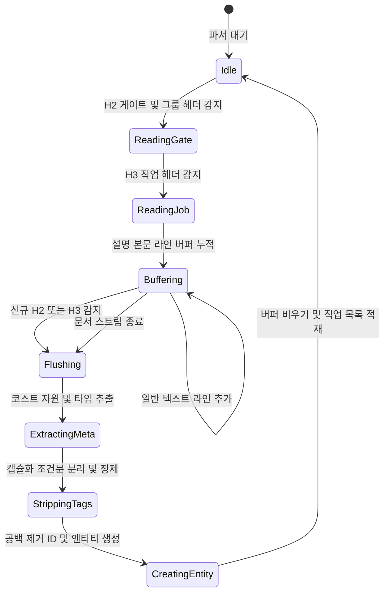

# 계층형 컨텍스트 파서와 동적 템플릿 기반 대량 동기화: 비정형 텍스트의 정형화와 무중단 데이터 파이프라인

## 1. 개요 및 프로젝트 배경

여든 개 이상의 직업 설명, 스킬 수치, 패치노트, 일러스트, 그리고 커뮤니티 유저(동시 활동 유저 40명 안팎, 동접 20명 수준)의 닉네임 데이터를 위키 웹에 안정적으로 적재해야 했다. 일반적인 웹 애플리케이션이라면 관리자 전용 웹 입력 폼을 구축하여 정형화된 데이터를 수집하는 방식이 개발 관점에서 가장 직관적이고 결함 가능성이 낮다.

그러나 운영 관점의 현실은 달랐다. 모든 기획 회의, 유저 소통, 직업 밸런스 논의는 이미 디스코드 커뮤니티 내부에서 완결되고 있었다. 웹 어드민을 분리하면 관리자가 디스코드에서 논의한 뒤 웹 폼에 다시 복사해야 하는 이중 작업과 플랫폼 전환 피로도가 발생했다.

> 운영자의 기존 업무 맥락을 보존하면서 비정형 텍스트를 백엔드 파서로 정형화하여 단일 진실 공급원을 구축하는 것이 엔지니어링의 핵심 목표였다.

디스코드 채널과 쓰레드에 누적된 세계관 텍스트를 그대로 유지하되, 마크다운의 줄바꿈과 비정형 메타데이터를 결정론적으로 추출하여 관계형 데이터베이스로 병합하는 자동화 파이프라인을 설계했다.

---

## 2. 전체 산출물 구조 및 동기화 파이프라인 체계

디스코드 채널의 원시 마크다운 텍스트와 유저 닉네임 문자열을 수집하여 검증 및 정제를 거친 후 데이터베이스에 일괄 적재하는 파이프라인 구조는 다음과 같다.



계층형 컨텍스트 파서는 줄 단위로 문서를 순회하며 헤더 계층에 따라 버퍼를 누적하고 배출한다. 전체 파이프라인을 구성하는 핵심 모듈과 담당 책임은 아래와 같이 분리되어 동작한다.

| 구성 모듈 | 소스 경로 | 핵심 엔지니어링 책임 |
| :--- | :--- | :--- |
| **텍스트 파서 유틸리티** | `src/bot/utils/text_parser.py` | 라인 순회 계층형 버퍼 배출 파서, 코스트 자원 식별, 정규식 기반 메타데이터 격리 |
| **동적 포맷 관리 코그** | `src/bot/cogs/system/nickname_format_cmd.py` | 관리자 슬래시 명령어 기반 가변 닉네임 인덱스 설정 및 봇 전역 런타임 캐시 갱신 |
| **대량 동기화 엔진** | `src/bot/cogs/system/bulk_sync_cmd.py` | 서버 전체 유저 순회, 1차 양식 필터링, 채널별 과거 메시지 이력 수집 및 R2 미디어 오프로딩 |
| **데이터베이스 연동 계층** | `src/database/connection.py` | 직업 목록 인메모리 사전 캐싱, 2단계 직업 매칭 충돌 검증, 배치 업서트 및 실패 리포트 집계 |
| **설정 영속화 계층** | `src/database/nickname_format.py` | 시스템 설정 테이블 기반 닉네임 분해 템플릿 제이슨 저장 및 조회 회복 탄력성 |

---

## 3. 기존 체계의 한계와 도전 과제: 비정형 서사 간섭과 가변 식별자의 붕괴

초기 텍스트 파싱 파이프라인은 본문 텍스트 내 특정 키워드의 존재 여부를 검사하는 단순 문자열 포함 방식에 의존했다. 그러나 직업 배경 스토리가 길어지면서 서사 텍스트와의 간섭으로 인한 심각한 오탐이 발생했다.

직업 설명에 "과거에는 영웅이었으나 타락하여 빌런이 되었다"와 같은 문장이 포함되면, 파서가 앞에 위치한 '영웅' 키워드를 먼저 감지하여 빌런 캐릭터임에도 영웅 진영으로 오분류하는 치명적인 결함이 발생했다. 조건문 역시 기획이 확장되며 복합 제약이 쏟아져 하드코딩 파서의 배포 병목을 가중시켰다.

유저 닉네임 동기화는 운영진 내부의 거버넌스 붕괴와 도메인 특수성이라는 이중고를 겪었다. 디스코드 닉네임 수정 권한은 일반 유저가 아닌 운영자에게만 부여되어 있었으나, 정작 운영진 스스로가 합의된 규칙을 어기고 임의로 양식을 변형하는 휴먼 에러가 빈번했다. 신규 유저(닉네임과 직업 2개 파트)부터 후원 등급 이모지, 길드명(최대 5자), 스태프 식별자가 결합된 헤비 유저(최대 5개 파트)까지 구분자 개수와 위치가 제각각이었다.

직업명이 일반 게임의 클래스가 아니라 '스토리 속 주인공의 고유 인명'이라는 점도 난제였다. 서양식 패밀리 네임(또는 동양식 가문명)이 겹치는 인물이 다수 존재했고, 닉네임 글자 수 제약으로 인해 커뮤니티는 관습적으로 라스트 네임(최대 5자)만 표기했다.

단순 완전 일치만 고집하면 대다수 유저가 누락되고, 단순 부분 일치를 쓰면 동일 가문명 유저가 엉뚱한 캐릭터로 오매핑되는 위험이 상존했다. 아울러 탈퇴 유저의 개인정보를 보관할 명확한 법적 근거가 부재했기에, 서버 퇴장 시 즉시 레코드를 파기하는 강경한 데이터 정합성까지 동시에 만족해야 했다.

---

## 4. 엔지니어링 의사결정 및 구현

### 4.1. 메타데이터 브래킷과 범용 캡슐화 문법 설계 (`text_parser.py`)

서사 텍스트와 메타데이터의 간섭을 원천 차단하기 위해 본문 내 단순 검색을 폐기하고 전용 브래킷 문법을 도입했다.

> 본문 서사와 분류 체계를 완벽히 분리하려면 파서 수준에서 명시적 캡슐화 문법을 강제해야 한다.

직업의 진영 정보는 헤더 또는 설명 상단에 `[영웅]`, `[빌런]` 형태로 표기하도록 규정했다. 정규표현식으로 대괄호 내부의 문자열만 엄격히 추출하여 배경 서사에 동일한 단어가 등장하더라도 오탐이 발생하지 않도록 격리했다. 브래킷 내부 검색 시에도 불필요한 수식어로 인한 오탐을 방지하기 위해 운영진에게 `[영웅]`, `[빌런]` 단일 식별자만 사용하도록 규정한 마크다운 작성 가이드라인을 사전 배포하여 프로세스와 코드가 상호 보완하도록 설계했다.

```python
# src/bot/utils/text_parser.py:40-56
# 타입 식별 (Hero/Villain)
job_type = "정보 없음"
bracket_matches = re.findall(r"\[(.*?)\]", desc_str)
for bracket_text in bracket_matches:
    if "영웅" in bracket_text:
        job_type = "영웅"
        break
    elif "빌런" in bracket_text:
        job_type = "빌런"
        break

# 조건(req_condition) 파싱 및 설명문 정제
req_condition = "정보 없음"
condition_match = re.search(r"<<(.*?)>>", desc_str)
if condition_match:
    req_condition = condition_match.group(1).strip()
    # DB 적재 시 설명 컬럼 중복 방지를 위한 태그 제거
    desc_str = desc_str.replace(condition_match.group(0), "").strip()
```

직업별 제약 조건은 `<< 조건문 내용 >>` 형태의 범용 컨테이너 태그로 일반화했다. 정규표현식으로 태그 내부 문자열을 추출하여 데이터베이스의 제약조건 컬럼에 분리 적재하고, 설명 컬럼에는 본문 서사만 남도록 태그를 제거하는 전처리 파이프라인을 완성했다.

### 4.2. 계층형 컨텍스트 버퍼 파서와 AST 라이브러리 배제 트레이드오프 (`_flush_job`)

하나의 거대한 정규표현식으로 전체 마크다운 문서를 한 번에 파싱하면 줄바꿈이나 공백 패턴의 사소한 불일치로 인해 정규식 역추적 병목이 발생할 위험이 높았다.

> 전체 문서를 탐색하는 거대 정규표현식 대신 라인 단위 순회와 버퍼 배출 루프를 적용하여 선형 시간 복잡도를 보장했다.

문서를 줄 단위로 순회하며 `## ` 게이트 헤더와 `### ` 직업 헤더를 만날 때마다 현재 계층 컨텍스트를 갱신하고, 새로운 헤더를 만나거나 문서 끝에 도달했을 때만 누적된 설명문 라인을 배출하는 `_flush_job` 버퍼 플러시 패턴을 구현했다.

```python
# src/bot/utils/text_parser.py:80-111
for line in lines:
    line = line.strip()
    if not line:
        continue

    # 1. Gate & Group (H2)
    if line.startswith("## "):
        _flush_job()
        header_content = line[3:].strip()

        # 대괄호 존재 여부로 그룹 추출
        group_match = re.search(r"\[(.*?)\]", header_content)
        if group_match:
            current_group = group_match.group(1).strip()
            current_gate = header_content[:group_match.start()].strip()
        else:
            current_gate = header_content
            current_group = "정보 없음"
        continue

    # 2. 직업명 (H3)
    if line.startswith("### "):
        _flush_job()
        current_job_name = line[4:].strip()
        continue

    # 3. 설명문 버퍼링
    if current_job_name:
        current_desc_lines.append(line)

_flush_job()
return jobs_data
```

외부 마크다운 구문 트리 라이브러리를 도입하는 방안도 검토했다. 그러나 클라우드 프리티어 가상 머신의 극도로 제한된 메모리 환경에서 무거운 의존성을 배제하고, 헤더 계층과 커스텀 도메인 태그를 단일 패스 루프에서 즉각 엔티티로 변환하기 위해 표준 라이브러리 기반의 경량 버퍼 파서를 유지했다.

### 4.3. 가변 닉네임 동적 템플릿과 관리자 명령어 체계 (`nickname_format_cmd.py`, `nickname_format.py`)

디스코드 서버 닉네임은 유저가 임의로 변경할 수 없도록 권한을 통제하고 오직 운영자만 수정 가능하도록 제한했다. 그러나 정작 운영진 내부에서 사전에 합의된 닉네임 양식을 임의로 파괴하거나 변경하는 문제가 빈번했다.

더욱이 신규 유입(닉네임과 직업 2개 파트)부터 후원 등급(이모지로 대체), 길드명(최대 5자 제한), 유저 닉네임(최대 3자), 스태프 이모지까지 추가되면서 닉네임 파트가 최소 2개에서 최대 5개까지 유동적으로 확장되었다. 엄격한 글자 수 규칙 덕분에 디스코드의 32자 제한에 걸릴 위험은 없었으나, 가변적인 파트 개수와 인덱스를 하드코딩된 규칙으로는 수용할 수 없었다.

| 설계 대안 | 아키텍처 접근 방식 | 평가 결과 및 기각 사유 |
| :--- | :--- | :--- |
| **화이트리스트 사전 매칭** | 여든 개 직업명과 길드명을 메모리에 올리고 단순 문자열 매칭 | 직업 개정이나 신규 길드 생성 시마다 화이트리스트 재배포가 필요하여 기각 |
| **경량 자연어 처리 모델** | 개체명 인식 모델이나 소형 언어 모델을 파이프라인에 배치 | 1기가바이트 미만 저사양 가상 머신의 메모리 제약으로 호스팅 불가하여 기각 |
| **동적 포맷 템플릿 (선택)** | 슬래시 명령어로 파트 개수 및 인덱스 매핑을 데이터베이스에 등록 | 인프라 비용 추가 없이 관리자 자율성과 결정론적 검증을 확보하여 채택 |

관리자가 슬래시 명령어로 서버 내에서 통용되는 닉네임 분해 규칙을 유연하게 등록할 수 있도록 `NicknameFormatCog`를 설계했다.

```python
# src/bot/cogs/system/nickname_format_cmd.py:68-98
# 새로운/업데이트할 포맷 정의
new_fmt = {
    "part_count": part_count,
    "delimiter": delimiter,
    "nickname_index": nickname_index,
    "job_index": job_index,
    "staff_index": staff_index
}

# 동일한 part_count가 있는지 확인 후 업데이트 또는 신규 삽입
updated = False
for i, fmt in enumerate(formats):
    if fmt.get("part_count") == part_count:
        formats[i] = new_fmt
        updated = True
        break

if not updated:
    formats.append(new_fmt)

formats.sort(key=lambda x: x["part_count"])

# DB 저장 및 봇 전역 캐시 동기화
success = await asyncio.to_thread(save_nickname_formats, formats)
if not success:
    return await interaction.followup.send("데이터베이스 설정 저장에 실패했습니다.", ephemeral=True)

self.bot.nickname_formats = formats
```

등록된 템플릿은 데이터베이스의 시스템 설정 테이블에 제이슨 형태로 영속화되며, 봇 프로세스 메모리의 전역 캐시로 즉시 동기화되어 매 파싱 요청마다 데이터베이스에 불필요한 질의를 던지지 않도록 최적화했다.

### 4.4. 벌크 동기화 배치 파이프라인과 실패 리포트 옵저버빌리티 (`bulk_sync_cmd.py`, `connection.py`)

서버 전체 유저를 순회하는 동기화 작업에서 가장 중요한 과제는 도메인 특수성을 수용한 직업 매칭과 데이터베이스 입출력 최적화였다.

> 풀네임이 아닌 라스트 네임 축약 관습을 수용하기 위해 2단계 매칭을 도입하고, 사전 메모리 캐싱으로 데이터베이스 부하를 격리했다.

이 시스템에서 직업명은 일반적인 RPG 클래스가 아니라 '세계관 스토리에 등장하는 주인공 이름'이었다. 가문명이 동일한 인물이 다수 존재했고, 커뮤니티는 닉네임에 풀네임 대신 5자 이내의 라스트 네임만 축약 표기하는 오랜 절차를 따르고 있었다.

따라서 데이터베이스의 직업 목록을 사전 메모리 캐싱한 후, 1차 완전 일치를 우선 확인하고 일치 항목이 없을 때만 2차 부분 일치를 수행하도록 설계했다. 동일 가문명 등으로 부분 일치 후보가 두 개 이상 검출되면 즉시 해당 유저를 동기화 대상에서 제외하고 충돌 사유를 기록했다.

```python
# src/database/connection.py:208-258
# 메모리 캐싱용 직업 리스트 생성 (DB I/O 병목 방지)
cursor.execute("SELECT job_id, LOWER(REPLACE(name, ' ', '')), LOWER(REPLACE(display_name, ' ', '')) FROM jobs")
cached_jobs = [{"id": row[0], "name": row[1] or "", "display": row[2] or ""} for row in cursor.fetchall()]

for user in users_data:
    job_name = user.pop('job_name', None)
    matched_job_id = None
    is_collision = False

    if job_name:
        exact_match = next(
            (job["id"] for job in cached_jobs if job_name == job["name"] or job_name == job["display"]), None)
        if exact_match:
            matched_job_id = exact_match
        else:
            partial_matches = [
                job for job in cached_jobs
                if job_name in job["name"] or job_name in job["display"]
            ]
            if len(partial_matches) >= 2:
                candidate_names = ", ".join(job["display"] for job in partial_matches)
                failed_users.append({
                    "discord_id": user["discord_id"],
                    "nickname": user["nickname"],
                    "reason": f"직업 중복 매칭 (후보군: {candidate_names})"
                })
                is_collision = True
            elif len(partial_matches) == 1:
                matched_job_id = partial_matches[0]["id"]

    if not is_collision:
        user['current_job_id'] = matched_job_id
        valid_users.append(user)

if valid_users:
    upsert_sql = """
        INSERT INTO USERS (DISCORD_ID, NICKNAME, SERVER_ROLE, CURRENT_JOB_ID)
        VALUES (%(discord_id)s, %(nickname)s, %(server_role)s, %(current_job_id)s)
        ON CONFLICT (DISCORD_ID) DO UPDATE SET
            NICKNAME = EXCLUDED.NICKNAME,
            SERVER_ROLE = EXCLUDED.SERVER_ROLE,
            CURRENT_JOB_ID = EXCLUDED.CURRENT_JOB_ID
    """
    cursor.executemany(upsert_sql, valid_users)
```

메모리 단에서 엄격한 사전 검증을 통과한 유저군(`valid_users`)만을 대상으로 `executemany`를 수행하여, 트랜잭션 도중 예외로 인한 전체 롤백 없이 안전하고 멱등하게 일괄 업서트를 완료했다. 또한 조용한 누락으로 인한 관리 사각지대를 방지하기 위해 동기화 완료 후 실패한 유저와 사유를 최대 15명까지 관리자 채널로 즉시 리포팅하는 관제 체계를 완성했다.

---

## 5. 검증 및 회고

### 5.1. 기능적 무결성 및 실패 격리 검증

완성된 계층형 컨텍스트 파서와 동기화 파이프라인을 실제 운영 환경에 투입하여 데이터 무결성과 예외 격리 동작을 단계별로 검증했다.

여든 개 이상의 직업 쓰레드 메시지를 대상으로 파서를 구동한 후, 추출된 데이터와 원본 마크다운 텍스트를 수작업으로 전수 대조했다. `[영웅]`, `[빌런]` 브래킷을 통해 본문 서사에 동일 키워드가 등장하는 직업도 진영이 뒤바뀌지 않고 정확히 분류되었으며, `<< 조건문 >>` 태그가 본문 설명문에서 깨끗하게 제거된 채 데이터베이스의 제약 조건 컬럼으로 분리 적재됨을 확인했다.

커뮤니티 활동 유저의 닉네임 동기화 과정에서는 실패 격리 메커니즘을 집중 검증했다. 지정된 구분자 양식을 준수한 계정은 캐싱된 직업 목록을 통해 정확한 직업 ID로 매핑되어 데이터베이스에 적재되었다. 반면 구분자가 어긋나거나 축약된 직업명으로 인해 두 개 이상의 직업 후보군이 검출된 유저는 임의 매핑되지 않고 안전하게 탈락 처리되었다.

동기화 종료 직후 관리자 채널로 디스코드 ID, 닉네임, 중복 후보군 목록이 포함된 실패 리포트가 정상 발송되어 조용한 누락 없이 관리자가 직접 예외를 파악하고 조치할 수 있는 옵저버빌리티를 확보했다.

### 5.2. 현실적 회고 및 교훈

엔지니어링 편의를 위해 정형화된 웹 입력 폼을 운영진에게 강요했다면 현장 도입 과정에서 심각한 저항과 피로를 초래했을 것이다. 운영자가 수년간 익숙하게 사용해 온 디스코드 쓰레드 작성 환경을 온전히 보존하면서, 백엔드 파서로 데이터를 정형화한 결정이 운영 마찰을 해소한 핵심 동력이었다.

비정형 텍스트를 다룰 때 단순 키워드 검색은 세계관 서사가 풍부해지는 순간 반드시 깨진다. 메타데이터 브래킷과 범용 캡슐화 태그처럼 비즈니스 로직과 본문 데이터를 격리하는 최소한의 문법 체계를 설계하는 것이 데이터 무결성 방어의 선결 조건임을 체감했다.

아울러 명확한 법적 근거가 부재한 상태에서 탈퇴 유저의 개인 식별 데이터를 남기지 않기 위해 퇴장 즉시 데이터베이스 레코드를 파기한 조치 역시, 데이터 보존 편의보다 개인정보 보호와 법적 리스크 방어를 엄격히 우선시했던 실전적 타협이었다.

다만 정규표현식 기반 파서의 한계와 기술 부채도 분명히 인식했다. 비정형 입력을 처리할 때 입력 텍스트 길이 제한을 두지 않으면 악의적인 입력에 의해 정규식 역추적 병목이 유발될 수 있다. 향후 파이프라인 고도화 시 정규식 엔진의 백트래킹 취약점을 사전에 차단하거나 역추적이 없는 엔진으로 교체해야 함을 중요한 설계 교훈으로 남겼다.
